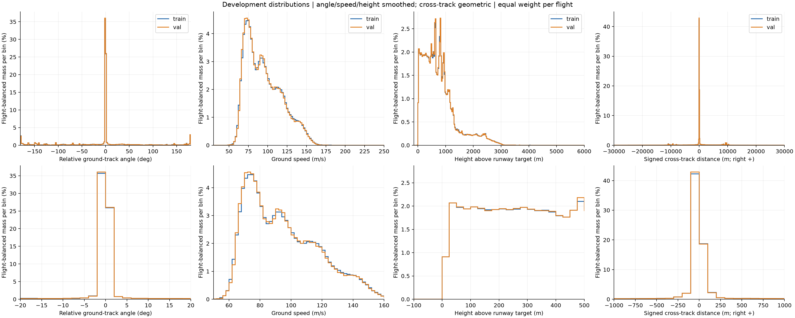
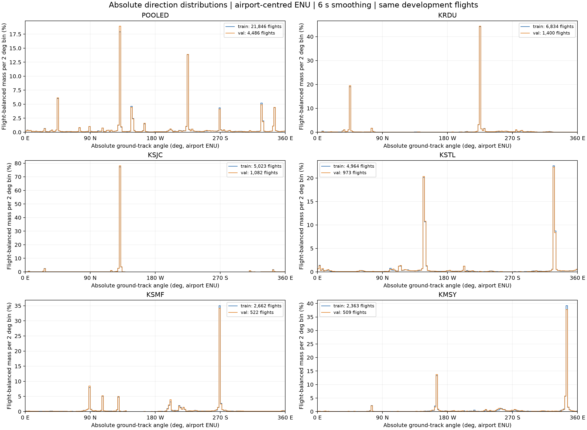
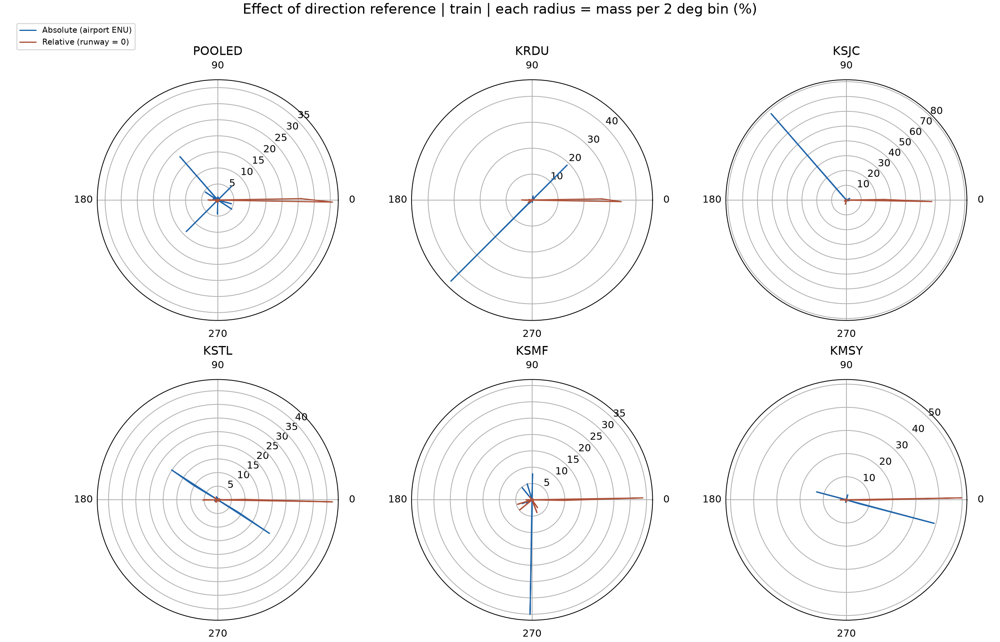
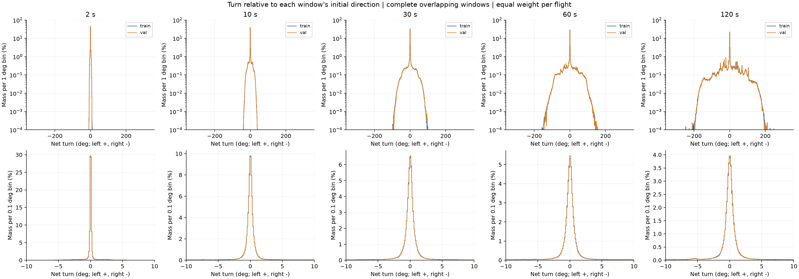
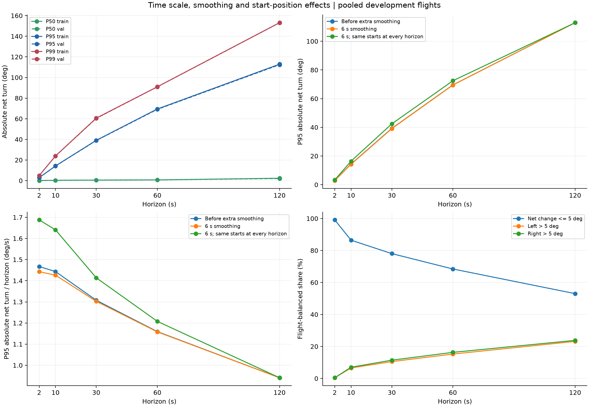
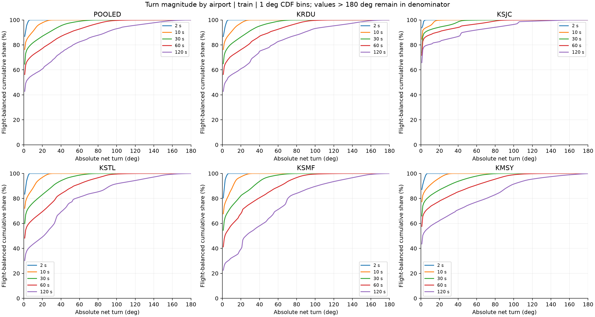
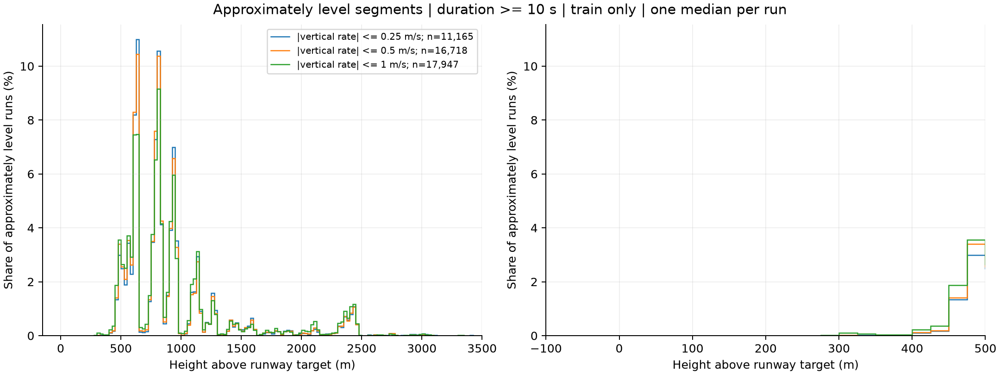
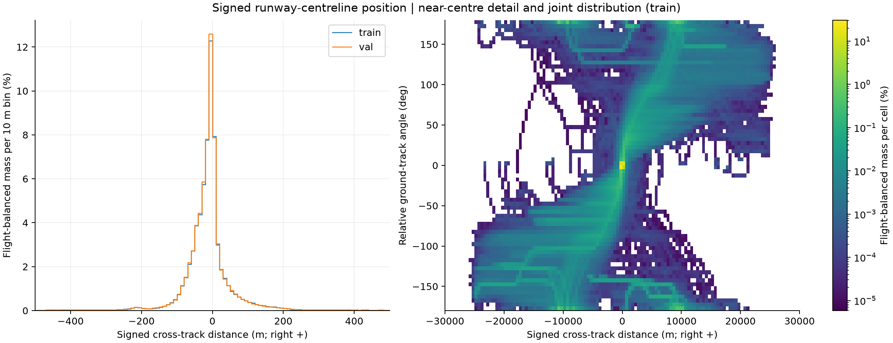
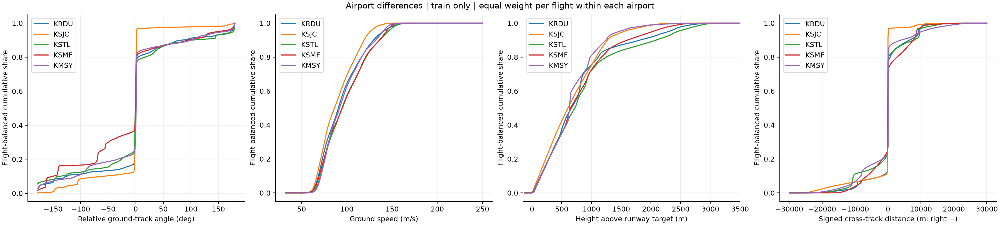

# 指令目标分布与整数词表建议

这份报告统计五机场开发集中的相对航迹角、地速、相对高度，以及有符号的跑道横向距离，并对比机场中心 ENU 中的绝对航迹角、相对飞机当前方向的多时段转角分布，供选择指令 dictionary 使用。**下面列出的目标集合都是待审核建议，没有替换现有词表，也没有用于训练。**

当前[词表设计](2026-09-21_box_vocabulary_design.zh.md)采用“相对发令时模型 heading 转向”和“相对机场参考点 MSL 高程”的高度。本报告保留各次统计的实际口径：76 值航向候选基于跑道相对角，65 值高度候选基于入口 gate，均不能直接作为新基准的字典。多时段转角统计使用固定机场 ENU，也应与正式标注使用的当地模型 `psi` 区分。图表和已保存数值没有重新标成另一种参考系。

分布支持在常见的小转角、60–140 m/s 地速区间及中线附近采用较细分辨率，并保留低频尾部。新的整数转角集合需结合完成时间核定；高度需先按各机场高程重算，再结合近似平飞段分布选择目标。

## 1 数据与统计口径

使用现有五机场 `development_cohort.json` 的全部 train / validation 名单，没有抽样，也没有读取 outer-test 航迹或预测。名单来源为已保存的 `vocabulary_box_five_airports/instruction_vocabulary.json`；名单、manifest、数据处理代码的指纹保存在 [extraction.json](assets/instruction_distribution_20260922/extraction.json)。

| 阶段 | Train | Validation | 合计 |
|---|---:|---:|---:|
| 名单中的航班 | 21,911 | 4,496 | 26,407 |
| 现有数据管线成功构建的航班 | 21,890 | 4,492 | 26,382 |
| 地速全过程落在设计量程 30–250 m/s 内的航班 | 21,846 | 4,486 | 26,332 |
| 主统计使用的 2 秒采样点 | 4,098,966 | 841,149 | 4,940,115 |

25 架未通过现有序列构建条件，具体名单和构建报告保存在 extraction.json。另有 50 架至少一行平滑地速超出设计量程：6 架低于 30 m/s，46 架高于 250 m/s，两类重叠 2 架。主图使用其余航班，但筛选前每机场、每分区的四项分布仍完整保存在 `distribution_summary.json` 的 `before_speed_filter` 中；没有把被排除航班当作不存在。

超范围不统一等同于物理异常。例如有三架最大平滑地速分别为 260.97、263.71、270.86 m/s，需要另行检查，不能只凭越过 250 就判坏。这也解释了本报告比旧 `box-v3` 读数少三架：旧速度边界递推的最后一格实际延伸到约 271.25 m/s，本报告严格按设计中的 250 m/s 筛选。筛选前最大的平滑地速达到 10,984.77 m/s，说明异常尾部确实存在，但这不能代替逐航班判断。

统计有两种权重：

- **采样点等权**：每个 2 秒采样点权重相同，近似表示整批数据的时间占比，长航班贡献更多。
- **航班等权**：每架航班总权重为 1，再均分给其采样点。正文、主图和建议的误差读数均使用这一口径，避免长航班支配结果。

机场之间没有再次强制等权，另列每机场结果用于检查差异。候选值的选择依据 train，validation 用于查看分布和量化误差是否相近。这是开发分析，不是最终测试。

### 四个量的定义

| 量 | 本报告采用的定义 | 单位与正负号 |
|---|---|---|
| 航向字段 | 实际是相对最后进近方向的地面航迹角，不是机头朝向 | 度；0 为沿进近方向，正值向左偏，负值向右偏；按圆周计算 |
| 速度 | 水平 chart 速度分量的长度，即当前标注器使用的地速 | m/s；不是指示空速 |
| 高度 | `course_frame` 中相对 `FlightSeries.target_chart` 的垂直坐标 | 米；目标点包含跑道入口 MSL 高程和入口飞越高度 TCH，零点不是跑道表面 |
| 横向距离 X | 相对所选跑道最后进近延长线的有符号垂距 | 米；**沿进近方向看，右侧为正，左侧为负** |

横向距离不是到有限跑道线段的最短距离，也不是距离的绝对值。使用现有 `course_frame` / `course_frame_rows` 的投影定义，保持与代码一致。跑道是数据中已经指定的目标跑道，结果以跑道已知为前提。

位置 X 与航迹角 A 的正号恰好相反：位于右侧是 X > 0，朝左飞是 A > 0。两者不能混用符号。举例说，位于右侧的飞机朝左修正，可能同时有 X > 0 和 A > 0。

数据沿用现有读时修复、垂直基准转换、进场窗口和 2 秒重采样，只统计实际观测序列，不包含监督用延长尾段。随后航迹角展开后做 6 秒平滑，高度、地速做 10 秒平滑，与当前盒标注的信号口径一致；窗口实际为 4、6、6 个采样点。横向距离直接使用几何投影，不额外平滑。JSON 中同时保留平滑前后的统计；这里的“平滑前”仍已经过数据管线，不是未经处理的原始 ADS-B 消息。

## 2 分布结果



上排是全量程，下排放大主要区域。每格高度表示该区间的概率质量，不是概率密度；航向、地速、高度、横距的格宽分别为 2°、2 m/s、25 m、100 m。不同变量的柱高不能直接比较。

### 航向：中心集中，但反向航段不能省略

| 航迹角区域 | Train | Validation |
|---|---:|---:|
| 绝对偏角不超过 1° | 57.43% | 57.95% |
| 绝对偏角不超过 10° | 65.04% | 65.51% |
| 绝对偏角超过 45° | 27.61% | 27.30% |
| 绝对偏角至少 150° | 11.36% | 11.22% |

0° 附近需要细分，同时必须保留整个方向圆。图两端的 −180° 与 +180° 相邻，不能把它们当作两种相距很远的方向。航向选档和误差都应使用圆周角差，不能对这种分布直接做普通线性聚类。

### 不以跑道方向归零：机场中心 ENU 中的绝对航迹角

**改成绝对方向后，分布呈现多个明显尖峰，各机场的峰值位置不同；它没有变成均匀分布。** 相对跑道角把不同机场、不同跑道的最后进近方向都放在 0° 附近，绝对角则把这些集中方向保留在各自的地理朝向上。

这里以 `airport_reference_point` 给出的机场参考点作为“机场中心”，采用该点固定的东、北、天切平面坐标轴。角度定义为：

```text
绝对航迹角 = atan2(机场 ENU 中的北向速度, 机场 ENU 中的东向速度)
转成度后折回 [0°, 360°)
东 = 0°，北 = 90°，西 = 180°，南 = 270°，逆时针为正
```

这是飞机运动的方向，不是机场中心指向飞机的位置方位角，也不是机头朝向。它采用数学 ENU 角度，不是“北为 0°、顺时针增加”的罗盘角；二者转换为 `罗盘角 = (90° - ENU 角) mod 360°`。

计算时先还原现有速度通道中的物理速度，再经地心地固轴转换到机场参考点的固定 ENU 轴，**没有减去跑道方向**。现有 `airport-enu` 模式使用经纬度缩放的平面 chart，与这里的固定切平面 ENU 有小差异：本批数据两种算法的未平滑角差最大为 0.322°。本节主图采用固定切平面算法，结果文件保留每机场的差异检查值。

样本仍是主统计的 21,846 架 train、4,486 架 validation，共 4,940,115 个采样点，航班和采样点数量逐机场核对一致。沿用航班等权及角度展开后的 6 秒平滑，直方格宽为 2°。绝对角虽然不使用跑道方向归零，进场窗口、航班筛选仍来自原来的跑道已知数据集；本次没有改变数据总体。



每个子图叠加 train / validation；纵轴按各自分布显示，比较机场间的比例应读取数值，而不能只比较尖峰在图上的高度。下表按 train 选择最高的一个 2° 直方格，再读取 validation 在同一格的占比：

| 分组 | 最高直方格，ENU 角 | Train 占比 | Validation 占比 |
|---|---|---:|---:|
| 合并 | 130–132° | 17.93% | 18.94% |
| KRDU | 224–226° | 44.19% | 44.41% |
| KSJC | 130–132° | 77.46% | 78.13% |
| KSTL | 326–328° | 22.60% | 22.33% |
| KSMF | 268–270° | 35.08% | 34.19% |
| KMSY | 344–346° | 39.26% | 37.75% |

这些范围是统计用的直方格，不是新的指令目标。图中还能看到 KRDU 的 44–46°、KSTL 的 146–148°、KMSY 的 164–166° 等明显次峰。相对方向合并在一起的特征，在绝对方向中分散到多处，其中一些主要峰相隔约 180°。峰的位置反映本批航班的绝对飞行方向；峰的权重还受到机场、跑道使用和航路构成影响。

合并 train 中最高的十个 2° 直方格合计占 62.47%，validation 中各自最高十格合计占 62.83%。这十格不必相邻。因此，绝对角仍有强烈集中性，只是集中在多个方向上。正东方向 ±1° 的占比仅为 train 0.230%、validation 0.229%；原来相对跑道 0° 附近的 57.43%、57.95% 不能再解释为绝对 0° 附近的占比。



圆周图使用 train，半径表示每个 2° 直方格的权重占比，不表示航迹位置或距离。蓝线的 0° 是正东，棕线的 0° 是各航班所选跑道的进近方向；两条线的零点语义不同，叠放是为了比较分布如何随参考方向改变。0° 与 360° 在图中相接。

对词表的直接影响是：**如果选择绝对角指令，此前“围绕相对 0° 加密”的 76 值建议就不能直接照搬。** 可以保留覆盖整个方向圆的整数目标，再考虑是否在各机场常见方向附近加密；但 pooled 峰值也受当前五机场的占比影响，不能把这里的最高几个格当作跨机场都适用的唯一目标。

绝对角的冗余也不能直接照搬“目标角数值的 5%”：同一方向可以写成 0° 或 360°，按数值比例计算却会给出不同容差；换一个角度零点也会改变容差。这说明它需要独立的圆周角差容差设计。本节只增加分布证据，没有更改 §3 的待审核目标集合或现有模型。

### 以飞机当前方向为零：不同时间跨度的转向变化

这一节把每个窗口起点的飞机运动方向设为 0°，统计经过 **2、10、30、60、120 秒**后的转向。方向仍来自上一节的机场中心 ENU 地面航迹角，不需要减去跑道方向；它不是机头朝向，不能直接当作飞机偏航角或滚转角。

为了保留实际左右转向，先沿每架航班的时间轴展开角度，再计算差值：

```text
净转角 = 展开后的角度(t + 时段长度) - 展开后的角度(t)
左转为正，右转为负；0° 表示终点方向与起点一致
终点相对方向 = 将净转角折回 [-180°, 180°)
累计转角路程 = 窗口内每次相邻角度变化的绝对值之和
```

主要图表采用**有符号净转角**，不在 ±180° 截断。例如实际连续左转 200°，净转角是 +200°，终点相对方向则是 −160°；不能因此把它标成右转 160°。另一个例子是先左转 20°、再右转 20°：净转角为 0°，累计转角路程为 40°。数据文件同时保存折回后的终点方向分布和累计转角检查，避免把终点方向相近误当成全程直飞。

仍使用同一批 26,332 架开发航班和 2 秒网格。每个时段都从所有能容纳完整窗口的采样点起算，窗口可以重叠；航迹末尾不足该时段的部分不补零、不延长，也不跨航班相减。窗口内使用平滑前的展开角度，以及追加 6 秒平滑后的展开角度各算一遍，主图沿用后者以便与前文比较。这里的平滑前仍已经过轨迹拟合和重采样。

每个时段中，每架有完整窗口的航班总权重为 1，再均分给该航班的有效起点。时段越长，可选起点越少；尤其临近结束的直线段更容易被排除。因此额外统计一组**所有时段都使用能够向后观察满 120 秒的相同起点**的对照，使用相同航班权重，避免把取样位置改变全部解释为时间尺度效应。重叠窗口不是独立样本，本节不把窗口数量当作独立实验次数。

**结果是一个很尖的零点峰，加上随时段增长而明显展开的左右尾部。** 与绝对航迹角按机场分散到不同方向的多峰不同，转角把“维持当前方向”的情况重新集中到 0° 附近；但这不意味着较长时段也只需要很小的转向范围。



上排显示 −360° 到 +360°，使用对数纵轴、1° 格宽；下排放大 −10° 到 +10°，使用线性纵轴、0.1° 格宽。两排格宽不同，柱高不能直接比较。所有曲线都以各自完整分布为分母，没有在放大区间内重新归一化。本次主统计没有超过 ±360° 的窗口。

下表是平滑后绝对净转角的分位数，单位为度。每种时段都包含全部 21,846 架 train 和 4,486 架 validation；变化的是有效窗口数量。

| 时段 | Train 窗口数 | Validation 窗口数 | Train P50 / P95 / P99 | Validation P50 / P95 / P99 |
|---|---:|---:|---|---|
| 2 秒 | 4,077,120 | 836,663 | 0.08 / 2.89 / 4.91 | 0.07 / 2.86 / 4.91 |
| 10 秒 | 3,989,736 | 818,719 | 0.33 / 14.26 / 23.92 | 0.32 / 14.16 / 23.90 |
| 30 秒 | 3,771,276 | 773,859 | 0.54 / 39.07 / 60.61 | 0.53 / 38.89 / 60.39 |
| 60 秒 | 3,443,586 | 706,569 | 0.72 / 69.48 / 91.00 | 0.70 / 69.13 / 90.97 |
| 120 秒 | 2,788,206 | 571,989 | 2.34 / 112.92 / 153.14 | 2.07 / 112.42 / 153.08 |

中位数小、P95 大，说明“多数窗口近似保持方向”和“有一部分窗口发生大幅转向”同时存在，不能只用一个平均值描述。下面用 5° 作为**统计分组阈值**区分近零变化与较明显的净转向，它不是词表容差，也不判定是否曾发生转弯。

| 时段 | Train 净变化不超过 ±5° | Train 净左转 > 5° | Train 净右转 > 5° | Validation 净变化不超过 ±5° |
|---|---:|---:|---:|---:|
| 2 秒 | 99.11% | 0.44% | 0.45% | 99.11% |
| 10 秒 | 86.42% | 6.57% | 7.01% | 86.72% |
| 30 秒 | 78.05% | 10.53% | 11.42% | 78.41% |
| 60 秒 | 68.43% | 15.25% | 16.32% | 68.88% |
| 120 秒 | 53.03% | 23.16% | 23.81% | 53.61% |

左右两侧总体接近，但并非完全对称。120 秒窗口中，train 有 9.53% 的绝对净转角超过 90°，0.0476% 超过 180°；validation 分别为 9.48%、0.0434%。因此不能因为大部分变化接近零，就截掉大转向尾部。主统计 120 秒净转角实测范围为 train −252.25° 到 +274.73°、validation −210.65° 到 +212.77°，这些是本批观测范围，不是飞行能力边界。

净变化接近零也不总是直飞。120 秒窗口中，“绝对净转角不超过 5°，但累计转角路程至少 30°”占 train 总权重的 0.1519%、validation 的 0.1251%。这个特例在当前数据中占比不大，但表明终点相对方向不能完整表达中间路径。累计转角路程还会积累观测波动，不能直接解释为真实指令次数。



右上、左下图比较平滑前后，以及所有时段采用相同起点后的结果；它们使用 train。具体 P95 如下：

| 时段 | 不追加角度平滑 | 6 秒平滑，全部有效起点 | 6 秒平滑，各时段相同起点 |
|---|---:|---:|---:|
| 2 秒 | 2.93° | 2.89° | 3.38° |
| 10 秒 | 14.43° | 14.26° | 16.41° |
| 30 秒 | 39.23° | 39.07° | 42.42° |
| 60 秒 | 69.56° | 69.48° | 72.47° |
| 120 秒 | 112.94° | 112.92° | 112.92° |

对这些 P95，追加平滑的影响较小；限制为较早的共同起点会提高短时段读数，但随时段增长而展宽的趋势仍然保留。共同起点对照每个时段使用 train 2,788,206、validation 571,989 个窗口起点。图中“净转角 / 时段长度”只是整个窗口的平均净转向率，不是瞬时转向率；长时段可以包含直飞、转向结束或反向修正，因此它并不按一个固定转向率线性增长。

航班等权仍然重要。例如 120 秒 train 的绝对净转角 P95，在所有窗口等权时为 134.34°，航班等权时为 112.92°。长航班与转向较多的航班对前者贡献更大；两种权重的分位数均已保存。



这幅图使用 train，曲线是绝对净转角的累计占比，格宽 1°。显示范围为 0–180°，超过 180° 的样本仍在分母中。下表的 P95 来自逐点加权分位数，未用直方格近似。

| 机场 | 2 秒 P95 | 10 秒 P95 | 30 秒 P95 | 60 秒 P95 | 120 秒 P95 |
|---|---:|---:|---:|---:|---:|
| KRDU | 3.09° | 15.15° | 39.69° | 70.22° | 117.16° |
| KSJC | 1.76° | 8.83° | 24.96° | 43.19° | 87.90° |
| KSTL | 3.38° | 16.54° | 42.41° | 72.35° | 124.64° |
| KSMF | 3.06° | 15.17° | 42.56° | 74.35° | 129.52° |
| KMSY | 3.49° | 17.16° | 45.23° | 77.97° | 116.22° |

相对当前方向虽然消除了绝对朝向的差别，各机场的转向幅度分布仍不相同。KSJC 在五个时段的 P95 都低于其他机场，不能假定换成机体前向参考后就消除了机场之间的航路构成差异。

如果后续把它设计成“左转 Δ 度并保持”的词，目标角应由**发令时**的方向加上 Δ 确定，执行期间固定这个参考方向，不能每一步重新把“当前方向 + Δ”当作新目标；否则会不断转向。Δ = 0 表示保持发令时方向，也不表示自动对齐跑道。

这次只提供分布证据，不新增转角 dictionary。选择转角目标时需要同时考虑指令完成时间：2 秒、30 秒和 120 秒的合理分辨率与常见幅度显然不同。固定时段内也可能包含多次实际动作，所以不能直接把每个窗口当作一条真实指令。另需注意，主图使用的居中平滑可以读到起点之后的观测，属于离线描述；它不能直接作为在线发令时已知的“当前方向”。

### 速度与高度

下表是航班等权的分位数。

| 信号 / 分区 | P1 | P25 | P50 | P75 | P95 | P99 |
|---|---:|---:|---:|---:|---:|---:|
| 地速 train，m/s | 61.51 | 75.84 | 91.18 | 111.56 | 139.91 | 152.26 |
| 地速 validation，m/s | 61.78 | 75.67 | 91.00 | 110.93 | 139.72 | 151.88 |
| 高度 train，m | 26.00 | 333.35 | 642.04 | 1,001.97 | 2,121.53 | 2,660.73 |
| 高度 validation，m | 25.96 | 332.99 | 638.62 | 996.80 | 2,112.52 | 2,650.21 |

Train 中 94.52% 的权重处于 60–140 m/s。因此可以在这一段保留较密的整数速度，外侧逐渐放宽，但不把量程缩成这个区间。保留航班中的最大地速，train 为 209.19 m/s，validation 为 243.34 m/s。

高度小于等于 300 m 的权重为 22.43%，超过 2,000 m 为 6.12%。Train 的实测高度范围为 −14.42–4,883.29 m，因此不能把高空尾部截在 P99，也不能删除负高度。负值仅表示低于当前入口目标点，不表示低于跑道表面或地面。

权重选择确实会改变读数：train 的地速中位数在采样点等权时是 94.3 m/s，在航班等权时是 91.2 m/s；高度中位数分别是 714.3 m 和 642.0 m。两种结果都已保存。

### 高度目标还需要看近似平飞段

下降过程会连续经过大量高度，经过得多不等于那里是实际保持目标。因此，额外提取了平滑高度的垂直速度绝对值不超过给定阈值、持续至少 10 秒的连续段，每段取一个高度中位数。



| 垂直速度阈值 | Train 中的段数 | 涉及航班数 |
|---|---:|---:|
| 0.25 m/s | 11,165 | 7,527 |
| 0.50 m/s | 16,718 | 9,445 |
| 1.00 m/s | 17,947 | 11,824 |

在 0.50 m/s 口径下，25 m 直方格中较明显的聚集区包括 600–650 m、775–825 m、925–950 m。更严格和更宽松的阈值下也能看到这些区域，因此建议在这些高度附近增加目标值。

这些只是近似平飞片段，不能据此声称恢复了真实 ATC 指令。ADS-B 高度量化、平滑和缓慢下降都可能影响段的识别；每段等权也会让平飞段更多的航班贡献更多。报告保留了三种阈值及逐段记录，没有把某一条识别规则当作真值。

### 横向距离：必须保留符号，中心与尾部需要不同分辨率



左图在中线附近使用 10 m 格宽，右图是 train 的横向距离—航迹角联合分布，颜色为对数刻度；二维格宽是 500 m × 5°。

| 横向位置统计 | Train | Validation |
|---|---:|---:|
| 在中线左侧 X < 0 | 61.98% | 62.19% |
| 距中线不超过 25 m | 34.98% | 35.29% |
| 距中线不超过 50 m | 49.52% | 49.91% |
| 距中线不超过 100 m | 60.98% | 61.50% |
| 距中线不超过 250 m | 66.20% | 66.60% |
| 距中线不超过 1 km | 69.92% | 70.25% |
| 距中线不超过 10 km | 91.05% | 91.26% |
| 距中线不超过 20 km | 99.09% | 99.12% |

Train 的有符号 P1、P50、P99 分别为 −18,877.2 m、−9.7 m、+13,416.7 m，范围是 −25,534.9–+25,557.5 m。Validation 的范围是 −25,324.5–+25,793.8 m。左右分布并不对称，不能先取绝对值再假设两边一样。

航向与位置有关联，却不能互相替代。Train 中“绝对航迹偏角不超过 1°，但离中线超过 250 m”占总权重 0.0646%；这个特例在当前数据中不常见，不能夸大其频率，但它说明 0° 航向并不保证在中线上。位置词的意义还包括区分截获前位于跑道哪一侧、还有多远。

### 各机场的差异



下表使用 train，每个机场内部航班等权。

| 机场 | 主统计航班数 | 地速 P50，m/s | 高度 P50，m | 横距 P50，m | 横距 P1 / P99，m |
|---|---:|---:|---:|---:|---:|
| KRDU | 6,834 | 90.6 | 661.9 | −1.4 | −16,242 / +10,612 |
| KSJC | 5,023 | 86.4 | 604.4 | −32.4 | −22,741 / +9,224 |
| KSTL | 4,964 | 94.6 | 720.5 | −36.2 | −16,670 / +14,989 |
| KSMF | 2,662 | 95.0 | 647.5 | +26.0 | −13,066 / +12,493 |
| KMSY | 2,363 | 92.0 | 625.6 | +44.2 | −18,663 / +19,682 |

这些差异支持用分机场结果检查词表。尤其不能因为 pooled 的横距中位数略偏左，就把中线目标从 0 移到负值；中线的几何定义不由样本中位数决定。至于几十米偏移来自航路构成、基准线还是其他原因，本次分布统计没有做归因。

## 3 建议的整数目标集合

以下集合是根据分布、目标可读性及已定冗余规则手工制定的第一版建议，不是聚类产生的唯一最优解。**列表里的数就是指令目标；编号只负责索引列表。** 全量展开的整数数组和量化结果另存于 [candidate_targets.json](assets/instruction_distribution_20260922/candidate_targets.json)。

### 相对跑道的航向：76 个目标

目标 0°；下面每个正值同时保留对应负值；反向只保留 −180° 一个目标：

```text
2, 4, 6, 8, 10, 12, 14, 16, 18, 20,
22, 24, 26, 28, 30, 33, 36, 39, 43, 45, 47,
51, 56, 61, 67, 73, 80, 88, 90, 96, 105, 115,
126, 135, 138, 151, 165
```

例如 `heading(+30°)` 的意思就是“跟踪相对进近方向向左 30° 的地面航迹角”。0° 附近每 2° 一个目标，远处间距逐渐增加，同时明确保留 ±45°、±90°、±135°。

不全部使用整五度，是因为已经选定的冗余在中心附近只有 ±1°。如果目标只有 0°、5°，二者之间就会出现无人覆盖的角度。2°、4° 这些也是明确的整数指令，并不是区间边界。

冗余单独计算：`角度半宽 = max(1°, 0.05 × abs(目标角度))`。按圆周合并所有允许区间，可以覆盖整个方向圆；脚本对相邻目标及 ±180° 接缝做了区间覆盖检查。

### 速度：33 个目标

每个目标单位均为 m/s：

```text
30, 33, 36, 39, 43, 47, 51, 55,
60, 65, 70, 75, 80, 85, 90, 95, 100, 105, 110, 115,
120, 125, 130, 135, 140,
150, 160, 175, 190, 205, 225, 245, 250
```

例如 `speed(90 m/s)` 就是“保持地速 90 m/s”。主要分布区间 60–140 m/s 每 5 m/s 一个目标；上侧尾部稀疏一些。低速尾部仍须保留足够密度，否则 ±5% 的冗余会留下覆盖空隙。

冗余为目标值的 ±5%，与 30–250 m/s 求交集。区间覆盖检查确认整个设计量程没有空洞。范围以外的 50 架仍按前述审计保留，并未因此宣称它们都应被丢弃。

### 高度：65 个候选目标，暂不冻结

单位为相对入口目标点的米：

```text
-150, -100, -75, -50, -25, -10,
0, 10, 20, 30, 40, 50, 60, 70, 80, 90, 100,
125, 150, 175, 200, 250, 300, 350, 400, 450, 475, 500,
550, 575, 600, 625, 650, 700, 750, 775, 800, 825, 850,
900, 925, 950, 1000, 1050, 1100, 1125, 1150, 1200,
1300, 1400, 1500, 1600, 1800, 2000, 2200, 2400, 2600,
2800, 3000, 3500, 4000, 4500, 5000, 5500, 6000
```

保留零点和负高度；接近入口时目标较密；在平飞段较集中的 600–650、775–825、925–950 m 附近增加目标；上侧稀疏尾部继续覆盖到原设计量程。

这些值保留“在本高度段内下降到 T 并保持”的语义。它们不是高度箱的中点，也不是把每个观测高度直接取最近整数。最终标注要同时满足整段下界、单侧坡度上界和段末完成条件。

**当前只能把这组值作为候选，不能凭本报告宣布新高度盒包含率。** 段末余量和坡度公式还没有冻结。上侧尾部目标间距达到 500 m，是否足够必须结合新包络验证；若段末余量很小，这组目标可能需要进一步加密。分布统计不能替代这个判断。

### 横向位置：建议保留这一维，43 个值作为初稿

位置词应表达明确的有符号目标，例如 `cross_track(0 m)` 表示以中线为位置目标，`cross_track(+500 m)` 表示以中线右侧 500 m 的平行线为位置目标。

候选包含 0，下面每个正值及其负值，单位为米：

```text
25, 50, 75, 100, 150, 250, 500, 750, 1000, 1500,
2000, 3000, 4000, 5000, 7500, 10000, 12500, 15000,
20000, 25000, 30000
```

左右观测频率虽不对称，第一版目标集合仍建议对称：这样同一数值大小表达相同的偏离距离，两侧都能表达低频动作。30 km 是略超出当前实测范围的候选端点，不是由此证明的普遍物理上限。

43 个值偏紧凑，远离跑道时表示较粗。它适合先讨论位置语义，尚不能直接当作精细横向跟踪的定案。需要确认：位置词要求何时到达目标线，怎样与非零航向的截获过程配合，允许偏差是多少。不能把“此刻 X 在某个区间”直接当作已经完成“到达并保持目标线”的指令，也不能默认可以瞬间跳到目标位置。

## 4 候选集合的量化检查

这一步仅度量目标集合的数值分辨率，不生成指令事件，不推断真实目标，也不运行执行器。航向用圆周最近目标，速度和横距用最近目标；**高度用不高于观测值的最近目标**，记录观测高度在该目标上方的差值。表中是航班等权的 P50 / P95 / P99。

| 候选集合 | Train | Validation |
|---|---|---|
| 航向绝对角差，度 | 0.41 / 3.74 / 6.26 | 0.41 / 3.69 / 6.26 |
| 地速绝对误差，m/s | 1.28 / 2.44 / 4.02 | 1.28 / 2.43 / 4.02 |
| 高度到最近下方目标的差，m | 18.00 / 96.56 / 177.96 | 17.99 / 95.59 / 177.65 |
| 横向距离绝对误差，m | 9.55 / 964.90 / 1,608.67 | 9.46 / 957.33 / 1,599.86 |

航向、地速在主统计样本中的允许区间覆盖均为 100%，且已独立检查完整设计量程的区间并集。这里的覆盖是“存在一个允许此观测值的目标”；最近目标只用于报告分辨率，最终标注仍要遵守允许包络和多候选选择规则。

高度和横向位置的所有主统计点都位于候选端点之内，但这只是量程覆盖，没有检验尚未定义的允许包络。高度差的 P95 接近 97 m，提醒我们不能把“下方有一个目标”当作“段末已达到目标”。0.50 m/s 阈值下的近似平飞段，按每段等权计算，下方目标差的 P50 / P95 / P99 为 train 14.94 / 85.22 / 172.78 m，validation 14.67 / 85.57 / 174.93 m，同样还不足以确认段末余量。

横距的中位误差约 10 m，但尾部误差明显大：最大接近 2.5 km。这是远处目标稀疏的直接代价。如果位置词需要约束远处的精细航路，就应增加远处目标，不能用较好的中心误差掩盖这一点。

分机场 validation 的 P95 如下，避免 pooled 结果掩盖某个机场：

| 机场 | 航向，度 | 地速，m/s | 高度下方目标差，m | 横距，m |
|---|---:|---:|---:|---:|
| KRDU | 3.93 | 2.43 | 109.65 | 824.53 |
| KSJC | 2.27 | 2.38 | 64.33 | 778.57 |
| KSTL | 4.76 | 2.48 | 136.44 | 967.57 |
| KSMF | 3.83 | 2.46 | 99.58 | 1,044.00 |
| KMSY | 4.17 | 2.43 | 68.48 | 1,118.10 |

## 5 供审核的建议

1. 航向按新设计使用相对发令 heading 的整数转角，结合本报告多时段统计另行核定；上面的 76 值集合及覆盖结果仅适用于原来的跑道相对角。速度的 33 个整数目标仍是待审核候选，冗余独立计算。
2. 高度保留“下降到下界并保持、段末必须完成”的语义，基准改为机场 MSL 高程。上面的 65 值候选和量化误差只对应 gate 相对高度；先重算新基准下的分布并确定单侧上界与段末余量，再核定目标集合和整段可标注性。
3. 横向位置值得单独表达，必须保留有符号距离和 0 m 中线目标。43 值初稿供选择分辨率；是否成为新的指令列、何时完成以及与航向如何配合，仍需审核后决定。

这些建议只决定“有哪些目标可供下达”的候选，不改变现有模型接口、事件列数、标注器或词表产物。

## 6 保存的结果与复现

| 文件 | 内容 |
|---|---|
| [extraction.json](assets/instruction_distribution_20260922/extraction.json) | 数据名单、构建排除项、配置和源文件指纹 |
| [distribution_summary.json](assets/instruction_distribution_20260922/distribution_summary.json) | 两种权重、平滑前后、各机场和 pooled 的分布；筛选前统计；近似平飞段及横距联合分布 |
| [histograms.csv](assets/instruction_distribution_20260922/histograms.csv) | 主统计直方图，每格边界、点数与航班权重 |
| [flight_audit.csv](assets/instruction_distribution_20260922/flight_audit.csv) | 成功构建航班的分区、采样点数和是否进入主统计 |
| [level_segments.csv](assets/instruction_distribution_20260922/level_segments.csv) | 三个阈值下每条近似平飞段的时间和高度 |
| [candidate_targets.json](assets/instruction_distribution_20260922/candidate_targets.json) | 完整整数目标数组、目标数量、各分区/机场量化结果；明确标为待审核 |
| [absolute_heading/summary.json](assets/instruction_distribution_20260922/absolute_heading/summary.json) | 机场中心 ENU 绝对角的平滑前后分布、相对角对照、峰值、机场参考点和计算指纹 |
| [absolute_heading/histograms.csv](assets/instruction_distribution_20260922/absolute_heading/histograms.csv) | 各机场及合并的绝对角、相对角直方图，含点数和航班权重 |
| [absolute_heading/flight_audit.csv](assets/instruction_distribution_20260922/absolute_heading/flight_audit.csv) | 绝对角统计逐航班名单、分区与点数，用于核对同一批样本 |
| [turn_change/summary.json](assets/instruction_distribution_20260922/turn_change/summary.json) | 五种时段的转角分布、左右转向占比、分位数、平滑敏感性与相同起点对照 |
| [turn_change/histograms.csv](assets/instruction_distribution_20260922/turn_change/histograms.csv) | 每机场、每时段、各统计口径下的有符号净转角直方图 |
| [turn_change/flight_audit.csv](assets/instruction_distribution_20260922/turn_change/flight_audit.csv) | 同一批航班在每种时段下的有效窗口数量 |

九幅图均同时保存 PNG 与 SVG。原四项统计的逐点缓存放在未发布的 `4dTrajectory/outputs/POOLED/analyses/instruction_distribution_20260922/`，转角统计的角度序列缓存放在同级 `turn_change_20260922/`，不改写原始航迹、manifest 或旧词表产物。

在仓库根目录运行；重新提取时使用一个不存在的新缓存目录：

```bash
conda run --no-capture-output -n aeroviz python run_ts.py measure_instruction_distribution \
  --artefact 4dTrajectory/outputs/POOLED/experiments/two_tier_v3_bprime_20260921/vocabulary_box_five_airports/instruction_vocabulary.json \
  --out /tmp/instruction_distribution_reproduction

MPLCONFIGDIR=/tmp/thesis-matplotlib conda run --no-capture-output -n aeroviz \
  python run_ts.py summarise_instruction_distribution \
  --cache /tmp/instruction_distribution_reproduction \
  --out /tmp/instruction_distribution_report
```

脚本复用现有数据加载和 `course_frame` 实现，在读取航迹前按开发集完整 flight key 筛选，并校验输入 manifest 与名单指纹。缓存用 float32 保存测量值以控制体积，几何与平滑计算在保存前使用 float64；这可能把极靠近 +180° 的值舍入成 +180°，量化检查仍按圆周处理。

绝对角统计由下面的独立命令复现。它读取本报告保留的主统计名单，只重新构建这些开发航班的观测序列，不需要旧的逐点缓存；新输出目录必须尚不存在。角度计算和统计使用 float64。

```bash
MPLCONFIGDIR=/tmp/thesis-matplotlib conda run --no-capture-output -n aeroviz \
  python run_ts.py absolute_heading_distribution \
  --analysis 4dTrajectory/ts_transformer/docs/assets/instruction_distribution_20260922 \
  --out /tmp/absolute_heading_report
```

多时段转角统计复现命令如下，缓存与输出目录都应尚不存在。若已经完成角度提取，可以加 `--summarise-only` 使用同一缓存生成新的统计输出目录。

```bash
MPLCONFIGDIR=/tmp/thesis-matplotlib conda run --no-capture-output -n aeroviz \
  python run_ts.py turn_change_distribution \
  --analysis 4dTrajectory/ts_transformer/docs/assets/instruction_distribution_20260922 \
  --cache /tmp/turn_change_cache \
  --out /tmp/turn_change_report
```
