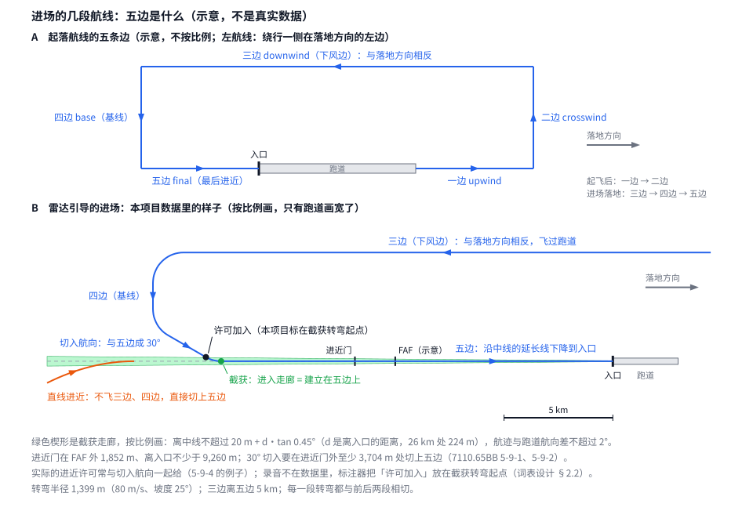

# 先验设计（两层模型第 5 阶段）

**一句话**：先验是管制员的语言模型。每隔 2 s，它对空域里的每一架进场飞机，读取到这一刻为止能知道的信息——本机和其他
飞机过去的位置、已经对它们说过的指令、机场此前的落地情况、候选跑道——然后说出这一步的六列指令词（每列要么"不变"，
要么是一个新词）。它先在句子产物上用 teacher forcing 训练（训练时每一步的输入用真实的指令，而不是模型自己上一步说的），
再和执行器接成闭环：先验说一步指令，执行器按指令飞 2 s，如此往复。

词的定义见[指令词表设计](instruction_vocabulary_design.zh.md)，执行器见[执行器设计](executor_design.zh.md)，
整体框架见[两层模型框架](two_tier_framework.zh.md) §1、§4；每次训练的结果见[先验的读数](../../../docs/two_tier/readouts/2026-09-24_prior_readouts.zh.md)。
本文只写现行的设计；设计是怎么一步步改过来的，看 git 历史和 `docs/CHANGELOG.md`。

---

## 0 状态

| 项 | 状态 |
|---|---|
| 设计 | 用户 2026-09-24 已确认全部取值（§10）；机型这一版不加，模型留一个"每架飞机的静态属性"接口（§4.5）。运动与方向差两块输入按第二版的比较结果都给（读数文档 §2） |
| 代码 | 第 0、1 步和单机自由生成已实现并合并进 `dev-two-tier`（第 0 步 `297c3e10`，第 1 步 `47c7b790`，自由生成 `0bbe6abf`）。第 1 步是单机：每架航班一个场景，模型已按 §6 带飞机轴（本步只有一架）。按落地强化（后训练设计 §2，`e8ee1373`）、闭环提速（逐位不变，`002998fb`）和 CAT-K 的归档（`e5f18692`）已合并进 `dev-two-tier`（`7e1e2df0`）。闭环监督微调（CAT-K）不采用（后训练设计 §6），代码已归档（`dev-prior-fast` `e5f18692`，`archive/closed_loop_sft_2026_09/`）；后训练第二阶段的代码（下滑道下沿屏蔽、扩充起点，后训练设计 §3–§5）连同会影响训练的代码健康修复已合并进 `dev-two-tier`（`acb93b55`，2026-09-26）；程序屏蔽跟着模型走、与词表规则分开（§5.1）已合并（`c0fc756b`，2026-09-26），现有模型已补记录；合并后的代码拒绝执行器规格 v7，现行句子产物 `instruction_language/v5_20260926`、执行器规格 `executor/v9_20260926` |
| 训练与读数 | 第 0 步（划分、重测规格、重建句子产物、普查）：读数文档 §3。第 1 步：选中 full（候选跑道带落地情况、各列按顺序输出），验证集每个预测步 0.2643，**§9 第 1 步的门过了**：每列都赢两个基线；还没建立在五边上的航班上，第一步跑道 81.5 %，B1 69.6 %、B3 72.1 %（读数文档 §4）。单机自由生成：先验说的词落地 89.3 %（内部选择集）、90.2 %（验证集，只读一次），标注的词 100 % / 99.9 %；门先只记录（用户 2026-09-25）（读数文档 §5）。**闭环监督微调（CAT-K）失败，不采用**（后训练设计 §6，读数文档 §6）。按落地强化（后训练设计 §2）完成、采用：验证集先验说词落地 90.2 → 97.2 %（被引导 83.3 → 93.9 %），teacher forcing 负对数似然不变（读数文档 §7）。第二阶段不采用（后训练设计 §0）。在重建后的执行器 v9 上重读验证集：第一阶段模型 97.2 %（与 v7 相同），base 89.7 %（读数文档 §11）；base 不重训（用户 2026-09-26）。以前按航班划分的两次训练（读数文档 §1、§2）不作本设计的对照 |
| 下一步 | 单机一段做完（第二阶段采用 augmented，后训练设计）。多机按[多机设计](multi_aircraft_design.zh.md)走：设计已确认（2026-09-27），M0 开发中（多机设计 §6.4） |

文中路径都相对 `4dTrajectory/`（`outputs/…`）或 `4dTrajectory/ts_transformer/`（`docs/…` 和包名）。

---

## 1 先验做什么

- 先验是两层模型的上层：它决定说什么指令、什么时候说；下层的执行器只按指令飞，负责保证飞得出来。
- **一步**就是句子的一行，2 s。每一步有**六列指令词**，每列是一个分类，类别 = "不变" + 这一列所有可能的取值：

  | 列 | 取值 | 类别数 |
  |---|---|---|
  | 跑道指针 | 本机场的候选跑道（最多 8 条） | 9 |
  | 进近 | 未许可、许可加入、复飞 | 4 |
  | 航向 | 每 5° 一档，共 72 档 | 73 |
  | 高度 | 181 档，加"下降至落地" | 183 |
  | 下降角 | 平飞、4 个下降档、爬升 | 7 |
  | 速度 | 47 档，加"未指定" | 49 |

- 每架飞机的句子从它进入跑道 25 km 范围开始（harvest 的到达切片起点）。先验从第 `N_look` 行开始对它说指令，前面这几行只用来
  观察。**第一个预测步**（第 `N_look` 行）要说出此时六列各自生效的指令；之后每一步，每列要么"不变"，要么说一个新词（每列
  大约只在 1–2 % 的步上换词）。闭环时，执行器从同一行的观测状态起飞。
- **通过标准**（框架 §4 的"门"）：困惑度、前 K 个候选的覆盖率、自由生成时飞机能不能落地、是否赢过两个基线（"重复上一条"
  和"只看上一个词"）。跑道和多机另有自己的标准（§8、§9）。

### 1.1 进场的几段航线：五边是什么

本文和后面几份设计文档常说"五边""建立在五边上""转上五边"。这里把进场的几段航线说清楚（图 1）。

**起落航线的五条边**（图 1 A）：飞机在机场周围起飞、落地时绕的一圈叫**起落航线**（traffic pattern）。FAA 的《飞行员/管制员术语表》
（P/CG，TRAFFIC PATTERN 条）把它分成几段，中文按飞的先后叫一边到五边：

| 中文 | 英文 | 是哪一段（按 P/CG TRAFFIC PATTERN 条） |
|---|---|---|
| 一边 | upwind leg（接在起飞 departure 之后） | 起飞后沿跑道中线的延长线继续直飞 |
| 二边 | crosswind leg | 在跑道起飞那一头的外面，与跑道成直角 |
| 三边（下风边） | downwind leg | 与跑道平行，方向与落地方向相反；通常从二边一直到四边 |
| 四边（基线） | base leg | 在跑道进近那一头的外面，与跑道成直角；通常从三边一直到跑道中线的延长线 |
| 五边 | final approach | 沿跑道中线的延长线、朝落地方向飞；通常从四边一直到跑道 |

起飞的飞机飞一边、二边；进场落地的飞机只用后三条：在三边上逆着落地方向飞过跑道，转四边，再转上五边，沿五边落地。从跑道方向直接进来、
不飞三边和四边、直接切上跑道中线延长线的，叫**直线进近**（P/CG STRAIGHT-IN APPROACH VFR 条）。

**仪表进场里的五边**（图 1 B）：我们的数据是大机场的仪表进场，由雷达管制员用航向指令引导。形状与起落航线相同，只是范围大得多。

- **五边就是最后进近航线**（P/CG FINAL APPROACH COURSE 条：通向跑道或跑道中线延长线的一条航迹）。本项目取跑道中线的延长线：每条候选
  跑道的入口位置加它的航向（`instructions.airport.RunwayCandidate`）。飞机在五边上对准跑道，沿下滑道（多为 3°）一直下降到跑道入口。
- 程序在五边上标一个**最后进近定位点**（FAF）：从 FAF 到跑道是程序的"最后进近段"（P/CG FINAL APPROACH FIX、SEGMENTS OF AN INSTRUMENT
  APPROACH PROCEDURE 条）。后训练设计 §3 的下滑道下沿只在 FAF 以内接上。
- **管制员怎样把飞机引上五边**（7110.65BB 5-9-1、5-9-2）：给一个切入航向，让飞机在**进近门**外至少 3,704 m（原文 2 miles）处切上五边；
  切入角不超过 30°，切入点离进近门不到 3,704 m 时不超过 20°。进近门是五边上、FAF 外 1,852 m（1 mile）、离入口不少于 9,260 m（5 miles）的
  一点（P/CG APPROACH GATE 条）。**进近许可**通常与切入航向一起给（5-9-4 的例子："Turn right heading three four zero. Maintain two
  thousand until established on the localizer. Cleared I-L-S runway three six approach."），飞机随后自己切上五边、沿五边飞到落地。执行器
  飞到航线碰不到的地方时，也按 30° 自己切入（词表设计 §2.2）。

**本项目怎样判定"建立在五边上"**（词表设计 §2.2、§3）：P/CG 的 ESTABLISHED 条只说"稳定在某条航道上"，没有给数。本项目用标注器和
执行器共用的**截获**判定：

- **截获走廊**：离入口 d 米处，离中线不超过 20 m + d·tan 0.45°，航迹与跑道航向差不超过 2°，并且在入口之前。这三个数是从已经对准航道的
  航迹上量出来的（词表设计 §10；现行句子产物 `v5_20260926`）。
- **截获**：航迹从某一行起一直留在走廊里，直到越过入口；那一行就是截获的行。**已建立在五边上 = 已截获。**
- **许可加入**（进近列的词）标在**截获转弯**开始的那一行。截获转弯是飞机从切入航向转到跑道航向的那段圆弧，从许可一直到截获；
  "转上五边"说的就是这一段。这是本项目的标法，不是管制员说话的时刻：无线电录音不在数据里，实际的许可常常更早、与切入航向一起给；
  标注器只能从航迹上看出飞机什么时候开始转向跑道（词表设计 §2.2、§3）。
- 执行器飞的时候用同一个走廊判定自己是否已截获；截获之后，横向就沿航线飞（执行器设计）。
- **五边在越过入口时结束**：越过入口时飞机必须在五边上（`final_approach_geometry.threshold_crossing_index`，契约 C3：只看离入口的距离，
  会把三边上正对入口的时刻误判成落地）。句子在越过入口前的最后一行结束。

**先验为什么要分"已建立在五边上"与"还没有"**：飞机一旦在五边上，它落哪条跑道由位置本身就看得出。上一版在内部选择集上的读数：交接时
已许可的航班，跑道前 1 命中 98.0 %；未许可的只有 75.7 %（§11）。所以跑道的成绩分这两组读（§2 第 4 条、§8）。多机时，同一条五边上的飞机
排成一队，间隔沿五边量（多机设计 §3）。



*图 1*：进场的几段航线（示意，不是真实数据）。A：起落航线的五条边，不按比例。B：一次雷达引导的进场，按比例画（只有跑道画宽了）：
三边、四边、与五边成 30° 的切入航向（在进近门外 3,704 m 以上切上五边）、许可加入（本项目标在截获转弯起点）、截获（进入走廊）、
进近门与 FAF（位置示意）、五边；橙色是直线进近。图由 `python run_ts.py approach_legs_figure` 画出（`experiments/approach_legs_figure.py`）；
`tests/test_approach_legs_figure.py` 核对文档里的图就是它画出的样子，并核对每一段转弯都与前后两段相切、30° 的切入点在进近门外至少
3,704 m。

## 2 原则

1. **输入只包含"说这一步指令之前，管制员能知道的东西"**：本机过去的位置、机场此前的落地、其他飞机此刻和之前的位置以及
   已经对它们说过的指令。每一项都写明来源和时刻，时刻都不晚于这一步。
2. **标注器从航迹里读出的指令，只当预测目标，不当输入条件**。输入里唯一出现的指令，是到上一步为止已经说过的那些（自回归
   的前文，§4.3）：训练时用标注出来的，闭环时用模型自己说过的。
3. **以"场景"为单位**：数据、模型、划分都按"同一机场、同一时刻的一组飞机"来组织；单机就是只有一架飞机的场景，用同一套代码。
4. **按运行日划分数据**，测试集按整天另行封存；跑道的结果分开读："方向对不对"与"平行跑道左右对不对"，"第一个预测步时已经
   建立在五边上"与"还没有"。

## 3 数据

### 3.1 句子产物

- 句子产物是唯一的真值来源（框架 §1）。按 §3.3 的新划分重新生成一份；标注器和标注规则不变（`instruction-v3`）。只读这一份，
  并核对其中记录的词表规格 sha 与标注器源码 sha。
- 一架航班的句子对应它信号的前 `len(words)` 行（在落地之前结束）。信号每 2 s 一行，由 ADS-B 报告点线性插值得到，所以一行的
  位置可能用到这一行之后最近的那个报告点：用到 2 s 以后的报告点的行占 0.86 %，用到 7.5 s 以后的占 0.044 %（第二版训练时
  量的），影响很小，不另处理。

### 3.2 场景

- **场景**：同一机场、同一时刻的一组飞机，按绝对时间对齐，2 s 一步。某架飞机某一行的绝对时间 = 它进入 25 km 范围的时刻
  （到达清单里的 `entry_time_utc`，信号里每架航班都记着它）+ 这一行在它句子里的时间。注意不是航迹文件的 `start_time_utc`：
  那是第一次收到信号的时刻，中位数早 45 s。据此建一个**场景索引**（`prior/scene.py`）：每一步有哪些飞机在场。
- **哪些飞机在场**：有句子的到达航班，先验要对它们说指令；没有句子的到达航班（被标注器拒绝的）作为**背景飞机**，只提供
  位置，不对它们说指令、也不算损失；离场和飞越的航班（航迹库里"不落地"的航迹）暂不放入，读数里注明这一点。
- **训练样本怎么切**：§9 第 1 步（单机）每架航班单独成一个样本。多机把同一机场上时间互相重叠的航班串成段、再切成样本，切法见
  [多机设计](multi_aircraft_design.zh.md) §2.3。

### 3.3 划分（用户 2026-09-24 确认）

- **运行日**：UTC 时间减 9 h 后的日期（在夜里航班最少的时候切开一天；`data/day_split.operational_day`）。**一架航班属于它
  落地那一刻所在的运行日**：落地统计取自航迹清单，航迹清单只有落地时刻、没有进入时刻，而同一架航班在到达清单和航迹清单里
  必须落在同一天。按进入时刻和按落地时刻会分到不同运行日的航班只有 20 架。harvest 现在覆盖 90 个运行日（2026-04-30 到 09-21）。
- **按运行日划分**：所有机场使用同一批日期，种子 1337。按天数取整来分，不让每一天各自抽签（90 天时抽签，测试集的天数会差
  ±3.4 天，约为测试集的四分之一）：日期按 sha256(种子:日期) 排序，前 round(15 % × 90) = 14 天为测试集，接着 14 天为验证集，剩下
  62 天里 round(62 ÷ 7) = 9 天为"内部选择集"（专门用来比较不同的模型变体），其余 53 天为训练集（四舍五入时 0.5 进位）。验证集
  用于提前停止训练和最后读一次结果。合格的到达航班分到各份：测试 9,838 架（只从清单里数，不打开）、验证 10,757 架、内部选择
  6,918 架、训练 44,734 架（数据平面筛选之前的数）。
- **分法只做一次，提交进仓库**（`data/day_split_20260924.json`）：按天数取整的代价是，某一天分到哪一份取决于整个日期列表——
  多下载 7 天，就会有一个现在用来开发的日子变成测试日；多 16 天，就会有一个测试日变成开发日。所以生成信号的 runner 只用这份
  提交的分法，harvest 的运行日与它不一致时直接拒绝。以后数据扩充，要另外决定新的分法，并保证这 14 个测试日仍然封存。
- **测试集的运行日完全封存**：这些天的全部航班（不论它们原来按航班被分到哪一份），在两层模型这条研究线上都不打开——不读
  信号、不标注、不进入落地统计，也不进入场景。写入和读取句子产物时，落地在测试日的航班会被拒绝（`SealedDay`）。其余日子的
  航班全部可用，包括原来按航班被分进测试集的那些。
- **原来按航班抽的测试集保留给 ts 的其他模型**。需要跨模型比较时（例如"先验 + 执行器"对"控制路径模型"），只用双方都没
  见过的航班：落在新测试集运行日里、并且原来也在测试集里的那些航班，共 1,458 架。
- **词表规格在新训练集上测量**：从数据得出的规格值（容差、角度档的边界等）只在按运行日划分的训练集上测量（原来的规格
  `0b4ea75be36d` 在旧训练集上测出，旧训练集包含新测试集那些运行日的航班，已按此重测为 `145d6911e75b`，读数文档 §3）。

## 4 输入（每架飞机、每一步 t；只用 t 以及 t 之前的信息）

### 4.1 本机的位置与运动

- **位置**：机场坐标系下的 E、N、MSL 高度，以及从句子第一行起经过的时间。缩放：位置除以 10 km，高度除以 1 km，时间除以 600 s。
- **运动**只从过去的位置计算：用上一行到这一行的位移除以 2 s，得到地速（除以 100 m/s）、运动方向（sin、cos）、垂直速率
  （除以 10 m/s）。不用信号里的航迹、地速、垂直速率，因为那些是用前后各 7.5 s 的数据拟合出来的，含有未来的信息。第二版
  比较过：给这一块，负对数似然降得最多，几乎都降在高度、下降角两列（读数文档 §2）。
- **先观察一段再开始说指令**：句子的前 `N_look` 行只作为观察、不做预测，这样到第一个预测步时，模型已经看到了 `N_look` 行
  过去的位置，能看出飞机往哪飞、飞多快、在升还是在降。

### 4.2 候选跑道（每条跑道一个向量）

- **几何**：入口的 E、N、高程，跑道航向（sin、cos），跑道长度。
- **相对位置**：每一步都对本机场所有候选跑道计算（用 `instructions.airport.relative_to_runway`，与标注器是同一个函数）：沿
  航道方向离入口多远（入口之前为正），偏离中线多远（右侧为正），这两项都取 asinh(距离 ÷ 1 km)；高出入口多少（除以 1 km）。
  另有一项"方向差"（过去的运动方向 − 跑道航向，sin、cos；第二版比较过，给）。
- **机场层面的落地情况**：在 t 之前的 `T_cfg` 分钟里，同一机场有多少架飞机落在这条跑道上；离上一次有飞机落在这条跑道上
  过去了多久（如果没有，记为"无"并置一个标志位）。落地记录取 harvest 航迹清单里已分配到跑道的落地（每架的落地跑道
  和落地时刻，`prior/scene.context_landings`，与跑道意图研究 `data/runway_context.build_airport_context` 的取法相同），只取落地
  时刻早于 t 的，并排除测试集运行日的落地。
- 以上几何、相对位置和落地情况，经过一个所有候选跑道共用的小网络（线性层 → GELU → 线性层，宽度 d），得到这条跑道在这一步
  的向量。跑道没有编号嵌入，也不给每条跑道一个固定不变的量：那样模型会学成"认出这是 30L"，跑道构型一变就错（§11）。因此，
  调换候选跑道的顺序，只会调换跑道打分的顺序，别的都不变。

### 4.3 已经说过的指令

先验是自回归的：它在第 t 步做判断时，能看到自己（训练时是标注）在第 t−1 步及以前已经对这架飞机说过的所有指令，这相当于
语言模型读到的"前文"。具体输入的是：

- **每列当前生效的指令**。一列指令说出之后，就一直有效，直到这一列说了新词为止；"不变"就是沿用当前生效的那个。所以在第 t
  步，每列输入的是"到第 t−1 步为止，这一列最后一次说的词"，经过这一列的嵌入层。在第一个预测步之前，六列都还没有说过任何
  指令，输入的是每列各自的一个"尚未说过"的嵌入。
- **每列距上次换词过了几步**（取对数后输入）：让模型知道一条指令已经执行了多久。
- **生效跑道的向量**：跑道指针说出之后，输入的不是跑道的名字，而是这条候选跑道这一步的向量（§4.2）。这样模型直接知道"被
  指定的那条跑道"此刻相对本机在哪里。跑道还没说时，用一个"尚未说过"的向量。
- 前 `N_look` 行观察期里，标注器其实也读出了一些指令（例如这段时间里换了航向），但先验在那段时间没有说话，这些指令既不当
  输入、也不当目标；它们的净效果体现在第一个预测步的目标里——第一个预测步要说出的，正是此时每列生效的那个词。
- 训练时，这些输入来自标注好的句子（teacher forcing）；闭环时，来自模型自己在前面各步说出的词。

### 4.4 场景里的其他飞机

- 单机（§9 第 1 步）时为空（用掩码去掉）。多机（[多机设计](multi_aircraft_design.zh.md)，边特征的最终定义在它的 §2.5）对第 t 步场上的每一架其他飞机，输入它的位置与运动、已经对它说过的指令（编码
  方式与本机相同；背景飞机没有指令，记为"无"），以及它与本机之间关系的一组特征（下称**边特征**）：
  - 相对位置：在本机的坐标系里（以本机位置为原点、本机运动方向为轴）的前后、左右、高度之差——不用绝对坐标表示交互，
    文献里用绝对坐标比不给还差（§11）；
  - 沿本机生效跑道的航道方向，两者离入口的距离之差：谁在前、相隔多远；
  - 由过去位置算出的接近速度；
  - 两者生效的是不是同一条跑道，或者一对平行跑道。

### 4.5 每架飞机的静态属性（接口）与其他背景

- **每架飞机的静态属性**：一个在整段飞行里不变的向量，经过一个线性层加到这架飞机每一步的输入里（本机和其他飞机用同一层）。
  **这一版为空**（宽度 0，不参与计算）：机型不加，用户判断航迹本身（速度、转弯、下降的快慢）已经隐含了机型信息。接口留着，
  以后要加机型或别的静态信息时，只往这个向量里加量，不改模型结构。
- **以后若加机型**，按这样的做法：不用机型编号嵌入（编号会让模型记住个别机型，遇到少见或没见过的就不会用），而用几个有物理
  或规章含义的量——尾流间隔类别（CWT，`inference/runway_schedule.wake_category`，出自 FAA JO 7360.1K 附录 A）、公布的进近速度及
  上下限、最大着陆重量（`aircraft/reference_speeds`）；查不到的记"无"并置标志位；多机时再把前后两架的尾流类别换算成"按规章
  至少要隔多远"（`runway_schedule.Separation`）作为一项边特征。作为一个变体与不加的版本比较后再决定。
- **机场**：一个机场嵌入。
- **不给的**：钟点和风。这两样在训练的日子里会变成"今天是哪种跑道构型"的标记，模型会学成按钟点背构型，换一天就错（§11）。

## 5 输出

- 六个输出头（§1 的表）。跑道头：每条候选跑道的分数 = 隐状态 · W · 这条跑道的向量，另有一个"不变"的分数；在本机场的
  候选跑道上做 softmax（不存在的位置分数为负无穷）。
- **第一个预测步六列都必须说出一个词**（屏蔽"不变"）。
- **同一步里，六列按顺序输出**：跑道 → 进近 → 航向 → 高度 → 下降角 → 速度，后面一列的输出头能看到这一步前面几列刚选的值
  （训练时用真值）。这样"许可加入"和跑道不会互相矛盾，自由生成时说出的组合是配得上的（词表设计 §4.4）。
- **同一步里，各架飞机同时说**：每架飞机只看得到上一步为止所有飞机的状态和指令，看不到同一步里别的飞机刚说了什么（MotionLM
  也是这样做的）。一步只有 2 s，这个近似影响很小；读数里报"同一步里两架飞机都换了词"的比例。
- **损失**：对要说指令的飞机，在预测步（第 `N_look` 行起）上把六列的交叉熵相加，再除以预测的步数。

### 5.1 说话时的屏蔽：词表规则与程序屏蔽分开，程序屏蔽跟着模型走

先验自己说词时（自由生成、后训练的闭环、训练视图的导出），有两种屏蔽把"不能说的词"拿掉。两者来源不同、变化的频率不同，**分开定义、分开
配置**（用户 2026-09-26）：

| | 词表规则（语法屏蔽） | 程序屏蔽 |
|---|---|---|
| 是什么 | 词表的相容规则（词表设计 §2.1、§2.5：换跑道时进近跟着改，高度与下降角要配得上，"下降至落地"配下降档；`instructions.grammar`）；生效的跑道不再说一遍；执行器已许可或已截获后跑道锁住（执行器设计 §4.6） | 按后训练阶段加的约束。现在只有一套：程序高度（后训练设计 §3.4 的五条：下滑道下沿、决断高度、跌破之后不爬升、"不变"）；多机阶段的间隔屏蔽（后训练设计 §1 第 3 项）会是另一套 |
| 属于谁 | 词表和执行器 | 训练出这个模型的那个阶段 |
| 多久变一次 | 基本不变；变了就是新词表（新规格），模型本来就按规格 sha 绑定（`load_prior` 已核对）。缺口：`instructions/grammar.py` 不在标注器 sha 覆盖的文件里，只改它不会被发现（`docs/code-health-followups.md`；加进去会让现有句子产物和模型的 sha 都对不上，等下一个词表规格） | 每个后训练阶段都可能不同 |
| 谁决定开不开 | 永远开，没有开关 | 模型自己记着（下面第 2 条）；换成别的要明确写出来 |

**要解决的问题**：原来程序屏蔽是调用者传的一个可选参数（`Speaker(finals=…)`，不传就不开），每个入口自己决定——自由生成默认不开、
加 `--procedure-masks` 才开，第一阶段不开，第二阶段开，训练视图的导出不开。模型目录里没有记录它是在哪套屏蔽下训练的，于是：
(1) 用 augmented 时忘了开，它就在训练时从没见过的状态下说话（后训练设计 §3.1：屏蔽训练和使用都要开），读数不报错；(2) 程序高度的
规则改过一次（2026-09-25 只有下滑道下沿，09-26 加了决断高度和跌破之后不爬升），之前几次第二阶段的模型是在旧规则下训练的，现在打开
开关用的是新规则，没有任何提示；(3) 规则读的数据（CIFP 的 FAF、公布的 DA、下滑道）换了，同样没有提示。

**设计**：

1. **每套程序屏蔽有名字**，名字只在代码里定义一次（`prior/masks.py`），名字里带版本。任何一条规则允许的词变了，就换一个名字，旧名字
   从代码里删掉（与 schema 名字的规矩相同）：在旧名字下训练的模型从此打不开来说话，不会悄悄换成新规则。

   | 名字 | 内容 | 代码 |
   |---|---|---|
   | `procedure-altitudes-v2` | 后训练设计 §3.4 第 1–5 条 | `181295fc`（2026-09-26）起 |
   | `procedure-altitudes-v1` | 只有下滑道下沿（第 1、2 条），**已退役**，代码里没有 | `3cb1fe72` → `181295fc` |

2. **模型目录里记着它的程序屏蔽**：`procedure_masks.json`（schema `ts-prior-procedure-masks-v1`），和 `checkpoint.pt` 由同一个 runner、
   同时写：

   ```json
   {"schema": "ts-prior-procedure-masks-v1",
    "checkpoint_sha256": "<同目录 checkpoint.pt 的 sha256>",
    "sets": [{"name": "procedure-altitudes-v2", "data_sha256": "<这套屏蔽读的数据的摘要>"}],
    "written_by": "<写它的 runner>", "written_utc": "…", "git": {…}}
   ```

   - `sets` 是列表，按顺序、每个名字至多一次；空列表就是"只有词表规则"（base、landing）。多机阶段加间隔屏蔽时往列表里加一项，
     文件格式不变。
   - `checkpoint_sha256` 把记录和这份权重绑在一起：只拷走 checkpoint 不带记录，或者记录旁边换了权重，都打不开。
   - `data_sha256`：这套屏蔽读的数据的摘要。程序高度读的是每条候选跑道的 `RunwayProcedure` 全部字段（入口、航道、入口高程、长度、
     入口跨越高度、下滑角、FAF 距离、LPV 扇形、DA），按机场、跑道顺序排好算 sha256。CIFP 或跑道数据换了（例如新的 AIRAC 周期），
     打开时对不上就拒绝——按新数据用这个模型是一个要人拿主意的决定，不自动发生。
   - **为什么单独一个文件，不写进 `config.json` 或 `checkpoint.pt`**：`config.json` 与 `checkpoint.pt` 共用 schema
     `ts-prior-checkpoint-v3`，往里加字段就要换 schema 名字，现有模型的 `config.json` 都得改写，而它记的是当时怎么训练的，不该事后改；
     `checkpoint.pt` 的 sha256 已被下游记下（第二阶段 `config.json` 的 `prior.checkpoint_sha256`、训练视图的 `checkpointSha256`），
     不能动。单独一个文件，现有的字节一个不变。
   - 词表规则不写进这个文件（它不属于模型，见上表）。

3. **打开模型时一起读出来**：`load_prior(目录, 句子产物)` 返回 `LoadedPrior(model, payload, config, procedure_masks)`，
   `procedure_masks` 是这个模型自己的那几套，已经按现在的代码和数据建好，可以直接交给说话的。以下情况拒绝，并说清楚原因：没有
   `procedure_masks.json`；schema 不对；`checkpoint_sha256` 对不上；名字不是这份代码实现的（例如 `procedure-altitudes-v1`）；
   `data_sha256` 对不上。

4. **说话时程序屏蔽必须给**：`Speaker`、`ClosedLoop`、`speak_and_fly` 的 `procedure_masks` 参数没有默认值（原来的 `finals=None`
   就是"忘了传就不开"的来源）。通常传 `loaded.procedure_masks`；要用别的，写 `ProcedureMasks.build(名字们, 各机场几何)`（空的也要这样
   明确写），日志写明用的是不是模型自己的。`Speaker` 里两层分开：词表规则写在它自己里面，永远算；程序屏蔽是传进来的对象，
   每套自己保存每架飞机要跟踪的状态（程序高度：每条候选跑道切入没有、切入前跌破没有），`Speaker` 把各套允许的词与词表规则允许的
   求交集。屏蔽之前放在被拿掉的词上的概率仍按列合在一起记（与现在的读数格式相同）；训练用的"这一步允许哪些词"也是合在一起的
   （句子就是在这个分布下采的）。

5. **各入口**：

   | 入口 | 说话时用哪几套 | 写不写 `procedure_masks.json` |
   |---|---|---|
   | `prior_train`（第 1 步，base） | 不说话 | 写空列表：teacher forcing 训练，它的自由生成读数都只开词表规则（§9.1） |
   | `prior_landing_reward`（第一阶段，landing） | 本阶段定的：空（后训练设计 §2），runner 里一个常数 | 每一轮写空列表 |
   | `prior_augmented_reward`（第二阶段，augmented） | 本阶段定的：`procedure-altitudes-v2`（后训练设计 §3），runner 里一个常数 | 每一轮写它；第 0 轮的读数是起点模型（landing，自己的是空）在本阶段屏蔽下的读数 |
   | `prior_free_generation` | 默认模型自己的（`--procedure-masks own`）；换成别的：`none`，或逗号隔开的名字 | 不写模型。读数格式没因此变（当时 `ts-prior-free-generation-v4`；执行器 v11 起是 v5，因为判定多了两个结局）：`procedure_masks` 仍记开没开程序高度，模型自己的在它的目录里，日志写明两者是否相同——不换 schema，已有的读数照样能用。开着程序高度，就同时按下滑道下沿结束句子、读切入前的三项（与原来相同） |
   | `prior_generation_training_export`（训练视图） | 明确传空（它现在就这样飞，行为不变） | 不写。按模型自己的屏蔽导出，要等导出格式能带上"低于下滑道下沿"的结束（`docs/code-health-followups.md` 已有一条，属于前端那边的分支） |
   | `prior_procedure_check`（标注数据，不是模型） | 直接用程序高度的规则和数据（`procedure.published_procedures`）：它检查的是规则本身 | 不写 |
   | 后端的模型航迹（`aeroviz_backend/autopilot_segment`） | 不说话，重飞导出的词 | — |

6. **现有模型补记录**（一次性；往产物目录里加一个文件，不改任何现有字节；用户同意，2026-09-26 22:25 UTC 已补 22 个，脚本和日志在
   `outputs/POOLED/prior/procedure_masks_stamp_20260927/`，带截断的运行跑完再补它的 8 轮）。按每个目录 `config.json` 里记的训练
   方式定，脚本和它写了什么放在 `outputs/POOLED/prior/procedure_masks_stamp_<日期>/`，已有 `procedure_masks.json` 的目录不碰：

   | 目录（`outputs/POOLED/prior/`） | 训练方式 | 补的 |
   |---|---|---|
   | `v3_step1_20260924/` 四个变体 | `prior_train` | 空 |
   | `v3_rl_20260925/grpo_s1337/round_01…08` | 第一阶段 | 空 |
   | `v3_sft_20260925/catk_s1337/round_01…08` | CAT-K（已归档，闭环里只开词表规则） | 空 |
   | `v3_stage2_restart_20260926/aug_s1337/round_01…02`、`v3_stage2_clip_20260926/aug_s1337/round_01…08`（等它跑完） | 第二阶段 v4、v5 | `procedure-altitudes-v2` |
   | `v3_augmented_20260926`、`v3_augbudget*_20260926`、`v3_augdata_20260926` | 第二阶段 v1–v3，规则是已退役的 `procedure-altitudes-v1` | 不补：打不开来说话，它们的读数都在盘上 |

   后训练的一轮只在它那次运行结束后才补（运行目录里有 `choice.json`，或整次运行有 `STOPPED.txt`），还在跑的跳过，以后再跑一次脚本补上。
   所有模型都用现行句子产物 `v5_20260926` 打开核对（v4 与 v5 的候选跑道完全相同）。`data_sha256` 用补记录时盘上的数据算，浮点数先取到 1e-6
   （这些数经过坐标投影和三角函数，换一台机器最后一位可能不同）；这些数据在这些模型训练之后没有改过（跑道数据 `runway_thresholds.json` 最后一次提交
   `bc45455f` 2026-09-20，CIFP `CIFP_260806` 文件 2026-07-16，`procedure-details` 61 个文件最新 2026-07-03），脚本运行时再打印一遍。
   演练（只列不写，2026-09-27）：补 22 个目录（base 等 4 个、landing 各轮 8 个、CAT-K 8 个、停掉的重启 2 轮），跳过 21 个（v1/v2 旧格式
   7 个、退役规则 10 个、带截断的运行还在跑的 4 轮）；带截断的运行跑完后再跑一次，补它的 8 轮。写的时候脚本先把自己复制进
   `outputs/POOLED/prior/procedure_masks_stamp_<日期>/`，日志也放那里。代码合并之后、补记录之前，所有模型都打不开，所以两件事紧挨着做。

7. **测试与核对**：记录的往返与每一种拒绝；数据摘要对任何一个字段的改动敏感、与机场顺序无关；自由生成默认用模型自己的、
   `none` 和点名的也对；不给程序屏蔽时说话器只屏蔽词表的三列；`prior_train` 写出的记录是空（`tests/test_prior_masks.py`、
   `test_prior.py`）。**重构不改结果**，在真实数据上核对过：landing 模型、同样的种子、选择集，旧代码与新代码各跑自由生成——真实起点
   关着和开着程序高度各 50 句，扩充起点开着 200 句（高度列每步被屏蔽的概率 1.4e-4，1.5 % 的句子被下沿结束）——句子和读数逐位相同。

8. **与另一个会话的分支 `dev-training-rounds` 的关系**：它改了训练视图的导出，并按自由生成读数的 `procedure_masks: false` 字段拒绝
   "开了程序屏蔽的读数"——读数格式没变，这条照样成立；这里只在导出的 `speak_and_fly` 调用里多传了 `procedure_masks=ProcedureMasks.none()`，
   两个分支谁后合并，谁把这一处对上。审查后导出也拒绝开着程序高度的读数，改法与那个分支同一处、逐字相同；试合并：代码文件都自动合并，
   只有 `docs/CHANGELOG.md` 与 `docs/code-health-followups.md` 两处文字冲突。

**关键代码**（`dev-two-tier` `c0fc756b`，路径相对 `4dTrajectory/ts_transformer/`）：

| 什么 | 在哪 |
|---|---|
| 屏蔽集的名字与记录文件 | `prior/masks.py:34`（`MASKS_SCHEMA`）、`:37`（`PROCEDURE_ALTITUDES`）、`:39`（`SETS`） |
| 数据摘要 | `prior/masks.py:55` `finals_sha256` |
| 一个模型说话用的程序屏蔽 | `prior/masks.py:64` `ProcedureMasks`（`:85` `build`、`:104` `speaking`） |
| 写、读记录 | `prior/masks.py:112` `write_masks`、`:124` `read_masks` |
| 程序高度五条规则连同切入与跌破 | `prior/procedure.py:173` `AltitudeMasks`（`:196` `track`、`:205` `allowed`） |
| 说话器：词表规则在里面，程序屏蔽传进来 | `prior/generate.py:60` `VOCABULARY_COLUMNS`、`:80`、`:193` `_allowed`、`:207` `_vocabulary_allowed` |
| 打开模型连同它的程序屏蔽 | `experiments/prior_train.py:71` `LoadedPrior`、`:80` `load_prior`、`:170`（base 写"无"） |
| 自由生成的选择 | `experiments/prior_free_generation.py:389` `procedure_masks_named`、`:396` `mva_charts`、`:495` `--procedure-masks` |
| 两个阶段各自的屏蔽 | `experiments/prior_landing_reward.py:70`、`:344`；`experiments/prior_augmented_reward.py:90`、`:485` |
| 训练视图导出 | `experiments/prior_generation_training_export.py:117`（拒绝开着程序高度的读数）、`:231`（明确不开） |
| 测试 | `tests/test_prior_masks.py`；两个阶段交给说话器和读数的屏蔽：`tests/test_prior_landing_reward.py`、`tests/test_prior_augmented_reward.py` |

## 6 模型

- 每架飞机、每一步的输入 = 本机位置与运动的投影 + 静态属性的投影（本版为空，§4.5）+ 各列生效指令的嵌入 + 生效跑道的
  向量 + 所有候选跑道向量之和的投影 + 机场嵌入 + 时间位置嵌入。
- 每一层依次是：**沿时间的因果注意力**（每架飞机只看自己之前的步）→ **同一步里各架飞机之间的注意力** → 前馈层。飞机之间的
  注意力里，边特征用两次：经一个小网络变成每个注意力头的偏置（决定听谁的），同时经另一个小网络加到被读取的内容（值）上（告诉
  本机那架飞机相对自己在哪里）；只作偏置的话，模型知道该注意哪架，却不知道它在哪（§11）。飞机之间带边特征的注意力，就是在一张全连接图上的图注意力；一个场景只有几架飞机（§11），
  所以不另接图神经网络的框架。场景里只有一架飞机时，这一层只看它自己。
- 尺寸：宽度 d = 192，4 层，6 个注意力头，前馈宽 768，dropout 0.1。

## 7 训练

- **预训练**：在场景上用 teacher forcing，所有要说指令的飞机一起训练（§9 第 1 步是单机）。优化器 AdamW，学习率 3e-4，前 500 步
  预热，权重衰减 0.01，梯度裁剪 1.0；按长度分桶组批，每批约 16,000 步（一架飞机的一步算一步）；看验证集每步的负对数似然
  决定何时停止，连续 3 个 epoch 不下降就停，最多 30 个 epoch。随机种子同时决定初始权重、组批顺序和 dropout。
- **比较变体**：在内部选择集上比较，比较规则在训练之前写进读数文档（负对数似然最低的胜出；差距不超过两个随机种子之间的
  差距时，取输入更少的那个）。
- **产物**：写到 `outputs/POOLED/prior/<名字>/`，只写一次、不覆盖：`checkpoint.pt`，`config.json`（句子产物目录、词表规格 sha、
  标注器 sha、划分方式、git 状态），`history.json`，`readout.json`。只在没有未提交改动的工作树上训练。
- **后训练**（先验自己说、执行器飞，只看结局来改先验）：顺序、做法与取值都写在[后训练设计](post_training_design.zh.md)：
  第一阶段按落地强化（单机，在跑），第二阶段程序高度的硬约束 + 起始状态扩充（单机，设计中），之后是多机的间隔屏蔽与多机的强化。
  闭环监督微调（CAT-K）试过，不采用（后训练设计 §6，读数文档 §6）。

## 8 读数

- **每一列**：每步的负对数似然和困惑度；在真实换了词的步上，模型给"换"的概率，以及取值的前 1 / 前 5 命中率；在没换词的步上，
  模型误说要换的比例。两个基线都从训练集的运行日统计："重复上一条"（按换词频率给"换"的概率、按取值频率给新词）；"只看上一个
  词"（按这一列"上一个词 → 下一个词"的频率，加一平滑）。
- **跑道**（第一个预测步）：前 1、前 2 命中率；分"方向"与"平行跑道左右"两层；分"已建立在五边上"与"还没有"；并与三条因果规则
  比较（`data/runway_context.py`：B0 机场最常用的跑道，B1 此前 30 分钟落地最多的跑道，B3 同一进场方向上一架的跑道）。
- **交互**（多机，[多机设计](multi_aircraft_design.zh.md) §6 的 M1 起）：每一步标出"同一条跑道前方 10 km 内有没有前一架飞机（下称**前机**）"和"场上是否有 ≥ 3 架飞机"；
  速度指令、航向指令的负对数似然和换词时刻，按"有无前机""忙闲"分开读。场景模型另读一项：评估时把飞机之间的注意力切掉（只看
  本机），输出变了多少——不变，说明模型没有学到用其他飞机。
- **闭环**（多机，[多机设计](multi_aircraft_design.zh.md) §7）：落地率、每小时失去间隔的次数、相邻两架到达在入口处的时间间隔分布（与观测对比）。
- **测试**：只用过去的信息——把 t 之后的位置、t 之后的落地、其他飞机 t 之后的状态随意改动，第 t 步的输出不变；调换候选跑道的
  顺序，只调换跑道打分的顺序；测试集运行日的航班一架都不读。

## 9 分步与通过标准

0. **准备**：在训练集的运行日上量这几项：第 `N_look` 行时已建立在五边上的航班占多少；t 之前 `T_cfg` 分钟内有落地记录的步占多少
   （夜里可能没有）；新划分下各部分的运行日数与航班数，以及原来的测试集航班有多少落在新测试集运行日里（跨模型比较能用的
   样本量）；每一步场上有几架要说指令的飞机、几架背景飞机，有前机的步占多少；串成段后段的长度。然后
   用新训练集重新测量词表规格，按新划分重新生成句子产物。
1. **单机**：按 §4–§7 训练，场景里只放本机。通过标准：每一列都赢两个基线；在"第一个预测步时
   还没有建立在五边上"的航班上，跑道赢 B1 和 B3（平行跑道左右单独看）。之后把先验和执行器接起来做单机的自由生成（框架门的
   第三项，§9.1）。
2–5. **多机**（看不看得到交互、场景预训练、多机闭环与后训练）：见[多机设计](multi_aircraft_design.zh.md) §6。2026-09-27 起取代这里原来的
   第 2–5 步（原来的写法在 git 历史里）。

### 9.1 单机自由生成（第 1 步之后）

- **做法**：先验说词、执行器照着飞，一步一步交替。每架航班的前 `N_look` 行用观测的位置；执行器从第 `N_look` 行的观测状态起飞
  （机型、质量、动力学与执行器回放门相同）。到第 t 步（t ≥ `N_look`），先验按 §5 的顺序逐列采样：先采跑道，再在它的基础上采
  进近，依此类推。它读的输入是：
  - 执行器此前飞出的位置，与观测一样每 2 s 一行，运动也由位置算；
  - t 之前 30 分钟的真实落地，与训练时一样，去掉本机自己的落地；
  - 自己此前说过的词。

  采样时按词表的相容规则屏蔽不允许的组合（词表设计 §2.1、§2.5 写明"标注时检查，解码时作为屏蔽"）：换跑道时，已许可的进近
  必须在同一步里跟着改；生效的高度和下降角在飞机当前高度上要相符，"下降至落地"要配一个下降档。检查用的就是标注器自己的那段
  代码（`instructions.grammar`）。屏蔽之前模型放在被禁组合上的概率照样记下，用来看它自己学会了多少词表的规则。

  执行器从这一步开始听这些词，飞 2 s（两个 1 s 周期），再轮到下一步。一直到执行器判定结束，结局按执行器的判定
  （`autopilot.judge`）：落地（在所指跑道上、截获后越过入口，满足 harvest 的落地条件）、越过入口但没截获、越过入口但偏出跑道、
  入口前触地、动力学失败、超时（观测剩余时间的 1.5 倍，与回放门相同）。
- **对照**：同一批航班、从同一行起飞，改由标注的词让执行器飞：第一步是第 `N_look` 行生效的六个词，之后照原句。两者之差就是
  "说词的换成先验"丢了多少。
- **航班**：用自己动力学的航班（与回放门同一组）。开发时在内部选择集上看，可以反复看；验证集只在定稿后读一次。每架航班用不同
  的随机种子采 `K` 句。
- **读数**：
  - 结局分布，分总的和机场 × 进近方式；
  - 跑道：第一步所指的跑道、落地的跑道，各与观测的一致多少；
  - 从起飞到落地的时间，与观测剩余时间之差；
  - 每架每列说了几个词，与标注的句子比；换跑道、复飞各有多少次；结束时进近是否已许可；
  - 屏蔽之前放在被禁组合上的概率（进近列、下降角列）。
- **先验与执行器的分工**：采样、读执行器的位置写在先验这边（`prior/`，不引用执行器）；执行器改成可以一步一步推进
  （原来的整句回放不变，结果逐位相同）；两者由 runner 接起来。
- **门**：先只记录（用户 2026-09-25），不设通过线；先验说词时的落地率留给后训练（[后训练设计](post_training_design.zh.md) §2）去提高。

### 9.2 闭环监督微调（CAT-K）：不采用

搬到[后训练设计](post_training_design.zh.md) §6（做了什么、为什么不采用、代码归档在哪）。

### 9.3 按落地强化（单机，自由生成之后）

搬到[后训练设计](post_training_design.zh.md) §2（后训练的第一阶段），取值在那里的 §8。

## 10 取值

| 项 | 取值 | 状态 | 理由 / 另一种做法 |
|---|---|---|---|
| 测试集怎么封存 | 按运行日另封，占 15 % 的运行日 | 已定 | §3.3 |
| 划分比例 | 训练 70 %（其中 1/7 的运行日作内部选择集）/ 验证 15 % / 测试 15 %，种子 1337 | 已定 | 验证与测试同比例 |
| 词表规格 | 用新训练集的航班重新测量 | 已定 | 原规格测量时用到了新测试集运行日的航班 |
| 怎么看过去 | 句子前 `N_look` 行只观察，不改数据 | 已定 | 另一种做法：在信号里加进入 25 km 之前的位置（平均约 45 s），要改 ts 的数据平面和信号格式 |
| `N_look` | 8 行（16 s） | 已定 | 与数据平面的拟合窗口 15 s 一样长，但只看过去；代价是每句少了开头 16 s（约 1.5 km）的指令作目标 |
| 落地统计的时间窗 `T_cfg` | 30 分钟 | 已定 | 跑道意图研究里 B1 用的值（§11）；第 0 步再量覆盖情况 |
| 同一步各列的顺序 | 跑道 → 进近 → 航向 → 高度 → 下降角 → 速度 | 已定 | 词表设计 §4.4 |
| 场景里放哪些飞机 | 有句子的到达航班说指令；没有句子的到达只作背景；离场、飞越不放 | 已定 | 离场、飞越以后按需要再加 |
| 数据范围 | 跑道周围 25 km 不变 | 已定 | 扩到 50–60 km 要重新下载数据（§11） |
| 多机的结构 | 沿时间 + 飞机之间的注意力，边特征作偏置 | 已定 | §6、§11 |
| 模型尺寸、训练设置 | §6、§7 | 已定（沿用上一版） | 只改输入、划分和结构，便于对照；交叉验证另做 |
| 运动、方向差这两块输入 | 都给，只用过去（第二版选中 V2d） | 已定 | 读数文档 §2：过去的运动降 0.0145、方向差再降 0.0086，种子线 0.0003 |
| 机型 | 不加；模型留"每架飞机的静态属性"接口，本版为空 | 已定（用户：航迹本身已隐含机型信息） | 以后要加时的做法见 §4.5 |
| 自由生成的采样 | 按 §5 的顺序逐列采样，温度 1（就是模型学到的分布） | 建议 | 取最可能的词会几乎从不换词（多数步上"换"的概率 < 0.5）；调低温度、按目标挑句子属于后训练（§7） |
| 每架航班采几句 | `K` = 4（不同种子） | 建议 | 看同一架航班上结局的分散程度 |
| 自由生成的门 | 先只记录 | 已定（用户 2026-09-25） | §9.1 |
| 后训练（闭环监督微调不采用、按落地强化、第二阶段） | 见[后训练设计](post_training_design.zh.md) §8 | | |

## 11 依据

**句子从哪里开始，第 0 步的"已许可"是什么**（训练集 50,223 架，句子产物 `v3_20260924`，2026-09-24 量）：第 0 步离落地跑道入口的
直线距离 p10 / p50 / p90 = 23.1 / 24.1 / 26.4 km。第 0 步已经是"许可加入"的有 13,039 架（26.0 %），其中 11,941 架那时就在五边
的走廊里（离中线中位数 37 m，航迹偏差 0.4°，高出入口 1,267 m——24 km 处 3° 下滑道的高度是 1,258 m），1,098 架正在转向航道；
各机场的比例：KSJC 57 %、KMSY 28 %、KRDU 20 %、KSMF 11 %、KSTL 9 %。也就是说，进近许可是在我们的数据开始之前、由前一个管制员
给的。

**为什么第一个预测步六列都要预测**：如果把交接时的指令当条件给模型，其中有些是那一刻看不到的——"正在下降到哪个高度"，要看到
后来在哪里改平才知道；"正在转向航道"被算作已许可，要先知道飞机后来切上了哪条线（`instructions/labeller/lateral.py`
`read_lateral`）。而对已经建立在五边上的航班，给了"许可加入"再问跑道，飞机的位置本身就说出了答案：上一版在内部选择集上，交接时
未许可的 3,747 架，跑道前 1 命中 75.7 %（按机场最常用跑道猜是 50.5 %）；已许可的 1,275 架是 98.0 %（81.4 %）（读数文档 §2）。

**为什么按运行日划分、不给钟点和风**：同一天、同一时段的航班共用一种跑道构型。跑道意图研究
（`docs/history/2026-09_runway_intent/2026-09-13_runway_intent_plan.zh.md`）的 R1 只有在按运行日划分时才发现：KSJC 30L 关闭的那两天，整天都落 30R，按航班划分
训练出的跑道模型当天只判对 55–57 %，而"入场前 30 分钟落地最多的跑道"（B1）能判对 97–98 %；原因是逐小时的风和钟点在训练日里
成了"今天是哪种构型"的标记（traps T4）。R1.1 还发现，给每条跑道一个固定的量，模型会学成认出具体跑道。

**为什么要机场层面的落地情况**：选跑道首先是机场层面的事。跑道意图 R0（入场时刻，按航班划分的验证集，harvest v5）只用"入场前
30 分钟同机场的落地"就把着陆方向判对了 96.3–99.4 %；难的是平行跑道的左右（KRDU 73–75 %，KSMF 61–65 %，少数跑道只有 33–49 %）。
那次的数据与本设计不同，要在本设计上重新测量。

**一个场景有多大，数据范围里看得到什么**（五个机场的到达清单，2026-09-24 量）：

| 机场 | 到达架数 | 在 25 km 范围内的时长中位数 | 进入时范围内的其他到达 p50 / p90 / 最多 | 与本机在范围内的时间有重叠的其他到达 p50 / p90 |
|---|---|---|---|---|
| KMSY | 7,696 | 321 s | 1 / 2 / 5 | 1 / 3 |
| KRDU | 24,202 | 328 s | 2 / 4 / 8 | 3 / 7 |
| KSJC | 16,772 | 289 s | 1 / 2 / 8 | 2 / 4 |
| KSMF | 9,224 | 328 s | 1 / 3 / 6 | 2 / 4 |
| KSTL | 14,680 | 306 s | 1 / 3 / 7 | 2 / 5 |

一个场景只有几架飞机，所以飞机之间直接做全连接的注意力就够了（带边特征的注意力就是图注意力），不需要另接图神经网络框架。
航迹库里还有到达航班 3–9 倍的"不落地"航迹（KRDU 77,033 条，KSJC 144,965 条），现在不放进场景。我们的数据只覆盖进近的最后约
5 分钟：航迹在进入 25 km 之前平均只多约 45 s，而排序和为拉开间隔所做的引导大多发生在 25 km 以外；在这个范围里能看到的交互，
主要是五边上前后机的间隔、速度指令、加长的下风边和转基线的时机。跑道意图 R3（各机独立估计到达时间，再联合排队，五个机场）
没有在落地时刻上量出交互带来的改进，与此一致；指令层面有没有交互还没有量过，所以要先量（[多机设计](multi_aircraft_design.zh.md) §6 的 M1）。如果要学排序本身，
需要把 harvest 的收集范围扩到 50–60 km，重新下载数据。

**多机的结构和训练顺序有什么文献依据**（`docs/literature/multi_agent_interaction/`，2026-09-24 整理）：2021 年以后的多智能体模型几乎都
在智能体之间做注意力；没有文献在小的全连接场景上比较出单独的图网络更好（全连接图上的 GAT 就是不带掩码的加性注意力；AgentFormer
表 3：Transformer 0.26 / 0.47 对 GCN 0.28 / 0.50）。相对几何要进到被读取的内容里：MTR++ 表 10，只进键 0.3658、键和值都进 0.3754、
不给 0.3513、用全局坐标 0.3463（mAP）；Groot 2022 用相对状态对绝对状态，间隔侵入 0.40 对 4.85（前馈网络）、0.77 对 15.52
（Transformer）。只用 teacher forcing 往往学不到多少交互（Makansi 2022：几个数据集上邻居的贡献约为 0）；大的、复现过的收益来自
闭环（TrafficSim 表 2：闭环训练把碰撞率从 5.92 % 降到 1.28 %，再加碰撞损失只从 0.60 % 降到 0.50 %），在闭环微调之上再做强化
学习收益很小（R1Sim、SMART-R1 在总分上 +0.0001、+0.0006），手工的安全奖励甚至降低了真实性（RLFTSim）。航空方面，终端区的多机
模型都是开环预测（MAIFormer 发现多机在 6 s 时反而不如单机、在 2 min 时更好），没有工作在记录数据上学多机的管制指令、也没有
在真实进场上闭环。

**为什么不做闭环监督微调（CAT-K）**：见[后训练设计](post_training_design.zh.md) §6。

**为什么交互要在闭环里学**：只用 teacher forcing，模型学到的是"有前机时一般会怎么说"这样的相关关系；而管制员说这些指令，是为了
保持间隔、让飞机落地。要让模型在"自己说、执行器飞"的闭环里为间隔负责，交互才学得到。相关的做法：MotionLM、Trajeglish、SMART
（`docs/literature/manoeuvre_tokens/`），Scene Transformer（`docs/literature/hierarchical_prediction/`），闭环训练与航空方向的
文献（`docs/literature/multi_agent_interaction/`）。
