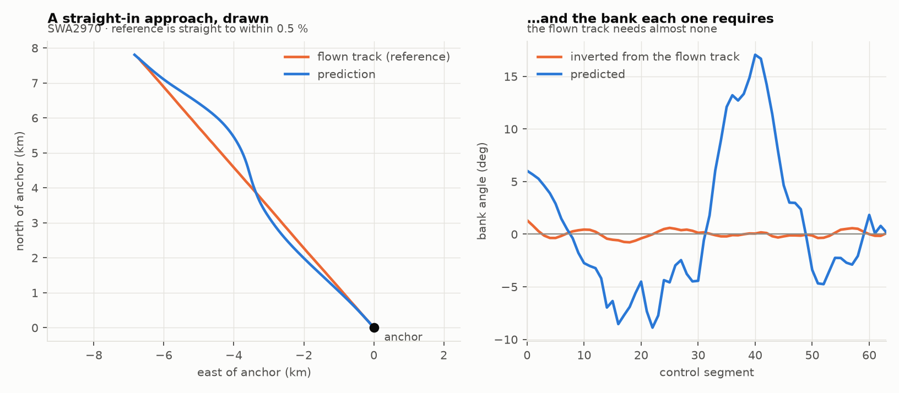
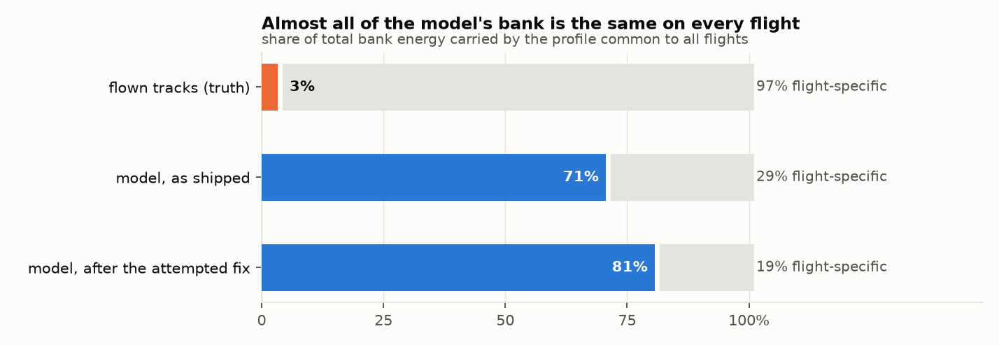
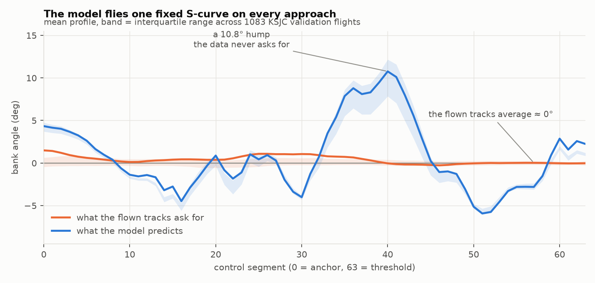
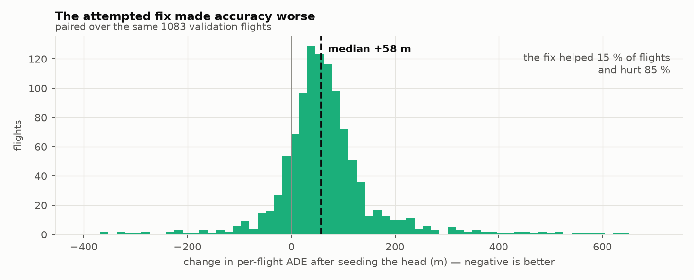
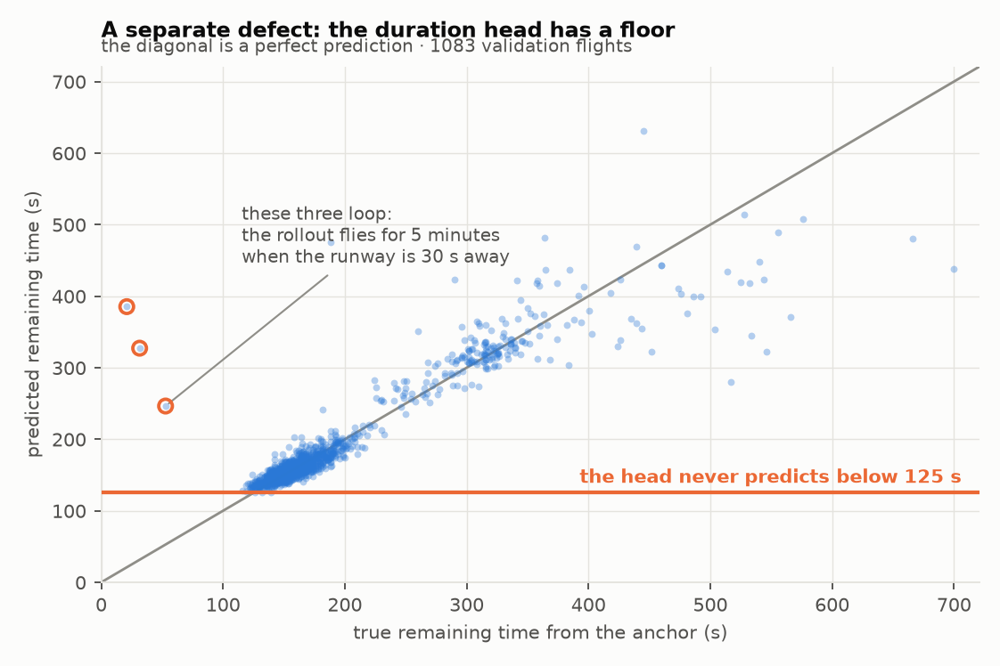

# control 输出的无谓弯曲：诊断、被否决的修复、以及当前结论

日期：2026-08-19
状态：**根因已确认 = 目标函数只约束位置、从不看速度**（§9）。
      第一个假设（控制头零初始化）已被实验否决并回滚（§4）。
      推荐权重 2×（精度最优）或 8×（航迹观感最优），不超过 8×（§9.1）。
      段数、训练预算、条件容量三条轴均已实验否定（§10），组合亦不叠加（§10）。
      结论冻结为 `simple-v2` recipe（§11）。
数据边界：只使用 outer-train / outer-validation；未读取、预测或评估 outer-test
产物：`4dTrajectory/outputs/KSJC/experiments/flight_model_paired{,_seeded_head}/`
图表复现：`python 4dTrajectory/ts_transformer/docs/plot_control_wiggle_diagnosis.py`

---

## 1. 现象

`prediction_output=control` 的预测轨迹带有大量参考航迹上不存在的转弯和弧线。**即使
参考是一条笔直的进近，预测出来仍然是弯的。**



左：SWA2970 的参考航迹（橙）笔直——路径长度和直线距离只差 0.5 %；预测（蓝）两次鼓出去
再拉回来。右：同一条航班，把参考航迹通过动力学**反解**出来的 bank（橙）几乎恒为 0，
而模型预测的 bank（蓝）在 −9° 和 +17° 之间来回。

---

## 2. 定量：问题有多大

判定"参考是否笔直"用 **tortuosity**（路径长度 ÷ 直线距离），不用逐点航向变化累加——
2 s 的 ADS-B 网格上后者会把采样噪声累积成几十度的假转弯（这正是我第一版度量踩的坑）。

在 1083 条 KSJC validation 航班中，**879 条**参考的 tortuosity < 1.02（即真正笔直）：

| | 参考航迹反解出来的 | 模型预测的 |
|---|---:|---:|
| bank RMS | **0.55°** | **3.65°** |
| bank 变号次数（共 63 个段边界） | **0** | **7** |

数据要求几乎不压坡度，模型给出一整条 S 形。

---

## 3. 根因刻画：模型没有在读输入

### 3.1 不是在追 ADS-B 噪声

相邻段的 bank 相关系数是 **+0.958**——曲线平滑缓慢。追逐逐点噪声会给出接近 0 或负的
相关系数。这条假设排除。

### 3.2 70 % 的 bank 能量是所有航班共用的同一条剖面

把每条航班的 bank 剖面拆成「所有航班的平均剖面」和「各自的残差」：



**真实航迹的 bank 只有 3 % 是共用的**（几乎全是航班特有的，逐段航班间标准差 2.63°）；
**模型的 bank 有 71 % 是共用的**（航班间标准差只有 2.23°，而共用剖面本身摆幅达 16°）。
两者的结构完全相反。

### 3.3 而且那条共用剖面不是数据的平均值



| | RMS | 范围 |
|---|---:|---|
| 真实航迹的平均剖面 | **0.60°** | [−0.27°, +1.49°] |
| 模型的共用剖面 | **4.15°** | [−5.93°, **+10.76°**] |
| 两者相关系数 | | **+0.096** |

真实航迹的平均 bank 接近 0，**这是必然的**——左转和右转的进近数量相当，平均必然抵消。
模型那条 S 形**在数据里根本不存在**，与真实平均剖面的相关系数只有 0.096。

### 3.4 逐航班的 bank 技能约等于零

```
  模型 bank 与该航班真实 bank 的相关系数（中位数）        +0.050
  各自扣掉共用剖面之后的相关系数（中位数）                −0.073   ← 这是真正的航班特异技能
```

**模型对单条航班的 bank 没有任何预测能力。**

### 3.5 但输入是有信息量的——所以这不是任务本身无解

比较「未来笔直」（n=879）与「未来是被引导的」（n=203）两组的**回看窗口**：

```
  lookback tortuosity        笔直 1.000   引导 1.004    Cohen d 0.44
  lookback 总转向量（度）      笔直 43.2    引导 55.4     Cohen d 0.82
```

Cohen d = 0.82 是**大效应量**。回看窗口能相当程度地区分两类未来，模型却没有用上。
所以这不能归因于「任务本身多模态、确定性模型只能输出条件均值」——真是那样的话，
输出至少应该接近数据的条件均值，而 §3.3 显示它连**无条件**均值都不是。

---

## 4. 被否决的假设：控制头的零初始化

### 4.1 假设

`control_models._initialize_control_head` 把控制投影的**权重置零**，靠 bias 让未训练
模型输出中性控制量：

```python
head.control_projection.weight.zero_()                       # ← 问题所在
head.control_projection.bias.copy_(_neutral_control_bias(head, bank_rad))
```

`_initialize_final_time_head` 对时长头的输出层同样处理。

线性层往回传的梯度是 `Wᵀ·δ`，**W 为零时它恒等于零**。实测一次前向反向：

```
  出厂初始化：    backbone 总梯度范数 0.000e+00    梯度恰好为 0 的张量 20/20
  权重 std=1e-3： backbone 总梯度范数 8.574e-03    梯度恰好为 0 的张量  0/20
```

整个读历史航迹的 iTransformer **在第 0 步拿不到任何梯度**。训练完的 checkpoint 也吻合：

```
  control_projection.weight  norm 0.55    ← 从 0 爬起来的
  control_projection.bias    norm 5.84    ← bias/weight = 10.5 倍
  final_time_head.network.1.weight  norm 13.26  ← 与 PyTorch 对该形状的默认初始化完全一致，
                                                   即 180 个 epoch 一步没动
```

bias 是 192 = 64 段 × 3 控制量，正好就是那条共用剖面。10.5 倍的范数比与 §3.2 的
71/29 能量分配是同一件事。

### 4.2 实验否决

把权重改为按 `NEUTRAL_LOGIT_PERTURBATION / sqrt(fan_in)` 播种（保持中性起点，实测未训练
输出偏离中性平均 0.4 %、最坏 1.7 % 的包络跨度），重跑完整成对实验：



| | 零初始化 | 播种初始化 |
|---|---:|---:|
| 共用剖面能量占比 | 70.7 % | **80.7 %** ↑ |
| 直线参考上 bank RMS | 3.65° | **4.90°** ↑ |
| bank 变号次数 | 7 | 4 ↓ |
| ADE 均值 | 707.8 m | **776.3 m** ↑ |
| ADE 中位数 | 368.6 m | **427.7 m** ↑ |

逐航班配对检验：播种版只在 **15.2 %** 的航班上更好，**p = 4.2e-127**。

**结论：零梯度起步是真实存在的缺陷，但它不是弯曲的原因。** 播种之后共用剖面占比反而
从 71 % 升到 81 %，精度显著变差。**该改动已回滚**（`git revert f2bd146`）。

---

## 5. 第二个、独立的缺陷：时长头有下限

4 条航班（0.4 %）的预测航迹长度是参考的 1.5 倍以上，最坏 **21 倍**（参考 1.3 km，
预测 27.5 km，绕了一整圈）。原因与 bank 无关：



```
  预测剩余时长范围  [125, 631] s
  真实剩余时长范围  [ 21, 700] s
  真实 < 90 s 的 3 条航班：真实均值 35 s，预测均值 320 s
```

**时长头预测不出低于 125 s 的值。** anchor 已经很靠近跑道的航班，模型仍然让 rollout
飞满 5 分钟，于是绕圈。

整体上这个头并不差（相关 0.92、MAE 14.3 s，而常数基线的 MAE 是 57.2 s），只是低端够不着。
两个飞行模型（point-mass 与 first-order-lag）都有这个问题。

---

## 6. 仍待检验的候选原因

按我认为的可能性排序，每条都附上判定实验：

| 候选 | 判定实验 |
|---|---|
| **训练预算太小**：batch 512、约 10 次更新/epoch、180 epoch ≈ **1800 步**，lr 3e-5 | 拉长到 5–10 倍步数（或提高 lr）重训一次，看共用剖面占比是否下降 |
| **loss 里没有任何航向/速度项**：simple-v1 只有 64 个点的物理位置 MSE + 终点位置 + 时长；bank 只是手段，走对位置即可，走法不受约束 | 加一个小权重的航向或局部速度项（`control_arc_*` 那套已存在），看 bank 是否收敛到数据要求的量级 |
| **条件信息没有进到控制头**：`fused_features` 把 backbone 特征与 8 维 dynamics condition 融合后，64×3 个输出全部来自同一个 512 维向量 | 加宽/加深该路径，看共用剖面占比 |
| **段数过多**：64 段 × 3 控制量 = 192 个自由度去拟合 64 个位置点 | 扫 `n_segments`（16/32）看共用剖面占比 |

**不要**在没有做上面任一实验之前再改初始化——那条路已经走过并被否决了。

### 6.1 实验队列（用户指定的优先级）

四个实验共用一套跑法和一套评分口径：

```
  声明   docs/experiments/<name>_arms.json      每臂只改一个字段
  跑     run_ts_control_arms.py                 train → predict → evaluate → publish
  评分   docs/score_control_arms.py <campaign>  与本文第 3 节同一套指标
```

每臂都保留 checkpoint、逐航班航迹和对比 CZML，可直接在前端切换查看。

| 顺序 | 实验 | 臂 | 状态 |
|---|---|---|---|
| 1 | **loss 设计** | velocity 项 0.5× / 2× position | 进行中 |
| 2 | 段数 | N=16 / N=32 | 已声明 |
| 3 | 训练预算 | lr 1e-4 / batch 128 | 已声明 |
| 4 | 条件信息 | d_model 1024 / 6 层 | 已声明 |

### 6.2 实验 1 的定标（一个必须先做的测量）

velocity 项的权重不能拍脑袋。在**已收敛的 baseline** 上实测两项的量级：

```
  position 项    0.009055   →   951.6 m RMS
  velocity 项    5.815438   →    24.12 m/s RMS      ← 原始量级差 642 倍
```

**收敛后的模型 chart 速度误差是 24 m/s RMS**，约为空速的五分之一，而目标函数从不看它——
这本身就是「loss 只约束位置」这条假设的直接证据。

按 642 倍定标：权重 **0.0008** 让 velocity 项 ≈ 0.5× position，**0.003** ≈ 2×。
第一次试跑用了 0.25，实测 velocity 项是 position 的 **160 倍**（`val parts` 里
`velocity=1.9652` vs `state=0.1123`），会把模型变成纯速度拟合器——已中止重跑，
没有浪费一整轮。

**`control_effort` 刻意不作为一臂**：它的 scale 把 load factor 除以上界 2.0，
于是平飞必需的 n≈1 会被罚得比那条虚假的 bank 更狠，方向是错的。

---

## 9. 实验 1 结果：loss 设计就是根因

产物：`4dTrajectory/outputs/KSJC/experiments/wiggle_loss_design/`
评分：`python docs/score_control_arms.py <campaign> [...]`

给 `true-time-position` 目标函数加一个 chart 速度项（`control_velocity_loss_weight`），
在同一批 1083 条 validation 航班上：

| 指标 | 真实 | baseline | 0.5× | **2×** |
|---|---:|---:|---:|---:|
| 共用剖面占比 | 3.2 % | 70.7 % | 41.9 % | **17.3 %** |
| 直线参考 bank RMS | 0.55° | 3.65° | 1.59° | **0.79°** |
| 变号次数 | 0 | 7.0 | 3.0 | **3.0** |
| 逐航班 bank 技能 | 1.0 | −0.073 | +0.067 | **+0.197** |
| ADE 均值 (m) | | 707.8 | 695.5 | **639.6** |
| ADE 中位数 (m) | | 368.6 | 356.9 | **317.7** |
| FDE 均值 (m) | | 856.2 | 925.5 | **818.6** |
| final-time MAE (s) | | 14.29 | 14.64 | **14.20** |

逐航班配对检验（2× vs baseline，n=1083）：

```
  ADE      中位 −58.2 m   77.8 % 的航班更好   p = 4.7e-79
  FDE      中位 −32.2 m   58.3 %              p = 5.9e-08
  终点误差  中位 −13.3 m   53.4 %              p = 0.029
```

**结论。** 虚假的共用 S 形被砍掉近 4 倍；直线进近上的 bank 从 3.65° 降到 0.79°（真值
0.55°）；逐航班 bank 技能从 **−0.073 变成 +0.197**——模型第一次真正在读输入决定压多少
坡度。而且精度同时改善，ADE 中位数 −13.8 %。

**与 §4 那个被否决的修复对照**，这正是"真修复"与"假修复"的判别：被否决的那次是共用
剖面 71 %→81 %、精度显著变差；这次是 71 %→17 %、精度大幅改善。

**一条需要更正的中间判断。** 0.5× 那一臂 FDE 变差 8 %，当时读作"路径变好、终点变差的
取舍"。2× 那一臂 FDE、终点误差、final-time **全部转好**，所以那不是取舍，只是权重不足
时的中间态。剂量不够就下结论会读出一个并不存在的权衡。

### 9.1 剂量曲线：两组指标的拐点不同

| 指标 | 真实 | baseline | 0.5× | **2×** | 8× | 32× | 128× |
|---|---:|---:|---:|---:|---:|---:|---:|
| 共用剖面占比 (%) | 3.2 | 70.7 | 41.9 | 17.3 | **11.5** | 13.6 | 13.3 |
| 直线 bank RMS (°) | 0.55 | 3.65 | 1.59 | 0.79 | 0.40 | 0.46 | **0.34** |
| 变号次数 | 0 | 7.0 | 3.0 | 3.0 | **0** | **0** | **0** |
| 逐航班 bank 技能 | 1.0 | −0.073 | +0.067 | +0.197 | +0.374 | **+0.465** | +0.459 |
| ADE 均值 (m) | | 707.8 | 695.5 | **639.6** | 664.8 | 670.9 | 688.3 |
| ADE 中位数 (m) | | 368.6 | 356.9 | **317.7** | 325.6 | 337.4 | 322.0 |
| FDE 均值 (m) | | 856.2 | 925.5 | **818.6** | 964.1 | 1111.8 | 1231.2 |
| final-time MAE (s) | | 14.29 | 14.64 | **14.20** | 14.84 | 15.74 | 15.70 |

**弯曲类指标要 ≥8×**：共用剖面在 8× 触底，变号次数从 8× 起归零（等于真值），
bank 技能在 32× 见顶。**精度类指标在 2× 见顶**：ADE、FDE、final-time 全部在 2× 最优，
之后单调变差，FDE 从 818 m 涨到 1231 m（**+50 %**）。

**8× 之后 bank 已压到真值以下**（0.34–0.46° vs 0.55°）——开始过度平滑，与 FDE 恶化
是同一件事：速度约束过强，模型贴住了速度却到不了正确的地方。这正是 README 记录的
flyability「越平淡越好看」陷阱在这里的复现，只不过这次有精度指标同时盯着，所以看得出来。

**推荐**：默认 **2×**（`control_velocity_loss_weight = 0.003`），精度最优且已把共用
剖面 71 %→17 %；若更看重航迹物理观感取 **8×**（0.0125），代价是 FDE +18 %。
**不要超过 8×。**

**一条更正**：先前预测 160× 会退化成纯速度拟合器——实测 128× 的 ADE（688 m）**仍优于
baseline**（708 m）。那句是过度悲观的推断，不是测量。

---

## 10. 四个实验的横向结论

全部 13 个臂在同一批 1083 条 validation 航班上、用同一套评分口径
（`docs/score_control_arms.py`）：

| 实验 | 臂 | 共用剖面 % | 直线 bank RMS ° | 逐航班技能 | ADE 中位 m |
|---|---|---:|---:|---:|---:|
| — | **真实航迹** | **3.2** | **0.55** | **1.000** | — |
| — | baseline (lag) | 70.7 | 3.65 | −0.073 | 368.6 |
| **1 loss** | velocity 0.5× | 41.9 | 1.59 | +0.067 | 356.9 |
| **1 loss** | **velocity 2×** | **17.3** | **0.79** | **+0.197** | **317.7** |
| **1 loss** | velocity 8× | **11.5** | 0.40 | +0.374 | 325.6 |
| **1 loss** | velocity 32× | 13.6 | 0.46 | **+0.465** | 337.4 |
| **1 loss** | velocity 128× | 13.3 | **0.34** | +0.459 | 322.0 |
| 2 段数 | N=32 | 58.8 | 3.25 | −0.000 | 337.1 |
| 2 段数 | N=16 | 63.6 | 3.49 | −0.005 | 358.7 |
| 3 预算 | batch 128 | 60.3 | 3.54 | +0.162 | 355.5 |
| 3 预算 | lr 1e-4 | 69.9 | **4.87** ↑ | +0.067 | 332.2 |
| 4 条件 | d_model 1024 | 48.8 | 2.81 | −0.000 | 343.9 |
| 4 条件 | 6 层 | **71.6** ↑ | 3.90 | −0.075 | 379.9 |

**每一个 velocity 臂都胜过每一个非 velocity 臂**（共用剖面 11.5–41.9 % vs 48.8–71.6 %）。
其余三条轴各自最多挪动 10–22 个百分点，且都不改变"模型飞一条共用剖面"的本质。

### 逐条判定

- **实验 1 loss 设计：确认为根因。** 见 §9。
- **实验 2 段数：否定。** N 减半只降 12 pp，且**非单调**（N=16 比 N=32 更差），
  更像噪声而非趋势。变号次数不可横向比较：按每边界率算 N=16 是 4/15 = 27 %、
  N=64 是 7/63 = 11 %，段数越少单位边界上反而越爱变号。
- **实验 3 训练预算：否定。** 两种增加更新步数的方式给出**不一致**的答案——
  `lr 1e-4` 的直线 bank RMS 反而涨到 4.87°（比 baseline 更糟），说明更多优化只是
  把那条共用剖面拟合得更彻底。`batch 128` 的逐航班技能到 +0.162 却仍有 60 % 共用剖面，
  说明**"技能上升"和"共用剖面下降"是两件事**，只有 velocity 项两者兼得。
- **实验 4 条件信息：基本否定，但有一条线索。** 加深（6 层）完全无效甚至更差
  （71.6 %，技能 −0.075）；加宽（d_model 1024）是非 loss 轴里最大的效果
  （70.7 → 48.8 %），但**逐航班技能仍精确为 0**。容量本身不产生条件化能力。

### 顺带的调参发现（与弯曲无关，未采纳）

`N=32`、`lr 1e-4`、`batch 128` 都把 ADE 中位数改善约 6–10 %，`batch 128`/`lr 1e-4`
把 final-time MAE 降到 13.8 s。这些值得单独评估，但都不解决弯曲。

### 组合实验：不叠加，而且更差

`velocity 2× + d_model 1024` 是唯一有理由试的组合（仅有的两条能降共用剖面的轴，
机理不同）。实测：

| 指标 | baseline | velocity 2× | wide 单独 | **组合** |
|---|---:|---:|---:|---:|
| 共用剖面占比 | 70.7 % | **17.3 %** | 48.8 % | **17.6 %** |
| 直线 bank RMS | 3.65° | **0.79°** | 2.81° | **0.78°** |
| 逐航班技能 | −0.073 | **+0.197** | −0.000 | **+0.174** |
| ADE 中位数 | 368.6 | **317.7** | 343.9 | 336.2 |
| FDE 均值 | 856.2 | **818.6** | 869.8 | **989.6** |

弯曲指标**精确落在 velocity 2× 单独的位置**（17.6 vs 17.3，0.78 vs 0.79）——额外容量
对修弯曲贡献为零。而精度显著变差，配对检验（n=1083）：

```
  ADE      中位 +25.1 m   组合只在 28.2 % 的航班上更好   p = 3.5e-48
  FDE      中位 +59.7 m   38.8 %                         p = 1.5e-13
  终点误差  中位 +99.4 m   29.6 %                         p = 6.5e-42
```

两条结论：**加宽单独时那 22 个百分点不是独立机理**，一旦约束到位它就一无所获，说明
它只是同一件事的低效路径；**多余容量在这个预算下是负担**，d_model 翻倍让 FDE 涨 21 %。
这与实验 3 的 `lr 1e-4` 是同一个故事——**更强的拟合能力用在没有正确约束的目标上，
只会把错误学得更彻底**。

**最终配置：`control_velocity_loss_weight = 0.003`，d_model 保持 512，不加宽。**
已冻结为 `simple-v2` recipe（§11）。

---

## 11. `simple-v2`：冻结下来的生产配方

```
  simple-v2  =  simple-v1
                + control_dynamics_model = first-order-lag     （飞行模型，§CHANGELOG 08-18）
                + control_velocity_loss_weight = 0.003          （本次调查的结论）
                + 三个时间常数一并冻结 (1.5, 2.0, 0.8) s
```

相对 `simple-v1-lag` 在同一批 1083 条 validation 航班上的实测：

| 指标 | 真实 | simple-v1-lag | **simple-v2** |
|---|---:|---:|---:|
| 共用剖面占比 | 3.2 % | 70.7 % | **17.3 %** |
| 直线 bank RMS | 0.55° | 3.65° | **0.79°** |
| 逐航班 bank 技能 | 1.0 | −0.073 | **+0.197** |
| ADE 中位数 | | 368.6 m | **317.7 m** |

配对：ADE 在 **77.8 %** 的航班上更好（中位 −58.2 m，p = 4.7e-79）。

**为什么时间常数在 v2 里改为冻结**：`simple-v1-lag` 刻意留它们开放，因为那个配方存在的
目的就是扫 τ。τ 扫描的结论是**未分辨**（最优到最差 5.7 %，而 fold 间噪声 11–23 %），
所以 2 s 是一个有依据的默认值而非选出来的值——但生产配方必须指定一个具体数字，
否则这个名字不指向唯一配置。要再扫 τ 就用 `custom`（CV 本来就把候选降级为 `custom`）。

**d_model 保持 512** 不是省事，是组合实验的结论：加宽在 velocity 项在场时一无所获，
还让 ADE 在 71.8 % 的航班上变差。

---

## 12. 重新审视设计：bank 从来没有被监督过

velocity 项让位置精度和共用剖面都明显好转，但**直线航迹依然没有被复现**。§11 的表格里
逐航班 bank 技能停在 +0.197，当时把 1.0 当作目标，于是这个数字读起来像"还差得远但方向
对了"。这一节换一个问法：**+0.197 到底该跟谁比？**

### 12.1 决定性的测量：模型的 bank 还不如随便挑一条别的航班

同一套指标（各自减去自身的共用剖面后逐航班求相关），换三个不需要训练的参照物：

| 参照物 | KSJC (1083 班) | KRDU (841 班) |
|---|---:|---:|
| 随机挑另一条真实航班的 bank（下限） | **+0.312** | **+0.109** |
| 同跑道、进入状态最接近的孪生航班 | +0.598 | **+0.679** |
| 自己的 bank 做 5 段平滑（噪声上限） | +0.966 | +0.945 |
| **simple-v2 模型** | **+0.197** | — |

在 KSJC 上，**模型输出的 bank 比随机拿另一条真实航迹的 bank 还更不能说明这条航班飞了
什么**（+0.197 < +0.312）。这不是"技能偏低"，是这一路输出根本不在正确的对象上。

为什么随机航班能拿到正数：观测 bank 的残差（减去总体均值后）是**低秩**的——第一模态
独占 55.2 % 的能量，且 86 % 的航班在该模态上同号（就是转向最后进近的那一次转弯）。
任意两条真实航迹因此天然正相关。模型也把 bank 集中在单一模态上（占它自己残差的
68.3 %），**但那是另一条模态：与观测第一模态的相关只有 0.062，近乎正交**。

一句话：模型学会了"要压坡度"，没学会"什么时候压"。参考航迹笔直时，真实的第一模态载荷
接近零，而模型的模态与它无关，于是照压不误——这正是肉眼看到的"直线航道也拐来拐去"。

### 12.2 为什么 velocity 项到此为止：监督的阶数不够

- 位置 = 0 阶，velocity 项 = 1 阶，**bank 住在 2 阶**（由航向变化率经协调转弯关系决定）。
- 只靠 1 阶间接约束 2 阶，代价极高：实测各 arm 的水平速度 RMS 仍有 7.4–12.8 m/s，
  其中绝大部分是沿迹（时间/速度剖面）误差，不产生坡度。反过来推，要把 bank 钉到观测
  量级需要的横向速度精度约 **0.35 m/s**，低于 ADS-B 自身噪声底。
- 剂量实验也印证：把权重推到 32×/128× 时，bank 的**总量**反而掉到真值以下
  （0.36–0.47° vs 0.57°），而 FDE 变差——velocity 项能压住幅度，压不出结构。

### 12.3 修法：直接监督控制量，目标由同一套逆动力学给出

`control_inverse_dynamics` 早就能从飞过的航迹精确反求控制序列，而且和前向模型走**同一个
注册表**（`config.control_dynamics_model`），逆解与训练积分的方程不可能不一致。但在此之前，
它只被用在两处：锚点初始条件、以及 oracle teacher 的预训练——**训练 loss 从来没有用过它**。

新增 `control_imitation_loss_weight`（默认 0.0，因此 simple-v1/v2 行为不变）：

```
loss += w · mean_c[ ((u_pred - u_ref) / halfbox_c)^2 ]  ，按段加权
```

- 目标 `u_ref` 在 `dataset.reference_control_supervision` 里按航班预计算一次，落在
  `_dynamics_arrays` 这条**只在训练用**的路径上；`dynamics_arrays()` 本身不动，
  因为 forecast/predict 也调它，而那里没有未来可以反求。
- 拟合尾段（无实测速度可微分）的段权重为 0，与 velocity 项依赖的掩码一致。
- 每个通道除以自己**半个控制盒宽度**，让满量程误差在三个通道等价。

### 12.4 目标本身先做了两项体检

在 2 s 网格上二次微分很容易得到噪声而不是信号，所以先量了目标质量（KRDU，64 段）：

| 检查 | 结果 | 判断 |
|---|---|---|
| 目标 bank 的高频占比 | **3.7 %** | 与飞过的航迹 3.2 % 基本一致，不是噪声 |
| 中点采样 vs 段内平均 | 差 **0.36°** RMS（3.7 % vs 3.4 %） | 混叠可忽略，`segment_controls` 不必改 |
| 三通道在 box 归一下的 MSE 占比 | 推力 57 % / **bank 41 %** / 载荷 2 % | bank 有实际话语权，无需再按数据方差加权 |

（同一张表在 KSJC 上是 82 / 18 / 1——bank 的话语权小得多。这是改用 KRDU 做实验的又一个
理由：KRDU 的下限 +0.109 也比 KSJC 的 +0.312 更能区分好坏。）

---

## 7. 当前状态

- 两个已发布的 arm（`flight_model_paired/`）用的是**零初始化**版本，即本文档描述的行为；
  它们仍是当前最好的结果，未被替换。
- `flight_model_paired_seeded_head/` 是被否决的对照，保留以备复查，**不要**用它的数字。
- 代码已回到零初始化。`f2bd146` 的回滚保留了那条回归测试的思路，但断言已随之撤回。
- §3 的全部数字可用 `plot_control_wiggle_diagnosis.py` 从已发布产物重新生成。

---

## 8. 方法上的一条教训

第一版度量用「逐点航向变化累加」判断参考是否笔直，得出「最直的 20 % 参考也有 61° 转向」
——这是 2 s 采样噪声累积的假象，几乎把整个分析引到错误方向。**在 2 s 的 ADS-B 网格上，
任何依赖高阶差分的量（航向变化、jerk）都必须先确认它测的是运动还是量化噪声。**
换成 tortuosity（只依赖端点和总长，对逐点噪声不敏感）之后，笔直参考的判定才稳定下来。

同一条教训在本轮的另一处也出现过：观测 jerk p95 是 4.25 m/s³，而两个飞行模型分别是
0.30× 和 0.21×——那不是"模型太平滑"，是观测 jerk 本身主要由量化噪声构成。
