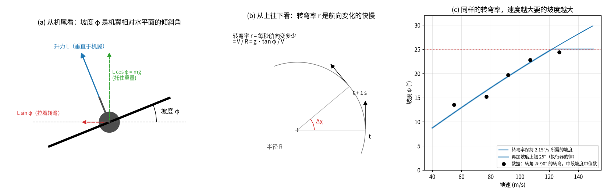
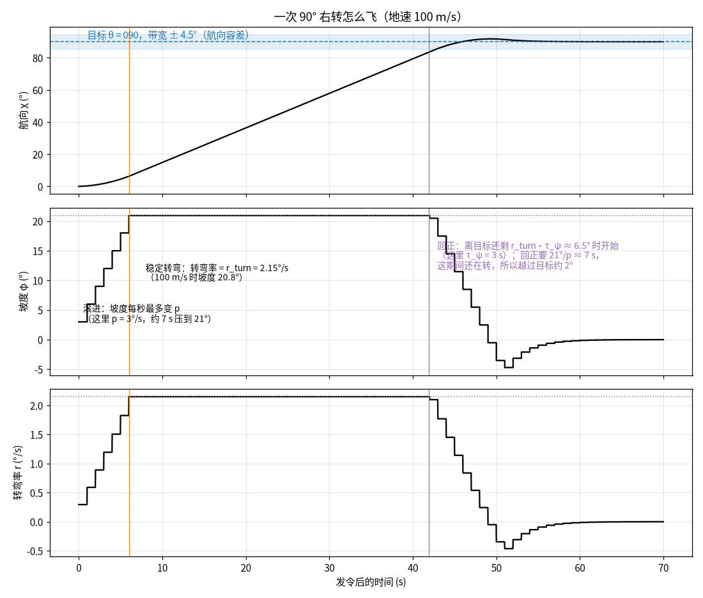
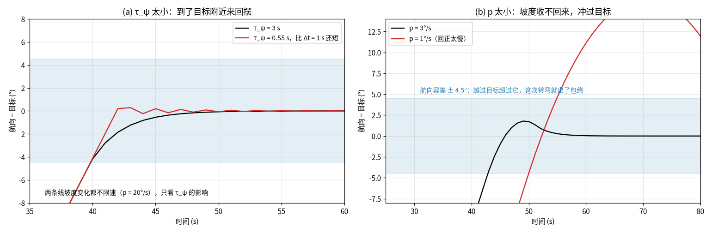
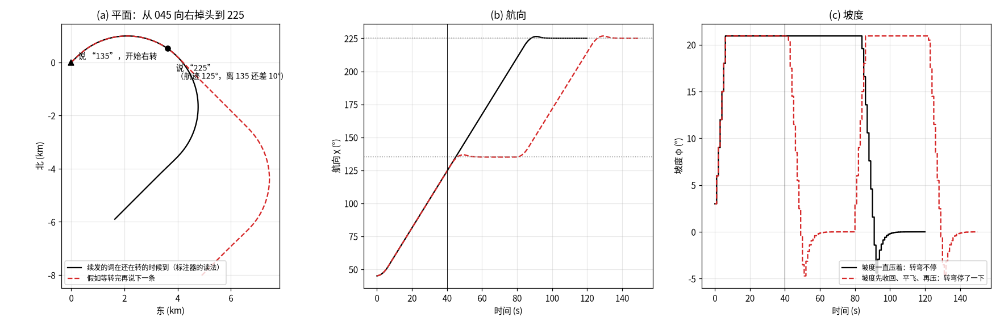

# 执行器设计（2026-09-23）

**一句话**：执行器是一个自动驾驶。它每秒读一次飞机状态和此刻生效的词，按"想要的变化率"反解出推力、坡度、
载荷因子，交给现有的点质量动力学积分。它不读任何程序数据，也不学习。

词的定义见[指令词表](2026-09-23_instruction_vocabulary_design.zh.md)（读法 `instruction-v3`，2026-09-24 起：航向词逐行标注，
词表设计 §10.1；此前为 `instruction-v2`，规格 `103a6eae6b90`），
总体框架见[两层模型框架](2026-09-23_two_tier_framework.zh.md)。本文是阶段 3（执行器），§11 定义阶段 4
（回放门）。

---

## 0 状态

| 项 | 状态 |
|---|---|
| 词表 | 规格 `103a6eae6b90`（读法 `instruction-v2`：转弯按转弯率、落地与 harvest 同条件），产物 `4dTrajectory/outputs/POOLED/instruction_language/v2_20260924/` |
| 本设计 | 第二稿：控制律从动力学方程推出，每个参数写明来源；§14 全部定下（2026-09-24：第 8 项按建议，第 9 项暂不动） |
| 初量 | §10 里标"初量"的数，来自 train 随机 6,000 / 12,000 架的探索脚本；实现时由 runner 正式量出，写进执行器规格 |
| 实现 | **完成并合入 `dev-two-tier`**（2026-09-24，`dc717045`，包 `ts_transformer/autopilot/`），三轮代码审查的发现都已改。正式规格 `outputs/POOLED/executor/v2_20260924/`（`2674ab8c71a9`，量于 `1c63eb3e`），val 回放门见 §11 的读数。进度见 §13 |
| **第三版词表（instruction-v3）** | **用户确认（2026-09-24），实现于分支 `dev-vocab-v3`**：航向词逐行标注、提前 4 s 说（词表设计 §10.1）。执行器随之改：跟随航向词时转弯率只受词表最大转弯率与坡度上限限制，r_turn 只用于执行器自己的转弯（§4.1）；**跟随航向词的律改为"听到词后正好一个提前量时到达"**（`误差 / 剩余时间`，剩余时间不小于 2Δt；2026-09-24 代码审查后改，原定的一阶律 τ_ψ = L 在每次转弯的最后一两条词上必然出包络，§4.1）；τ_ψ 只管执行器自己的转弯，取 L（§9）；航向词没有延迟（§9 办法 B 只量纵向与速度）；p 取两条都满足的最小值：执行器自己最大一次转弯（124.5°）越过目标不超过容差，按词飞的 90° 转弯每条词都在包络内（§9）；拆分大转弯不再存在（§4.2）；航向词的包络与判定改为逐行（§8.2）；规格格式 `ts-executor-spec-v3`、回放格式 `ts-executor-replay-v2`；源码指纹按模块名计入包外模块，与检出位置无关。下一代规格要重新量 |

---

## 1 要解决的问题，和参数从哪来

执行器要把一句话飞成一条轨迹，这条轨迹要满足三件事：

1. **是现有动力学的解**：每一步都由动力学积分出来，控制量在现有控制量的界之内（§2）。
2. **每个词飞在它自己的包络里**：转弯单调、坡度在范围内、高度在管子里、速度在带里（词表 §2），用标注器的同一套
   检查判定（§8）。
3. **在数据看得见的尺度上像真飞机**：转弯多快、减速多快，与观测一致。

参数只有四种来源，每个参数属于其中一种（§10 的总表逐个标出）：

| 来源 | 含义 | 例子 |
|---|---|---|
| **动力学方程** | 精确反解，没有可调的数 | 由想要的变化率算坡度、载荷因子、推力（§3） |
| **词表规格** | 冻结的规格里已有的数 | 各下降档的名义角度、容差、切入角 30°、走廊 |
| **推导** | 由稳定性、临界阻尼、几何或包络推出 | 截获开始的提前量、横向增益、高度截获的起点 |
| **数据** | 只取数据看得清的量；看不清的另行确定（§9） | 稳定转弯率、减速率 |

"看得清"有一个具体的界：观测到的速度、航迹、爬升率是数据平面对位置做 **15 s 居中最小二乘拟合**得到的
（`flight_scenarios/start_state.py`，`DEFAULT_WINDOW_S = 15.0`）。**比 15 s 快的动态在数据里被抹平了**，
例如直接量出的滚转速度 1.7°/s、改出转弯的时间常数 8.6 s，主要是这个拟合窗口，不是飞机。这类量不能直接量，
它们按 §9 的办法确定。

---

## 2 执行器驱动的动力学（现有系统）

### 2.1 状态、控制量、方程

执行器接在 ts 控制路径的积分器上（`outputs/dynamics/rollout`），动力学是 `aerodynamic_model/torch_dynamics.enu_rhs`
的点质量模型（运输坐标版本多一个坐标系转动项，量级约 1e-3 °/s，下面略去）：

```text
状态  x = (位置, 高度 h, 空速 V, 航向 ψ, 航迹倾角 γ, 质量 m)
控制  u = (推力 T, 坡度 φ, 载荷因子 n)

ḣ  = V sin γ
V̇  = (T − D) / m − g sin γ
ψ̇  = g n sin φ / (V cos γ)
γ̇  = g (n cos φ − cos γ) / V
ṁ  = 0
```

- **阻力** `D = ½ρV²S·C_D`，`C_D = C_D0 + k·C_L² (+ 接近失速时的附加阻力)`，`C_L = n m g / (½ρV²S)`；ρ 按 ISA。
  这些都是每架航班自己的气动参数（`aero_params = S, C_L,max, C_D0, k, 失速起点, 失速附加系数`）。
- **失速**：`C_L` 需要超过 `C_L,max` 时，方程把载荷因子截在 `C_L,max` 能给的那么多——飞机转不动、拉不起来。
- **没有风**：地面航迹 = ψ，地速 = V cos γ。词说的是地面航迹和地速，二者一致。
- **角度约定**：ψ 是数学约定（正东为 0，逆时针为正），所以**正坡度向左转**；词的航向是罗盘约定（真北为 0，
  顺时针为正），χ = 90° − ψ。执行器内部用 χ 算，下发坡度时取 φ 的符号使罗盘航向朝目标变化。

### 2.2 控制量的界与可飞包线（都是现有的数）

| 量 | 界 | 出处 |
|---|---|---|
| 推力 | `T = δ_T · T_max`，`δ_T ∈ [−0.2, 1.0]`；`T_max` 为装机总推力，不随高度变 | `outputs/envelope.py`（负推力代表襟翼、起落架、减速板的阻力，干净构型的极曲线里没有这些） |
| 坡度 | `|φ| ≤ 45°` | 同上 |
| 载荷因子 | `n ∈ [0.2, 2.0]`（控制量的盒子）；可飞包线 `[0.5, 2.0]` | 同上；`geometry/flyability.Envelope` |
| 失速 | `C_L ≤ C_L,max`；速度下限 `V ≥ 1.10 · V_stall(n)` | `outputs/constraints/speed_floor`（包里现有的 1.10） |

### 2.3 积分方式：执行器如何接进去

- 积分器按"段"积分，每段的控制量不变（零阶保持），段内用 RK4。
- 动力学配置取控制路径现行配方 `simple-v3` 的那一对：`point-mass` + `scaled-transport-chart-velocity`，推力按
  `thrust-fraction`（`autopilot/plant.EXECUTOR_DYNAMICS`）。执行器的输出因此就是 ts 控制路径能产生的那种轨迹。
- **执行器自己一段一段地积分，不嵌在一次 rollout 里当 hook**：现有的点质量后端不调用 command hook，只有一阶滞后
  后端调用（`outputs/dynamics/backends.py` 的 `runs_hooks`）。所以执行器每个控制周期用控制路径公开的积分函数
  `rollout_control_endpoints` 积一段，段末状态交给下一段（`autopilot/plant.py`）。这与 hook 是同一个计算：hook 也是
  每段开始时拿到当时的状态，积分器本来就在每段的边界重新开始；段与段之间状态以大地坐标交接，两次坐标换算互为
  精确逆运算。
- **控制周期 Δt = 1 s**：每段 1 s，每个 2 s 的词步里两段。

### 2.4 每架航班的输入从哪来

- 用数据平面给产物里那架航班重建 `FlightSeries`，按 dataset_id 对上。stage A 的 lockstep 已经用现有函数从任意一行
  起飞，这里从第 0 行起飞。重建出的时刻和位置必须与产物的信号逐行一致，否则拒绝。
- 由此得到：初态（位置、速度矢量、质量）、`aero_params`、`T_max`、坐标系参数（以本机着陆跑道入口为原点的东北天
  坐标）。质量是数据平面给的该机型的代表着陆质量（ADS-B 里没有真实质量）。这四样由
  `outputs/dynamics/context.rollout_context` 读出（`dynamics_arrays` 就是它加上控制模型才读的东西；后者还要从第 0
  行之前的回看反推当时的控制量，执行器从第 0 行起飞，没有回看，也不需要）。
- 状态以大地坐标交接；执行器读状态时把位置换到机场坐标系（与标注器同一个投影，`autopilot/frame.py`），所以候选
  跑道、词的目标、包络都在机场坐标系里算，不必换到每架航班的动力学坐标。
- 第一个控制周期不受坡度变化速度的限制：第 0 步的词写的是飞机进入切片时已经在做的事，进入切片时正在转弯的航班
  应当接着转，而不是先改平再压坡度。

---

## 3 设计方法：外环要变化率，内环精确反解

每个控制周期分两步：

**外环**：词翻译成三个"想要的变化率"：

- 罗盘航迹变化率 χ̇*（§4）；
- 航迹倾角变化率 γ̇*（§5）；
- 速度变化率 V̇*（§6）。

**内环**：把 §2.1 的后三个方程反过来解。这正是 `geometry/flyability.py` 判定可飞时用的同一个反解，这里是正着用：

```text
A = −χ̇*·V cos γ / g            （= n sin φ；负号来自罗盘与数学约定相反）
B =  γ̇*·V / g + cos γ           （= n cos φ）
φ = atan2(A, B)
n = B / cos φ                   （先定坡度，再由 B 定载荷因子，保证 γ̇ 正好是要的）
T = m (V̇* + g sin γ) + D(V, n, h)
δ_T = T / T_max
```

- 阻力 `D` 用动力学自己的函数（`torch_dynamics.flight_aerodynamics`）在这个 `n` 下算，所以反解与积分用的是
  同一个极曲线，内环没有可调参数。
- **零阶保持的误差**：控制量在 1 s 内不变，而 V、γ 在变，所以一段结束时的变化率与想要的略有出入。下一段的外环
  会看到并修正。§4、§5 的时间常数都要求不小于 Δt 的若干倍，以免这个误差引起振荡。
- **限制按物理意义施加**：坡度的上限、坡度变化速度、角度变化速度、推力的界，各自加在它代表的物理量上（§7），
  不在最后统一截断。每次截断都记下来（§8 第一层）。

---

## 4 横向

### 4.1 航向词：按较短方向转到 θ 并保持

> **instruction-v3（2026-09-24，用户确认）**：航向词逐行标注，每条只转一两格，并提前 4 s 说出（词表设计 §10.1）。
> 转多快由词出现的节奏定。一条词说的是"L 秒后航迹在这里"，所以执行器听到它之后，要正好在 L 秒后转到它：
>
> ```text
> 剩余时间 = 听到这条词的时刻 + L − 现在，至少 2Δt        （过了期限就按 2Δt 保持）
> χ̇*     = sat(e / 剩余时间, ±r_max)
> ```
>
> 时刻按执行器自己的时间算（判定也是从执行器听到词的那一行起算，§8.2），r_max 是词表的最大转弯率（4.7°/s），坡度
> 上限在反解里先起作用；数据量出的稳定转弯率 r_turn 只用于执行器自己的转弯（自行切入、复飞、截获、沿线跟踪）。
>
> **为什么不用一阶律 `e / τ_ψ`（原定 τ_ψ = L）**：匀速转弯中，一阶律落后目标 `r·τ_ψ`，与词提前的 L 抵消，这一点
> 没问题；但转弯结束时，最后一条词说出后目标不再往前走，一阶律只按指数逼近——过 L 秒还剩 `e^(−L/τ_ψ)` ≈ 37 % 的
> 误差（约 4 °），再加观测拟合把拐角抹圆，最后一两条词必然出包络。合成检查（`derive.follow_excess_deg`，90° 转弯，
> 60–140 m/s，读法与标注器相同）：一阶律每次转弯 19 条词里有 3–7 条出包络，p 取多大都一样；新律 p ≥ 2.5°/s 时
> 0 条出包络，最差离词 2.8–3.9°（容差 4.5°）。
>
> 原约束 2（`r_max |τ_ψ − L| ≤ 容差 − 半格`）随之取消：τ_ψ 只管执行器自己的转弯，取 L（§9）。本节以下描述
> instruction-v2 的推导（拆分转弯、续发提前量 10°），留作来历。

#### 先说两个量：坡度和转弯率



- **坡度 φ**（图 (a)）：从机尾看，机翼相对水平面倾斜的角度。飞机靠倾斜升力转弯。升力垂直于机翼，机翼倾斜后：
  - 竖直分量 `L cos φ` 托住重量；
  - 水平分量 `L sin φ` 把飞机往一侧拉，这就是转弯的向心力。

  坡度是飞行员（或自动驾驶）直接操纵的量，也是动力学的一个控制量。
- **转弯率 r**（图 (b)）：航向每秒变多少度。平飞协调转弯时，二者的关系是 `r = g·tan φ / V`，转弯半径
  `R = V / r`。
- **同一个坡度，速度越大转得越慢**：坡度 20.8° 时，100 m/s 每秒转 2.15°、半径 2.7 km；70 m/s 每秒转 3.1°。
  反过来说，要保持同样的转弯率，速度越大，需要的坡度越大，见图 (c) 的曲线。
- **数据**（图 (c) 的黑点，转角 ≥ 90° 的转弯取中段）：
  - 坡度随速度增大，正好落在"转弯率保持 2.15°/s"的曲线上；
  - 最快一档（115–140 m/s）的坡度停在 25° 附近，低于曲线（按 2.15°/s 该压 28°）。

  所以执行器按**转弯率**转，另外给坡度一个上限：
  - `r_turn`（数据）：稳定转弯率，取转弯中段转弯率的中位数。初量 2.15°/s，各速度档在 2.09–2.17°/s 之间。
  - `φ_cap`（数据）：坡度上限，取最快一档稳定坡度的中位数。初量约 25°（24.4°），不超过词表的 32°。
  - 大转弯的中段长于 15 s 的观测窗口，这两个量在数据里看得清。

#### 一次转弯怎么飞



律（每个控制周期算一次）：

```text
e    = θ − χ（都沿飞行展开）                    离目标还差多少度，带符号
r*   = sat(e / τ_ψ, ±r_turn)                   想要的转弯率
φ*   = atan(V · r* / g)，再限 |φ*| ≤ φ_cap      这个转弯率要的坡度（有升降时用 §3 的完整反解）
φ    = φ_上一周期 + sat(φ* − φ_上一周期, ±p·Δt)  坡度每秒最多变 p 度
```

`e` 从生效的词量起，与词表量一条词的方式相同（§2.3）：第一条词取较短方向；之后每来一条新词，目标在原来的目标上再
转 `wrap180(θ_新 − θ_旧)`。飞机已经转到旧目标时，这和"从当前航迹取较短方向"是一回事；区别在飞机还落后于旧目标的
时候，见 §4.2。

一次转弯因此分三段（图 2）：

1. **滚进**：坡度从 0 起每秒增加 p 度，直到转弯需要的坡度。p = 3°/s 时，压到 21° 约要 7 s。
2. **稳定转弯**：误差还大，`e / τ_ψ` 超过 r_turn，转弯率被截在 r_turn，坡度不变。
3. **回正**：离目标还差 `r_turn · τ_ψ` 度时，`e / τ_ψ` 开始小于 r_turn。想要的转弯率随误差一起减小，误差按时间常数
   τ_ψ 指数衰减：每过 τ_ψ 秒，只剩 37 %。坡度随之回到 0，每秒最多回 p 度。

两个参数的意思：

- **τ_ψ（回正的时间常数，秒）**：决定从哪里开始回正，以及回正有多"软"。τ_ψ = 3 s 时，离目标 6.5° 开始回正。
- **p（坡度变化速度，°/s）**：决定压坡度、收坡度有多快。

它们要满足三个约束。这三条都来自执行器和词表本身，不来自数据：

1. **τ_ψ ≥ 2Δt = 2 s**：指令每 1 s 才改一次，每一步误差变成 `e·(1 − Δt/τ_ψ)`。
   - τ_ψ < Δt 时，这个系数是负的：一步就冲过目标，下一步再往回，来回摆（图 3a 红线）。
   - τ_ψ ≥ 2Δt 时，每步最多消掉一半误差，单调地逼近（图 3a 黑线）。
2. **τ_ψ ≤ 10° / r_turn ≈ 4.7 s**：拆分的大转弯里，下一条词在航迹离中间目标 10° 时到（§4.2）。回正必须晚于它开始，
   否则飞机会先收一点坡度、再压回去。回正从离目标 `r_turn·τ_ψ` 处开始，所以要 `r_turn·τ_ψ ≤ 10°`。
   10° 是词表的续发提前量。
3. **p 不能太小**：回正要 `φ/p` 秒，这期间飞机还在转，转弯率大致线性地降到 0，所以还要转 `r_turn·φ/(2p)` 度左右。
   - 回正是从离目标 `r_turn·τ_ψ` 度处开始的，所以会越过目标约 `r_turn·(φ/(2p) − τ_ψ)` 度。
   - 这个量不能超过航向容差 4.5°，否则这次转弯出了词表的转弯包络。图 3b 红线是 p = 1°/s 的情形，冲过约 13°。
   - 按 φ = 21°、r_turn = 2.15°/s 算：τ_ψ = 2 s 要 p ≥ 2.6°/s，3 s 要 p ≥ 2.1°/s，4 s 要 p ≥ 1.7°/s。这是近似式，
     取值时用模拟逐个核对。



**为什么这两个量不直接从数据里量**：滚进、回正都在 5–10 s 内完成，比观测的 15 s 速度拟合窗口短，
数据里看到的是被抹平后的样子。直接量出的"滚转速度 1.7°/s、回正时间常数 8.6 s"，主要是那个窗口的效果。所以在上面
三条约束围出的范围里取值：τ_ψ 在 2–4.7 s 之间，p 满足约束 3。具体怎么取见 §9（建议取范围内最温和的，再查敏感度）。

图 1–4 由这条横向律的简化模拟画出：常速 100 m/s、平飞、1 s 零阶保持。实现之后，用真正的执行器代码重画。

### 4.2 拆分的大转弯：为什么"转弯不停"

> **instruction-v3 里没有拆分转弯**：连续转弯本身就是一串相隔几秒的词，每条都在执行器还没转到上一条时说出，
> 执行器一直压着坡度转（测试 `test_a_turn_said_word_by_word_is_flown_without_levelling`、
> `test_an_orbit_said_word_by_word_is_flown_all_the_way_round`）。误差仍从生效的词量起（每条新词在原目标上再加
> `wrap180(θ_新 − θ_旧)`），所以盘旋按第一条词定下的方向一直转。本节以下描述 instruction-v2，留作来历。



词表规定，一条航向词相对在用目标的转角不超过 150°，更大的转弯（掉头、盘旋）拆成几条等分的词（词表 §2.3）。
原因之一是 180° 的转弯没有"较短方向"：向左向右一样远，一条词说不清往哪边转。

例（图 4）：飞机航迹 045，要向右掉头到 225。标注器读成两条词：

- 开始转时说 "135"：较短方向是右转 90°，飞机压坡度右转；
- 航迹转到约 125°、离 135 还差 10° 时，说 "225"：从 125 起，较短方向仍是右转（100°）。

执行器收到 "225" 时，离目标的误差从约 10° 跳到约 100°。想要的转弯率仍被截在 r_turn，坡度不变。**飞机一直压着坡度
转过去，中途不回正、不平飞，这就是"转弯不停"**（图 4 黑线）。这也正是标注器在观测里看到的：真实航迹没有在 135
停下来，所以标注器在飞机还在转的时候就发了下一条。

对比图 4 的红虚线：假如第二条词等飞机在 135 稳住之后才说，执行器会先回正、平飞一段、再压坡度转第二段。航迹上多出
一段直线，时间也晚了，这不是这句话的意思。

"下一条在还在转时到"能成立，前提是回正开始得比下一条词晚。这就是 §4.1 的约束 2：`r_turn·τ_ψ ≤ 10°`。

执行器的转弯率 r_turn 可能比观测飞机慢（观测里的盘旋常在 3°/s）。这时下一条词到的时候，执行器还落在前一个目标的
后面。若从当前航迹取较短方向，落后超过 `180° − 每段的转角`（3 × 120° 的盘旋是 60°）时，较短方向就成了反方向，
执行器会掉头往回转。所以执行器按 §4.1 从生效的词量误差：方向由第一条词定下，后面每条词只在原目标上再加一段。
（2026-09-24 代码审查发现，合成的 360° 右盘旋原来转到约 75° 就往回转，现已改正，有单元测试。）

### 4.3 许可之后：在容差内朝航线修正

许可之后、截获之前飞航向词。如果按 θ 在入口前碰不到航线，而 θ ± 4.5° 之内有航向碰得到（`envelope.heading_converges`，
与标注器同一个判断），就把 θ 朝航线偏 4.5°（词表 §6 第 5 条）。偏 4.5° 仍在这条航向词的包络之内。

偏了也碰不到时，执行器按词表的切入角（30°）自己切入航线——这就是标注器插入切入词时用的规则（词表 §2.2）。这种情况
出现在执行器不在观测飞机的位置时（转弯比观测的宽，改出后与五边平行）；此时它已离开这条航向词的包络，判定照实报。
2026-09-24 在 train 200 架上，加上这一条后超时从 8 架降到 0。

### 4.4 截获：什么时候开始转，怎么转

执行器有一个自己的状态"已截获"（截获不是词）。设 y 为离所指跑道延长中线的横向距离，Δχ 为航迹与跑道航向之差，
V 为地速。

**什么时候开始**：截获转弯以 `r = min(r_turn, g·tanφ_cap / V)` 转（稳定转弯率；速度高时坡度上限给不了 r_turn，就
取坡度上限给得出的转弯率）。转完需要的横向距离是下面四段之和，每段都是执行器自己的量：

```text
开始截获：  |y| ≤ R (1 − cos|Δχ|)           圆弧，R = V / r
                + V sin|Δχ| · t_roll / 2      压坡度期间（t_roll = |φ_转弯 − φ_当前| / p）按一半时间直飞算
                + V r τ_ψ² / 2                回正的指数尾巴（§4.1）
                + V r³ / (6 k²)               坡度按 p 收回期间多走的，k = 2 g p / V（见下）
            且朝航线飞（y 与 sin Δχ 异号）
```

若已在截获走廊的宽度之内（词表 §2.2），也立即截获。

**怎么转**：截获之后，每个周期按"从当前位置出发、正好切到线上"的圆弧重新算想要的转弯率
`V (1 − cos|Δχ|) / |y|`，朝跑道航向转。这样中途减速（半径变小）或压坡度晚了，都不会停在线外或冲过线。它再受四个
上限：

- 坡度上限在此速度下给得出的转弯率 `g·tanφ_cap / V`（离得近的基线要比稳定转弯率转得急，坡度上限是词的包络自己的界）；
- 词表的最大转弯率 4.7°/s（低速时坡度上限给出的转弯率会超过它）；
- `|Δχ| / τ_ψ`：航向律自己的回正；
- `sqrt(k·|Δχ|)`：转弯率 r 时坡度约为 `V r / g`，按 p 收回这个坡度期间航迹还要多转 `r² V / (2 g p)`。这个上限就是
  "离航向还剩 |Δχ| 时，坡度还来得及收回"的最大转弯率（小坡度近似）。

**交给沿线跟踪（§4.5）**：航迹离跑道航向在走廊的航向容差（2°）之内，或者飞机不再朝航线飞（已经越过中线：许可来得
晚，或坡度上限让转弯慢了）。第二个条件是 2026-09-24 代码审查后加的：原来越过中线后圆弧公式给出的转弯率趋于 0，
又要等航向差进到容差内才交接，于是以固定角度一直飞离航线（train 100 架里 3 架，离中线 2.3–4.9 km）。

### 4.5 截获之后：沿线跟踪

跟踪律把横向距离换成一个"想要的切入角"，再交给 §4.1 的航向环：

```text
Δχ* = −sat(k_y · y, a)          a：走廊外是词表的切入角 30°，走廊内是走廊航向容差的一半（1°）
θ_line = 跑道航向 + Δχ*          作为 §4.1 的目标航向，转弯率另受 sqrt(k·|e|) 限制（与 §4.4 相同）
```

走廊要求航迹离跑道航向不超过航向容差（2°）。走廊内只用一半去修正横向偏差，另一半留给航向环自己的滞后；从越过中线
的截获回来时，`sqrt(k·|e|)` 让坡度来得及收回，不会甩过跑道航向。改之前（2026-09-24 审查）train 100 架里 22 架进了
走廊又出去，改后 1 架。

**`k_y` 的推导（临界阻尼）**：在线附近线性化，`ẏ = V·Δχ`，航向环 `τ_ψ·Δχ̇ + Δχ = Δχ*`，代入得

```text
τ_ψ ÿ + ẏ + V k_y y = 0
```

临界阻尼（一阶近似下不越过中线）要求 `1 = 4 τ_ψ V k_y`，即

```text
k_y = 1 / (4 V τ_ψ)
```

横向误差以时间常数 `2 τ_ψ` 衰减。`k_y` 由 `τ_ψ` 与速度决定，不单独调。真实的航迹还滞后于坡度，所以会越过中线
几米（审查量到越过的航班里 p50 4.9 m、p90 9.3 m），都在走廊宽度之内。

### 4.6 跑道指针与复飞

- 航线是跑道指针所指那条候选跑道的延长中线。许可之前换指针就换航线；许可之后换指针，标注里已被拒绝，执行器
  同样拒绝（报错）。
- 复飞（进近列）：取消"已许可"和"已截获"，横向把目标航向设为所指跑道的航向；纵向有高度目标时爬到它（高度保持律
  最多按爬升类的角度爬），生效的是"下降至落地"时按爬升类的角度爬，直到来了新的高度词；速度保持当前空速。数据里
  没有复飞，这一条只有单元测试。

---

## 5 纵向

### 5.1 航迹倾角内环

```text
γ̇* = sat((γ_ref − γ) / τ_γ, ±γ̇_max)
```

- **`τ_γ = 2 Δt`（推导）**：内环只负责让 γ 跟上外环给的 γ_ref。它越快越好，限度是 1 s 的零阶保持：`τ_γ = Δt`
  时一步到位，留一倍余量取 2Δt，避免 V 与 γ 在段内变化带来的超调。飞机实际改变航迹角有多快，由下面的
  `γ̇_max` 决定，不由 `τ_γ` 决定。
- **`γ̇_max`（推导下限，取值见 §9）**：飞机从平飞转入按角 γ_k 下降时，航迹角只能以有限速度变化。在变过来之前，
  飞机高于这一档管子的上沿（上沿按该档的下限角 γ_lo 下降）。高出的最大值是

  ```text
  e_max = V γ_lo² / (2 γ̇)
  ```

  要它不超过管子的容差 ε = 25 m，就需要 `γ̇ ≥ V γ_lo² / (2ε)`。按最陡一档（γ_lo = 3.73°）、V = 100 m/s，
  需要 γ̇ ≥ 0.49°/s，对应载荷因子偏离 1 约 0.09 g，在可飞包线里。所以：`γ̇_max` 的**下限**由词表的管子推出，保证执行器
  不因变角太慢而出管子；具体取值见 §9，不低于这个下限。

### 5.2 高度与下降角：四种模式

| 生效的词 | 模式 | γ_ref |
|---|---|---|
| 目标 T + 平飞 | 保持 | 高度保持律（§5.4） |
| 目标 T + 下降档 k | 按角度下降 | −γ_k（该档的名义角度，规格里各档的中心：0.91°、2.11°、3.06°、4.41°） |
| 目标 T + 爬升 | 按角度爬升 | +1.33°（规格里爬升类的名义角度） |
| 下降至落地 + 下降档 k | 按角度下降到落地 | 截获航线之前：−γ_k，但不比"到瞄准点的直线"更陡；截获之后：瞄准入口上方一个越过高度，从平飞到最陡一档之间取角度，不改平 |
| 复飞 + 下降至落地 | 爬升 | +γ_climb，直到来了新的高度词（§4.6） |

下降途中来了新的角度词，就换 γ_k。方向与目标矛盾的组合在标注里已被拒绝，执行器遇到时同样拒绝；"下降至落地"配的
不是下降档（平飞或爬升）也拒绝。

**落地的瞄准**（`autopilot/vertical.py`）：

- **瞄准高度与窗口**（数据）：train 航班在入口处的高度——各航班最后 10 行沿航迹外推到入口——中位数 `h_aim`（20.8 m），
  第 5、95 百分位是窗口 `land_window_low_m` / `land_window_high_m`（初量 8.4 / 36.5 m）。
- **截获之后**：越过高度取在这个词自己的管子里（`labeller.vertical.tube_bounds` 的读法：从这条高度词或角度词说出的位置
  起，按该档两条角度线，± 高度容差，沿飞过的路程）投到入口处的内半部分，与窗口的交集里；`h_aim` 在交集里就取
  `h_aim`，否则取交集里离它最近的高度；没有交集时取窗口里离管子近的那一端（这时会出管子，判定照实报）。角度从平飞
  到最陡一档：飞机在下滑线下面就先平飞迎上去，在上面就按词表允许的最陡角度下来。
- **截获之前**：到入口还要飞多远不知道（下风边可能先飞过入口再转回来），按这一档的名义角度；但不比"到瞄准点的直线"
  更陡——直线是最短的路，这样途中不会下到地上。

演变（train，2026-09-24）：全程名义角度，100 架落地 58；截获前名义、截获后瞄准 `h_aim` 并限在第 k 档的角度内，83；
限在第 k 档内时，执行器到五边比观测高或低就越过入口时高出几百米或提前触地——放开到"平飞到最陡一档"并加截获前的
直线限制后，200 架落地 98 %，但词的合格率降到 94.1 %（落地段出了管子）；再把越过高度放进管子和窗口后，train
2,000 架（每机场 400，按 `track` 说词）：落地 98.3 %，词的合格率 95.4 %，evaluation 与观测配对 96.5 %。

### 5.3 截获目标高度：什么时候开始改平

以 γ_k 下降、航迹角以 `γ̇_max` 回到 0，这段过程掉的高度是

```text
Δh_capture = V γ_k² / (2 γ̇_max)
```

飞机离 T 还有 `Δh_capture` 时转入高度保持，正好在 T 改平、不越过。V = 100 m/s、γ = 3.06°、γ̇_max = 0.49°/s 时约
17 m。这里没有新的参数。

### 5.4 高度保持

```text
γ_ref = −(h − T) / (V τ_h)
```

**`τ_h = 4 τ_γ`（推导）**：把 γ 内环看作一阶，代入得 `τ_γ ḧ + ḣ + (h − T)/τ_h = 0`。临界阻尼（不越过 T）要求
`τ_h = 4 τ_γ = 8 s`。

---

## 6 速度

```text
V_ref = V_g* / cos γ                              目标地速换成空速（无风）
V̇*    = sat((V_ref − V) / τ_V, [−a_dec, +a_acc])
V_ref ≥ 1.10 · V_stall(n)                         失速下限，用 speed_floor 的同一个定义
```

推力由 §3 的反解给出。复飞时保持当前空速（§4.6）。

"未指定"是飞行员自己落地用的速度：减到它的减速度取 `a_unspec`，和"按离入口的直线距离在入口前减到它所需的减速度"中
较大的一个，最多到词表的加速度上限。只用 `a_unspec` 时，"未指定"说得晚、五边长、速度高的航班越过入口时比机型的速度
窗口快 20 m/s，evaluation 的速度门不过。

- **`a_dec`、`a_acc`（数据）**：管制要求的速度变化，按标注器读出的速度过渡段的斜率量，取中位数。初量：减速
  0.24 m/s²，加速 0.16 m/s²。过渡段持续几十秒，长于 15 s 的观测窗口，看得清。正式量只用长于 20 s 的段。两者都在
  词表上限 1.7 m/s² 之内。
- **`τ_V = δv / a`（推导）**：离目标还剩一个带的半宽 δv = 5 m/s 时，从匀减速转成指数逼近，进带时速度单调、不越过
  目标（词表的速度过渡包络）。按初量 `τ_V ≈ 21 s`（减速）。
- **"未指定"**：目标是**本机型公开的进近速度**（`aircraft/reference_speeds`，FAA 飞机特性数据库，每个数有出处）。
  按质量换算：`V_app(m) = V_pub · √(m / MALW)`。再由指示空速换成真空速：`V_app · √(ρ0/ρ(h))`，无风时就是地速。
  机型取**本机识别出的真实机型**，不取动力学替代机型。飞行员自己减速的快慢与管制要求的不同，另量一个
  `a_unspec`：标注器读出的"未指定"之后的减速段斜率的中位数，初量 0.26 m/s²。

---

## 7 同时顶到限制时怎么办

每个周期按下面的顺序施加限制，每一条被触发就记一次（§8 第一层）：

1. **失速下限**先定：速度参考不低于 1.10·V_stall(n)。失速就失去升力，其他指令都没有意义。
2. **纵向优先于横向**：先按 γ̇* 定 `B = n cos φ`，坡度被上限或变化速度截住时，由 `n = B / cos φ` 保住 γ̇，损失的是
   转弯率。高度比横向位置更要紧：管子只有 ±25 m，漏斗随距离张开。
3. **载荷因子**截在可飞包线 `[0.5, 2.0]` 里。正常飞行达不到这个界；达到了说明词要求的机动太猛。
4. **推力**截在 `[−0.2, 1.0]·T_max` 里，损失的是速度变化率：
   - 推力顶到上限：飞机加速或爬升不了那么快，速度落后；
   - 推力顶到下限：飞机以这个角度下降时减不了速，"一边按陡角下降一边减速"这句话对这架飞机太难。

   这是速度与高度争能量：执行器按下降角保高度，让速度让步，因为下降角是词明说的，速度过渡本身有包络可查。

---

## 8 怎么判定"能飞"与"失败"

执行器的轨迹由动力学积分而来，控制量在界内，所以**在动力学意义上总是可飞的**。要判的是**这句话**能不能被飞出来，
分三层：

### 8.1 第一层：每一步，要的与给的

每个控制周期记录：想要的三个变化率、实际得到的三个变化率，以及哪条限制被触发：坡度上限、坡度变化速度、γ̇ 上限、
载荷因子包线、推力上限、推力下限、失速下限。每架报出每条限制占多少步，以及触发时要的与给的相差多少。"想要的"是
各律在自己的上限（γ̇ 上限、失速下限）之前要的量；否则这两条限制触发时差值永远是 0，量不出东西（2026-09-24 审查）。

另有两种情况直接算动力学失效：积分出现非有限值，或速度 ≤ 0。执行器用了失速下限，方程里的失速截断不应该发生；
一旦发生，也算失效。

### 8.2 第二层：每个词，是否飞在它自己的包络里

用标注器的同一套检查判执行器自己的航迹，起点是执行器收到这个词的那一刻：

| 词 | 检查 | 用的函数 |
|---|---|---|
| 航向（instruction-v3） | 在第 r 行说的词，从 r + 提前行数到下一条词的行 + 提前行数（不到许可或截获），每行航迹与词相差 ≤ 4.5° | `envelope.heading_words_inside`（`heading_word_rows`），标注器的同一函数 |
| 许可加入 | 执行器的截获转弯（从开始截获到交给沿线跟踪）单调、转弯率与坡度在 §2.3 范围内；进了走廊之后一直在走廊里（到入口前） | `labeller.lateral.turn_check`、`envelope.corridor` |
| 高度 + 下降角 | 高度逐行在管子里 | `labeller.vertical.tube_bounds` |
| 速度 | 过渡单调、加速度 ≤ 1.7 m/s²、到达后在 V ± 5 m/s 内 | `labeller.speed.span_checks` |

几条细则（2026-09-24 审查后定下）：

- （以下两条是 instruction-v2 的航向词细则，v3 的航向词逐行判，没有转弯记录与保持漏斗；提前量越过许可或截获、
  一行都没有的词记为"不判"。）
- **航向词的转角和方向取标注器对观测转弯的记录**（带符号的总转角），所以 360° 的盘旋按 360° 判，不会读成 0°。
  拆分转弯的保持漏斗用标注器 `span_funnel` 的镜像（`judge.hold_funnel`）：转角按转弯的方向给出，而不是从最后一条
  词那一行的航迹取较短方向；180° 以内两者相等，有测试。
- **被截获接过去的转弯**：许可与最后一条航向词一起来，执行器已在截获提前量之内时，会立刻截获（词表 §2.2 允许）。
  这条转弯按标注器判"被截获截断的切入转弯"的方式判：判到转弯进展最远的那一行，不要求到达；一点都没开始转就被
  接过去的，记为"被截获取代"，不判。
- **只读入口前的行**：航迹在越过入口的那一行结束，判词只用它之前的行，与标注器的句子一样结束在落地之前。
- **没到的词**：词按时间生效，航班结束之后的词执行器根本没收到，记为"没到"，不判。落地的航班飞了它收到的全部词；
  没落地的航班在第三层已经失败。

一个词不合格，就在记录里标出这个词飞行期间触发了哪条限制（例如推力顶到下限）。这样能分清是词要求得太难，
还是执行器的律有问题：前者有限制被触发，后者没有。

### 8.3 第三层：每架航班的结局——落地判定与 evaluation 一致

仓库里"落地"分两层，执行器两层都**直接用现有的判定**，不另写一套：

**第一层：落在所指跑道上了没有**（事件）。用 harvest 判观测航班着陆的同一个条件。evaluation 判观测航班时用的
越过点也来自它：

- 执行器的航迹越过所指跑道的入口平面：沿航道的距离由正变负，用 `final_approach.frame.RunwayFrame.project` 投影；
- 在越过前后两点之间插值出越过点：`final_approach.crossing.bracket_fraction` / `interpolate_channels`，evaluation 插值
  越过点用的也是这一对；
- 越过点满足 `final_approach.assign.LandingScreen` 的两条：
  - 离中线 ≤ `threshold_radius_m`（1000 m），且不超过到相邻平行跑道距离的一半（harvest 的
    `_runway_bracket_cross_limit`，§14 第 8 项）；
  - 离入口的高度 ≤ `max_crossing_height_m`（100 m）。

满足就是"落在这条跑道上"，执行器的记录在越过点结束，与 evaluation 对计算记录的要求一致（最后一段跨过入口平面）。
标注器判"句子在哪里结束、哪些航班在落地前越过过入口"，也改用这同一个条件（见词表文档 §3.1）。

**第二层：落得好不好**（质量）。执行器的记录写成 evaluation 的记录格式，与 ts 控制路径的预测记录是同一套
（`states` + `controls`，`target_source = runway_threshold`），交给 evaluation 判三道门，不在执行器里重写：

| 门 | 条件（evaluation 现有的） |
|---|---|
| 横向 | 越过点离中线 ≤ 公布跑道宽度的一半（15.24–22.86 m） |
| 垂直 | 越过点高度在公布的入口高度 + 跨越高度（LTP + TCH）下滑道 ±22 m 内；没有 RNAV 程序的跑道判不了 |
| 速度 | 越过点速度在该机型公开进近速度给出的窗口内 |

执行器不读程序；程序数据只在这里作为评判出现，与词表的原则一致。

**执行器自己的失败分类**（没落在跑道上的航班，按先发生的算）：

| 结局 | 判定 |
|---|---|
| 没截获就越过入口 | 越过入口平面时还没有"已截获"（或没有许可） |
| 越过了但不在这条跑道上 | 越过点离中线或离入口的高度超出上面的两条 |
| 入口前触地 | 还在入口前，高度已低于入口高程 |
| 超时 | 飞了观测剩余时长的 1.5 倍还没落地。1.5 倍给执行器留出速度落后的余地，又不让绕圈的航班无限飞下去 |
| 动力学失效 | 见 §8.1 |

**"按原话飞出来"** 要同时满足三条：落在所指跑道上；收到的所有词都合格（§8.2 的"没到的词"不算）；没有动力学失效。
同一行发生几件事时，按动力学失效、触地、越过入口的顺序取结局。evaluation 的三道门另报，并与
这架航班观测航迹自己的 evaluation 结果配对（§11）。

---

## 9 数据看不清的参数怎么定

有三组参数比 15 s 快，数据平面的速度拟合看不清：

- 横向：`τ_ψ` 与坡度变化速度 `p`；
- 纵向：`γ̇_max`（在 §5.1 的下限之上）；
- 每一列的"发令到动作的延迟" `d_ψ`、`d_h`、`d_v`。标注器的发令行是从平滑后的信号上读的：观测本身 15 s 拟合，
  航迹再做 6 s 平均。所以发令行可能比飞机真正开始动作早几秒。词表的转弯包络已经按这个上限放宽：转弯最多
  晚 t_d = (15 + 6) / 2 = 10.5 s 开始（词表 §2.3）。所以 `d_ψ` 不能超过 10.5 s，否则执行器自己的转弯会出漏斗。
  **instruction-v3 起航向词没有 `d_ψ`**：每条词说的就是 4 s 之后的航迹，时机已在词里；跑道指针与许可随航向词一起
  生效。办法 B 只量 `d_h`、`d_v`。

有五种办法，不一定要用数据标定：

| 办法 | 怎么做 | 好处 | 问题 |
|---|---|---|---|
| **A 由约束和原理直接定** | τ_ψ、p 在 §4.1 三条约束围出的范围里，按"不出包络的最温和机动"取：τ_ψ 取约束 2 允许的最大值（`10° / r_turn` 向下取到 0.5 s），p 取刚好使回正越过目标 ≤ 4.5° 的值；γ̇_max 取 §5.1 下限的 2 倍 | 不依赖数据，每个数都能从词表和执行器推回去 | "最温和"是一个选择，要说明理由 |
| **B 推算读法的延迟** | 延迟 d 不从数据拟合：让执行器飞一个已知起点的合成机动，经过观测算子 O 和标注器，看标注器把发令行放在真正起点之前几秒，那就是 d | d 是标注器读法的性质，可以直接算出来，不用数据 | 只补读法偏差，不含飞行员真实的反应时间 |
| **C 用原始 1 Hz 位置直接量** | 原始航迹位置约 1 s 一个点（KRDU 抽样，间隔中位数 1.0 s），用短窗口（4–6 s）求航迹变化率，就能看到滚进、回正；先在直线段量噪声 | 真正从数据里量，不经过 15 s 窗口 | 位置噪声大；原始数据没有存飞机自己广播的航迹角和爬升率（harvest 只存了位置、高度、地速） |
| **D 观测算子标定** | 执行器输出经过同一个 15 s 拟合，与观测比，在事先写定的候选网格上找最接近的 | 比较的是同一种东西 | 窗口把快动态抹平后，误差曲面可能很平，标不出来 |
| **E 公开资料** | 例如标准转弯率 3°/s（AIM）；飞机自动驾驶的滚转速度限制写在厂家手册里 | 有权威出处 | 手册一般拿不到原文；按仓库规矩，数字必须引到原文段落 |

**建议**：

1. 用 **A + B** 定值：A 定 τ_ψ、p、γ̇_max，B 算延迟 d。这样全部不依赖数据看不清的部分。
2. 再在 train 的固定抽样上做**敏感度检查**：每个机场 400 架，动力学不是替代机型的。把每个参数在候选范围内变动
   （τ_ψ 2–4 s，p 2–5 °/s，γ̇_max 为下限的 1–3 倍，d ± 4 s），看落地率、词的合格率、与观测的误差变不变。
   - 基本不变：说明这些参数不影响结论，A + B 的值就够了；
   - 变化明显：再用 C 或 D 从数据里量。

val 只用来判门，不用来定参数。

**实现（E7，2026-09-24 定下的做法）**：

1. **数据参数**（train 全部已标注航班，`autopilot/measure.py`）：
   - 稳定转弯率 r_turn：转角 ≥ 90° 的转弯去掉首尾各四分之一，每个转弯取中段各行转弯率的中位数作为它的稳定转弯率，
     再对所有转弯取中位数——每个转弯算一次，不论长短（按行合在一起取，长转弯权重大：train 1 万架上按行 1.995°/s、
     按转弯 2.147°/s，2026-09-24 审查）；
   - 坡度上限 φ_cap：同样的转弯中段、地速 115–140 m/s 的行，每个转弯取坡度的中位数，再对有这种行的转弯取中位数，
     向上取整，不超过词表的 32°；
   - 减速 a_dec、加速 a_acc：有目标速度的速度词，从发令到进入 V ± 5 m/s 带、历时 ≥ 20 s 的过渡段的平均加速度，
     按正负分开取中位数；
   - "未指定"后的减速 a_unspec："未指定"词之后第一段 ≥ 20 s 的减速段（地速分段拟合）的斜率中位数；
   - 落地的瞄准高度：各航班最后 10 行沿航迹外推到入口的高度的中位数（§5 的落地律；train 已标注的句子全部在入口前
     1.2 km 内结束，中位数 0.1 km，外推很短）；
   - 每个航班都先用标注器重读，必须与存下的句子逐格相同，参数量的就是执行器要飞的那些句子。
2. **办法 A**（`autopilot/derive.py`，合成转弯）：
   - instruction-v3：τ_ψ 取 L（选定，不是推出：执行器自己的转弯按一条词给的时间收尾；航向词有自己的律，§4.1）。
     p 取 0.5°/s 一档上、在 60–140 m/s 各速度下两条都满足的最小值：
     (1) 执行器自己最大的一次转弯（90° + 容差 + 切入角 = 124.5°）越过目标不超过航向容差；
     (2) 按词飞一个 90° 转弯（转弯率 r_turn，坡度上限不够时取它允许的），每条词判定的每一行都在包络内。词的读法
     近似标注器：观测拟合当作 15 s 居中滑动平均，再取 2 s 网格、做标注器的航迹平滑，然后 `per_step_words`；飞出的
     航向也按同样方式读。这是近似（真的拟合是对位置做最小二乘），写在 `derive` 的说明里。
     在测试的参数上（r_turn 2.15°/s、坡度上限 25°），p = 2.5°/s，由 (2) 定：2.0°/s 时 (1) 仍满足（4.42°），但
     120–140 m/s 按词转弯的最后几条词出包络 1.1–2.4°；
   - instruction-v2：τ_ψ 取约束 2 允许的最大值（`10° / r_turn` 向下取到 0.5 s）；p 只看 (1)，转最大的一条词（150°）；
   - γ̇_max 取 §5.1 下限的 2 倍。
3. **办法 B**（`autopilot/observe.py`）：观测算子 O 就是数据平面自己的一串函数——1 Hz 的位置点经
   `flight_scenarios.start_state.state_samples_from_track`（15 s 居中最小二乘）得到速度，`channels_from_states`、
   `resample_uniform` 落到 2 s 网格，再像标注器读观测航班那样读出信号。做法：
   - 延迟全取 0，按 train 抽样航班的真值句子飞一遍；
   - 飞出的航迹经 O、再用标注器重读；
   - 每个执行器收到的、开始一个动作的词（航向列只取一次转弯的第一条词：拆分转弯的后几条、插入的切入词量到的是
     执行器与观测飞机转弯快慢之差，不是读法），找重读句子里同一列、同一取值、时间最近的词，二者之差（执行器收到的
     时刻减去重读的发令时刻）就是读法提前的量；每列记下收到多少、配上多少；
   - 航向列得 d_ψ，高度列和角度列合起来得 d_h，速度列得 d_v，各取中位数；负值取 0——负值表示标注器读出的发令行
     比动作开始还晚，执行器不能在词说出之前动作，这是标注器读法的性质，记进测量文件，不在执行器里补；d_ψ 不超过
     词表的 10.5 s；
   - 抽样：train 每机场 40 架（种子 1337，动力学不是替代机型、机型有公开进近速度），同一列同一取值在 30 s 内算匹配；
     重读时被标注器闸门拒收的飞行（例如没落地）只计数。
4. **执行器规格**（`experiments/executor_spec.py`，`autopilot/spec.py`）：上面各值连同量法、样本写进
   `outputs/POOLED/executor/<名字>/spec.json`（格式 `ts-executor-spec-v1`，带参数的 sha）和 `measurements.json`。与词表规格
   同样的规矩：写一次，不覆盖；只在干净的工作树上量，记下 commit 和执行器源码的 sha（`executor_source_files`：除规格文件
   之外的执行器模块，加上它们直接导入的、仓库里的模块——动力学、包线、进近速度表、观测算子用的拟合；词表包由
   标注器的 sha 管，也记进规格并在回放时核对）；回放时源码 sha 不同、词表 sha 不同、或标注器源码与产物不同，都拒绝。固定的设计选择
   （Δt = 1 s、τ_γ = 2 Δt、γ̇_max 为下限的 2 倍、超时系数 1.5）是 runner 的模块常量，也写进测量文件。
5. **敏感度**（`experiments/executor_sensitivity.py`，train 每机场 400 架、动力学不是替代机型的）：τ_ψ 取 2–6 s（只影响
   执行器自己的转弯；instruction-v2 时从 2 s 到办法 A 的值）、p 2–5°/s、γ̇_max 为下限的 1–3 倍、d ± 4 s 各自变动，报落地率、按原话飞出的比例、词的合格率、
   与观测的时间对齐误差。

---

## 10 参数总表

| 参数 | 值 | 来源 | 怎么得来 |
|---|---|---|---|
| 控制周期 Δt | 1 s | 选定 | 每个词步两次；§14 第 5 项 |
| 反解 | 无参数 | 动力学方程 | §3 |
| 稳定转弯率 r_turn | 初量 2.15°/s | 数据 | 转角 ≥ 90° 的转弯，每个转弯中段转弯率的中位数，再对转弯取中位数；instruction-v3 起只用于执行器自己的转弯，转弯取许可之前按转弯起点速率连续转向的段 |
| 跟随航向词的最大转弯率 r_max | 4.7°/s | 词表 | `turn_rate_max_deg_s`（instruction-v3）；坡度上限在反解里先起作用 |
| 坡度上限 φ_cap | 初量 24–25° | 数据 | 115–140 m/s 档，每个转弯坡度的中位数，再对转弯取中位数，向上取整，不超过词表 32° |
| 跟随航向词的律 | `e / max(听到时刻 + L − 现在, 2Δt)`，不超过 r_max | 词的含义（§4.1） | instruction-v3：听到词后正好 L 秒到达；原定一阶律 τ_ψ = L 在转弯末尾出包络，2026-09-24 审查后改 |
| 回正时间常数 τ_ψ | instruction-v3：L（4 s），只管执行器自己的转弯；v2 时为 `10° / r_turn`（4.5 s） | 选定（§9 办法 A） | 自己的转弯按一条词给的时间收尾；敏感度在 train 上查 2–6 s |
| 坡度变化速度 p | 测试参数上 2.5 °/s；v2 规格 2.0 °/s | 原理（§9 办法 A） | instruction-v3：两条都满足的最小值——执行器自己最大一次转弯（124.5°）越过目标 ≤ 4.5°，按词飞的 90° 转弯每条词都在包络内（60–140 m/s）；v2 时只看前一条，转弯取 150° |
| 许可后的修正角 | 4.5° | 词表 | 航向容差 |
| 截获开始 | 圆弧 + 压坡度 + 回正尾巴 + 收坡度四段之和 | 推导 | §4.4，几何 |
| 截获转弯的转弯率 | 切到线上的圆弧，受坡度上限、4.7°/s、`|Δχ|/τ_ψ`、`sqrt(k|Δχ|)` 限制 | 推导 | §4.4 |
| 走廊内的修正角 | 走廊航向容差的一半（1°） | 词表 | §4.5 |
| 落地的瞄准高度 h_aim | 初量 20.8 m | 数据 | 入口前 1.5 km 内结束的句子，最后 10 行外推到入口的高度的中位数（§5.2） |
| 横向增益 k_y | `1/(4 V τ_ψ)` | 推导 | §4.5，临界阻尼 |
| 最大切入角 | 30° | 词表 | 切入角 |
| 航迹角内环 τ_γ | 2 s | 推导 | §5.1，2Δt |
| 航迹角变化速度 γ̇_max | `2 × V γ_lo² / (2ε)` | 推导（§5.1）+ 原理（§9 办法 A） | 不出管子的下限的 2 倍 |
| 高度截获起点 | `V γ_k² / (2 γ̇_max)` | 推导 | §5.3 |
| 高度保持 τ_h | 8 s | 推导 | §5.4，4τ_γ，临界阻尼 |
| 下降档的名义角度 | 0.91° / 2.11° / 3.06° / 4.41°；爬升 1.33° | 词表 | 规格里各类的中心 |
| 减速 a_dec / 加速 a_acc | 初量 0.24 / 0.16 m/s² | 数据 | 速度过渡段斜率的中位数，只用 ≥ 20 s 的段 |
| "未指定"后的减速 a_unspec | 初量 0.26 m/s² | 数据 | "未指定"之后减速段斜率的中位数 |
| 速度逼近 τ_V | `δv / a` | 推导 | §6，δv = 5 m/s |
| "未指定"的目标速度 | 公开进近速度，按质量与密度换算 | 公开数据 | `aircraft/reference_speeds` |
| 失速裕度 | 1.10 | 现有 | `speed_floor` |
| 发令到动作的延迟 d_ψ / d_h / d_v | 初量 2 / 0 / 0 s；instruction-v3 起没有 d_ψ（航向词带提前量） | §9 办法 B | 执行器按真值句子、延迟为 0 飞 train 抽样，经观测算子与标注器重读，量开始动作的词被标注器提前了几秒；负值取 0；某组一个词都没配上就拒绝 |
| 落地的越过条件 | 离中线 ≤ 1000 m 且 ≤ 平行跑道间距一半；离入口高 ≤ 100 m | 现有（harvest / evaluation） | `final_approach.assign.LandingScreen`（§8.3） |
| 超时 | 观测剩余时长 × 1.5 | 选定 | §8.3 |

定下来之后，这些值连同敏感度检查的范围和抽样一起写进一份**执行器规格**，带 sha，与词表规格同样的规矩：改任何
一项就是新版本。

---

## 11 回放门（阶段 4）

**问题**：把真值句子交给执行器，它能不能把飞机按原话飞到所指跑道上。

- **输入**：产物里每一架已标注的 val 航班，初态为第 0 行。句子最后一行之后，词保持不变，直到落地或失败。
- **词在哪里说**（`ExecutorParams.word_clock`，`autopilot/sentence.py`）：一条词只给目标，不给快慢（速度词不说减速多快，
  航向词不说转多急），所以执行器按自己的节奏飞时，会沿航迹比观测飞机早到或晚到。若词按观测的时刻说（`time`），
  后面的词就落在不该落的地方：基线转弯早了 2 km，五边短了 3.5 km、高 160 m（2026-09-24 train 正式敏感度里 82.5 % 落地
  的主要原因）。管制是在飞机到了某处时说词，闭环里先验也是看执行器自己的状态说词；回放真值句子时就在执行器到了
  观测飞机听到这条词的位置时说：
  - `track`：执行器到了观测航迹上离它最近的那一点（往前最多看 60 s，只进不退，所以绕圈的航迹不会被跨过）时，说那一点
    的词。**回放门用这一种。**
  - `distance`：执行器飞过的路程等于观测飞机飞过的路程时说。转得比观测急时路程对不上位置，比 `track` 差。
  - `time`：按观测的时刻说，留作对照。
  判定时每条词在执行器听到它的那一行判（`judge.said_at`）；同一列两条词落在同一行时，前一条没飞就被后一条取代，记数不判。
- **人群**：按机型的动力学分三组（初量：val 的 10,625 架，按 icao24 识别；数据平面的机型对照表 2026-09-23 更新过，
  实现时按新的识别重量）：

  | 组 | 初量 | 处理 |
  |---|---|---|
  | 有自己的动力学 | 7,806（73.5 %） | **进门** |
  | 识别出机型，但动力学用 A320 代替 | 2,469（23.2 %），多为 BCS3、P28A、CRJ7、E55P、BCS1 | 只报不判：误差说的是 A320 的气动，不是执行器。"未指定"用识别出的机型公开的进近速度，不按质量换算——航班的质量是 A320 的，拿它换算会给出 P28A 298 m/s 这样的速度（2026-09-24 审查） |
  | 没有识别出机型 | 350（3.3 %） | 不回放：没有机型就没有进近速度，"未指定"段飞不了 |

  KRDU 用 A320 代替的比例是 34 %，其中 P28A 教练机最多。ts 的控制路径用同一套动力学参数，这个缺口不只影响执行器。
- **门**（每个机场分开，直线进近与雷达引导分开报）：
  1. 落在所指跑道上的比例 ≥ 95 %（§8.3 第一层）；
  2. 词的合格率 ≥ 95 %（§8.2，按词计）；
  3. **evaluation 三道门，与观测配对**：观测航迹自己通过的航班里，执行器回放也通过的比例 ≥ 95 %。观测本身没通过的
     航班，执行器通过与否只报不判：观测基线本来就不是 100 %（KRDU 横向 + 垂直 96.6 %，三道门在判得了的航迹里
     91.4 %，见 `evaluation/docs/2026-09-23_observed_baseline_pass_rate.zh.md`），拿它当门会把观测的问题算到执行器头上。
- **与观测的差别**，报出，不设门：
  - 落地时刻之差；
  - 按时间对齐的 ADE / FDE，与按路径对齐的 chamfer、Fréchet，两种都读；
  - 每个词发令时刻的横向、垂直、速度误差；
  - 第一层的限制触发率。
- **门没过**：先看 §8 三层里失败落在哪一层、哪条限制，再决定改执行器还是回头看词表。不在 val 上调参数。
- **val 回放门的读数**（2026-09-24，规格 `2674ab8c71a9`，按 `track` 说词，`outputs/POOLED/executor/v2_20260924/replay-val/`）：
  val 10,366 架被飞（自己的动力学 7,773 架进门，替代机型 2,593 架只报；没有识别出机型 108 架、机型没有公开进近速度
  66 架不飞）。

  | 自己的动力学 | 落地 | 词在包络里 | evaluation 配对 |
  |---|---|---|---|
  | 全部 7,773 | 98.6 % | 94.2 % | 96.7 % |
  | 直线进近 4,978 | 100 % | 93.0 % | 98.9 % |
  | 雷达引导 2,795 | 96.3 % | 95.1 % | 92.8 % |

  按机场 × 进近方式的 15 格（门 ≥ 95 %）：
  - **落地** 14 格过，只有 KSMF 雷达引导 90.3 % 没过；
  - **evaluation 配对** 12 格过，KSMF / KSJC / KSTL 的雷达引导 80.7 / 93.8 / 94.2 % 没过；
  - **词** 多数格在 93–95 %，只有 KMSY 直线（95.0 %）、KRDU 雷达引导（95.9 %）、KSJC 雷达引导（97.3 %）过。拉低它的是
    高度词：落地段的词管子与观测越过高度窗口对不上时，执行器按窗口落地、离开了管子——直线进近的高度词只有 83.7 %
    在管子里，雷达引导 88.9 %；航向词约 95.5 %，速度词 100 %。

  替代机型组（只报）：落地 89.6 %，evaluation 配对 31.5 %——误差说的是 A320 的气动。

  **train 敏感度**（同一规格，每机场 400 架）：可取的变动里，没有一项在落地、按原话飞出、词的合格率上同时比规格的值好
  （规格：98.3 % / 70.1 % / 94.3 %）。所以办法 A、B 定的值就够了，不需要再用数据标定（§9 的判据）。
- **发现（train，2026-09-24）**：词只说转到哪个航向，不说转多急。回放别人的句子时，执行器的转弯半径（稳定转弯率
  2.15°/s）和观测飞机的不同，一个 150° 的大转弯就能在五边前差出几公里：KSMF 17R 的雷达引导航班（观测的转弯更缓、
  下风边更快）执行器落到中线西边 3–4 km，按 30° 切入到入口前几百米才截获，高出一两百米。这不是执行器能不看答案就
  补上的：闭环里先验按执行器自己的状态说词，会在途中改航向。
- **配对的前提**：第 3 道门比的是两份 evaluation 报告（观测航迹的是 harvest 自己的 `approach/evaluation_report.json`），
  两份的 schema 与 methodology 必须相同，否则拒绝；每架要飞的航班先确认观测报告里有它，再开始飞；val 回放只在干净的
  工作树上跑。落地时刻之差：执行器取插值出的越过时刻，观测取句子最后一行按当时地速走完到入口的剩余距离。

---

## 12 与后面阶段的接口

- **先验（阶段 5）**：生成时，先验每 2 s 读一次执行器的状态，说下一步的六列词。执行器每 2 s 在机场坐标系里给出
  与信号同一套量：位置、MSL 高度、航迹、地速、垂直速率，以及到每条候选跑道的相对量。
  - 这些量要先经过观测算子 O：先验训练时读的是经过 O 的观测，生成时也要读经过 O 的执行器状态，两边才是同一种东西。
- **整批**：hook 按批算，回放上万架航班可以一次积分完成。
- **闭环（阶段 6）**：执行器不学习；闭环再训只训先验，执行器是环境。

---

## 13 实现步骤

| 步 | 内容 | 验证 | 状态 |
|---|---|---|---|
| E1 | 坐标与约定（罗盘 ↔ 数学、坡度符号）、每周期生效的词、航班输入的重建与核对 | 往返误差；重建的信号与产物逐行一致 | **完成**：`autopilot/{frame,sentence,flights,plant}.py`；val 50 架（每机场 10）重建后与产物逐行一致，第 0 行位置、高度、地速误差 0，航迹 3e-14° |
| E2 | §3 的反解 | 反解后正向积分一段，变化率与想要的一致（零阶保持误差量级内） | **完成**：`autopilot/inverse.py`；A320 四种状态积一段，航迹率误差 < 2 %，航迹角率 < 5 %，速度变化率在零阶保持的界 g·|γ̇|·Δt/2 之内；四种限制各自只压它管的量 |
| E3 | 横向律（§4） | 合成状态：左右转、拆分、直角基线两侧、平行靠近；截获后在线附近 | **完成**：`autopilot/lateral.py`；按审查改了截获交接、走廊内修正、航向误差从生效的词量起（§4.2、§4.4、§4.5） |
| E4 | 纵向律（§5） | 各档下降、中途换角、截获 T 不越过、高度保持、下降至落地 | **完成**：`autopilot/vertical.py`；落地瞄准（§5.2）、复飞爬升 |
| E5 | 速度律与进近速度表（§6），量 a_dec / a_acc / a_unspec | 进近速度表覆盖了哪些机型 | **完成**：`autopilot/speed.py` |
| E6 | 周期循环（执行器直接一步一步积分，不用 hook，见 §2.3）、三层判定（§8）、落地与失败 | 合成航班整段飞：下风边—基线—五边落地 | **完成**：`autopilot/{executor,judge}.py`；审查 12 条全部处理，每条有测试。train 100 架（种子 3，每机场 20，参数同审查前）：落地 83 → 86，按原话飞出 63 → 82 → 84 |
| E7 | 按 §9 定参数（A + B），在 train 上做敏感度检查，写执行器规格 | 敏感度表；只用 train | **代码完成并审查**：`autopilot/{measure,derive,observe,spec,replay}.py`，runner `executor_spec`、`executor_sensitivity`；E7–E8 审查 2 高 5 中若干低，全部改完、有测试（敏感度的"提前"探针原来会让整次运行崩掉；替代机型的"未指定"速度原来按 A320 的质量换算）；待正式量 |
| E8 | 回放 runner 与门的读数（§11），对照图 | val 读数文档 | **完成**：runner `executor_replay`（记录交给 evaluation，按 flight_key 与观测配对，两份报告的 schema 与 methodology 必须一致）；词按观测飞机的位置说（§11）。val 门的读数见 §11：自己的动力学 7,773 架，落地 98.6 %、evaluation 配对 96.7 %、词 94.2 % |

E2、E6、E7 之后各做一次代码审查。

---

## 14 已确认与待确认

已确认（用户，2026-09-23）：

1. 动力学用点质量模型，由执行器自己限制坡度变化速度（§4.1 的 p）。
2. A320 替身航班先不补动力学（用户正在处理 `aircraft/`），回放门里只报不判。**2026-09-24 起**（C31）A320 替身
   没有了：没有动力学的航班（性能索引表排除的机型、没有模型的机型）信号里照样保留，但不飞、只计数（"no aircraft
   dynamics"）；"替身"只剩索引表的替代机型（例如 GLF4 按 CRJ9 飞），仍然只报不判。§11 的 val 读数是改之前量的。
3. "未指定"的速度用公开的进近速度，不从训练数据里拟合。
4. 转弯按恒定转弯率飞，坡度有上限。
5. 控制周期 1 s。
6. 门：落在所指跑道上、词的合格率、evaluation 三道门与观测配对（§11）。
7. 落地判定与 evaluation 一致，直接用现有的判定（§8.3）；标注器用同一个条件。

已确认（用户，2026-09-24）：

8. **看不清的参数用 A + B 定**，再在 train 上做敏感度检查；只有敏感度大时才用数据（C 或 D）（§9）。
9. **平行跑道的横向上限暂不挪进 `final_approach`**：标注器与执行器用 `instructions/airport.landing_cross_limit_m`，
   它是 harvest `_runway_bracket_cross_limit` 的镜像，测试逐跑道核对两者相等。
