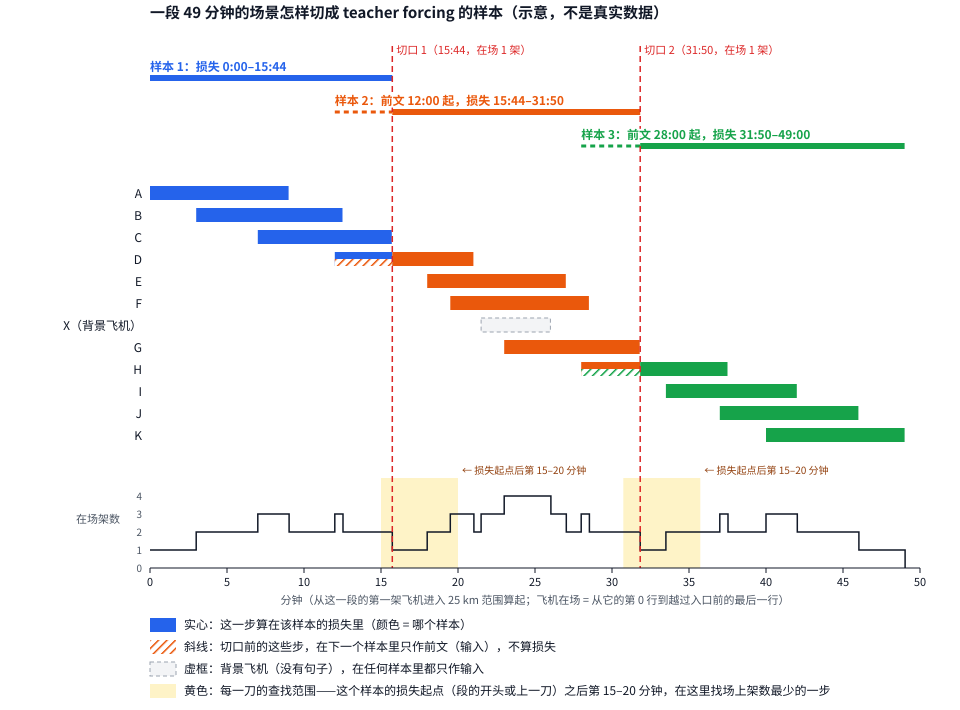
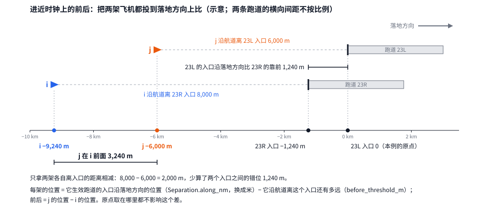

# 多机设计（两层模型第 7 阶段）

**一句话**：把单机的闭环（先验每 2 s 说一行词、执行器飞 2 s）扩到同一机场、同一时段的一组到达飞机：先验同时看着其他飞机
说话，执行器每架一个、各飞各的；飞机之间的规矩——不失去雷达间隔和尾流间隔——在生成时做屏蔽、在飞出来的航迹上再查、在
后训练里进奖励；落地顺序不是一个单独的输出，而是词的结果。记录数据里交互的样本少（有前机的步只占 16.5 %），所以闭环
训练另用扩充出来的多机场景：把别的航班按时间插进来、把起点转一转、把进入的间隔压紧。

先验、后训练、词表、执行器各自的设计见[先验设计](prior_design.zh.md)、[后训练设计](post_training_design.zh.md)、
[指令词表设计](instruction_vocabulary_design.zh.md)、[执行器设计](executor_design.zh.md)；框架见[两层模型框架](two_tier_framework.zh.md)。
本文取代先验设计 §9 第 2–5 步和后训练设计 §1 第 3、4 项里关于多机的写法（那两处已改为指向本文，§6.0）。本文只写现行的设计。

文中路径都相对 `4dTrajectory/`（`outputs/…`）或 `4dTrajectory/ts_transformer/`（`docs/…` 和包名），仓库根目录的写明。
单位只用米、米/秒、度、秒；规章原文里的 NM、ft 在引用处一次换成米（1 NM = 1,852 m，1 ft = 0.3048 m，`geokit`）。

---

## 0 状态

| 项 | 状态 |
|---|---|
| 设计 | **已确认**（用户 2026-09-27 逐项回答 §9 第 1–16 项，写进正文与 §8）。M2 之后改了 M3、M4（用户 2026-09-28 同意方向，§9 第 22 项）：不再做场景预训练，交互交给后训练，起点是 augmented 加上初始为零的"交通注意力"（§2.5、§6.2；起点用户 2026-09-28 定，§9 第 23 项） |
| 代码 | M0 第 1–4 步完成并已合并（2026-09-27，`852b395f`）；第 5 步完成并已合并（2026-09-28，`6165c52a`）：第 0 步第二条通过线按用户定的判法（执行器多加的部分，§9 第 17 项）过了，间隔作硬检查。第 6 步完成（2026-09-28，分支 `dev-multi-aircraft`，opus 审查过，待合并）：第一条通过线按合计判过了（0.32 %，§9 第 19 项），两条屏蔽处处硬用，兜底时不屏蔽（§9 第 20 项）。**M0 完成**，第 6 步已合并（`bd016193`）。**M1 完成**（2026-09-28，分支 `dev-multi-aircraft` `cba749cc`，opus 审查过，待合并）：base 在有前机的步上速度词每步负对数似然多 0.0077、忙的步上航向词多 0.0104（对齐飞行阶段与机场），集中在 KSJC、KSMF，只记录。**M2 完成**（分支 `dev-multi-aircraft` `a7abbe86`，opus 审查过，待合并）：场景模型没有学会用别的飞机——第一次训出的整体比 base 差
（选择集每步 0.2880 对 0.2839）；按 base 的批大小再训一次（§9 第 21 项）差距缩到 0.2868，但有前机的步上仍然没有一处比 base 好，速度词的差距
原样还在。按 §9 第 21、22 项，**不再做场景预训练，交互交给后训练**（§6.2 已改）；M3、M4 的开发按 §6.6 进行中。**M3 真实场景读完**（§6.6 第 1–5 步完成，分支 `dev-multi-aircraft` `de9a539a`，opus 审查过，待合并）：起点模型指挥一架、其余照记录回放，目视读法下 11.5 % 的样本失去间隔，照标注的词飞 4.9 %，记录 2.6 %；扩充场景上 23.9 %（插一架 37.6 %，挪前机 16.9 %，挪起点 12.9 %）。M4（第 6 步）代码写完、审查过、已合并；说话提速后（§6.6 第 12、13 项）2026-09-29 从第 0 轮重跑并跑完：选中的仍是第 0 轮（起点模型），没有训练出的一轮过线（读数 `readouts/2026-09-29_m4_traffic.zh.md`）（`outputs/POOLED/prior/m4_traffic_20260929/`）。第 7 步（窗口内由模型指挥）2026-09-30 开工（§6.6 第 7 步细节，分支 `dev-m4-window`）；第 8 步（复飞）已写进计划，未开工，开工前逐项定的在 §8 |
| 已有的、直接用得上的 | 场景索引与分段（`prior/scene.py`）；模型已带飞机轴和飞机之间的注意力，边特征现在只有"是不是自己"一项（`prior/model.py`）；间隔规则的唯一定义（`inference/runway_schedule.py`，FAA 条款逐条注明）；机型的 CWT 类别表（7360.1K 附录 A 全表，仓库内已解析）；起点扩充（`prior/augment.py`）；程序高度屏蔽（`prior/procedure.py`）；带截断的比的强化训练器（`prior/train.py` `RewardTuner`）；按批飞的执行器 v11 |
| 已量的数 | 训练集运行日普查（先验读数 §3）：每个预测步场上其他飞机 0 / 1 / 2 / ≥ 3 架占 30.0 / 34.4 / 21.5 / 14.0 %；有前机的步 16.5 %。落地顺序与进入顺序互换的比例（本文 §4.1）。观测航迹的失去间隔（M0 第 4 步，`outputs/POOLED/traffic/census_20260927/`，读数 `readouts/2026-09-27_parallel_runway_separation.md`，英文）：按 IFR 读法每小时 0.98 对、按目视读法 0.60 对（§3.2）。所有航班一起照标注的词飞（M0 第 5 步，`outputs/POOLED/traffic/labelled_v2_20260928/`，读数 `readouts/2026-09-28_labelled_traffic.zh.md`）：目视读法下被结束 3.93 %，同一批航班照记录走 2.76 %，执行器多加 1.17 个百分点（§3.4）。两条间隔屏蔽在标注词上（M0 第 6 步，`outputs/POOLED/traffic/masks_v2_20260928/`，读数 `readouts/2026-09-28_separation_masks.zh.md`）：拿掉 0.32 % 的标注速度词和许可词（§3.4）。单机模型看不看得到交互（M1，`outputs/POOLED/traffic/interaction_20260928/`，读数 `readouts/2026-09-28_m1_interaction.zh.md`）：有前机的步上速度词每步负对数似然多 0.0077（约 15 %），忙的步上航向词多 0.0104（约 9 %），KSJC 最多。场景模型（M2，`outputs/POOLED/traffic/scene_readout_20260928/`，读数 `readouts/2026-09-28_m2_scene_prior.zh.md`）：选择集每步 0.2880 对 base 0.2839，有前机的步上速度词 +0.0008（更差），M1 的差距 +0.0080 原样还在，切掉飞机之间的注意力词几乎不变。起点模型在多机闭环里（M3，`outputs/POOLED/traffic/free_generation_20260928/`，读数 `readouts/2026-09-28_m3_free_generation.zh.md`）：真实场景里指挥一架，目视读法下失去间隔 11.5 %（被引导的进近 21.6 %、直线 4.0 %），同一模型单独飞再放回场景 12.3 %，照标注的词飞 4.9 %，记录 2.6 %；扩充场景上 23.9 %（`free_generation_aug_20260928`：插一架 37.6 %，其中插得比规章间隔近的 63.6 %） |
| 与现行后训练的关系 | 第二阶段已跑完，第 7 轮采用为 augmented（用户 2026-09-27，`outputs/POOLED/prior/v3_stage2_clip_20260926/aug_s1337/round_07/`）。多机不改单机的代码、产物和读数（§1.2） |

---

## 1 目标与边界

### 1.1 要回答的四件事（用户 2026-09-26）

1. **多机情境**：场景里放哪些飞机，闭环里哪些由模型说话、哪些照记录回放，样本怎么切（§2）。
2. **数据扩充**：记录里的交互少，怎样造出"情况真实、但更挤"的多机场景来训练（§5）。
3. **交互约束**：飞机之间要守什么——最小距离怎么定、相对速度起什么作用、怎样用（§3）。
4. **落地排序**：谁先落、隔多久，模型怎样决定，怎样读（§4）。

### 1.2 不影响现行后训练（硬规矩）

- **不改**：`autopilot/`（在执行器规格的源码指纹里，改一处逻辑现行代码就拒绝 v11）、`instructions/`（在标注器指纹里）、句子产物
  `instruction_language/v5_20260926`、执行器规格 `executor/v11_20260927`、base / landing / augmented 的检查点。
- **多机的执行器就是现在的执行器**：每架飞机一个，互不知道对方；飞机之间的一切都在先验这一侧（输入、屏蔽）和 runner 里的检查。
- **新代码放新模块、新 runner**：单机的 runner（`prior_free_generation`、`prior_landing_reward`、`prior_augmented_reward`）与它们的读数
  逐位不变，由测试核对。模型结构的改动（边特征变多）用新的检查点格式名（§2.5），现行的单机检查点照旧能读、照旧逐位相同地生成。
- **GPU 与内存**：M0、M1 是 CPU；训练（M2 起）用 GPU，一次只跑一个，由管实验队列的代理按 PID 看着。
- **提交**：本文直接提交到 `dev-two-tier`；代码走新的工作树分支（建议名 `dev-multi-aircraft`），每一步 opus 审查，用户合并。

### 1.3 沿用的规矩

- 输入只给说这一步之前管制员能知道的；不给钟点和风；按运行日划分；训练只用训练集运行日，选轮用内部选择集，验证集每个阶段
  定稿后只读一次，**测试集运行日一架都不读**（不进场景、不作插入的来源、不进落地统计）。
- 程序、规章算出来的航迹不当模型的答案：屏蔽只拿掉"说了必然违规"的词，剩下的仍由模型选；规则排序器只作对照（§4.2）。
- 规章数值取自原文并注明条款（`docs/literature/arrival_separation/README.md`，下称"间隔文献"）；由它推出来的量标明"我的读法"。
- 比数据"更安全"就离开了数据：每一个间隔读数都与同一批场景的观测航迹、按同一个检查量出来的比例并排。

---

## 2 多机情境

### 2.1 场景里有谁

- **场景**：同一机场、按绝对时间对齐、2 s 一步（先验设计 §3.2）。某架飞机第 r 行的时刻 = 它进入 25 km 范围的时刻（`entry_time_utc`）
  + 第 r 行在句子里的时间。场景索引与分段已实现：`prior/scene.py` `SceneIndex`、`segments`。
- **每一行挂到哪一步**（用户 2026-09-27 定，§9 第 13 项）：各架的进入时刻是任意的（精确到毫秒），所以各架的行不在同一组时刻上。场景的步
  取 UTC 秒数为偶数的时刻；每架的每一行挂到离它最近的那一步（最多差 1 s），这只用来把各架排进同一步。本机的输入和说的词仍按它自己的行，
  时刻不改。两架之间的量按本机这一行的真实时刻算：模型的输入（边特征）把邻机从它的上一行往前推到这一时刻（§2.5）；失去间隔的判定和
  读数不是模型的输入，照记录回放的飞机按它的记录插值到这一时刻。闭环里由执行器飞的飞机本来就在场景的步上。
- **每架的行号仍是它自己句子里的行号**：位置编码、"前 8 行只观察"、落地前的最后一行，都按这架自己的行号算，与它挂在场景的哪一步无关。
- **在场的飞机**：有句子的到达航班（要对它说话）；没有句子的到达航班（标注器拒绝的）只作**背景飞机**，照记录回放、不说话、不算损失；
  离场与飞越不放（先验设计 §10 已定，读数里注明）。有句子、但执行器飞不了的（机型没有动力学，契约 C31）：teacher forcing 里照样说话、算
  损失；闭环里只能照记录回放，读数里数出有多少。
- **进入是数据给的**：每架飞机何时、在哪、以什么状态进入 25 km 范围，都取自记录——这是"交通需求"。模型管的是进入以后说什么。
  每架的前 `N_look` = 8 行（16 s）只观察，与单机相同。

### 2.2 闭环里每架飞机由谁指挥：三种设置

单机闭环里只有一架飞机：先验每 2 s 为它说一行词，它的执行器照着飞 2 s。多机场景里同时有好几架，每一架都要先定下"它这一步怎么动"。
做法只有三种：

- **由模型指挥**：先验每 2 s 为它说一行词，它自己的执行器照这些词飞。这是要训练、要评判的对象。
- **照标注的词飞**：不用先验，它自己的执行器照标注器从这架飞机真实航迹上读出的句子飞（与回放门的飞法相同）。
- **照记录回放**：不飞，每一步直接取记录里它在那一时刻的位置和状态；别的飞机的输入要用到它"说过的词"时，取它标注的词。回放的飞机
  不对任何别的飞机作出反应：由模型指挥的飞机离它再近，它也照记录走。

背景飞机（没有句子的到达，§2.1）只能照记录回放。有句子的到达用哪一种，由下面三种设置决定：

| 设置 | 由模型指挥的 | 照标注的词飞的 | 照记录回放的 | 要回答的问题 |
|---|---|---|---|---|
| **照标注的词飞** | 没有 | 场景里每一架有句子的到达 | 背景飞机 | 执行器自己会不会让飞机失去间隔（§6 的 M0） |
| **一架由模型指挥** | 选定的一架 | 没有 | 其余所有飞机 | 模型能不能在真实的交通里把一架飞机安全带下来 |
| **窗口内由模型指挥** | 一个时间窗口里新进入 25 km 范围、有句子的每一架 | 没有 | 窗口开始时已在空中的飞机、背景飞机 | 模型能不能同时指挥几架：谁先落、谁让谁 |

**「照标注的词飞」**：模型不参与。标注的词是从真实航迹读出来的，但执行器飞得和真实飞机不完全一样（转弯的快慢、到达某一点的时刻都有差别），
几架飞机合在一起，可能在真实飞机从没失去间隔的地方失去间隔。先在这个设置下量出执行器自己造成多少，后面才不会把它算到模型头上（§3.4 第 0 步）。

**「一架由模型指挥」**：

- 每架有句子的航班轮流当一次由模型指挥的那一架，其余飞机照记录回放。所以样本数与单机相同，而这架飞机看到的是真实的邻机。
- 邻机照记录走、不会让路，所以失去间隔时只问由模型指挥的这一架有没有责任（谁负责按 §3.4）：
  - 两架都已建立在同一条五边上（一前一后），规章把间隔的要求放在后机身上（间隔文献 §2.1、§7 第 3 行：前机过入口时，后机要离开多远）。
    由模型指挥的这架是后机，就算它失去间隔，它结束；它是前机、后机是回放的邻机时，邻机不会调整，这一对只记为读数。
  - 一架已建立在五边上、另一架还在被引导（要切进来）：切进来的那架负责。
  - 两架都还在被引导（从两个方向汇合），两架都有责任，由模型指挥的这架结束。

    **五边**是飞机落地前的最后一段：沿跑道中线的延长线、朝落地方向、沿下滑道下降到跑道入口的一条直线。它前面是三边（与跑道平行、
    逆着落地方向飞）和四边（与跑道成直角、转向五边）；从跑道方向直接进来的直线进近不飞三边、四边。飞机切进五边的走廊并一直沿着飞，
    叫**建立在五边上**；本项目用标注器和执行器共用的截获判定：离中线不超过 20 m + d·tan 0.45°（d 为离入口的距离）、航迹与跑道航向差
    不超过 2°。详见先验设计 §1.1 和它的图 1。
- 这个设置先做（用户 2026-09-27 定，§9 第 2 项）：出了问题，只可能出在模型怎样应对真实的邻机上。

**「窗口内由模型指挥」**：

- **窗口**：从一段连续的场景（§2.3）里截出一段时间。在这段时间里进入 25 km 范围、有句子的到达，全部由模型指挥；窗口开始时已经在空中的飞机，
  整段照记录回放。
- 这样截，是为了不在半空中接管一架已经在飞的飞机：每架由模型指挥的飞机都从它自己的第 8 行开始（前 8 行只观察），与单机相同。
- 窗口前后重叠地铺满一段（建议每 10 分钟开一个 20 分钟长的窗口），让每架航班都在某一个窗口里由模型指挥一次；长度与重叠等 M0 量完段长后定（§8）。
- 两架都由模型指挥时，谁负责按 §3.4：同一条五边上一前一后，后机结束；一架要切进另一架已在的五边（同一条或平行的），切进来的那架结束；
  两架都还在被引导的汇合，两架都结束。一架由模型指挥、一架照记录回放时，照上一个设置的规矩。

**三种设置共同的规矩**：

- **结局**：由模型指挥的飞机、照标注的词飞的飞机，各自判定——执行器判定的结局（`autopilot/judge.py`），加上"低于下滑道下沿"和新的
  "失去间隔"（§3.4）。照记录回放的飞机从不结束，也不算违规。
- **时限**：真实场景与执行器规格相同（观测剩余时间 × 1.5）；扩充场景 × 2.0，与第二阶段的扩充起点相同（`prior/augment.py` `TIMEOUT_FACTOR`）。
- 一个场景在它所有由模型指挥（或照标注的词飞）的飞机都结束时结束。

### 2.3 预训练（teacher forcing）的样本怎么切

**先说"段"**。一架飞机"在场"，是从它的第 0 行（进入 25 km 范围）到它越过入口前的最后一行；背景飞机到它记录的最后一行。把同一机场的
航班按进入的先后排开：一架航班如果在当前这一段结束之前就进入了，就归进这一段；否则从它开一段新的（`prior/scene.py`
`SceneIndex.segments`）。所以一段就是"从场上有飞机，到场上一架都没有"的一段连续时间，中间任何时刻场上都至少有一架。

**段有多长**（先验读数 §3，训练集运行日，五个机场）：每段航班数的中位数 1–3 架；段长的中位数 8–12 分钟，p90 18–47 分钟，最长 67–209 分钟。
多数段不长，但最长的有三个多小时，不能整段放进一个样本，所以要切。

**切法**（图 1）：

1. 段长不超过 20 分钟：整段就是一个样本。
2. 更长的：从这一段的开头量起，在第 15 分钟到第 20 分钟之间（两头都算）逐步（2 s 一步）数场上有几架飞机（背景飞机也算），在架数最少
   的那一步切一刀；架数最少的步不止一个时，取最早的一步。切口那一步归后一个样本，刀前的步是一个样本。
3. 从这一刀起，把剩下的部分当成新的一段，再按第 1、2 条做：剩下的不超过 20 分钟就整个作最后一个样本；否则从这一刀量起，在第 15–20
   分钟之间找架数最少的一步，再切一刀。如此直到切完。

所以每个样本算损失的时间：除了最后一个都是 15–20 分钟，最后一个不超过 20 分钟。样本的输入还要加上下面说的前文，所以比这更长。

在架数最少的时候切，是为了让被一刀切开的航班尽量少。

**被切开的航班**（图 1 的 D、H）：在切口之前已经进入、切口那一步还在场的航班，一部分在刀前，一部分在刀后。（恰好在切口那一步进入的
航班整个在后一个样本里，不算被切开；最后一行恰好在切口那一步的航班算被切开，它的最后一步在后一个样本里算损失。）

- 在前一个样本里：它从第 0 行到切口前一步照常算损失。
- 在后一个样本里：它切口之前的位置和标注的词只作前文（输入），让模型知道它从哪里来、已经被说了哪些词；损失从切口那一步算起。
  所以后一个样本的时间从这些航班的第 0 行开始，比切口早；切口前的这一段在两个样本里都出现，但只在前一个样本里算损失。
- 切口之前已经离开的航班不进后一个样本。所以在后一个样本的前文里，被切开的航班看不到它们当时的邻机——这也是要在架数最少的时候切的原因。

背景飞机在任何样本里都只作输入，不算损失。只有一架飞机的段照样作样本：场景模型也要会说单机的话。

**一个样本最多放几架**：模型的飞机轴放的是这个样本里**出现过的每一架**（每架占一个位置，整段时间都是它的），不是同时在场的架数。
同时在场最多 8 架（普查），但一个 20 分钟的样本里先后出现的航班可以多得多。所以 `A_max` 由 M0 量：训练集运行日每个样本、每个闭环窗口
（同样按"出现过的每一架"数）的架数的最大值；内部选择集、验证集超过它时报错，不悄悄丢掉飞机。M0 的预览：各机场 11–18（KRDU 18）。



*图 1*：一段 49 分钟的场景（示意的例子，不是真实数据）。上面三条横线是三个样本：实线是算损失的时间，虚线是只作前文的时间。中间每一行是一架
飞机在场的时间：颜色是它这几步的损失算在哪个样本里；斜线表示切口前的这几步在下一个样本里只作前文；虚框是背景飞机。下面的折线是场上的
架数，黄色是每一刀的查找范围（从这个样本算损失的起点——段的开头或上一刀——量起的第 15–20 分钟），红色虚线是切口。图由 `python run_ts.py scene_sample_figure` 按上面的切法
算出切口后画出（`experiments/scene_sample_figure.py`），`tests/test_scene_sample_figure.py` 核对文档里的图就是它画出的样子。

### 2.4 闭环的样本

- **真实场景**：按 §2.2 的窗口从训练集运行日的段里取；每轮换种子抽窗口；内部选择集、验证集各一套固定的窗口（固定种子）。
- **扩充场景**：§5。
- **每个窗口说 `K` 次**（不同种子），同一窗口的 `K` 次互相比（§6 M4 的优势）。

### 2.5 模型输入的改动：边特征

**边特征是什么**：模型把同一步场上的飞机看成一张图，每架飞机是一个"点"，任意两架之间有一条"边"。

- **点**上放这架飞机自己的输入：它的位置、高度、速度、运动方向，以及已经对它说过的词（先验设计 §4）。
- **边**上放两架飞机之间的关系。例如"j 在 i 正前方 6 km，比 i 低 300 m，正以 5 m/s 接近 i，两架落同一条跑道"。这些量不属于任何一架飞机
  自己，只有成对看才有。这组数就叫边特征。
- **边有方向**：i → j 是"从 i 看 j"（j 在 i 的坐标系里在哪），j → i 反过来，两组数不一样。每一步、每一对飞机都有一组；A 架飞机就有
  A × A 组，包括每架对自己的那一条。边特征只用第 t 步及以前的数据算，模型看不到未来。

**模型怎么用边特征**：模型每一层都有一次"同一步各架飞机之间的注意力"（`prior/model.py` `SceneLayer.extend`；每层是"沿时间的因果注意力
→ 同一步各架飞机之间的注意力 → 前馈"，先验设计 §6）。飞机 i 在这一步看场上的每一架 j：先给每架打分，决定看谁看得多，再把看到的内容
按分数加权，读进自己。边特征在这里用两次：

1. **决定看谁**（`edge_bias`）：一个小网络把 i → j 的边特征变成每个注意力头一个数，加到 i 给 j 的打分上。模型因此能学会：同一条五边上、
   紧挨在前面的那架多看；30 km 外、落另一条跑道的那架少看。
2. **读到什么**（`edge_value`）：另一个小网络把边特征变成一个向量，加到 i 从 j 读到的内容里。i 读到的因此不只是"j 自己在哪、飞多快"，
   还有"j 相对我在哪、我们在接近还是在拉开"。

**为什么直接给关系，不让模型从两架的状态里自己算**：每架飞机自己的输入是机场坐标系里的位置和速度。要知道"j 在我前面多远"，得把两架的
位置相减，再转到 i 的运动方向上。注意力靠两个向量的点积打分，很难做这种相减和旋转。文献的结论也是：相对的几何量要直接放进被读取的
值里（MTR++ 表 10）；用绝对坐标表示交互，比不给还差（先验设计 §4.4、§11）。

**两种用法**：

- **M2 的场景模型 scene**：边特征进上面那个"同一步各架之间的注意力"，与"读自己"在同一个 softmax 里。已训两次，没用上别的飞机
  （M2 读数 `readouts/2026-09-28_m2_scene_prior.zh.md`），不再往下用。
- **从 M3 起（多机后训练的模型 traffic，§6.2）**：单机模型的每一层原样不动，在"同一步各架之间的注意力"之后加一个**交通注意力**：
  只读同一步在场的**别的**飞机（不读自己），边特征的用法同上（决定看谁 + 加进读到的内容），输出的那一层**没有偏置、权重初始化为零**（没有偏置：场上只有自己时读到的永远是 0，学过以后也一样；第一次审查发现偏置从第一步起就有梯度）。
  所以一开始交通注意力的输出正好是 0，整个模型对每架飞机说的与单机模型对它单独说的**相同**——只差浮点舍入（几架放在一批里，
  求和的顺序与一架时不同：双精度 1e-15，augmented 的 logit 在 float32 下 1.2e-5；单机模型自己换这两种排法也差这么多）；某一步场上没有别的飞机时，它的输出也是 0（不是一行全被遮住的注意力）。
  - **为什么不能只把边特征那几层置零**：单机模型里"同一步各架之间的注意力"对在场的每一架做 softmax。场上只有自己时权重全在自己身上；
    只要多一架，哪怕边特征全是 0，权重也会分给它，单机模型的输出就变了。所以读别的飞机必须是另外一条路，起点时这条路的输出正好是 0。
  - 这是给已训好的网络加新输入的常见做法（Flamingo 的门控交叉注意力、ControlNet 的零卷积：新加的一路从 0 起，训练开始时不破坏原网络）。
    输出层从 0 起时，它自己的梯度不为 0（读到的内容乘上游梯度），所以它先动起来，里面的层随后跟上。

**现在只有一项**："是不是自己"（i = j 时为 1，否则为 0）。现行的 base、landing、augmented 都是单机模型，每个场景只有一架飞机，
飞机之间的注意力只读到自己，这一项就够了。多机模型要加下表各项（每对飞机 i → j、每一步，只用 t 及以前）：

| 边特征 | 怎么算 | 缩放 |
|---|---|---|
| 是不是自己 | 已有 | — |
| 相对位置 | 在本机坐标系里（原点本机，轴沿本机运动方向）j 的前后、左右、高度差 | 前后、左右 asinh(÷ 5,556 m)，高度差 ÷ 1 km |
| 进近时钟上的前后 | 按落地的先后，j 在 i 前面（正）还是后面（负）、隔多远；怎么算见表下"进近时钟上的前后"一段和图 2 | asinh(÷ 5,556 m)；两机生效跑道的方向不同、或有一架还没有生效跑道时，记 0 并把标志位置 1 |
| 两条生效跑道的关系 | 同一条 / 当作一条的平行跑道 / 相关平行跑道 / 独立平行跑道 / 无关（`Separation.relation`，按 FAA 间距划分，间隔文献 §7） | 五种关系各占一位：是哪一种，哪一位为 1，其余为 0 |
| 接近速度 | 由两机过去两行的位置差算出的相对速度在连线上的分量（正为接近） | ÷ 100 m/s |
| 运动是否未知 | 本机或 j 这一行是它的第一行（没有上一行，算不出运动）时为 1；这时接近速度与最近点记 0，本机没有运动时前后、左右也记 0 | 0 / 1 |
| 最近点 | 两机都按此刻的速度直飞时，水平距离最近的时刻和那时的水平、垂直距离（常说的 CPA，"最近接近点"）；时刻截到 [0, 120] s | 时刻 ÷ 120 s，水平距离 asinh(÷ 5,556 m)，垂直距离 ÷ 1 km |
| 规章要求的距离（给，用户 2026-09-27，§9 第 6 项） | 两机若成前后机，按规章至少要隔多远（`Separation.distance_nm`，含尾流类别，机型按 §3.2 的 CWT 表查） | asinh(÷ 5,556 m)，与进近时钟相同 |

**边特征在哪个时刻算**：按本机这一行的真实时刻（§2.1）。邻机的位置和速度取它在这一时刻之前的最后一行，按那一行的速度直线推到这一时刻；
推的时间不超过 2 s，只用过去的数据。直飞时误差不到 1 m，以 3°/s 转弯时约 7 m（我的估算）。闭环里由执行器飞的飞机都在场景的步上，
推的时间为 0；照记录回放的飞机仍按它自己的行推。邻机刚进场、还没有更早的行时，它的第一行往回推到本机的时刻（至多一步）。

**速度从哪来**：每架飞机每一行的速度 = 从上一行到这一行的位移 ÷ 两行的时间差（水平、垂直、进近时钟上的前进都这样算），与先验自己的节点输入
同一口径（`prior/data.py`）。**不用信号里的地速、航迹、升降率**：那些是以这一行为中心的最小二乘拟合，含这一行之后 7.5 s 的数据，会把本机
接下来要转的弯漏进本机坐标系、接近速度和最近点。一架飞机的第一行没有上一行：它的运动记为未知（"运动是否未知"置 1），邻机按不动推，
本机没有坐标轴。两行位置相同时本机也没有坐标轴（训练、val 与内部选择集里 1,205 万对相邻行中 89 对）。生效跑道在两行之间换了的那一步，进近时钟上的
前进速度记 0。

**进近时钟上的前后**（图 2）：

- **它回答什么**：按落地的先后，j 在 i 前面还是后面、隔多远。同一条跑道（或当作一条的平行跑道）上的间隔规章量的就是这个：前机过入口时，
  后机沿航道离入口还有多远（间隔文献 §2.1、§7）；相关平行跑道的对角间隔，`runway_schedule` 也换成了沿航道要错开的距离。
- **怎么算**：把两架飞机都投到"落地方向"这一条直线上，看谁更靠前。
  - 每架飞机在这条线上的位置 = 它生效跑道的入口在这条线上的位置 − 它沿航道离这个入口还有多远。
  - 前后 = j 的位置 − i 的位置，正数表示 j 在前。
  - 入口在这条线上的位置是 `runway_schedule.Separation.along_nm`（记的是海里，换成米再减；以机场里按名字排第一的跑道的入口为原点，
    原点取在哪里都不影响两机之差）。
  - 离入口还有多远，沿跑道的航道方向量：`instructions.airport.relative_to_runway` 的 `before_threshold_m`，标注器用的同一个函数。
  - 两架落同一条跑道时，两个入口的位置相同，前后就是两者离入口的距离之差。
- **为什么要加上入口的位置**：两条平行跑道的入口常常不齐。图 2 的例子：23L 的入口沿落地方向比 23R 的靠前 1,240 m（KRDU 这两条跑道的错位，
  `runway_schedule` 的模块说明）；i 沿航道离 23R 的入口 8,000 m，j 离 23L 的入口 6,000 m。只拿两个距离相减得 2,000 m；把入口的错位算进去，
  j 实际在 i 前面 3,240 m。
- **为什么叫"时钟"**：`runway_schedule` 排落地时间时用的是时间——把这个位置按进近速度换成"飞过同一个原点的时刻"（`approach_time_s`），
  两机的时刻差乘以速度，就是这里的距离差。边特征直接用距离。
- **它只在两架都在（或快到）五边上时才等于落地的先后**：还没转上五边的飞机（例如在三边上逆着落地方向飞），投到这条线上只是它此刻的
  几何位置，不代表它还要多久才落地；这时模型要靠相对位置和对方已经说过的词来判断先后。
- **记 0 的情形**：两机生效跑道的方向不同（航道相差超过 10°，`runway_schedule.parallel_relations` 的 `max_course_diff_deg`），或其中一架还
  没有生效跑道（它的前 8 行只观察，还没有对它说过跑道）。这时这一项记 0，并把标志位置 1。



*图 2*：进近时钟上的前后怎么算（示意的例子；两条跑道的横向间距不按比例）。两架飞机和两个入口都投到下面这条沿落地方向的轴上，前后就是
两架在轴上的位置之差。图由 `python run_ts.py approach_clock_figure` 画出（`experiments/approach_clock_figure.py`）；
`tests/test_approach_clock_figure.py` 核对文档里的图就是它画出的样子，并核对图里用的两个约定与代码一致：`along_nm` 是入口沿落地方向的
位置，`before_threshold_m` 是沿航道离入口还有多远。

**缩放**：网络的输入最好都在几的量级，所以每个量先缩放。水平距离（相对位置的前后与左右、进近时钟上的前后、最近点的水平距离、规章要求的
距离）一律用 asinh(d ÷ 5,556 m)；高度差用 ÷ 1 km。

- **asinh 是什么**：反双曲正弦，asinh(x) = ln(x + √(x² + 1))，是 sinh(x) = (eˣ − e⁻ˣ) ÷ 2 的反函数。它有三个合用的性质：
  - x 在 ±1 以内，asinh(x) 约等于 x 本身（线性）；
  - |x| 大了只按对数增长，约为 ln(2|x|)，带着 x 的正负号；
  - 对任何实数都有定义，单调，保留正负号（前 / 后、左 / 右不会丢）。对数做不到这一条：ln 在 0 和负数上没有定义。

  几个值：asinh(0.5) = 0.48，asinh(1) = 0.88，asinh(2) = 1.44，asinh(5) = 2.31，asinh(10) = 3.00，asinh(50) = 4.61。
- **除以的那个数是"拐点"**：asinh(d ÷ s) 在 d 不超过 s 时按距离本身分辨（差 1 km 就是差 1 km），超过 s 以后按比例分辨（5 km 与 6 km 的
  差别，和 50 km 与 60 km 的差别在输入里一样大）。所以 s 取"判断在哪个距离上做出"的量级。
- **s 为什么取 5,556 m**（规章的雷达间隔，`runway_schedule.FAA_RADAR_NM` = 3 NM）：两机之间的判断都发生在间隔标准附近——雷达间隔 5,556 m，
  尾流间隔更大。几百米的差别在这里没有意义：两机只隔几百米时，间隔早就丢了。单机输入里"离跑道中心线多远"用的是 asinh(÷ 1 km)
  （`prior/data.py` `RELATIVE_SCALE_M`），因为对准跑道的判断发生在几百米以内（航道走廊 20 m + d·tan 0.45°）；这个理由对两机之间的距离
  不成立，所以边特征不照搬 1 km。
- **进近时钟和规章要求的距离用同一个缩放**：同一条五边上失去间隔，就是"进近时钟上相隔的距离 < 规章要求的距离"。两个量经过同一个单调
  的缩放，谁大谁小不变，模型直接比两个数就行；如果一个用 asinh(÷ 1 km)、一个用 ÷ 5,556 m，模型得先学会把两者换到同一把尺上。
- 高度差是 ÷ 1 km（线性）：高度差本来就只有几千米以内，线性就看得清垂直间隔的 1,000 ft（305 m）。

**一个例子**（示意的数）：两架落同一条跑道，都已在五边上。i 跟在 j 后面 6 km，i 地速 75 m/s，j 地速 70 m/s；按 3° 下滑道，j 比 i 低约
300 m。

| 边特征 | i → j（从 i 看 j） | 缩放后 |
|---|---|---|
| 是不是自己 | 不是 | 0 |
| 相对位置 | 前 6,000 m，左右 0，高度差 −300 m（j 更低） | 0.94，0，−0.30 |
| 进近时钟上的前后 | j 在前 6,000 m | 0.94 |
| 两条生效跑道的关系 | 同一条 | 五种关系各占一位："同一条"那一位为 1，其余为 0 |
| 接近速度 | +5 m/s（i 比 j 快，正在追近） | 0.05 |
| 最近点 | 照现在的速度直飞，距离一直在缩小，所以截在 120 s；那时水平 5,400 m、垂直约 270 m | 1.0，0.86，0.27 |
| 规章要求的距离 | 没有尾流的额外要求时，就是雷达间隔 5,556 m | 0.88 |

反方向的 j → i：相对位置变成"后 6,000 m、高度差 +300 m"，进近时钟变成"i 在后 6,000 m"；接近速度、最近点、跑道关系、规章距离两边相同。
模型从 i → j 这条边读到的就是"前机在 6 km，我快 5 m/s，两分钟后还剩 5.4 km，规章要 5.56 km"，由此可以学会对 i 说减速。三个距离在同一
把尺上，直接比：进近时钟 0.94 > 规章 0.88，现在还够；最近点的水平距离 0.86 < 0.88，照这样飞下去不够（算下来约 89 s 后，
(6,000 − 5,556) ÷ 5 ≈ 89）。

- 接近速度和最近点都能从相对位置和运动算出来，但显式给出后模型不必自己学这层算术；它们就是"相对速度"在输入里的位置（§3.3）。
- **对方已经说过的词**：与本机同样编码（每列生效的词 + 距上次换词的步数），加到 j 的节点上（先验设计 §4.4 已写）；回放的飞机用标注的词，
  背景飞机记为"无"。
- **检查点格式**：边特征的列表写进配置，新格式名 `ts-prior-checkpoint-v4`；现行的 `ts-prior-checkpoint-v3`（base、landing、augmented）
  按它自己的格式名读，边特征就是"是不是自己"一项。两种格式按名字分开读、都不改（用户 2026-09-27 同意两种格式并存，§9 第 10 项）。
  traffic 模型再一个格式名 `ts-prior-checkpoint-v5`：单机模型（v3）的全部权重 + 每层的交通注意力 + 边特征列表与边特征代码的哈希 + 起点模型的出处
  （目录与检查点的 sha256）；三种格式按名字分开读。
  v4 还记下决定边特征的代码与 CWT 表的哈希（`traffic_scene_data.edge_source_sha256`：边特征、间隔规则、进近时钟位置、生效跑道、步与行时刻、
  样本与组批这七个文件的代码逻辑，加两张 CWT 表的内容），`load_prior` 对不上就拒绝——这七个文件里任何一处代码改动（包括 `runway_schedule`
  里排程的部分）都会让已有的场景模型读不了，与执行器的哈希同一做法。
- **规章要求的距离：给**（用户 2026-09-27，§9 第 6 项，看了 M0 的量之后定）：在训练集运行日每次落地时紧跟其后的那一对上量，93.4 %（KSMF）
  到 98.7 %（KSTL）的对只要雷达间隔 3 NM，其余要 3.5–6 NM（多是前机为重型机）。占的对少，但一旦出现差别就大（5 NM 比 3 NM 多约 3.7 km），
  而模型看不到机型，不给就无从知道哪一对要隔得更远——那些对到入口时违反尾流间隔，对模型是无法预见的噪声。

### 2.6 同一步里的说话顺序

- **模型**：各架同时说（先验设计 §5），每架只看得到上一步为止所有飞机的状态和词。预训练、闭环都一样，模型结构不变。
- **屏蔽**：在模型之外按顺序算——同一步里按进近时钟从前到后（离入口最近的先说），后一架的屏蔽看得到前一架这一步刚说的词（后训练设计 §1
  第 3 项）。顺序只决定屏蔽看到什么，不是落地顺序的答案。

```text
每一步（2 s）：
  所有由模型指挥的飞机的输入（本机 + 边特征 + 各机已说的词） ──► 先验：每架六列的分布（同时算）
       │
       ▼ 按进近时钟从前到后，逐架采样：相容规则 → 程序高度屏蔽 → 间隔屏蔽（看得到前面几架刚说的）
  每架的执行器各飞 2 s ──► 回放的飞机取记录的下一行
       │
       ▼ 查每一对：失去间隔 → 负责的那架结束（§3.4）；低于下滑道下沿 → 结束
  回到下一步
```

---

## 3 交互约束

### 3.1 规章原文说什么

全文和条款在间隔文献（FAA JO 7110.65BB Change 3，2026-07-09 生效）；`inference/runway_schedule.py` 按条款编码了进近时钟上的间隔。
状态沿用间隔文献 §7 的记法：**T** = 原文，**T+R** = 原文有值、怎么套用是我们的读法，**N** = 没核实。

| 规矩 | 值（原文） | 米 | 条款 | 状态 |
|---|---|---|---|---|
| 终端雷达间隔 | 3 mi（单传感器离天线 40 mi 以内，或 FUSION） | 5,556 m | 5-5-4 a、b | T |
| 同一跑道，前机过入口时的尾流间隔 | 按前后机 CWT 类别查 TBL 5-5-2，例如 B 在前、F 在后 5 NM | 例：9,260 m | 5-5-4 h | T |
| 同一跑道，空中跟在前机后面 | TBL 5-5-1，在前机航迹下方 1,000 ft 以内、2,500 ft 以内跟随时 | — | 5-5-4 g | T |
| 间距 < 2,500 ft 的平行跑道 | 按一条跑道算尾流；雷达间隔也跨两条取是读法 | — | 5-5-4 h NOTE | T（雷达：T+R） |
| 相关平行跑道 2,500–3,600 ft | 相邻五边上先后两架对角 ≥ 1.0 NM，外加各自五边上的前后间隔；转入时 1,000 ft 垂直或 3 mi | 1,852 m | 5-9-6 a1、a2 | T |
| 相关平行跑道 3,600–8,300 ft | 对角 ≥ 1.5 NM | 2,778 m | 5-9-6 a3 | T |
| 独立平行跑道 | 双方都建立在五边上之后不设间隔；之前 1,000 ft 或 3 mi | — | 5-9-7 | T；**哪几对真在独立运行：N** |
| 跑道占用 | 前一架脱离跑道之前后一架不得过入口 | — | 3-10-3 a | T；3 NM（约 80 s）比占用时间长，由雷达间隔管住（跑道意图计划 §17.4，读法） |
| 间隔到接地为止 | 非目视进近的 IFR 飞机 | — | 2-1-19 b | T |
| 目视进近 | 平行跑道 < 2,500 ft 可由飞行员目视保持间隔；需要尾流间隔时不许超越 | — | 7-4-4 c1（N JO 7110.805） | T；**记录里多少是目视进近：N** |
| 5 NM 以内不指定速度 | 离跑道 9,260 m 以内不给速度调整 | 9,260 m | 5-7-1 b4 | T（词表设计 §5.1） |
| **垂直间隔** | "Up to and including FL 410- 1,000 feet." | 304.8 m | 4-5-1 a | T（间隔文献 §2.9，2026-09-27 取原文） |
| 雷达间隔与垂直间隔是二选一 | "Aircraft not laterally separated, may be vertically separated…"；转入平行五边时 "1,000 feet vertical or … 3 miles radar" | — | 5-5-5；5-9-6 a1、5-9-7 a1 | T |
| 同一条五边上只说雷达间隔 | "Provide the minimum approved radar separation between aircraft on the same final approach course." | — | 5-9-6 a5（5-9-7 a4 / b4、5-9-9 a2 同） | T；没有条款明文禁止在同一条五边上用垂直间隔 |
| 高度指什么 | "'Altitude' means indicated altitude mean sea level (MSL), flight level (FL), or both." | — | 1-2-1 j | T；我们比的是 ADS-B 的几何高度，两机之差与气压高度之差相近是读法，没量 |
| "失去间隔"有没有数值定义 | 没有；上报规定只说 "Any suspected loss of radar separation … except as the result of compression on final approach" | — | JO 7210.632A 附录 A ¶2 a | T；所以下面的判定是我们的读法 |

### 3.2 失去间隔的判定（我的读法；平行跑道按 `runway_schedule` 现行的读法，用户 2026-09-27 同意，§9 第 4 项）

**两种读法**（用户 2026-09-27，§9 第 15、16 项）：**检查和奖励用"目视读法"，"IFR 读法"在每个间隔读数里并排报**。
- **IFR 读法**：规章的仪表规则照原文，即下面第 1、2 条。
- **目视读法**：天气好时，管制员给多条跑道的到达发目视进近许可（7-4-4 c）。这个读法默认有这些许可，但**从不默认目视间隔**（7-2-1）：
  目视间隔要飞行员报"看见了前机"、管制员指令"保持目视间隔"，我们的词表里没有这两个词，模型说不出来，就不能算它说了。与 IFR 读法只差两处，
  而且凡是目视读法判为失去间隔的，IFR 读法也判（随机场景测过）：
  - **相关和独立平行跑道**（间距 2,500 ft 以上）：两架都"转上了五边"以后，两条跑道之间不设最小间隔（7-4-4 c2 a、c3 a：转上五边的
    飞机切入角不大于 30° 之前要有规定的间隔；c2 c、c3 c：之后不必再对相邻五边上的飞机用别的间隔）；之前照 IFR 读法。"转上了五边"
    = 航迹与本跑道五边方向的夹角不大于 30°，**并且在两条五边中线的本侧**。夹角用地速方向（航迹）量，没有风的数据。中线是我的读法：
    冲过本跑道五边、进了另一条五边那一半的，和从另一侧横穿过来、还在另一半的（c2、c3 的 (b)(d) 要这种飞机守着间隔直到到达本跑道五边），
    都不算已切入（7-4-4 NOTE 1 说 30° 的用意就是防冲过头）；在本跑道五边附近偏了一两度的、从外侧转进来的，算。试过"朝本跑道五边飞
    才算"的读法，结果凡是在五边上偏开一度的都成了失去间隔（KRDU 584 → 789 对，多出来的那些中位离五边 10 m、偏 2°），弃用。
    代码：`separation._turned_in`，常量 `runway_schedule.FAA_VISUAL_INTERCEPT_MAX_DEG`，每对平行跑道带方向的间距 `Separation.right_nm`；
  - **不同方向的跑道**：两架都已建立在各自五边上时不查（7-4-4 c4 要的间隔由交叉跑道的放行规则 3-10-4 给，没有建模）；有一架还在被引导，
    照 IFR 读法。这是唯一比原文宽的地方。
  **间距不到 2,500 ft 的近距一对照 IFR 读法当作一条跑道**：7-4-4 c1（N JO 7110.805 改过的文字）要后机报看见前机、并被指令保持目视间隔
  （c1 b），没有目视间隔就没有这种目视进近。前机过入口时的尾流检查两种读法相同。没有编码的：c2、c3 的 (b)(d)（两机从同一侧来时，
  后机要切过远的一条或建立在近的一条之前一直保持间隔；用中线近似，原文是到五边本身），b1 的"雷达目标不得相碰"（要显示比例）。
- **为什么不用 IFR 读法**：观测航迹按 IFR 读法在五个机场里有四个每小时失去间隔 0.6–1.9 对，几乎都在平行跑道和交叉跑道上；其中切入角不大于
  30° 的平行跑道转入、都已建立的交叉跑道五边，是目视进近许可本身就允许的，不该让模型因此被结束。数和航迹实例见英文读数
  `readouts/2026-09-27_parallel_runway_separation.md`。
- **模型因此比记录严**：记录里管制员常用目视间隔代替规定间隔（KSJC 30L/30R 并排飞、切入角大于 30° 的转入），模型给不出目视间隔，
  就得守规定间隔。所以间隔读数里总要并排报观测航迹在同一检查下的失去间隔率（§1.3）。
  代码：`inference/separation.py` `IFR`、`VISUAL`。

对同一时刻的两架飞机 i、j（都在场、都没结束），按 IFR 读法：

1. **水平距离 < S_h 且垂直距离 < 304.8 m** 就算失去间隔（雷达间隔和垂直间隔二选一，守住一个就算有间隔，5-5-5）；**同一条五边上的一前一后
   例外，只看水平距离**（下一条的第一种情形）。S_h 按两机生效跑道的关系、以及两机是否都已建立在五边上取：
   - **一前一后**：同一条跑道或当作一条的平行跑道，并且两机**都已建立在这条五边上**：S_h = max(5,556 m, 空中尾流间隔：TBL 5-5-1，5-5-4 g，
     按前后机的 CWT 类别查)，**不看垂直距离**。只是被指了同一条跑道、还在被引导的两架不算：它们还不在"同一条最后进近航线"上，
     照最后一种情形判（雷达或垂直）。原文对同一条五边
     只说雷达间隔和尾流间隔（5-9-6 a5、5-5-4 g、h）；而且两机都在 3° 下滑道上时，后机每落后 1,852 m 高出约 97 m，落后 5,816 m 时就高出
     304.8 m——带着垂直条件，任何 3.5 NM 以上的尾流间隔都只能查到 5,816 m 为止（我的算术与读法，间隔文献 §2.9）；
   - 相关平行跑道，两机都已建立在各自五边上：S_h = 对角 1,852 m 或 2,778 m（按间距）；之前 5,556 m；
   - 独立平行跑道，两机都已建立在五边上：不查；之前 5,556 m；
   - 其他（不是两机都已建立、跑道方向不同、还没说跑道）：5,556 m。
   "建立在五边上"用执行器自己的截获判定（与落地判定同一个量），回放的飞机用标注器读出的截获。
   代码：`inference/separation.py` `losses`（每一对的情形、要求的距离、谁负责都在返回里）。
2. **前机过入口的那一刻**，同一条跑道（或当作一条的一对）上、已建立在五边上、在进近时钟上紧跟其后的那架，与前机在进近时钟上相隔
   < 尾流间隔（TBL 5-5-2，5-5-4 h）：算后机失去间隔。还没建立在五边上的不查——它投到进近时钟上的位置不是它在队里的位置（§2.5）。
   代码：`inference/separation.py` `wake_at_threshold`。
   CWT 类别由机型查（`runway_schedule.wake_category`；执行器本来就知道每架的机型）。**机型 → CWT 类别的表**（用户 2026-09-27：要一张可查、
   方便以后增补的表）：读 7360.1K 附录 A 的全表（仓库内 `docs/literature/arrival_separation/papers/FAA_JO_7360.1K_AppendixA_categories_parsed.csv`，
   2,653 个机型），另加一张本项目的补充表（`docs/literature/arrival_separation/cwt_supplement.csv`：7360.1K 还没列的机型，每行写出处和日期）；同一机型在一张表里出现两次、或两张表里都有，都报错，有机型代码
   但两张表都查不到的也报错、不猜（补进补充表）。记录里根本没有机型代码的飞机：尾流类别未知，它参与的一对只按雷达间隔判，读数里数出有多少。
   现在的 `CWT_BY_TYPECODE` 只有 25 个机型，是手抄的，由这张表取代。M0 先列出数据里每一个机型查不查得到。
3. **不打折**：用规章值本身判，不加容差；记录数据里低于它的（目视进近、雷达的量测、上报规定明说不算的"五边上的压缩"）用同一个检查
   量出来并排报（§3.4 第 0 步）。

### 3.3 相对速度起什么作用

- **规章里没有"接近速度不许超过多少"这种条款**：上表每一条最小间隔都是距离；和速度有关的原文只有"需要尾流间隔时不许超越"（7-4-4 c1）
  和"5 NM 以内不指定速度"（5-7-1 b4）。所以相对速度**本身不作约束**。
- 它起的是三个作用：
  1. **输入**：接近速度和最近点作边特征（§2.5），让模型看得出"再这样飞 40 s 就不够了"。
  2. **预判**：间隔屏蔽（§3.4 第 2 层）判断一个速度词会不会让后机在前机过入口时太近，靠的就是两机的速度差在剩余时间里累积掉多少距离——
     五边上前机减到进近速度、后机还快，间隔被"压缩"，这是同一条五边上最常见的失去间隔的方式（我的读法）。
  3. **读数**：同一条五边上前后机的接近速度分布，与观测并排；一个靠来回改速度保持间隔的模型会在这里露出来。

### 3.4 怎么用：三层，外加第 0 步

仿照第二阶段程序高度的做法（后训练设计 §3）：屏蔽只管此刻能确定的，屏蔽照顾不到的由飞出来的航迹再查。

- **第 1 层，事后检查**（每飞完一步查每一对）：按 §3.2 失去间隔，负责的那架结束，结局"失去间隔"，奖励 0；另一架继续飞。**谁负责**：
  两架都已建立在五边上时（同一条的一前一后，或相关平行跑道的两条），进近时钟上在后的那架；一架已建立、一架还在被引导时，还在被引导
  （要切进来）的那架——管制员把切进来的飞机引到有间隔的地方；两架都还在被引导（从两个方向汇合），两架都负责。负责的飞机由模型指挥
  （或照标注的词飞）就结束；照记录回放的飞机不会调整，从不结束，它该负责的一对只记为读数。所以两架都由模型指挥时，都在被引导的汇合两架都结束；
  一架由模型指挥、一架照记录回放时，只可能结束由模型指挥的那一架（§2.2）。
- **第 2 层，屏蔽**（每一步，在相容规则和程序高度屏蔽之后，按 §2.6 的顺序）。只做两条，都只看同一条跑道（或当作一条）上、进近时钟上紧挨着的
  前机：
  1. **速度词**：只在两机都已建立在五边上（都已截获）时用——还没转上五边的飞机还要飞多远，取决于以后的航向词，"必然违规"无从判断，这时的
     间隔靠航向词和第 1 层。后机离跑道超过 9,260 m 时（以内不指定速度），按"两机从此刻起各自以 0.25 m/s² 的加速度（执行器的速度律，执行器设计 §6）
     趋向各自生效的速度目标，沿各自航道飞到前机过入口"预判，前机过入口时后机离入口不足尾流间隔的速度词屏蔽掉；生效的速度词已经会不足时，
     屏蔽"不变"（必须说一个新的速度词）。所有速度词都不足时（兜底），什么都不屏蔽，交给第 1 层（用户 2026-09-28，§9 第 20 项：那时"预判距离
     最大"的永远是词表最慢的一档 20 m/s，低于任何机型的失速速度）。前机过入口时要求的距离是 `Separation.distance_nm`（雷达 3 NM 或 TBL 5-5-2，
     取大；与 §2.5 给模型的规章距离是同一个量）。这是近似（不含转弯、下降、风对速度的影响，也不含执行器"未指定速度"下为在入口前减到进近速度
     而加大的减速），近似本身写明在代码和读数里，读数报它屏蔽了多少、事后检查又抓到多少。代码：`inference/separation_masks.py`。
  2. **进近许可**：此刻在进近时钟上，本机与同一跑道（或当作一条）上最近的、已许可的前机相隔不足 S_h，不许对本机说"许可加入"（这一步继续引导）。
  屏蔽之前模型放在被屏蔽词上的概率照样按列记下。
- **第 3 层，奖励**：见 §6 M4；不用只有间隔的奖励（后训练设计 §1 第 4 项）。
- **第 0 步（不训练，先在标注数据上量）**：
  - 观测航迹（全部照记录）按 §3.2 量失去间隔：每小时几次、每对的比例，分机场、分关系、分"一前一后 / 汇合 / 平行跑道"。**已量**（M0 第 4 步，
    两种读法，普查 `census_20260927`，格式 v3，`8e788f9f`）：失去间隔的对每小时 IFR 0.98、目视 0.60（KMSY 0.03 / 0.03，
    KRDU 1.87 / 0.73，KSJC 0.90 / 0.90，KSMF 0.73 / 0.56，KSTL 0.59 / 0.52）。目视读法下剩下的 1,809 段：同一条跑道上 738 段（一前一后或切进来，
    多是擦边：要 3 NM 的，最近时仍有 2.5 NM 以上的在 KSTL 占 239 / 268）；近距一对 366 段（KSJC 302、KSTL 64）；平行跑道上还没转上五边的
    （切入角大于 30°，或过了中线）439 段；不同方向、有一架还在被引导的 266 段（读数 §6）。KSJC 光近距一对就可能过不了下面第二条通过线（读数 §7）；
  - "照标注的词飞"设置（§2.2）量同样的数——执行器的时机误差会不会自己制造失去间隔（第二阶段的教训：照标注的词重飞低于下沿，
    查明是执行器的飞法，先验读数 §12）。并排一个对照：同一批航班照各自的记录走、放在同样的步上、按同样的检查——记录本身就会被结束不少（目视间隔），
    只看执行器那一遍会把它们也算成执行器的。**已量**（M0 第 5 步，`labelled_v2_20260928`，`5171643c`；只算在自己动力学上飞的 38,393 架，沿用回放门）：
    执行器那一遍被结束 3.93 %，照记录那一遍 2.76 %，执行器多加 1.17 个百分点（KMSY 1.41 / 0.28，KRDU 2.75 / 2.00，KSJC 4.25 / 3.36，
    KSMF 4.79 / 4.77，KSTL 5.86 / 3.24 %）；多加的多是同一条五边上的一前一后——执行器落地比记录早 10 s（中位数，回放门量到的同一个性质）。
    读数 `readouts/2026-09-28_labelled_traffic.zh.md`；
  - 两条屏蔽会屏蔽多少标注的速度词和许可词。**已量**（M0 第 6 步，`masks_v2_20260928`，`13097a09`；每架从第一个预测步起，口径同程序高度那次）：
    标注的速度词被屏蔽 223 / 124,136（0.18 %），许可词 316 / 44,363（0.71 %），合计 0.32 %（KMSY 0.04，KRDU 0.08，KSJC 0.98，KSMF 0.15，
    KSTL 0.41 %）；KSJC 的许可词里近一半在近距一对 30L/30R 之间（记录靠目视间隔并排放行）。被迫换词 2.45 % 的步，兜底 2.44 % 的检查（KSTL 5.7 %）。
    读数 `readouts/2026-09-28_separation_masks.zh.md`。
  - **通过线**（沿用用户对程序高度定的线）：标注的速度词和许可词被屏蔽合计 ≤ 1 %；"照标注的词飞"设置里被第 1 层结束的航班，**比同一批航班照记录走
    多出的** ≤ 3 %（每个机场和合计；只算在自己动力学上飞的航班；用户 2026-09-28 定，§9 第 17 项——原文是被结束的比例本身 ≤ 3 %，但记录本身就有
    2.76 %）。过了，三层照上面用；没过，就只作奖励或只作读数，带着数回来找用户（与 MVA 的处理相同；用户 2026-09-27 同意，§9 第 5 项）。
    第二条已过（执行器多加 1.17 个百分点，最多 KSTL 2.62）：间隔作硬检查（结束 + 奖励 0）。第一条按合计判（用户 2026-09-28，§9 第 19 项）：
    已过（0.32 %）：两条屏蔽在五个机场都硬用。

---

## 4 落地排序

### 4.1 在我们的数据范围里能看到多少排序

我们的数据只覆盖进近的最后约 5 分钟（25 km 以内），排序和拉开间隔大多在 25 km 以外做完（先验设计 §11）。但并不是全部：

- **进入顺序与落地顺序互换**（训练集运行日；M0 第 4 步的普查 `census_20260927` 量，场上时段按挂到的步算，与 2026-09-26 的一次性脚本
  差不到 0.5 个百分点）：两架到达在 25 km 以内的时段有重叠、落在同一条跑道上，后进入的先落地的比例——KMSY 12.3 %、KRDU 15.1 %、KSJC 7.6 %、
  KSMF 16.3 %、KSTL 13.2 %；落在同一方向的两条平行跑道上：KRDU 20.3 %、KSJC 13.3 %、KSMF 19.2 %、KSTL 14.5 %。卷入至少一次互换的航班占
  14.2 %（KSJC）到 35.8 %（KRDU）。读法：互换里也包括进入点
  离跑道远近不同（从下风边进入的要飞得远）造成的，并不都是管制员改了顺序。
- **真实交通守着 IFR 间隔**（跑道意图计划 §17，另一份名单与划分，只作量级参考）：相邻同组的落地在进近时钟上 99.3–100 % 满足雷达与尾流间隔；
  同一跑道落地间隔 p1 69–90 s、p5 82–108 s、中位 184–236 s；平行跑道之间（下一架落另一条）p5 只有 22–51 s（目视条件下）。

所以在 25 km 以内，顺序的一部分和间隔的最后调整是看得到的；扩充场景（§5）再把"必须排"的情形造多。要学完整的排序，要把 harvest 的范围扩到
50–60 km、重新下载（先验设计 §11），不在本设计里。

### 4.2 设计

- **顺序不是一个输出**：没有"第几个落地"的头。顺序由词决定——跑道指针（平行跑道之间分流）、许可的时机（谁先转上五边）、速度词（压住后机）、
  航向词（加长下风边、晚转基线、绕一圈）。模型说什么，执行器就飞出什么顺序。
- **不给"计划的顺序"作输入**：管制员手里的排序来自上游，我们的数据里没有；由未来的落地时刻反推出来的顺序是未来信息。模型此刻能知道的只有
  进近时钟上的前后（边特征，§2.5）。
- **规则排序器只作对照**：`inference/runway_schedule.py` 的先来先服务调度（按各机估计的到达时间排、按规章间隔放时隙）可以给同一批场景排一个
  "规则的顺序和时刻"，与模型飞出来的并排比（顺序一致多少、延误多少）；它不进模型、不作奖励、不作屏蔽（用户的规矩：程序算出来的答案不当模型的答案）。

### 4.3 读数与护栏

- **读数**：每条跑道（或当作一条的一对）落地顺序与进入顺序互换的比例，与观测的 8–16 % 并排；每个场景里落地顺序与观测顺序的一致程度（排序相关
  系数，Kendall τ）；入口处相邻落地在进近时钟上的间隔 p1 / p5 / p50，与观测并排；每架从进入到落地的时间与观测之差；每小时落地架数。
- **护栏（不让模型靠把所有飞机隔得远远的来"保持间隔"）**：相邻落地间隔的中位数、每架从进入到落地的时间的中位数，都不超过同一批场景观测值的
  1.2 倍（余量与说话方式护栏相同）。

---

## 5 数据扩充

### 5.1 原则

- **扩充场景只进闭环（奖励），不进 teacher forcing**：插进来的飞机，它标注的词是在没有新邻机的真实情形下说的，不是对新邻机的反应；拿它们作
  teacher forcing 的目标，等于教模型"不理邻机"。所以与第二阶段相同：扩充的场景只用于自由生成、奖励和读数，数据项只用真实场景。
- **每个扩充场景都要"像数据"**：进入状态来自真实航班（最多做第二阶段那样的小变换），进入的时刻和地点合乎机场此刻的落地方向；不合格就重抽（§5.3）。
- **只从训练集运行日造**；内部选择集、验证集各造一套固定的（固定种子）；测试集运行日不碰。

### 5.2 四种做法

| 做法 | 怎么做 | 造出什么 |
|---|---|---|
| **A 按时间插入** | 取一个真实场景作底，从训练集运行日另取一架同机场、落地跑道在原场景此刻落地方向上的航班（"插入的航班"），把它的进入时刻挪到原场景里的某个时刻；它的进入状态、前 8 行不变，落地情况改用原场景那一刻的 | 新的前后机、新的间隔。挪到哪一刻按目标间隔抽：让它进入时与进近时钟上的前机相隔 [0.5, 2.0] × 规章间隔（均匀），三分之一的插入一开始就"不够"，要靠说话解开 |
| **B 起点扩充** | 对场景里的某一架做第二阶段的变换（绕机场转 ±15°、高度 ±150 m、速度 ±5 %，`prior/augment.py`） | 新的汇合角度、新的高度层关系；可与 A 叠用（插入的航班再转一下） |
| **C 流量压紧** | 把一个真实段里各架的进入时刻相对段的开始乘一个系数 c（[0.6, 1.0] 里均匀取，即流量最多 1/0.6 ≈ 1.67 倍），进入状态不变 | 保持真实的进入次序和来向，但更忙：排序和压速度的情形变多 |
| **D 一架由模型指挥时挪动回放的前机** | "一架由模型指挥"设置下，把本机的前机（回放的）整段提前或推后 δ 秒（δ 在 [−60, 60] s 里均匀取） | A 的便宜版本：邻机仍是一条完整的真实航迹 |

- **不做的**：镜像（把场景沿跑道中线翻过去）——机场布局不对称，翻过去的场景在真实机场里不存在；用生成模型造进入状态——以后再说；把离场、
  飞越的航迹放进来——另一套间隔规则，先验设计 §10 已定不放。
- 进入的"忙"有上限：一个窗口里同时在场的飞机不超过训练数据里这个机场的最多架数（普查：最多 5–8 架），避免造出记录里从没有过的密度。

### 5.3 合格检查（不合格就重抽，连续 10 次不合格就换一个原场景）

- 插入或变换之后，每架的前 8 行（只观察的那段）与场上任何一架都没有失去间隔（§3.2）——一开始就失去间隔的场景解不开，不是模型的错；
- 插入的航班：有自己的动力学（与回放门同一组），落地跑道在原场景那一刻的落地方向上（与落地奖励的"落地方向"同一个定义，后训练设计 §2）；
- B 的高度、速度检查同第二阶段（后训练设计 §4.3）；
- 读数：每种做法的场景数、平均抽了几次、放弃的原场景数，写进每轮的记录。

### 5.4 每轮的配比

- **真实场景一半、扩充场景一半**（沿用第二阶段的规矩，用户 2026-09-26：只有扩充时，真实起点的落地率一轮轮往下掉）。
- 扩充的一半里 A、B、C（窗口内由模型指挥）或 A、B、D（一架由模型指挥）各占三分之一（用户 2026-09-27 同意，§9 第 7 项）。
- 真实场景里包括只有一架飞机的窗口：场景模型也要守住单机的落地。

---

## 6 训练方案

### 6.0 与先验设计原计划的关系

先验设计 §9 原来的第 2–5 步是：M1 看不看得到交互（看不到就停在单机）→ 加前机一条边 → 完整场景 → 多机闭环与后训练。本文保留这个顺序，改两处：
M1 由"停下的门"改为读数（交互主要在闭环里学，文献与先验设计 §11 一致；记录里交互少的问题由扩充场景补；用户 2026-09-27 同意，§9 第 12 项）；
多机闭环分"一架由模型指挥"与"窗口内由模型指挥"两步。先验设计 §9 第 2–5 步和后训练设计 §1 第 3、4 项已改为指向本文（2026-09-27）。
M2 之后（2026-09-28）：场景预训练训了两次都没用上别的飞机，交互改由后训练学——M4 从单机模型加上初始为零的交通注意力起（§2.5、§6.2，
§9 第 22 项）；M3 就是这个起点在多机闭环里的表现（M4 的第 0 轮）。

### 6.1 分步

| 步 | 做什么 | 训练吗 | 门（先只记录，与前几个阶段相同，除非用户另定） |
|---|---|---|---|
| **M0 测量** | 场景普查补全：失去间隔（观测、"照标注的词飞"设置）、进近时钟上的落地间隔、顺序互换、接近速度；两条屏蔽在标注词上的比例；窗口与段长 | 否（CPU） | §3.4 第 0 步的通过线决定间隔是硬的（结束 + 奖励 0）还是只作奖励 / 读数 |
| **M1 看不看得到交互** | 用 base 在内部选择集上，比较速度词、航向词、许可词的每步负对数似然在"有前机 / 没有""忙 / 闲"的步上（第一个预测步之后；在"是否已建立 × 离入口距离"的档里、合计再加机场对齐；按"机场 × 小时"成簇重抽）。**已量**（2026-09-28，`experiments/traffic_interaction.py`，读数 `readouts/2026-09-28_m1_interaction.zh.md`）：速度·有前机 +0.0077，航向·忙 +0.0104，许可·有前机 −0.0082 | 否 | 只记录 |
| **M2 场景预训练** | 与 base 同一配方（先验设计 §7），在场景样本（§2.3）上 teacher forcing；一个变体（全部飞机之间的边特征，§2.5）、一个种子（用户 2026-09-27 定，§9 第 14 项） | 是（GPU） | 只记录：有前机的步上速度、航向、许可词的负对数似然比 base 低多少；没有前机的步上比 base 差多少；把飞机之间的注意力切掉后词的分布变多少。有前机的步上差距小到要分辨种子噪声时，再训第二个种子。**已量**（2026-09-28，`experiments/traffic_scene_readout.py`，读数 `readouts/2026-09-28_m2_scene_prior.zh.md`）：哪里都没有比 base 好（整体 +0.0041，有前机的步上速度 +0.0008、航向 +0.0020），切掉注意力词几乎不变；按 base 的批大小再训一次（§6.5 第 6 步）整体 +0.0029，有前机的步上速度 +0.0005、航向 +0.0013，仍然没用上别的飞机。**不作 M4 的起点**（§6.2） |
| **M3 多机自由生成（M4 的第 0 轮）** | 起点模型（§6.2：单机模型加上初始为零的交通注意力，与单机模型相同到舍入）在多机闭环里说话：先"一架由模型指挥"（其余照记录回放），再"窗口内由模型指挥"；内部选择集的真实场景和扩充场景；每架（窗口）`K` = 4 次；屏蔽全开（相容规则、程序高度、两条间隔屏蔽） | 否 | 只记录（§7）：失去间隔（每小时、每对，分关系）、落地、屏蔽起作用的次数。**并排**：同一批航班照记录走（观测）、"照标注的词飞"（执行器的底线，M0 已量）、同一批航班单独飞（场上只有它：交通让结局变了多少） |
| **M4 多机后训练** | 从 M3 的起点模型起（§6.2），拉回 base；奖励 = 落地（且在机场此刻的落地方向上）并且没有失去间隔；屏蔽：相容规则 + 程序高度 + 间隔（第 0 步决定）；损失与现行配方相同，交通注意力的学习率单独定（§8） | 是（GPU） | 选轮与护栏见 §6.2 |

### 6.2 多机后训练（M4）

- **起点**：**augmented**（第二阶段采用的单机模型，`outputs/POOLED/prior/v3_stage2_clip_20260926/aug_s1337/round_07/`）加上每层一个交通注意力，
  输出层初始化为零（§2.5）——开始时与 augmented 相同到舍入，M3 量的就是它。**用 augmented 而不是 base**（用户 2026-09-28 定，§9 第 23 项）：
  base 只学过模仿，没学过落地（落地是第一、二阶段加的），从它起，前几轮的奖励差异几乎全来自落不落地，间隔的信号被淹没；augmented 已经会落地，
  它在交通里剩下的失败主要就是失去间隔。第二阶段也是从上一阶段的模型（landing）起、拉回 base，同一个做法。
- **为什么不从 M2 的 scene 起**：M2 读数——场景预训练没用上别的飞机，整体还比 base 差（选择集 0.2868 对 0.2839）。
- **拉回对象**：base（与单机每个阶段相同，用户 2026-09-26：每个后训练阶段都拉回 base）。base 看不见别的飞机，拉回项按每架每步它自己的分布算；
  交互要靠奖励"付得起"这份拉回。
- 多机后训练出来的模型叫 **traffic**（§9 第 8 项）。
- **一个阶段同时奖励落地与间隔**（用户 2026-09-27 定，§9 第 9 项）：真实场景里失去间隔少，奖励在那里近似于单机第一阶段的落地奖励；间隔的信号
  主要来自扩充场景。
- **每一轮**：每机场 200 个真实窗口 + 200 个扩充窗口（§5.4），每个窗口说 `K` = 8 次；每架由模型指挥的飞机一个奖励（0 / 1）；**优势按"同一个窗口里的
  同一架飞机"的 `K` 次比**（这架的奖励 − 它 `K` 次的平均）——同一个窗口的 `K` 次起点完全相同，只有模型说的词不同。
- **损失**：奖励项（截断的比，ε = 0.2，后训练设计 §2）+ 0.04 × 拉回项（按采到的词估计的 KL，屏蔽后的分布）+ 1 × 数据项（训练集运行日真实场景的
  teacher forcing，用 M2 的场景样本与边特征：交通注意力在数据项里也看得见别的飞机）；AdamW，dropout 关，每轮在这一轮的句子上过一遍，8 轮。
  与现行配方一致，只换场景，另加一条：**交通注意力的学习率单独定**（§8）。原因：Adam 每次更新让每个权重最多动约一个学习率，从 0 起的一层按
  现行的 1e-5 要上万次更新才动到 0.1 的量级，而一轮只过一遍这一轮的句子（我的估算，每轮的更新次数没量过）；所以交通注意力用预训练的 3e-4，
  其余照旧 1e-5。每轮记下交通注意力输出的大小（与残差流之比），看它动了没有。
- **选哪一轮**：先排除护栏变差的轮——真实场景的落地率比第 0 轮低 1 个百分点以上；落在观测跑道上的比例低 2 个百分点以上；说话方式（五列每架词数与
  标注之比，后训练设计 §5）；排序的护栏（§4.3）；真实场景里失去间隔的比例比第 0 轮高 1 个百分点以上（原写"超过观测的 1.2 倍"，起点模型就过不了，2026-09-28 改，§6.6 第 6 步细节第 8 条）。剩下的里面按扩充场景上"落地且没有失去间隔"的比例选，
  **按配对的标准误定平手**（用户 2026-09-29，§9 第 27 项；M4 第一次运行 `m4_traffic_20260929` 用的是旧规则"差 1.5 个百分点以内取更早的"）：
  选择集每轮用同一串随机数说，一轮与另一轮可以逐句配对；两轮之差的标准误 = √(b + c) / n（b、c 是两轮之间结局一变好、一变坏的句数，n 是句数）。
  1. 候选：比第 0 轮高出至少 2 倍配对标准误（与第 0 轮配对）的轮；没有候选就留第 0 轮。
  2. 候选里奖励最高的一轮为准；与它相差不到 2 倍配对标准误（与它配对）的候选里，取最早的。
- **验证集**：选定的一轮只读一次，与起点模型（= augmented，第 0 轮）和"照标注的词飞"在同一批窗口、同样的屏蔽下并排。

### 6.3 代价的量级

单机的数：一次验证集读数（每机场 400 架 × 4 句）约 9 分钟，按落地强化一轮约 30–45 分钟（阶段记录 §10）。多机一个窗口里由模型指挥的飞机平均 1–3 架
（普查的段），一步要算的飞机数按此放大；间隔检查每步是在场飞机两两之间的距离，不到 10 架，可以忽略。M2 的训练时间按 base 的量级估，M0 量完样本数后
再写准。

### 6.4 M0 的开发顺序（工作树 `dev-multi-aircraft`，每一步都有测试；opus 审查每一两步一次，审完再往下）

M0 不训练、不改任何单机的代码与产物（§1.2），产物写到 `outputs/POOLED/traffic/`。按依赖排：

| 顺序 | 写什么 | 放哪（为什么放那里） | 产出 |
|---|---|---|---|
| 1 | 机型 → CWT 类别的表（§3.2）：读 7360.1K 全表 + 补充表，冲突与查不到都报错 | `inference/runway_schedule.py` 的 `wake_category` 改为查这张表（间隔规则的唯一定义在这里；执行器、标注器都不导入它，改它不动任何指纹） | 测试；数据里每个机型查得到的清单 |
| 2 | 失去间隔的判定（§3.2）：同一时刻一组飞机两两判定（关系、S_h、垂直、谁负责），前机过入口时的尾流检查 | 新模块 `inference/separation.py`，纯 numpy，只导入 `runway_schedule`；"已截获""进近时钟上的位置"由调用方算好传进来（`inference` 不能导入 `instructions`，架构测试） | 测试：同一跑道一前一后、汇合、相关 / 独立平行、垂直间隔、尾流 |
| 3 | 场景的时间轴（§2.1、§2.5）：每行挂到最近的偶数秒那一步；判定用的插值、边特征用的往前推 | `prior/scene.py` 加函数（场景属于先验的数据平面） | 测试：挂步、插值、往前推不用未来 |
| 4 | 观测航迹的普查 runner：失去间隔（按对的连续段数、有过失去间隔的对数，每小时、分关系）、每次落地时紧跟其后那架在进近时钟上的落地间隔与规章距离、同一条五边上的接近速度、顺序互换（把 §4.1 的一次性脚本写成 runner）、规章距离的分布（§2.5、§9 第 6 项）、段长、样本与窗口出现过的架数（定 `A_max`）、没有机型代码的航班数 | `experiments/traffic_census.py`（只有 runner 能把先验、标注产物和间隔规则接在一起） | `outputs/POOLED/traffic/census_<日期>/`，读数文档一节 |
| 5 | "照标注的词飞"设置：一个场景里每架有句子的飞机各由一个执行器照标注的词飞（按批飞），背景飞机照记录回放，每步判定、负责的结束；执行器飞不了的航班数（契约 C31，这一步给每架重建执行器要的数据，顺带数出） | `experiments/traffic_loop.py`（场景闭环，M3、M4 接着用）+ runner `experiments/traffic_labelled.py` | 执行器自己造成的失去间隔；第 0 步的第二条通过线 |
| 6 | 两条屏蔽在标注词上屏蔽多少（第 0 步的第一条通过线） | 屏蔽的算法放 `inference/separation_masks.py`（挨着间隔规则，纯 numpy）+ runner `experiments/traffic_masks.py`；场景闭环本来就知道每架的状态和跑道，由它算好每架这一步允许的速度词、许可词，交给说话器（用户 2026-09-28，§9 第 18 项）。先验包的导入规则不动，它仍只读指令语言。第 6 步的测量只数标注词里会被屏蔽多少，不改说话器；说话器接收"允许的词"留到 M3 | 屏蔽比例；硬还是软的依据（§3.4） |

进度（2026-09-28）：第 1–6 步完成（第 1–4 步已合并，`852b395f`；第 5 步已合并，`6165c52a`；第 6 步在分支上，`4be3ce05`、`13097a09`，待合并）。第 4 步的普查
`outputs/POOLED/traffic/census_20260927/census.json`（格式 `ts-traffic-census-v3`，`8e788f9f`，干净的树，约两分钟）；两种读法的结果与五个航迹
实例写成英文读数 `readouts/2026-09-27_parallel_runway_separation.md`，图由 `experiments/traffic_separation_examples.py` 画。第 5 步
`outputs/POOLED/traffic/labelled_v2_20260928/labelled.json`（格式 `ts-traffic-labelled-v2`，`5171643c`，干净的树，约 20 分钟）：场景闭环
`experiments/traffic_loop.py`（M3、M4 接着用）+ runner `experiments/traffic_labelled.py`；被结束 3.93 %，同一批照记录走 2.76 %，执行器多加的
1.17 个百分点按用户定的判法过线（§3.4、§9 第 17 项，读数 `readouts/2026-09-28_labelled_traffic.zh.md`）。第 6 步
`outputs/POOLED/traffic/masks_v2_20260928/masks.json`（格式 `ts-traffic-masks-v2`，`13097a09`，干净的树，约 6 分钟）：两条屏蔽拿掉 0.32 % 的
标注速度词和许可词，按合计判过线（§9 第 19 项），兜底不屏蔽（§9 第 20 项），读数 `readouts/2026-09-28_separation_masks.zh.md`。**M0 完成**，
下一步是 M1（§6.1）。


### 6.5 M2 的开发顺序（工作树 `dev-multi-aircraft`，每一步都有测试；opus 审查每一两步一次，审完再往下）

M2 不改单机的代码路径和产物：现行的 v3 检查点（base、landing、augmented）照旧加载、照旧逐位相同地生成（测试核对，§1.2）；单机的 runner 不动。
一个变体（全部飞机之间的边特征）、一个种子（§9 第 14 项）。

| 顺序 | 写什么 | 放哪（为什么放那里） | 产出 |
|---|---|---|---|
| 1 | 模型：位置编码按每架自己的行号（`[B, A, T]`），"第一个预测步"（第 8 行，屏蔽"不变"）和"要说话的步"都按每架自己的行号（§2.1）；边特征的列表从常量改成模型配置的一项；新检查点格式 `ts-prior-checkpoint-v4` 带边特征列表，v3 按它自己的名字读、边特征就是"是不是自己"（§9 第 10 项） | `prior/model.py`；检查点的读写在 `experiments/prior_train.py`（两种格式按名字分开读） | 测试：v3 模型在单机场景上逐位相同；各架行号不同的场景里，每架的第一个预测步各自屏蔽"不变" |
| 2 | 边特征（§2.5 的表，共 17 维：是不是自己 1、相对位置 3、进近时钟上的前后与"不可比"标志 2、跑道关系 5、接近速度 1、最近点 3、运动是否未知 1、规章距离 1）：给每架每步的时刻、位置、生效跑道、进近时钟位置、CWT 类别（速度由相邻两行的位置差算），算 `[T, A, A, E]`；邻机从它这一步以前的最后一行推到本机这一行的时刻，只用过去 | `inference/scene_edges.py`（要用间隔规则，先验包不能导入 `inference`；与屏蔽同一放法，§9 第 18 项）；进近时钟位置等要读跑道几何的量由调用方算好传入 | 测试：§2.5 的例子逐项；推的时间不用未来 |
| 3 | 场景样本的数据平面：按 §2.3 的样本，每架的行放到样本的步上（行号仍是它自己的）；背景飞机有输入、词记为"无"、不算损失；被切开的航班切口前只作前文；`A_max` 超出就报错、不丢飞机 | `prior/scene_data.py`（节点与损失掩码，只读指令语言）+ `experiments/traffic_scene_data.py`（算边特征并接起来，训练与读数共用） | 测试：放置、前文与背景不算损失、只用过去 |
| 4 | 场景预训练 runner：与 base 同一配方（先验设计 §7），一批里的场景补齐到最大的 A、T；与 base 一样按 val 早停（读数在内部选择集上）；写 v4 检查点。先冒烟（CPU、几个样本），再正式（GPU，管队列的代理按 PID 看着） | `experiments/traffic_prior_train.py`（新 runner；单机的 `prior_train` 不动） | 场景模型 scene |
| 5 | M2 读数（§6.1）：有前机、忙的步上速度、航向、许可词的每步负对数似然比 base 低多少（M1 的读法，同一批步）；没有前机的步上比 base 差多少；把飞机之间的注意力切掉后词的分布变多少 | `experiments/traffic_scene_readout.py`（新 runner，借用 M1 的标、档和重抽） | 读数文档一节 |
| 6 | 对齐批的大小再训一次（用户 2026-09-28，§9 第 21 项）：每 4 批累积一次梯度再更新（每次更新被问到的步约 1.67 万，base 约 1.56 万；每轮 494 次更新，base 531 次），其余与第 4 步相同；同一个读数 | `experiments/traffic_prior_train.py` 加 `--accumulate`（不动边特征那七个文件，已训的场景模型照样能读） | 场景模型 scene（累积 4 批）与它的读数；若有前机的步上仍无改进，走读数 §4 第 2 条 |

进度（2026-09-28）：第 1–4 步完成（分支 `dev-multi-aircraft` `5d9c43bf`、`82b0af67`、`650078dd`、`17719c20`，opus 审查两次、按审查改完）。

- 第 1 步：单机的先验逐位不变——前向、每个参数的梯度、说话器逐步编码都与改之前的代码逐位相同（单机的行号按 `[1, 1, T]` 广播传入，位置编码的梯度
  按原来的顺序累加）；"要说话的步"按每架自己的行号，逐列的损失只数"在场且要问"的格（`asked` 从来不含一架飞机第一个预测步之前的行）。
- 第 2 步：边特征 `inference/scene_edges.py`，17 维（§2.5）。速度按相邻两行的位置差（§2.5"速度从哪来"）。生效跑道取这一步之前说的（与 `in_force`
  同一口径，这一步要预测的词不会漏进边特征）；没有机型代码的，规章距离只按雷达间隔（与判定同样处理，数据平面数出有多少）。审查用 200 个随机场景
  逐行扰动核对过：改本机时刻之后的任何一行，这一步的边特征都不变。
- 第 3 步：场景样本 `prior/scene_data.py` + `experiments/traffic_scene_data.py`。训练日 15,812 个样本（最多 16 架），val 3,800 个，内部选择集 2,396 个；
  背景飞机训练日 338 架，其中 2 架航迹比模型的位置编码还长（2,048 行），不放进场景并数出；有标注的句子那么长就报错。每个航班的行只存一份，组批时
  才摊开：训练日建好样本内存峰值 4.0 GB。一对飞机的整段一次算：18 架 × 600 步 86 ms，所以边特征按批现算、不存盘。
- 第 4 步：`experiments/traffic_prior_train.py`（R29）。损失按"被问到的格"平均，与 base 的格相同（切口把每个航班被问到的行分到恰好一个样本里），
  所以 val 上每步的负对数似然可以直接与 base 的 0.2643 比。一批最多 16,384 个补齐后的"飞机 × 步"：场景样本里还有背景飞机、切口前的前文和补齐，
  一轮是 1,976 批，base 是 531 批——每批被问到的步更少，写明，不去对齐（对齐要让 GPU 上一批的格数翻几倍）。在 RTX 4060 上一轮约 5–6 分钟，
  最多 30 轮。

- 第 5 步：`experiments/traffic_scene_readout.py`（R30，`31814869`，opus 审查过）。

正式训练（2026-09-28，干净的检出 `17719c20`，`outputs/POOLED/prior/m2_scene_20260928/scene_s1337`）：第 14 轮最好（共 17 轮，早停），val 每步 0.2681，
base 0.2643（另一个种子 0.2644），2.0 小时。正式读数 `outputs/POOLED/traffic/scene_readout_20260928/`：scene 没有学会用别的飞机，整体比 base 差，
"单独"读法也差——差主要在训练本身（最可疑的是每批被问到的步只有 base 的 1/3.7，推测）。

- 第 6 步（用户选的，§9 第 21 项）：`traffic_prior_train --accumulate 4`（`a7abbe86`，opus 审查过）。`outputs/POOLED/prior/m2_scene_20260928/scene_acc4_s1337`：
  第 19 轮最好（共 22 轮），val 0.2667，2.6 小时；读数 `outputs/POOLED/traffic/scene_readout_acc4_20260928/`（读数文档 §5）：选择集 0.2868（"单独" 0.2867，
  base 0.2839），有前机的步上速度 +0.0005、航向 +0.0013，M1 的差距 +0.0079 原样还在。批的大小解释了一部分整体差距，交互仍然没学到。

**M2 的结论**：teacher forcing 的场景预训练没有让模型用上别的飞机。按 §9 第 21、22 项，不再做场景预训练，交互交给后训练
（§2.5 的交通注意力，§6.2；开发顺序 §6.6）。

### 6.6 M3、M4 的开发顺序（工作树 `dev-multi-aircraft`，每一步都有测试；opus 审查每一两步一次，审完再往下）

M3 就是 M4 的第 0 轮：起点模型在多机闭环里的表现，不训练。先做"一架由模型指挥"（§9 第 2 项），"窗口内由模型指挥"放最后。单机的代码路径和产物不变
（§1.2）：v3、v4 照旧按名字读，单机说话器照旧逐位相同（它不接受带交通注意力的模型）。

| 顺序 | 写什么 | 放哪（为什么放那里） | 产出 |
|---|---|---|---|
| 1 | 交通注意力（§2.5）：`SceneLayer` 加一条只读别的飞机的注意力，边特征 17 维，输出层初始化为零；新格式 `ts-prior-checkpoint-v5`（单机模型的权重 + 交通注意力 + 边特征列表与哈希 + 起点模型的出处），`load_prior` 按名字读 | `prior/model.py`；读写在 `experiments/prior_train.py` | 测试：交通注意力的输出正好是 0；此时多机场景里每架的输出与起点模型对它单独的输出相同到舍入（双精度 1e-12 以内）；逐步编码与整段相同；某一步场上只有自己时它输出 0、前向反向都没有 NaN |
| 2 | 多机说话器：几架同时逐行编码（`Prior.extend`，A > 1）；每一步的边特征由调用方从闭环的状态算好传入（最近两步的行，运动要用上一行）；按进近时钟从前到后逐架采样：相容规则 → 程序高度 → 间隔屏蔽（看得到前面几架这一步刚说的） | 说话器在 `prior/`（先验包不导入 `inference`：边特征和间隔屏蔽由调用方算好传入，与 §9 第 18 项同一放法） | 测试：只有一架时与单机说话器逐步相同；边特征只用到这一步为止；屏蔽的顺序 |
| 3 | 闭环加"由模型指挥"：由模型指挥的飞机每步由说话器说一行、自己的执行器飞 2 s；"一架由模型指挥"设置（其余照记录回放）；结局、失去间隔与谁负责按 §3.4 | `experiments/traffic_loop.py`（M0 的闭环） | 测试：场上没有别的飞机时与单机自由生成逐步相同 |
| 4 | M3 runner：内部选择集的真实场景，"一架由模型指挥"，每架 `K` = 4 次；§7 的读数，与观测、"照标注的词飞"、同一批航班单独飞并排 | `experiments/` 新 runner | M3 读数（第 0 轮） |
| 5 | 扩充场景：A 插入、B 起点扩充、D 挪前机（"一架由模型指挥"用的三种，§5）与合格检查；M3 在扩充场景上再读一次 | `experiments/` 新模块（扩充只进闭环） | 测试：合格检查、每种做法的计数 |
| 6 | M4 runner：每轮真实 200 + 扩充 200（每机场）× `K` = 8；优势按同一架、同一场景比；奖励项 + 0.04 拉回 base + 1 数据项（M2 的场景样本）；交通注意力的学习率按 §8；选轮与护栏按 §6.2。**怎么算**：说话那架的句子按单机的做法记成一条记录（`data.chain_record`，与说话器读的行相同）；traffic 模型和"本轮开始时的冻结副本"在场景里给它打分（其余飞机照记录放上、不计损失，边特征照闭环重算），取出说话那架的行；base（拉回对象）只看它单独一架打分——base 自己的"各架之间的注意力"对场上每一架做 softmax，放进场景就不是 base 了；数据项用 M2 的场景样本（teacher forcing）；交通注意力 3e-4、其余 1e-5 两组参数 | `experiments/` 新 runner（场景打分的 tuner 放这里：场景批要边特征）；`prior/train.py` 的 `RewardTuner` 加两个不改行为的钩子（数据项、参数组） | traffic 模型 |
| 7 | "窗口内由模型指挥"：多架同时由模型指挥；扩充 C；M3、M4 在这个设置上再做一遍（细节见下文"第 7、8 步的细节"） | 同上 | 第二遍 M3 / M4 |
| 8 | 复飞：让模型会用词表里已有的复飞词避开失去间隔——量复飞后再落地要多久、改奖励、构造复飞场景；执行器不改（细节见下文） | 同上；执行器不动 | 会复飞的 traffic 模型 |

进度（2026-09-28）：第 1–5 步完成（分支 `dev-multi-aircraft` `bc47fb40`、`f7004211`、`c8992685`、`64998573`、`cb178ad3`、`679f28cf`、`a0c31f3c`、`11c3ae48`、`de9a539a`；每两步 opus 审查一次，都审过）；第 6 步的代码写完（用户 2026-09-28 让开始 M4）：`0505ff48`（runner `traffic_reward` R32、`traffic_tuner`）、审查后修 `54ef20e1`——闭环逐步算边特征时只往回看一行，别的飞机的记录时间不在整数步上时运动读成"未知"，与一次算完的打分和数据项不一致，改为往回看两行（M3 的正式数不受影响：交通注意力输出为零）；v5 检查点补上起点模型的出处；起点模型训练前先按排序护栏读一次。CPU 冒烟跑通（17 分钟）。GPU 冒烟第一次显存不够（场景里每对飞机每步的边特征层很占显存），改为层在反向时重算、分块按量出来的显存定（`f3a8f4eb`），再跑通过（24 分钟，GPU 峰值 4.0 GB）。正式运行约 21 小时：用户 2026-09-28 先说不跑，改成一轮一轮地跑（第 11 条）后让开始：正式运行 2026-09-28 从专用分支 `run-m4-traffic-20260928`（`e76ca5ff`）启动，跑完第 2 轮后为换说话提速的代码停下（第 12、13 条），2026-09-29 从第 0 轮重跑并跑完：`outputs/POOLED/prior/m4_traffic_20260929/`（`3976acbd`，脚本 `run.sh` 第 1 轮新开、之后每轮 `--resume`，放 `PAUSE` 文件就在当前轮跑完后停下），选中第 0 轮（读数 `readouts/2026-09-29_m4_traffic.zh.md`）。第一次的目录 `m4_traffic_20260928` 按用户意见删掉（2026-09-29）；提速与读数程序已合并（`f2adfdc6`、`edb0c2b7`），运行用的检出都已删除。

- 第 1 步：`prior.model.with_traffic`：交通注意力的输出正好是 0；多机场景里每架的输出与单机模型对它单独的输出相同到舍入（双精度 1e-15，augmented
  的 logit 在 float32 下 1.2e-5：几架放在一批里求和顺序不同，单机模型自己换这两种排法也差这么多）；新加 0.77M 参数（augmented 3.3M）。审查找出
  输出层原来带偏置、从第一步起就有梯度（只有自己时读到的会是偏置），已去掉。检查点 v5（C37）。
- 第 2 步：`prior/scene_speaker.py`：场景里一架说话、其余照记录回放；只有一架时与单机说话器说的词逐位相同；别的飞机在它之前进场的，最多往前读
  20 分钟（与训练样本最长的一段相同，读不到的数出来）。
- 第 3 步：`experiments/traffic_speaking.py`：单机闭环换上场景说话器；场上没有别的飞机时说的词、飞的状态与单机自由生成逐位相同。
- 第 4 步：`experiments/traffic_free_generation.py`（R31）：每架读四种——场景里的模型、单独的模型（不看别的飞机、没有间隔屏蔽，按同一场景判）、
  标注的词、记录。按"飞机 × 步"的上限分批（大场景一批放不下），每批写完就追加到 `flights.jsonl`。审查找出：大场景显存不够（改为分批、前文每 64 步编码一次）、已许可的飞机还被进近许可屏蔽、结局之后的步还在计数，都已改。第一次正式运行在 476 / 2000 架时内存不够停了：闭环和说话器互相引用，每批的说话器没有释放（`a0c31f3c`，放在 `free_generation_20260928.aborted-20260928T1330Z`）；改后每批之后显存回到 0.03 GB。
  **正式结果**（`outputs/POOLED/traffic/free_generation_20260928/`，`a0c31f3c`，79 分钟；读数 `readouts/2026-09-28_m3_free_generation.zh.md`）：目视读法下失去间隔——场景里的模型 11.5 %、单独的模型 12.3 %、照标注的词飞 4.9 %、记录 2.6 %；被引导的进近 21.6 %、直线 4.0 %。被引导时落地时间比记录早晚 p10 −111 s、p90 +121 s（标注的词 −36 s / +21 s）：它不管自己排在谁后面。两条屏蔽几乎不挡词（进近许可列 2.7 % 的步、速度列 1.05 %）。
- 第 5 步：`experiments/traffic_augment.py`：D 挪前机（按落地顺序找同一跑道或按一条跑道算的前机，挪 ±60 s）、B 起点扩充（第二阶段的做法，时限 × 2.0 只给它）、A 插入一架（同一跑道、单跑道对、相关平行跑道，放在进近时钟上说话那架之前 g × 要求的间隔，g ∈ [0.5, 2]）；合格 = 到第一个预测步为止它不负责任何失去间隔（按闭环第一步的判法：未建立），最多抽 10 次；说话那架的落地上下文用扩充后的场景。审查找出：插入原来按落地时间放、×2.0 的时限原来三种都给、合格检查里的"已建立"读错、落地上下文没跟着场景变，都已改（`de9a539a`）。扩充场景上的 M3（`outputs/POOLED/traffic/free_generation_aug_20260928/`，扩充种子 7919：B 815、A 839、D 346，没有抽不到的）：失去间隔 23.9 %（单独 25.8 %），插一架 37.6 %（插得比规章间隔近的 63.6 %）、挪前机 16.9 %、挪起点 12.9 %（读数 §4）。

**第 6 步 M4 runner 的细节**（2026-09-28，写代码前定；用户 2026-09-28 让开始 M4）：

1. **每轮的场景**：训练集运行日，每机场按本轮种子抽 1.25 × 400 架（在自己动力学上飞的，与回放门同一组），前 200 架用真实场景；其余的按顺序
   做扩充（`traffic_augment`：D / B / A 各三分之一，合格检查同 M3），取够每机场 200 个，不够就报错。真实场景里一开始（第一个预测步）就失去间隔、
   由它负责的航班，它的 8 句不进训练（不是模型的错），数出来。
2. **说话**：场景闭环（`traffic_speaking.SceneLoop`），每个场景 `K` = 8 句；屏蔽：相容规则 + 起点模型自己的程序高度屏蔽（procedure-altitudes-v2）+
   两条间隔屏蔽；时限：真实场景和 D、A 用规格的，B 用 × 2.0（同 M3）。
3. **判与奖励**：目视读法在场景里判（同 M3）；奖励 1 = 落地、落在机场此刻的落地方向上（按场景的落地记录）、且没有被失去间隔结束。句子作为训练
   记录**截到判定的结束**：失去间隔那一步以后说的词不训练（那时它本该已被结束）；低于下滑道下沿同理（单机第二阶段已是这样）。优势按同一场景的 8 句比；
   只训练 8 句奖励不全相同的场景。
4. **打分**：traffic 模型和"本轮开始时的冻结副本"在场景的排法里给说话那架打分——排法和边特征用说话器用的**同一段代码**
   （`scene_speaker` 的排法、`traffic_speaking` 的边特征都抽成函数，说话器和打分共用），测试核对：交通注意力不为零时，打分给出的分布与说话时采样用的
   分布相同到舍入。base 只看它单独一架（单机的排法）。三者都在这句说话时的屏蔽下（含两条间隔屏蔽）重新归一。
5. **批**：句子按第二阶段的办法分批（每批说话那架自己的行合计 8,192，每次更新的句子数与第二阶段相同）；一批在场景排法里太大，分成每份不超过
   16,384 个"飞机 × 步"（M2 训练用的批）分开前向、梯度相加，与整批一次算的梯度相同。数据项每次更新两个 M2 的场景批（每批 16,384 个"飞机 × 步"，
   两批合计约 8,800 个被问到的步，第二阶段一个数据批约 8,192 行），看得见别的飞机。
6. **学习率**：交通注意力 3e-4，其余 1e-5（§8）；预热（20 次更新）、梯度裁剪与第二阶段相同。
7. **每轮的选择集读数**（第 0 轮 = 起点模型）：内部选择集每机场 200 架 × 2 句，真实场景和同一批航班的扩充场景（固定的扩充种子 = 种子 + 7919）；
   只读"场景里的模型"。另记：选择集场景样本上的 teacher forcing 每步负对数似然；交通注意力输出的大小（与它加进去的残差流之比，只算场上有别的飞机的步）。
   同一批航班照记录走的读数第 0 轮量一次，作失去间隔和排序护栏的参照。
8. **护栏与选轮**（§6.2）：真实场景的落地率不低于第 0 轮 1 个百分点以上；落在观测跑道上的比例不低于第 0 轮 2 个百分点以上；说话方式（第二阶段的做法，
   真实和扩充两边）；排序（§4.3，只在真实场景上：落地的句子从第一个预测步到落地的时间、与同一跑道上前一架落地的间隔，两者的中位数都不超过同一批
   航班记录的 1.2 倍——起点模型在训练前先按这两条读一次，过不了就不训练：否则没有哪一轮能被选中）；**真实场景的失去间隔比例不高于第 0 轮 1 个百分点以上**（与落地率护栏的余量相同：选择集 2,000 句、11.5 % 时一个标准差约 0.7 个百分点，不留余量就是在按噪声排除）。在护栏内，扩充场景上奖励为 1 的比例最高的一轮胜出，差 1.5 个百分点以内取更早的。
   **改了一条（我的建议，§8 的护栏原是"按建议做"）**：原来写"真实场景失去间隔不超过观测的 1.2 倍"，但起点模型在真实场景里就是 11.5 %，记录 2.6 %
   （M3），这条线会连第 0 轮在内排除所有轮；改为"不高于第 0 轮 1 个百分点以上"，"观测的 1.2 倍"作为目标线在读数里报。
9. **产物**：`outputs/POOLED/prior/<campaign>/traffic_s1337/`：`config.json`、`round_00/readout.json`、`round_<k>/{checkpoint.pt（v5）, config.json,
   procedure_masks.json, sentences.npz, sentences.json, readout.json}`、`history.json`、`choice.json`；从干净的树跑。
10. **代价（GPU 冒烟量过）**：每轮训练句子 5 × 400 × 8 = 16,000 句、选择集 4,000 句，都在场景闭环里。冒烟（1 轮，每机场 20 + 20 个场景 × 8 句，
    选择集 20 × 2）24 分钟：训练句子每句约 0.5 秒（规模大时批更满，M3 在场景里说 8,000 句约 45 分钟），一遍更新 680 句 72 秒，GPU 峰值 4.0 GB，
    主机内存峰值 7.5 GB。正式规模一轮约 2.5 小时，第 0 轮加 8 轮约 21 小时。打分分块按量出来的显存定（每个"飞机 × 步"64 KB、每个"飞机对 × 步"
    8 KB，层在反向时重算；不重算时第一次 GPU 冒烟显存不够）。
11. **一轮一轮地跑**（用户 2026-09-28 同意改）：原来 8 轮在一个进程里跑完（照搬第一、二阶段的写法，那时一轮只要半小时多），轮与轮之间要带过去的
    状态只在内存里。改为：
    - 每轮结束时，把优化器的状态（AdamW 每个参数的动量、预热走到第几步）随检查点一起存进这一轮的目录（`optimiser.pt`）；
    - 每轮用到的随机数都由（种子，轮号）决定：抽航班（原来就是）、扩充（原来就是）、说话采样、这一遍更新里句子的打乱顺序和数据项的顺序——
      这样不用记随机数走到哪里，接着跑和一口气跑是同一个做法；
    - `--resume`：从目录里最后一轮完整的（有 `readout.json`）接着跑到 `--rounds` 那一轮；配置（起点、base、执行器、指令产物、每轮的规模、
      优化器、种子、边特征代码的哈希）或代码版本（git 提交）与目录里记下的不同就拒绝，并说出哪一项不同；有一轮没跑完（目录在、没有
      `readout.json`）也拒绝，说出是哪一轮，由人挪开（`round_<k>.aborted-<UTC>`）再接着跑——不自动删；
    - 每跑完一次，就在已有的轮里按第 8 条选一次轮，写 `choice.json`；第 0 轮只在第一次读，起点对排序护栏的检查也只在第一次做；
    - 从一个固定在某个提交上的独立检出跑（与 M3 相同），dev-two-tier 上照常提交文档不影响它。
    测试：从存下的状态接着跑一轮，与一口气跑两轮的权重相同；配置不同、有一轮没跑完时拒绝。
    **已做**（分支 `dev-m4-rounds`：`9b64662a`，审查后修 `fae9e3ce`——续跑时仍查起点的排序护栏、设备记进配置、优化器状态读到 CPU 上、
    `--resume --rounds <最后一轮>` 只重写 `choice.json`；合并 dev-two-tier 后 `090e8570`，244 个测试过）。GPU 冒烟（从固定在 `fae9e3ce` 的
    检出跑，每机场 10 + 10 个场景 × 8 句）：跑 1 轮 → 只重写选轮 → 换配置续跑被拒（说出 `samples`）→ 续跑到第 2 轮，全部如设计；第一次冒烟
    时我在同一个检出里提交了文档，续跑因代码提交不同被拒——正式运行必须从一个没人再提交的固定检出跑。在 GPU 上，续跑与一口气跑用同一串随机数，
    求和差在舍入（任何两次 GPU 运行都如此）。

12. **提速**（用户 2026-09-28：GPU 利用率不高；同意先在别的工作树做、证明输出逐位相同、明显更快再从第 0 轮重跑）。CPU 剖面（20 个训练场景 × 8 句，
    182 秒）：模型本身约 88 秒（在 GPU 上只占很小一块），其余是逐场景、逐步的 Python——边特征 34 秒（每场景每步一次、逐对算，52,816 次调用，
    每次只有 3 步的窗口，几乎全是开销）、间隔屏蔽 14 秒（别的飞机此刻的状态每个样本、每列各算一次）、相容规则与程序高度 20 秒、执行器 12.5 秒、
    事后判定 10 秒。做法（只减重复和开销，每个数不变）：
    - 边特征按"飞机对"成批算，并把一个闭环批里所有场景放在一次调用里（逐对的算式原样，逐元素相同）；
    - 间隔屏蔽：别的飞机在某一刻的状态，同一场景的样本、两列共用一份；
    - 事后判定：别的飞机的回放，同一场景的样本共用一份（若改动小）；
    - **不做**：相容规则的批量——它的检查是标注器自己的函数（`labeller/sentence._check_compatibility`，冻结文件），改它会让标注器源码指纹变、
      指令产物作废、单机模型要重训；不碰它最多省 1–2 秒 / 182 秒。执行器（`autopilot/*`，冻结）也不动。
    核对：同一批真实场景和种子，旧代码（`e76ca5ff`）与新代码说出的词、飞出的状态、每一步屏蔽允许的词、判定逐位相同（CPU 上，确定性）；
    单机路径的文件不改（`prior/generate.py`、`prior/procedure.py`、`instructions/`、`autopilot/` 都不动），执行器与标注器的源码指纹不变；
    量提速倍数。明显（≥ 1.5 倍）才在当前运行某一轮结束时 `PAUSE`、换新代码从第 0 轮重跑，旧运行目录挪开（删不删由用户定）。
    **结果**（分支 `dev-m4-speed` `7ab9ec1c`）：输出逐位相同（选择集 2,396 个场景样本的边特征；20 个真实训练场景 × 8 句的判定行、词、位置、每步允许的词），
    执行器与标注器的源码指纹不变。但只快约 1.35 倍：边特征 26 → 3 秒、间隔屏蔽 13 → 9 秒（每个样本自己的那部分共用不了），其余不能动——相容规则
    13.5 秒（标注器冻结）、执行器 12.5 秒（冻结）、事后判定约 10 秒（M0 共用代码）、零碎约 25 秒。原来"快一倍"的估计是没分清哪些能动就给的（我的错）。
    不到 1.5 倍：当前运行不停、不重跑（重跑只省约 2 小时，还要丢掉已跑完的两轮）；这份提速留在分支上给以后的运行用。

13. **多进程说话**（用户 2026-09-29 同意；瓶颈是单核上的 Python，GPU 在等 CPU：进程只用 20 核里的一个多，GPU 利用率 20–30 %）：一轮的闭环批分给
    `--speakers` 个子进程并行说（训练句子和选择集读数都这样；一遍更新仍在主进程）。
    - 主进程先建好训练日和选择集的数据，再 fork 子进程（共享这份数据的内存，不各复制），之后才启动 GPU（fork 之后才能碰 GPU）；
    - 子进程每轮按同样的种子自己重建本轮的场景（场景挂着整个机场的数据，不打包发送），主进程只发"第几轮、这轮的权重、你说哪几批"，收回说出的句子；
    - 随机数改为每个闭环批一串（[种子, 轮号, 流, 批号]），结果与进程数无关：1 个进程与 N 个在 CPU 上逐位相同（测试）；进程数不属于运行的身份
      （续跑时可以换）；闭环批的大小上限属于身份，调小到 N 个进程放得进 8 GB（冒烟量显存）；
    - 子进程出错，整次运行报错停下，不挂起。
    这改变了每批的随机数，所以要从第 0 轮重跑；先在分支上做好、冒烟量出提速，明显才换。
    **结果**（分支 `dev-m4-speed` `3976acbd`，`--speakers 4`；冒烟规模与 2026-09-28 的单进程冒烟相同：每机场 20 真实 + 20 扩充场景 × 8 句，
    选择集每机场 20 × 2 句，1 轮）：整次 24 分钟 → 12.5 分钟。
    - 训练句子的说话 793 → 330 秒（2.4 倍，其中约 1.35 倍来自第 12 条）；选择集读数 257 → 144 秒、256 → 139 秒（1.8 倍）；一遍更新 88 → 89 秒（不变）。
    - 显存：4 个说话进程各占 1.35–1.47 GB（预留），整卡峰值 6.57 GB / 8.19 GB，说话时 GPU 利用率平均约 76 %（单进程 20–30 %）；
      内存：6 个进程合计 12 GB（共享页按份摊），主进程峰值 7.3 GB。
    - 换算到正式规模（正式运行第 1、2 轮实测：说话 111–113 分钟、更新 15 分钟、读数 35–39 分钟，一轮 2.7 小时）：一轮约 47 + 15 + 20 ≈ 1.4 小时。
      正式运行停在第 2 轮之后：续跑第 3–8 轮约 16 小时；换新代码从第 0 轮重跑约 11 小时，省约 5 小时，但丢掉已跑的三轮（其中第 1、2 轮都没被选上）。
      说话的倍数（2.4）略低于事先说的 2.5 倍，整轮约 2 倍。**用户 2026-09-29 定重跑**：分支 `run-m4-traffic-20260929`（`3976acbd`）、`--speakers 4`，产物 `outputs/POOLED/prior/m4_traffic_20260929/`；旧运行目录留着。
    - 未量：正式规模的闭环批比冒烟的满，单个说话进程的显存可能更高；若超出，运行报错停下，用 `--resume --speakers 3` 接着跑（进程数不属于身份）。
      正式规模实测：每个说话进程 1.5–1.9 GB，整卡峰值 7.63 GB，没超出；一轮 82–85 分钟（读数 `readouts/2026-09-29_m4_traffic.zh.md` §1）。

14. **M4 第二次运行：每轮同一批句子多过几遍**（用户 2026-09-29 定：先在"一架由模型指挥"上做，只改这一处）。
    - **为什么**：第一次运行每轮只过一遍，离 base 的差别每轮只有 0.008–0.01，截断（一次更新里一个词的概率最多变 ±20 %）只碰到约 0.1 % 的词——
      每轮挪动的远没到截断允许的幅度；每轮花约 50 分钟说出的句子只用一次。先检验"每轮挪得太少"是不是瓶颈。
    - **怎么做**：一轮的句子按 `--passes` 遍过（这次 3），每遍重新打乱批次的次序（接着这一轮的更新随机数串往下抽）；截断的比的分母始终是
      **说出这些句子的模型**（这一轮开始时冻结的那份），不是每遍开始时的——这正是截断用来防止多遍走太远的地方（PPO 的做法）。数据项、
      拉回 base 的项每步照旧。`--passes 1` 与现在的一遍逐位相同（测试）。每遍分别记下离 base 的差别和碰到截断的词的比例。
    - **选轮**按 §6.2 的新规则（配对的标准误，§9 第 27 项）。
    - **其余与第一次运行完全相同**：同一起点、base、执行器、指令产物，同一种子 1337（所以每轮的训练场景、选择集的抽样与第一次运行相同），
      4 个说话进程，8 轮。第 0 轮不训练，它的读数必须与第一次运行的第 0 轮逐位相同——作为代码没有改动说话的核对。
    - **取值**：遍数 3（我的建议：常见做法是 3–10 遍；第一次运行碰到截断的只有约 0.1 %，3 遍先看挪动是否随之变大、落地是否守得住）；
      代价每轮多约 25 分钟（一遍约 12.5 分钟），8 轮共约 14.5 小时。
    - **看什么**：每遍的碰到截断的比例和离 base 的差别（挪动有没有变大）；真实场景落地率（第一次运行里它一点点往下走，挪得快可能掉得更快，
      护栏会排除）；扩充和真实场景失去间隔的配对变化（与第一次运行同一批抽样，可以逐句比两次运行）。
    - **代码**（分支 `dev-m4-passes`，`00730963` + 审查后修 `ce5b15c4`，opus 审查）：`traffic_tuner.SceneRewardTuner.one_pass(passes=N)`、
      `traffic_reward --passes`、选轮 `paired_difference` / `select_rewards`（§6.2）。审查逐位核对过：1 遍与原来的一遍在权重、优化器状态、
      预热、随机数上完全相同；多遍 = 共用一个冻结模型的几次单遍（测试钉住）。审查另量出：第一次运行第 7 轮按奖励逐句配对是 +0.0140 =
      1.96 倍标准误，新规则下也仍留第 0 轮。
    - **GPU 冒烟**（2 轮、每机场 20 + 20 场景 × 8 句，选择集 20 × 2，`--passes 3`，27.6 分钟）：第 0 轮读数、第 1 轮训练句子与之前的 4 进程冒烟
      逐位相同；3 遍 222 / 254 秒（一遍的 3 倍）；每遍碰到截断的比例 0.01 → 0.06 → 0.10 %（第 2 轮 0.03 → 0.06 → 0.12 %），离 base 0.0074 →
      0.0079；交通注意力输出 / 主干 第 1 轮约 0.0095（一遍的冒烟约 0.006）；更新时显存 3.26 GB（与一遍相同）。
    - **结果**（2026-09-29 20:06Z → 09-30 10:48Z，14 小时 42 分钟；分支 `run-m4-passes-20260929`（`ce5b15c4`），产物 `outputs/POOLED/prior/
      m4_passes_20260929/`，读数 `readouts/2026-09-30_m4_passes.zh.md`，R33 `outputs/POOLED/traffic/m4_passes_readout_20260930/`）：第 0 轮读数与第一次
      运行逐句相同。按新规则**选中第 5 轮**（扩充奖励 0.726，比第 0 轮 +0.0155 ± 0.0072，2.14 倍；候选第 5、7、8 轮，最高的第 8 轮 0.7305 与第 5 轮
      只差 +0.0050 ± 0.0070；第 4 轮被落地护栏排除）。**与第一次运行逐句配对，第 1–7 轮分不出差别**（扩充奖励之差都在 1.2 倍标准误内；选中的
      第 5 轮对第一次最好的第 7 轮 +0.0015 ± 0.0069），只有第 8 轮扩充 +0.015（2.03 倍）、真实 +0.0115（1.71 倍）。模型挪得更多（离 base 的 KL
      每轮到 0.0137 对第一次 0.0098，交通注意力输出 / 主干第 4 层 0.082 对 0.038），奖励没跟上：**"每轮挪得太少"不是瓶颈**，遍数不再加。
      第 0 → 8 轮失去间隔逐句配对：真实 −1.00 ± 0.57、扩充 −2.35 ± 0.66 个百分点（第一次 −1.05、−1.80）。
    - **用户 2026-09-30 定**：第 5 轮读一次验证集（这次选中的是训练出的模型）；合并 `dev-m4-passes`（已合并 `2f455808`，检出
      `m4-passes`、`m4-passes-run` 和分支已删，产物保留）。验证集读数用新 runner `traffic_reward_val`（分支 `dev-m4-val` `7bb12737`）：
      按运行自己的选择集读法（同样的抽样、说话进程、同一串随机数），起点与第 5 轮逐句配对，旁边并排照标注的词飞、照记录飞；先在选择集上跑一遍，
      必须与运行自己的第 0、5 轮选择集读数一致，再读验证集。

**第 7、8 步的细节**（第 7 步 2026-09-30 开工；第 8 步未开工，待定的项在 §8）：

第 7 步，"窗口内由模型指挥"（§2.2）：

1. **窗口**：同一机场、同一套运行日的每一段（§2.3 的段），从段的开头起每 10 分钟开一个 20 分钟长的窗口，直到段结束（§8）。由模型指挥的：在窗口的
   20 分钟里进入 25 km 范围（第 0 行挂的那一步落在窗口里）、有句子、在自己的动力学上飞得了的航班（与回放门同一组）；一架都没有的窗口不要。
   其余在场的——窗口开始时已在空中的、窗口之后才进场的、背景飞机、飞不了的——照记录回放。窗口的场景从第一架由模型指挥的飞机的第 0 行起（别的
   飞机往前最多读 20 分钟的历史，与现在相同），到最后一架由模型指挥的飞机结束。窗口前后重叠，一架航班会出现在两个窗口里，各算一次。每轮按本轮
   种子从训练集运行日的窗口里每机场抽 200 个；选择集按固定种子抽一套。
2. **说话器**（新模块 `prior/window_speaker.py`）：模型每一步只算一次，场景里所有飞机（由模型指挥的与回放的）一起编码，由模型指挥的每一架从它
   自己的第 8 行起说话。挑词在模型外：同一步里按进近时钟从前到后分几轮，每一轮每个窗口挑一架、六列按顺序挑；后一轮的间隔屏蔽看得到前几轮这一步
   刚说的词（§2.6，§9 第 24 项）。每架的行号、第一个预测步、程序高度屏蔽都按它自己的行。模型结构不改——交通注意力已经读场上所有别的飞机。
3. **闭环**（新模块 `experiments/traffic_window.py`）：
   - **执行器按开始说话的那一步分组**：执行器是整批同步走的——一批里第几周期是共用的：第一周期不限滚转速率、时限、词的时刻都从这一批的第 0 周期
     算起——而窗口里各架进场的时刻不同。所以同一步开始说话的飞机（不同窗口的、同一窗口 `K` 次的）放进同一个执行器，其余各自一个；每架飞机在
     执行器里的情形与单机闭环完全相同。执行器的代码不动。
   - **边特征、间隔屏蔽**：由模型指挥的每一架按它飞到的位置和它被说的词，回放的按记录；每一架的行都由现有的 `traffic_speaking.edge_rows` 放
     （它在边特征的源码指纹里），新模块只把各架的行摞在一起。间隔屏蔽里，别的由模型指挥的飞机按它此刻的执行器状态和它生效的（或这一步刚说的）
     速度词、许可词算。
   - **判定在闭环里逐步做**：每一步先判这一步的状态（前一步里有落地的先查尾流；失去间隔 → 负责的那架结束；低于下滑道下沿 → 结束），再让没结束的
     说话、执行器飞。"一架由模型指挥"时是飞完再判（邻机不反应，飞完再判等于边飞边判）；几架都由模型指挥时，一架结束了就不再说话，后面的判定
     取决于它，只能边飞边判。`traffic_loop.Loop` 拆成逐步可调用的判定（每一步做什么不变，M0、M3 的判定逐位相同），另加"被判结束、仍在场"的一类。
   - **被判结束的飞机**（用户 2026-09-30 定，§9 第 29 项）：因失去间隔或低于下滑道下沿被判结束的，不再说话、不再被判，按结束时生效的词继续飞，
     直到执行器判它结束（落地、越过入口、超时等）；这期间别的飞机仍要避开它，它与别的飞机之间谁负责，按"照记录回放的邻机"算。奖励 0。执行器判
     结束的（落地、超时等）照常离开场景。不让它消失：消失等于给别的飞机腾出空间，变相奖励失败。
   - **"一架由模型指挥"是它的特例**：窗口里只有一架由模型指挥时，到判定的结束为止，说的词、飞的状态、结局与现在的 `traffic_speaking.SceneLoop`
     加 `judged` 逐位相同（测试）。新代码不改边特征源码指纹（`traffic_scene_data.EDGE_SOURCES`）里的任何文件，已训练的 traffic 模型照样能读。
4. **M3 第二遍**（新 runner）：选择集的固定窗口，`K` = 4；每架读四种，都在窗口里判：模型（场景里的）、单独（每架看不到任何别的飞机、没有间隔
   屏蔽，仍在窗口里一起判）、标注的词、记录；按架、按窗口报结局、失去间隔（分关系，分"与由模型指挥的 / 与回放的"）、落地顺序，以及第 5 条的相关。
5. **学习信号更乱**：每架一个奖励，优势按"同一窗口、同一架的 8 次"比（§6.2）；但同一窗口里几架的词同时在变，一架的成败也取决于邻机被说了什么。
   M3 第二遍上先量：同一窗口里各架奖励的相关有多大。
6. **扩充**（`experiments/traffic_window_augment.py`）：C 流量压紧（§5.2：由模型指挥的各架整体挪向窗口开头，进入时刻相对窗口开头乘 c ∈ [0.6, 1.0]；
   回放的——包括窗口里进场、执行器飞不了的——不动，所以由模型指挥的几架彼此的次序和方向不变，可能越过回放的）、A 插入（从这次抽到的同一机场、同一集的
   航班里抽一架，按单机版 A 的时刻放到一架由模型指挥的飞机前面，插进来的也由模型指挥，原航班不再回放）、B 起点扩充（窗口里抽一架，按第二阶段挪起点，
   时限用第二阶段的），各三分之一。**一个窗口的种类只抽一次**，被拒只重抽这一种的参数（否则被拒多的种类的窗口会流到别的种类里，各种类读的不再是同一类窗口）。
   所有挪动都是整秒（一架自己的落地按精确时刻从它的落地上下文里拿掉）。合格检查同 §5.3：每架由模型指挥的飞机的观察行，对着别的飞机的记录判，不能已经失去间隔
   ——比闭环里的判定在别的由模型指挥的飞机开始说话之前更严、之后读记录而不读模型飞出的航迹，被拒掉的是整个窗口；同时在场的架数不超过数据里有过的：
   这个机场训练日上最忙的一步，或同一段时间照记录的架数（更忙时）——只限扩充加上去的；每架的时限要放得进模型的位置表（第二阶段的时限可能超）。
   最多抽 10 次，不行就不要这个窗口；拒绝按原因计数。M3 在扩充窗口上再读一次，只读模型的两种（挪过起点的没有记录）。
7. **M4 第二遍**：`traffic_reward` 加"窗口"这一设置；打分时，一个窗口一次说话里所有由模型指挥的飞机一起放进场景、各自打分（别的由模型指挥的飞机
   按它们飞到的位置和被说的词放，与说话时模型读到的相同）；选轮、护栏同 §6.2。从哪个模型起（augmented 加零交通注意力，还是第一遍 M4 选中的一轮），
   M3 第二遍读完再定。
8. **代价**：一个窗口里由模型指挥的平均 1–3 架（§6.3）；执行器按开始说话的那一步分组后，每一步要多跑几个小批。开工时用冒烟量。

第 7 步的开发顺序（工作树 `dev-m4-window`，从 `dev-m4-passes` 起：第 7 条要改 `traffic_reward.py`，那条分支还没合并；每一步都有测试，opus 审查每一两步一次）：

| 顺序 | 写什么 | 测试 |
|---|---|---|
| 7.1 | 窗口（第 1 条）；`traffic_loop` 拆成逐步的判定，加"被判结束、仍在场"的飞机 | M0、M3 的判定逐位不变；逐步判与一次判相同；结束的飞机别的飞机仍要避、它自己不再结束 |
| 7.2 | 窗口说话器（第 2 条） | 每窗口一架时与 `SceneSpeaker` 逐位相同；各架从自己的行起；进近时钟的顺序；后一轮的屏蔽看得到前一轮刚说的词 |
| 7.3 | 窗口闭环（第 3 条） | 每窗口一架时到判定的结束为止与 `SceneLoop` + `judged` 逐位相同；执行器分组与每架各一个执行器逐位相同；结束的飞机不再说话、继续飞 |
| 7.4 | M3 第二遍 runner（第 4 条）；冒烟；M4 第二次运行跑完、GPU 空出来后正式跑 | 读数的计数 |
| 7.5 | 扩充 C、A、B（第 6 条） | 合格检查、每种的计数 |
| 7.6 | M4 第二遍（第 7 条） | 窗口打分与说话时模型读到的相同 |

进度（2026-09-30）：7.1–7.4 写完（分支 `dev-m4-window`，从 `dev-m4-passes` `ce5b15c4` 起）：`2e11fcab` 窗口与逐步判定、`5c4f1a00` 窗口说话器、
`5eaf9e92` 窗口闭环；opus 审查两次，修 `22bb6414`、`c4dbb3ec`；`8a14875c` M3 第二遍 runner（R34 `traffic_window_generation`），审查中。边特征源码
指纹仍是 `352a21c2`（没改指纹里的文件），执行器没动。测试：窗口里只有一架时，说的词、飞的状态、结局与判定的结束，与现在的 `SceneLoop` + `judged`
逐位相同（有回放飞机一直在场、各窗口限时不同、同一批里几个窗口先后结束、程序高度下的下滑道停说、"单独"读法都对过）；两架都由模型指挥时前面的先说，
后面那架的速度屏蔽读得到前面那架这一步刚说的词；按"开始说话的那一步"分组的执行器，与每架各自一个执行器飞出的状态逐位相同；被判结束的飞机不再说话、
飞到自己的结束、一直留在场景里；一个窗口的判定不随同批别的窗口变；逐步展开的航迹角与 `np.unwrap` 逐位相同。
写的时候与审查后定的实现细节：
- 执行器按"开始说话的那一步"分组；每一步的顺序是 说话 → 定这一步的跑道 → 查尾流 → 查每一对 → 飞；执行器都停下后再只判不飞，直到每架还在场景里的状态都判过、
  每次落地都查过（审查：原来最后一步漏判）；
- 被判结束的那一步说的词照飞（与单机判定一致：那一步的词不进训练）；执行器飞过去而不停的结局（失速、没截获越过入口、越过别的跑道）当场按那时生效的跑道判，
  单机是整句说完后按最后说的跑道判——只在之后又改了跑道时不同（写在代码说明里）；
- 还没开始说话的由模型指挥的飞机（包括在它第一个预测步、还没轮到它说的时候），在屏蔽里按记录和标注的词算（与原来"一架由模型指挥"时它作为回放飞机的算法相同）；
- **落地上下文**（按先验设计"输入只用这一步之前知道的"）：每架由模型指挥的飞机的落地上下文，去掉同窗口别的由模型指挥飞机记录里的落地，它们在闭环里落地时再加进来，
  还没编码的行（后进场飞机的观察行也在内）按新的上下文重算。回放飞机的输入是样本里预先算好的（在边特征指纹里），其中的落地上下文仍是记录的——写明的近似；
- "单独"读法里每架各自一个说话场景、没有别的飞机和间隔屏蔽，但仍在窗口里一起飞、一起判；标注的词、记录这两种路径不反应，飞完再判，被判结束的沿自己的路径继续
  留在场景里（`traffic_loop.Loop(keep_ended=True)`）。
- **选择集冒烟**（2026-09-30，每机场 3 个窗口 × 2 次，一个进程）：15 个窗口、52 架由模型指挥的飞机，4.5 分钟，GPU 2.3 GB，主机内存 2.6 GB，GPU 忙 8–41 %——
  瓶颈在 CPU：一批的分析里执行器约占三分之一（后进场的每架各自一个执行器，每步各算一次；执行器代码在指纹里不能改），模型与挑词约一半（CPU 上量的）。
  正式读数每机场 200 个窗口 × 4 次，单进程估计 7–8 小时。**用户 2026-09-30 定：先提速再跑。** 已加 `--workers`（`4276e8db`：数据建好后派生几个进程，
  各读分给自己的批次；每批每种读法用自己的随机数串，读出的与进程数无关，测试钉住；每进程 10 万"飞机 × 步"，与 M4 的说话进程相同）。GPU 冒烟：4 个进程
  30 个窗口 3 分钟（3.6 倍），4、6 个进程写出的文件相同，每进程 GPU 0.88 GB；默认 6 个。
- **7.4 正式读数**（2026-09-30 12:16Z–13:34Z，78 分钟，`128f9476`，产物 `outputs/POOLED/traffic/window_generation_20260930/`，读数
  [`readouts/2026-09-30_m3_window.zh.md`](readouts/2026-09-30_m3_window.zh.md)）：1,000 个窗口、2,867 架；失去间隔 场景 13.4 %、单独 14.0 %、
  标注的词 4.9 %、记录 3.8 %；同样的航班比第一遍（只指挥一架）多 1.7 ± 0.7 个百分点，四分之三与另一架由模型指挥的飞机；同一窗口各架奖励相关 0.05。
- **7.5 扩充**写完（`3a5ed8c6`，opus 审查两次，修 `3dae4c46`、`9cd58cd6`）：选择集冒烟（每机场 12 个窗口，种子 7919）进行中，之后在选择集上正式读。
- **M4 第二遍从哪个模型起**（第 7 条）：起点，还是 M4 第二次运行的第 5 轮。**用户 2026-09-30 定：先读第 5 轮**——放进同样的 1,000 个窗口（同一种子、同样 4 次），与起点的读数逐架配对，再定（runner 读得了已带交通注意力的模型，`af284b2d`；产物 `outputs/POOLED/traffic/window_generation_r5_20260930/`，排在扩充读数之后跑）。`dev-m4-val` 已合并（`6ee27d8f`），检出与分支已删。

**7.6 的细化**（2026-09-30 写，开工前；新 runner `experiments/traffic_window_reward.py`，R 编号合并时定——R35 已被别的会话用了）：
与第一遍 M4（R32）同一套一轮一轮的做法（每轮自己的随机数串、`--resume`、优化器状态按轮存、`--passes`、说话进程、按配对标准误选轮加护栏），
只是训练的单位从"一架的一个场景"换成"一个窗口的一次说话"。代码按下面的次序写，每步有测试，第 1、3、4 步后各一次 opus 审查：

| 顺序 | 写什么 | 测试 |
|---|---|---|
| 7.6.1 | **排法只写一处**：把窗口说话器每步编码时摆输入的代码提成一个函数（说话和打分共用，像单机的 `scene_speaker.scene_inputs`），把窗口闭环的边特征（`WindowLoop._edges`）提成一个读记下的位置和生效跑道的函数；每架记下它的落地上下文在哪一行换过（别的由模型指挥的飞机落地时，还没编码的行按新上下文重算——打分时按同样的分段重建） | 一个窗口一次说话记下来、整段一次编码，每架每步的各列对数概率与说话时的相同（到舍入）：一架、几架、中途有落地换上下文 |
| 7.6.2 | **窗口的句子**：每个窗口说 `K` 次，每架记下说的词（到判定的结束）、读到的位置、屏蔽允许的词、上下文分段；奖励同 R34；优势 = 这架的奖励减它在同一窗口 `K` 次里的平均；只训练 `K` 次奖励有差别、且开口前没失去间隔的那几架 | 计数、优势、落下的与训练的 |
| 7.6.3 | **打分器**：一个窗口的一次说话整个放进场景，所有由模型指挥的飞机的头一起读、各自按自己的优势算截断比；拉回 base 按每架单独读（与 R32 相同）；数据项 M2 的场景样本；按显存预算分块、层在反向时重算 | 窗口里只有一架时，损失与梯度与现在的 `SceneRewardTuner` 相同（到舍入） |
| 7.6.4 | **runner**：每轮抽训练日的真实窗口和扩充窗口、说、打分、训练；每轮在固定的选择集窗口（真实 + 扩充，每轮同一批抽样）上读；护栏与选轮同 §6.2；写出带交通注意力的模型 | 冒烟：两轮、每机场几个窗口，`--resume` 接得上 |
| 7.6.5 | 正式运行（从哪个模型起见下） | — |

进度（2026-09-30）：7.6.1–7.6.4 写完（分支 `dev-m4-window`）：
- 7.6.1 `81636a02`，审查后修 `65c7eef5`：说话与打分共用一套排法（`window_speaker.window_inputs`、`traffic_window.window_places` / `window_edges`），
  `WindowLoop.records` 记下说话器读到的每架飞机，打分重建每架的行时在落地上下文换过的行接上。测试：一个窗口的一次说话整个打分，每个词的分布与说话时
  相同（1e-4 以内；两架由模型指挥同时在空中、有回放飞机、交通注意力在起作用、候选跑道槽比机场多、另一种预滚长度）；在一步里自己结束的飞机保留
  它在最后一行说的词。审查找出两处真错：落地那步的词被记成"不变"，候选跑道槽没有补齐。
- 7.6.2 `681e978d`：窗口的句子（`window_sentences`）和每架的优势（`window_advantages`）。
- 7.6.3 `57f037d9`：打分器 `WindowRewardTuner`；M4 的一遍拆成共用的 `sweeps`（M4 的路径不变，测试钉住）。测试：窗口里只有一架时，损失与梯度与现在的
  M4 打分器相同（到舍入）；分块与不分块梯度相同；不训练的飞机只作输入。审查中。
- 7.6.4 `2e2aa310`：runner `traffic_window_reward`（R37；R36 是另一个会话的 `window_training_export`）；M4 的说话进程改成由 `Speaking` 决定怎么说一轮（M4 不变）。审查后修 `0b8822c3`（训练的句子按数到的步截断——判定结束后静默飞的行只给别的飞机读；每架正好 K 次）、`cace1dea`（顺序护栏的“间隔”两边用同一批前机；落地率、跑道、说词按全部句子，与 M4 相同；每轮存下说的词）。冒烟（从固定在 `cace1dea` 的检出，每机场 4 + 4 个窗口 × 4 次，两轮，第二轮 `--resume`）：跑通，一轮的训练约 15–18 秒、选择集读数约 3 分钟，护栏起作用（第 2 轮因失去间隔被排除）。
- **7.6.5 正式运行已开始**（2026-09-30 18:13Z，从 `.claude/worktrees/m3-window-run` 固定在 `cace1dea`，没人在那里提交）：`outputs/POOLED/prior/m4_window_20260930/`（`run.sh`：第 1 轮新开，之后每轮 `--resume`；旁边放 `PAUSE` 就在当前轮结束后停；`run.log`、`run.pid`），运行目录 `window_s1337/`。按冒烟估计一轮约 2.5 小时，8 轮约 21 小时。第 0 轮（第 5 轮在选择集窗口上）：真实奖励 0.813、扩充 0.743，失去间隔 13.4 % / 19.1 %，落地 85.1 %，顺序护栏 1.00 / 1.09。**第 1 轮开始时被内核的内存不足机制杀掉一个说话进程**（18:46Z；五个进程各自建这一轮的窗口，加上别的会话的任务，超过 31 GB；实测一个说话进程建一轮自己多占 1.2 GB）：损失约 50 分钟，第 0 轮完好；`round_01` 移到一边（`round_01.aborted-20260930T1936Z`，空的），改用 3 个说话进程 `--resume` 接着跑（`run.sh` 已改，旧日志 `run.log.1-oom`，`mem.log` 每分钟记一次内存）。**第二次失败**（20:53Z）：第 1 轮训练时给最大的一个扩充窗口（23 架）打分，显存不够。模型每层在飞机之间建 步数 × 飞机数² × 192 的张量，一层十个，这个窗口一层就要 5.3 GB；打分的显存预算原来是在单机场景上量的，冒烟的小窗口碰不到。先做的应急（`68bf2a6e`：打分代价超过一个上限的窗口不训练）把最密、最有价值的窗口漏掉了，用户否了（2026-09-30），已删。**修法**：每层在时间注意力之后，飞机之间的注意力、交通注意力和前馈都只看本步，不跨步——所以这一部分按步分块算，每块在反向时各自重算（`Prior.encode` 的 `pairs_per_block`，窗口打分每块 32,768 对，`traffic_window_tuner.PAIRS_PER_BLOCK`）。实测：那个窗口从超过 7 GB 降到 1.51 GB，19 架的窗口 4.61 → 1.06 GB，不变慢，梯度和不分块的差在 1e-6（浮点舍入）。每个窗口都训练，没有上限。开跑前按正式规模检查：主机空闲内存够不够派生的说话进程；全新运行时把第 1 轮最贵的一次说话在 GPU 上带梯度打分一遍（`preflight.json`），不够就不开跑。第二次的运行目录移到 `window_s1337.aborted-20260930T2053Z`（里面有第 0 轮读数），日志 `run.log.2-gpu-oom`；带上限的第三次开跑 5 分钟后停掉（21:16Z，`run.log.3-stopped`、`window_s1337.aborted-20260930T2116Z`）。**第四次开跑**（2026-10-01，`cbfdc5f2`，全套 1,813 个测试通过，opus 审查无正确性问题），从固定在该提交的检出，3 个说话进程，第 0 轮重读。

取值（**用户 2026-09-30 定：按建议**；理由在括号里）：
- 起点：**用户 2026-09-30 定：M4 第二次运行的第 5 轮**（`outputs/POOLED/prior/m4_passes_20260929/traffic_s1337/round_05`；它在窗口里比起点好，好处来自读别的飞机，读数 §5）；
- 每轮每机场：真实窗口 70 个、扩充窗口 70 个（窗口平均约 3 架，每轮约 1.7 万架次的句子，与第一遍 M4 每轮 1.6 万句相当；真实与扩充一样多，与 R32 同）；
  每个窗口说 `K` = 8 次（同 R32）；
- 选择集：固定的真实窗口、扩充窗口每机场各 70 个 × 2 次（约 200 架一机场，与 R32 的 200 架 × 2 相当）；
- 8 轮、每轮 1 遍（第二次运行量过多遍不帮忙）、交通注意力学习率 3e-4、KL 0.04、数据项 1.0、截断 0.2、护栏与选轮规则：都与 R32 相同；
- 说话进程 4 个（父进程要留显存给三份模型）。
- 代价估计（按 M3 第二遍量的：一个窗口一次说话约 3.5 个进程秒）：每轮说话约 80 分钟、选择集读数约 30 分钟，加训练，一轮约 2.5 小时，8 轮约 20 小时；
  冒烟时量准。

第 8 步，复飞（用户 2026-09-29 同意写进计划，§9 第 25 项）：

5. **现状**：
   - 词表里有复飞（进近列：未许可 / 许可加入 / 复飞，词表设计 §2.2），执行器会飞（执行器设计 §4.6：取消许可和截获，沿所指跑道的航向爬升，
     保持当前空速）。复飞生效期间航向词不飞（执行器设计 §16 第 2 项），要先把进近列改回"未许可"才能开始引导。
   - 训练数据里复飞词 0 次（标注器不说它，词表设计 §2.2）；复飞本身在数据里，按引导标注（第 7 条的探针）。M4 正式运行（`m4_traffic_20260929`）里模型几乎不说：
     选择集第 0、5 轮各 4,000 句里 1 句；第 5 轮的训练句子 2,678,254 步里 1 步。
   - 奖励也不鼓励它：复飞后要重新进近，多半来不及就超时，奖励 0，与失去间隔相同。
6. **做法：执行器不改**。复飞之后由模型用航向词、高度词引导回来再进近，或绕圈等待（等待在词表里本来就由一串航向词表达，词表设计 §5.3）。
   不加"按公布的复飞程序飞到复飞点并等待"的词：执行器要开始读程序（现在只读跑道几何）、词表要改；词表或执行器（在执行器源码指纹里）一改，
   句子产物、执行器规格和全部先验（base → augmented → traffic）都要重建重训，也违反"执行器只接词表"。上面那条"复飞期间航向词不飞"同理不改，
   模型要学会先改回"未许可"。
7. **先量**：真实的复飞到再次落地要飞多久，据此定时限。找法（2026-10-01 定，我的读法；runner R40 `go_around_census`，只读、不用 GPU）：
   - **看哪些航迹**：五个机场现行 harvest 的 `tracks/` 里判为 `assigned`（落在某条跑道上）的航迹，只看落地的运行日是训练日的（测试日不打开）。
     存下的航迹是离机场 30 km 以内最后一段连续飞行，结束于落地后的地面滑跑（harvest TD7）；复飞后在 30 km 内飞回来再落地的，两次进近都在
     这一条航迹里。高度用读时修过离群值的视图（`store.read_track_view`，harvest TD10），不读原始字节。
   - **一次低空进近**：落地样本之前连续的一段样本（中间断开不超过 3 个样本），对机场的某一个跑道端（`Airport.frames("hae")`，每个跑道端都看：
     复飞后可以换跑道）都在延长中线上——离中线 ≤ 500 m、沿跑道方向在入口前 10 km 到入口后 3 km 之间、比入口高不超过 600 m——并且这段里
     沿跑道方向往前走了至少 1 km（顺着落地方向飞，不是横穿）。这段里最低的样本叫复飞点。
   - **是复飞**：复飞点之前这架飞机曾比复飞点高至少 150 m（是降下来的；本场起飞的航迹第一个样本就在跑道上，这条排除它），复飞点之后、落地样本
     之前又爬到比复飞点高至少 150 m。一架航班有几次就记几次。
   - **量什么**：每次复飞到落地的时间；其中"多花的时间" = 复飞到落地的时间 − 按复飞点的地速飞完复飞点到入口剩下的距离要的时间；复飞后飞离机场
     最远多少（看有没有贴着 30 km 的边）；分机场、分复飞点高度（≤ 300 m / 300–600 m）、复飞与落地是否同一条跑道；每千架落地几次；这架航班在不在
     到达名册里、到达切片包不包含复飞点、在句子产物里是标注了 / 拒绝 / 不在（下一条）。
   - **看不到的**：复飞后飞出 30 km 再回来的（存下的只有回来以后的一段，前一次进近连同复飞都裁掉了）、复飞后没在本场落地的（备降，或接收中断
     超过 900 s），都不在这个量里——量出的时长分布的长尾偏短，读数里用"复飞后飞离最远"看离 30 km 的边有多近。
   - 这些数是阈值的来由（都是我定的，不是规章）：3° 下滑道在入口前 10 km 高约 540 m，600 m 把它和略高于它的都包进来；150 m 的爬升比 ADS-B 高度的
     报告格（7.6 m、30.5 m）大得多。探针（2026-10-01，KRDU 训练日，只作找法的依据）：修离群值之前有 3 架"复飞到落地 79–144 s"是高度离群值
     造成的假象，所以必须读修过的视图；本场起飞后又落地的训练飞机被"之前曾更高"排除。
   - **探针顺带看到的**（待 runner 正式量）：KRDU 训练日约 30 次航空公司复飞里，约 20 次复飞点在到达切片之内，而且被标注了——标注器不说复飞词，
     第一次进近和复飞后的爬升被标成航向词、高度词，许可在第二次截获时说。所以"训练数据里复飞 0 次"只对复飞这个词成立：复飞本身在数据里，
     是按引导标的。
8. **奖励**（待定，§8）：建议放宽时限，让"复飞 + 第二次落地成功、全程没失去间隔"拿 1 分，其余不变——奖励仍是"落地且不失去间隔"。
   另一种：复飞后没失去间隔但超时，给部分分（如 0.5）；风险是模型学会一靠近别的飞机就复飞来拿稳分。
9. **让模型第一次说出复飞**（待定，§8）：复飞词在数据里一次都没有，强化学习自己几乎采不到（1 / 4,000）。第 7 条量完后多一种候选：把数据里
   真实的复飞改标成复飞词（标注器要会认复飞，标注器源码指纹一变，句子产物、执行器规格和全部先验都要重建重训），或只给数据项另写一批改标过的
   句子（不动现行产物）；做不做由用户定。先构造"不复飞就一定失去间隔"的场景（例如
   前机插得很近：扩充 A 的一种，合格检查改为"照标注的词飞一定失去间隔"）；在这些场景里怎样让复飞被说出来，两种做法开工前定：数据项里加构造的
   复飞句子，或只在这些场景里抬高复飞词的采样概率（采样分布变了，截断的比要按实际采样的分布算）。

---

## 7 读数（写进读数文档，每步一节）

- **结局**：分真实 / 扩充场景、分"一架由模型指挥 / 窗口内由模型指挥"、分机场 × 进近方式；多一类"失去间隔"。
- **间隔**：每小时失去间隔的次数和每对的比例，分关系（一前一后 / 汇合 / 平行跑道）；前机过入口时后机的距离与尾流间隔之差的分布；以上每项与同一批场景的
  观测、"照标注的词飞"设置并排。
- **排序**：§4.3 的全部读数。
- **相对速度**：同一条五边上前后机的接近速度分布，与观测并排。
- **说话方式**：每架每列的词数（速度词单列：它是保持间隔的主要手段），换跑道、复飞的次数，与标注比。
- **屏蔽**：相容规则、程序高度、间隔三种屏蔽各自屏蔽前放在被屏蔽词上的概率（分列）；速度屏蔽的近似屏蔽了多少、事后检查又抓到多少。
- **交互有没有被用上**：把交通注意力关掉（= 起点模型）以后，词的分布变了多少（KL，分有前机 / 没有、忙 / 闲的步）；交通注意力输出的大小
  （与残差流之比），每轮记（先验设计 §8）。
- **离拉回对象的距离**：每轮训练前，真实场景和扩充场景的句子分开记（与第二阶段相同）。

---

## 8 取值

| 项 | 取值 | 状态（"按建议做"：用户没有逐项定，照本文的建议做，有变再找用户） | 理由 / 另一种做法 |
|---|---|---|---|
| 场景里放谁 | 有句子的到达说话；没句子的到达作背景回放；离场、飞越不放 | 已定（先验设计 §10） | |
| 数据范围 | 25 km 不变 | 已定（先验设计 §10） | 学完整排序要扩到 50–60 km、重新下载（§4.1） |
| 闭环设置的顺序 | 先"一架由模型指挥"，再"窗口内由模型指挥" | 定（用户 2026-09-27，§9 第 2 项） | 直接窗口内由模型指挥：少一步，但出了问题分不清是交互还是多机闭环本身 |
| 时间窗口（窗口内由模型指挥） | 20 分钟，前后重叠 10 分钟；窗口开始时已在空中的整段回放 | 按建议做 | M0 量完段长再定 |
| 预训练样本的切法 | ≤ 20 分钟整段；更长的在第 15–20 分钟里飞机最少的一步切，切口那一步归后一个样本；`A_max` = 训练集样本与窗口里出现过的架数的最大值（M0 量） | 按建议做；`A_max` 的数法是复查改的（2026-09-27） | 普查：段长 p90 18–47 分钟，同时在场最多 8 架；原来的 `A_max` = 10 数的是同时在场，而飞机轴放的是先后出现的每一架 |
| 场景的步 | UTC 偶数秒；每一行挂到最近的一步（≤ 1 s）；边特征把邻机从它的上一行推到本机这一行的时刻 | 定（用户 2026-09-27，§9 第 13 项） | 重新取行、重新标注：标注器指纹变，整条链重建 |
| 边特征 | §2.5 的表 | 按建议做 | 先验设计 §4.4 已列相对位置、进近时钟前后、接近速度、跑道关系；新加最近点 |
| 规章要求的距离作边特征 | 机型本身不给；规章距离给（§2.5） | 定（用户 2026-09-27，§9 第 6 项，看了 M0 的量） | 不给：约 3 % 要隔得更远的对，模型无从知道 |
| 失去间隔的判定 | §3.2 | 按建议做（我的读法；所用条款都已是原文，间隔文献 §2.9；平行跑道的读法用户 2026-09-27 同意） | 同一条五边上带垂直条件：尾流间隔在 5,816 m 以外查不到 |
| 检查和奖励用哪种读法 | 目视读法（照 7-4-4 c：默认目视进近许可，不默认目视间隔）；IFR 读法在读数里并排报 | 定（用户 2026-09-27，§9 第 15、16 项） | IFR 读法：切入角不大于 30° 的平行转入、都已建立的交叉五边也算失去间隔（观测每小时 0.98 对）；更宽的目视读法（平行跑道一律不查，默认了目视间隔）：每小时 0.33 对 |
| 机型 → CWT 类别 | 7360.1K 附录 A 全表 + 本项目补充表（每行出处），冲突、查不到都报错 | 定（用户 2026-09-27：可查、可增补） | 手抄的 25 个机型（现在的 `CWT_BY_TYPECODE`） |
| 容差 | 不打折，与观测按同一检查并排 | 按建议做 | 打折（如 S_h − 0.25 NM）会让比较对象变成我们选的数 |
| 谁负责 | 都已建立：进近时钟上在后的；一架已建立、一架切进来：切进来的；都还在被引导：两架 | 按建议做；"切进来的负责"是编码时定的（2026-09-27） | 间隔文献 §2.1、§7 第 3 行；原来写的"平行转入两架都负责"会让已在五边上的那架替切进来的那架结束 |
| 屏蔽 | 速度词（9,260 m 以外，两机都已截获）、进近许可，两条；兜底（所有速度词都保不住）时不屏蔽 | 按建议做；"两机都已截获"是复查加的（2026-09-27）；兜底不屏蔽是用户定的（2026-09-28，§9 第 20 项） | 航向词不屏蔽：航向的后果要十几秒以后才显出，只能事后查；速度屏蔽用在五边之前：还要飞多远取决于以后的航向词，无从判断 |
| 速度屏蔽的预判 | 两机以 0.25 m/s² 趋向各自生效的速度目标，沿各自航道飞到前机过入口 | 按建议做（近似，作配置选项） | 用执行器本身逐个候选词往前飞：准，但每个被屏蔽的步要多飞几千个周期 |
| 第 0 步通过线 | 标注的速度词和许可词被屏蔽 ≤ 1 %；"照标注的词飞"设置被结束 ≤ 3 % | 定（用户 2026-09-27，§9 第 5 项；沿用程序高度的线）；第二条按执行器多加的部分判（用户 2026-09-28，§9 第 17 项）：量了 3.93 % 对记录 2.76 %，多加 1.17 个百分点，过；第一条按合计判（用户 2026-09-28，§9 第 19 项）：0.32 %，过 | 过不了只作奖励 / 读数；第二条按原文（被结束的比例本身）判：3.93 % 过不了，而记录本身就 2.76 % |
| 扩充场景 | A 插入 / B 起点扩充 / C 流量压紧（窗口内由模型指挥）或 D 挪前机（一架由模型指挥），各三分之一 | 定（用户 2026-09-27，§9 第 7 项） | |
| A 的目标间隔 | [0.5, 2.0] × 规章间隔，均匀 | 按建议做 | |
| C 的系数 | [0.6, 1.0]，均匀 | 按建议做 | |
| D 的挪动 | [−60, 60] s，均匀 | 按建议做 | 60 s 约 4 km，与 3 NM 同量级 |
| 每轮真实 / 扩充 | 各一半，每机场 200 + 200 个窗口 | 按建议做（沿用第二阶段） | |
| 扩充场景的时限 | 观测剩余时间 × 2.0 | 按建议做（沿用第二阶段） | |
| 起点模型 | augmented 加上每层一个初始为零的交通注意力（开始时与 augmented 相同到舍入，§2.5、§6.2） | 定（用户 2026-09-28，§9 第 22 项：M2 的场景模型没用上别的飞机，原来的第 1 项作废；第 23 项：用 augmented 而不是 base） | base 起：只学过模仿，前几轮的奖励差异几乎全来自落不落地；M2 的 scene 起：没用上别的飞机，整体还比 base 差 |
| 交通注意力的学习率 | 3e-4（预训练的），其余照旧 1e-5 | 按建议做（每轮记下它输出的大小，看动没动） | 一律 1e-5：从 0 起的一层上万次更新才动到 0.1 的量级 |
| M2 的变体与种子 | 一个变体（全部飞机之间的边特征）、一个种子 | 定（用户 2026-09-27，§9 第 14 项） | 两个变体（加只看前机的一条边）× 两个种子：四次训练，没有哪个决定取决于"只看前机"那一个 |
| 后训练的阶段数 | 一个阶段：落地且不失去间隔 | 定（用户 2026-09-27，§9 第 9 项） | 先在场景上重做落地奖励，再做间隔 |
| 名字 | 场景预训练 scene，多机后训练 traffic | 定（用户 2026-09-27，§9 第 8 项） | |
| 检查点格式 | 新格式 `ts-prior-checkpoint-v4`（M2 的 scene），与现行 v3 按名字分开读；traffic 模型再一个 `ts-prior-checkpoint-v5`（§2.5） | v4 定（用户 2026-09-27，§9 第 10 项）；v5 按同一做法（2026-09-28） | 不并存：landing 等现行模型在新代码上打不开 |
| 后训练损失、轮数、`K`、优化器 | 与现行配方相同（截断的比 ε 0.2 + 0.04 拉回 + 1 数据项；8 轮；`K` = 8；AdamW 1e-5） | 按建议做（沿用） | |
| 选哪一轮 | 护栏内、扩充场景奖励比第 0 轮高出 ≥ 2 倍配对标准误的轮里最高的；与它相差不到 2 倍配对标准误的取最早的；没有就留第 0 轮（§6.2） | 定（用户 2026-09-29，§9 第 27 项；从 M4 第二次运行起） | 原规则"差 0.015 以内取更早的"：从单机第二阶段照搬，与这次读数实际的噪声无关；M4 第一次运行最好的一轮（第 7 轮）+0.0140 = 1.96 倍配对标准误（奖励逐句配对：116 句变好、88 句变差，n 1999；审查时量），新规则下也仍留第 0 轮 |
| 护栏 | 真实落地 −1 个百分点、观测跑道 −2 个百分点、说话方式、排序 1.2 倍、真实场景失去间隔不高于第 0 轮 +1 个百分点（观测 × 1.2 作目标线报） | 按建议做；失去间隔一条 2026-09-28 改（§6.6 第 6 步细节第 8 条：起点模型 11.5 % 对记录 2.6 %，原来的线会排除所有轮） | |
| 程序高度屏蔽 | 多机闭环里开着 | 定（用户 2026-09-27，§9 第 11 项） | 屏蔽是可行性，与第二阶段采不采用无关 |
| 被判结束的飞机（窗口内由模型指挥） | 因失去间隔或低于下滑道下沿被判结束的：按结束时生效的词继续飞，留在场景里，不再说话、不再判，奖励 0；与别的飞机之间按"照记录回放的邻机"算谁负责；执行器判结束的照常离开 | 定（用户 2026-09-30，§9 第 29 项；§6.6 第 7 步细节第 3 条） | 从场景里拿掉：给别的飞机腾出空间，变相奖励失败 |
| 复飞的做法 | 用已有的复飞词，之后用航向词、高度词引导回来或绕圈；执行器不改 | 用户同意写进计划（2026-09-29，§9 第 25 项） | 加"飞公布的复飞程序并等待"的词：执行器读程序、改词表，全链重建重训 |
| 复飞的奖励 | 放宽时限，"复飞 + 第二次落地成功、全程没失去间隔"得 1 | 待定（细节第 8 条；时限等量完复飞到再落地的时间） | 复飞后没失去间隔但超时给部分分：模型可能学会一靠近就复飞 |
| 怎样让模型第一次说出复飞 | 构造"不复飞就一定失去间隔"的场景，再二选一：数据项加构造的复飞句子 / 只在这些场景里抬高复飞词的采样概率 | 待定（细节第 9 条） | |

---

## 9 用户定的事（2026-09-27 逐项回答）

1. **起点模型**：A——从数据重新训场景模型 scene（M2），再做多机后训练。（M2 之后由第 22 项改了。）
2. **闭环设置的顺序**：先"一架由模型指挥、其余照记录回放"，再"窗口内由模型指挥"。
3. **垂直间隔的原文**：已补（间隔文献 §2.9）：4-5-1 a 的 1,000 ft 是原文；雷达与垂直二选一；同一条五边上原文只说雷达间隔，据此 §3.2 在同一条
   五边上的一前一后只看水平距离。
4. **平行跑道的关系**：按 `runway_schedule` 现行的读法（按 FAA 间距划分；独立平行跑道在双方都建立在五边上之后不查）；哪几对真在独立运行没核实，
   读数里注明。
5. **硬还是软**：按 §3.4 第 0 步的通过线决定，过不了带数回来。
6. **机型的信息**：机型本身不给；"两机成前后机时规章要求的距离"要一张可查、方便以后增补的机型表（§3.2）。M0 量出 93.4–98.7 % 的对只要
   雷达间隔，其余差别大；用户看了数定：给（§2.5）。
7. **扩充的配比**：真实 / 扩充各半；扩充里三种做法各三分之一。
8. **名字**：场景预训练的模型 **scene**，多机后训练的模型 **traffic**。
9. **后训练分几个阶段**：一个阶段，同时奖励落地与间隔。
10. **检查点格式**：新格式 `ts-prior-checkpoint-v4` 与现行的 v3（base、landing、augmented）并存，按格式名分开读。
11. **程序高度屏蔽**：多机闭环里开着。
12. **M1 改为读数**：看不看得到交互只记录，不作停下的门。
13. **场景的步怎样对齐**：**已定（用户 2026-09-27）**——每一行挂到最近的 UTC 偶数秒那一步，两架之间的量按本机这一行的真实时刻算，
    邻机往前推不超过 2 s（§2.1、§2.5）。背景：各架的行从各自进入 25 km 范围的时刻起每 2 s 一行，进入时刻是任意的（KRDU 24,202 架，精确到
    毫秒，挂到最近的偶数秒平均差 0.51 s）。
    - 不重新取行、重新标注：取行的代码 `instructions/signals.py` 在标注器的指纹里（`instructions/artefact.py` `LABELLER_MODULES`），改了
      就要重量词表规格、重建执行器规格，现有的先验也打不开（C34）；而对单机模型，新取的行只是采样起点挪了不到 2 s，没有新内容。
    - 不整条航迹平移时间标签：同一步上两架的位置会差到 2 s 的飞行（同一条五边上约 140 m），上面的做法只差几米。
    - **步长 2 s 不改**：它唯一写下的理由是"与数据采样一致"（词表设计 §10），即沿用最早的单层模型数据平面按 2 s 重采样；没有 1 s 与 2 s
      的对比记录。原始 ADS-B 约 1 秒一个点（KRDU 300 条航迹：间隔中位数 1.0 s、p99 1.9 s）。留 2 s 的理由（我的看法，未量过）：20 分钟的
      样本 600 步而不是 1,200 步，沿时间的注意力开销约四分之一；每列只在 1–2 % 的步上换词；量过的航向提前量 4 s 比 2 s 的量化大。
      改成 1 s 等于整条链重建。

**复查后提的（2026-09-27）**：

14. **M2 只训一个变体、一个种子**（用户 2026-09-27 同意）：原来写的是两个变体（只加前机一条边 / 全部飞机之间的边特征），通过线要"差距超过两个种子之间的差"，
    即四次 GPU 训练。没有哪个决定取决于"只看前机"那个变体；门又先只记录。所以只训全部边特征的一个，一个种子；有前机的步上的差距小到要分辨
    种子噪声时，再训第二个种子；全部边特征的变体在有前机的步上不比 base 好时，"只看前机"的变体作诊断再训。

**看了 M0 普查以后定的（2026-09-27）**：

15. **检查和奖励用哪种读法**（用户 2026-09-27）：检查和奖励用目视读法，IFR 读法在读数里并排报（§3.2）。依据是英文读数
    `readouts/2026-09-27_parallel_runway_separation.md`：观测航迹按 IFR 读法失去间隔的，几乎都在平行跑道和交叉跑道上，附五个航迹实例。
16. **目视读法照 7-4-4 c 的条件**（用户 2026-09-27，"按建议改"）：只默认目视进近许可，不默认目视间隔。原来的目视读法在平行跑道之间一律不查，
    等于默认了目视间隔，而那要"看见了""保持目视间隔"两个词，模型说不出来。改后：相关和独立平行跑道要两架都转上了五边（夹角不大于 30°、
    在两条五边中线的本侧）才不查；
    近距一对照一条跑道判——建议时只按 c1 (a)（前机建立以后就不查）估了影响，读了 N JO 7110.805 原文才知道 c1 (b) 还要目视间隔，
    照同一原则就没有放宽的余地（读数 §2）。只改判定，不改词表、标注器、执行器、先验。结果：观测航迹每小时 0.60 对（原来的目视读法 0.33，
    IFR 0.98）。

**看了 M0 第 5 步以后定的（2026-09-28）**：

17. **第二条通过线按执行器多加的部分判，间隔作硬检查**（用户 2026-09-28，选了建议的做法）：所有航班一起照标注的词飞，被结束 3.93 %，按原文
    （≤ 3 %）过不了；但同一批航班照记录走、按同样的检查本身就有 2.76 %（记录里的管制员用了目视间隔，模型说不出来）。线的用意是挡住执行器自己
    制造、模型无从避免的失去间隔，所以改判"执行器那一遍比记录那一遍多出的 ≤ 3 %"（每个机场和合计，只算在自己动力学上飞的航班）：多加 1.17 个
    百分点，最多 KSTL 2.62，都过。代价：约 1.2 % 的航班（KSTL 约 2.6 %）会因执行器的时机被结束，是奖励里的噪声。另两个做法（按原文判，间隔只作
    奖励或只作读数）不用。读数 `readouts/2026-09-28_labelled_traffic.zh.md`。
18. **两条间隔屏蔽的代码放哪**（用户 2026-09-28，选了建议的做法）：屏蔽算法放 `inference/`（挨着间隔规则，纯 numpy），由场景闭环算好每架这一步
    允许的速度词、许可词交给说话器；先验包的导入规则（`tests/test_architecture.py` `PRIOR_MAY_IMPORT`）不动。另一个做法（放宽架构规则、屏蔽放
    `prior/`、像程序高度那样作为有名字的一组记在模型旁边）不用。

**看了 M0 第 6 步以后定的（2026-09-28）**：

19. **第一条通过线按合计判，两条屏蔽处处硬用**（用户 2026-09-28，选了建议的做法）：量的时候（兜底照原文留最慢一档）合计 0.39 % 过，KSJC 1.19 %
    超——它被屏蔽的许可词近一半在近距一对 30L/30R 之间，记录靠目视间隔并排放行，与第 17 项同源。另一个做法（按机场判、KSJC 的屏蔽只作奖励或读数）
    不用。兜底改了以后（第 20 项）合计 0.32 %，每个机场都不超过 1 %（KSJC 0.98 %）。
20. **速度屏蔽兜底时不屏蔽**（用户 2026-09-28，选了建议的做法）：所有速度词都保不住间隔时，原文"留下预判距离最大的那一档"永远是词表最慢的
    20 m/s（慢的词留下的距离从不更小），低于任何机型的失速速度；改为什么都不屏蔽，模型照自己的分布说，交给事后检查。兜底占速度检查的 2.44 %
    （KSTL 5.7 %）。另两个做法（只留不低于本机进近速度的最慢一档、照原文）不用。读数 `readouts/2026-09-28_separation_masks.zh.md`。
21. **M2 的场景模型没用上别的飞机，先对齐批的大小再训一次**（用户 2026-09-28，选了建议的做法）：第一次训出的 scene 在选择集上哪里都没有比 base
    好，"单独"读法也比 base 差，最可疑的是每批被问到的步只有 base 的 1/3.7（读数 `readouts/2026-09-28_m2_scene_prior.zh.md`）。每 4 批累积一次梯度，
    其余不动，再读一次（§6.5 第 6 步）。若有前机的步上仍无改进，就不再做场景预训练，交互交给后训练（M4 从 base 起，边特征那几层初始化为零）。（做法与起点后来由第 22、23 项定。）

**M2 之后定的（2026-09-28）**：

22. **交互交给后训练**（用户 2026-09-28 同意）：场景预训练训了两次都没用上别的飞机（读数 `readouts/2026-09-28_m2_scene_prior.zh.md`）。
    不再做场景预训练；M4 从单机模型加上初始为零的交通注意力起（开始时与单机模型相同到舍入），由带间隔奖励和屏蔽的后训练学用别的飞机；
    M3 就是这个起点在多机闭环里的表现（§2.5、§6.1、§6.2、§6.6）。第 1 项作废。
23. **起点用 augmented**（用户 2026-09-28 定）：用户同意第 22 项时，我写的是"从 base 起"；改设计时想清楚了，建议从 augmented 起、拉回 base
    （§6.2：base 没学过落地，前几轮的奖励差异会几乎全来自落不落地；第二阶段也是从上一阶段的模型起、拉回 base），用户同意。
24. **同一步里的屏蔽保留按顺序算**（用户 2026-09-29）：我提议"窗口内由模型指挥"先把屏蔽也改成各架同时算（只看这一步开始时的状态），用户不同意：
    没必要引入同一步里互相矛盾的指令。§2.6 照原样：模型各架同时说，屏蔽按进近时钟从前到后，后一架看得到前一架这一步刚说的词。
25. **复飞写进计划**（用户 2026-09-29 同意写进设计）：M4 里模型几乎从不说复飞（数据里 0 次，奖励上复飞与失去间隔同样得 0），作为 §6.6 第 8 步；
    执行器不改（我的建议，理由见第 8 步细节第 6 条）。奖励怎么算、怎样让模型第一次说出复飞、失败而结束的飞机怎么办，开工前逐项定（§8）。
26. **M4 不读验证集**（用户 2026-09-29）：选中的是第 0 轮（起点模型），读验证集只是量起点；等后面某一步选中了训练出的模型再读。
27. **选轮的平手按配对的标准误定**（用户 2026-09-29，同意我的建议）：§6.2 的新规则，从 M4 的第二次运行起用。第一次运行不按新规则重选——
    看了结果再改规则去选第 7 轮，等于按结果挑规则。新规则只决定怎么选，不会让模型多学到什么。
28. **M4 第二次运行先做"每轮多过几遍"**（用户 2026-09-29）：我先建议"只把分数给冲突前那一段"，量了失去间隔的句子长度（真实场景中位 5.5
    分钟、扩充 3.7 分钟；约八成是同一条跑道前后跟得太近，避免它要提前约 3 分钟减速或晚转）后收回——窗口至少 3 分钟，信号集中最多约 2 倍。
    改为先做最便宜、直接检验"每轮挪得太少"的一处（§6.6 第 6 步细节第 14 条）；不够再做"按间隔余量逐步给分"（势函数塑形）。
29. **被判结束的飞机留在场景里**（用户 2026-09-30，选了我建议的做法）：窗口内由模型指挥时，因失去间隔或低于下滑道下沿被判结束的飞机按结束时
    生效的词继续飞，不再说话、不再判，奖励 0，别的飞机仍要避开它；执行器判结束的（落地、超时等）照常离开（§6.6 第 7 步细节第 3 条，§8）。

---

## 10 依据

- **场景有多大、交互有多少**：先验读数 §3（训练集运行日普查）；先验设计 §11 的五机场表（进入时范围内其他到达 p50 1–2、p90 2–4、最多 5–8）。
- **顺序互换**：§4.1，2026-09-26 在训练集运行日的到达清单（`trajectory_data_process/outputs/harvest/<ICAO>/arrivals/manifest.json`，仓库根目录）上量：
  两架在 25 km 以内的时段重叠即为一对，按落地跑道分"同一条 / 同方向的另一条"。M0 把它写成 runner、连同分母一起进读数文档。
- **落地间隔、真实交通守着间隔**：跑道意图计划 `docs/history/2026-09_runway_intent/2026-09-13_runway_intent_plan.zh.md` §17.3–§17.5（R2b 名单、
  另一种划分；只作量级参考）。
- **规章**：仓库根目录 `docs/literature/arrival_separation/README.md` §2、§7；编码 `inference/runway_schedule.py`。
- **交互怎么学**（仓库根目录 `docs/literature/multi_agent_interaction/README.md`）：只用 teacher forcing 往往学不到多少交互（Makansi 2022）；大的收益来自
  闭环（TrafficSim：碰撞率 5.92 → 1.28 %，再加碰撞损失 0.60 → 0.50 %）；同一步里各智能体同时解码是主流（MotionLM、SMART），按顺序解码有收益但弱
  （Trajeglish）；相对几何要进到被读取的值里（MTR++ 表 10）。航空方面没有工作在记录数据上学多机的管制指令、也没有在真实进场上闭环。
- **屏蔽**：前置屏蔽、训练与使用都开着（后训练设计 §3.1 与 `docs/literature/procedure_hard_constraints/`）；在先验分布的前几个候选里按可行性挑词
  （SaFeR，`docs/literature/trajectory_as_language/` E2：不加可行性屏蔽时生成的冲突里有不少是"来不及避开"的）。
- **扩充只进闭环**：第二阶段的做法（后训练设计 §5：扩充起点从不进数据项）。

---

## 11 关键代码索引（本设计要接上的现有代码，`dev-two-tier` `c219d25c`）

| 看什么 | 在哪 |
|---|---|
| 场景索引、分段、在场的时段 | `prior/scene.py:155` `SceneIndex`，`:169` `segments`，`:121` `Presence`，`:146` `presence` |
| 前机的定义（同一条跑道、离入口近不超过 10 km） | `prior/scene.py:30` `LEADER_RANGE_M` |
| 前 8 行只观察 | `prior/scene.py:25` `N_LOOK` |
| 边特征（现在只有"是不是自己"） | `prior/model.py:52` `EDGE_FEATURES`；`:87` `self_edges` |
| 飞机之间的注意力：边特征作偏置和值 | `prior/model.py:123` `edge_bias`，`:124` `edge_value`，`:135` `SceneLayer.extend` |
| 说话器（现在每架一个场景） | `prior/generate.py:63` `Speaker`，`:161` `speak`（`:169` 用 `self_edges(count, 1, …)`），`:144` `append` |
| 起点扩充、扩充的时限 | `prior/augment.py:51` `draw`，`:65` `augment_signals`，`:80` `augment_state`，`:48` `TIMEOUT_FACTOR` |
| 程序高度屏蔽 | `prior/procedure.py:117` `pre_join`，`:159` `altitude_word_allowed`，`:168` `angle_word_allowed` |
| 落地奖励 | `prior/landing_reward.py:42` `rewards` |
| 强化训练器（截断的比） | `prior/train.py:255` `RewardTuner`，`:115` `flight_surrogate`，`:248` `clip_ratio` |
| 第二阶段的 runner（真实 / 扩充各半、选轮、护栏） | `experiments/prior_augmented_reward.py:174` `round_starts`，`:245` `guarded_choice` |
| 间隔规则：进近时钟、关系、距离、时间 | `inference/runway_schedule.py:57` `Separation`，`:75` `approach_time_s`，`:96` `distance_nm`，`:106` `gap_s` |
| FAA 的值（雷达、平行跑道、尾流表、机型类别） | `inference/runway_schedule.py:171` `FAA_RADAR_NM`，`:173` `FAA_PARALLEL_REGIMES`，`:179` `CWT_ON_APPROACH_NM`，`:192` `CWT_BY_TYPECODE`（手抄 25 个，M0 第 1 步换成全表），`:200` `wake_category`，`:208` `faa_separation` |
| 7360.1K 附录 A 全表（机型 → CWT 类别） | 仓库根目录 `docs/literature/arrival_separation/papers/FAA_JO_7360.1K_AppendixA_categories_parsed.csv` |
| 执行器的一个周期、跑道锁 | `autopilot/executor.py:64` `Executor`，`:103` `cycle`，`:98` `runway_locked` |
| 执行器的结局 | `autopilot/judge.py:82` `OUTCOMES`，`:144` `_outcome` |
