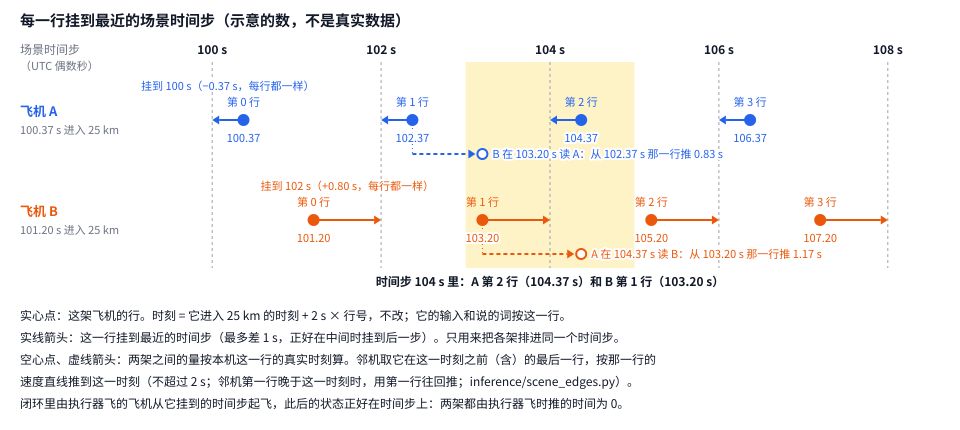

# 多机设计（两层模型第 7 阶段）

**一句话**：本设计把单机闭环扩成同一机场、同一时段的多机闭环。
单机闭环里，先验每 2 s 为一架飞机说一行词，这架飞机的执行器照词飞 2 s。
多机闭环里，先验看着场上别的飞机说话，每架飞机有自己的执行器，各飞各的。
飞机之间的规矩是不失去雷达间隔和尾流间隔。这条规矩在三处起作用：生成时做屏蔽，飞出的航迹上做事后检查，后训练里进奖励。
落地顺序不是单独的输出，由词的结果决定。
记录数据里交互的样本少：有前机的时间步只占 16.5 %（先验读数 §3）。
所以闭环训练另用扩充出来的多机场景：把别的航班按时间插进来，转动进入状态，压紧进入的间隔。

先验、后训练、词表、执行器各自的设计见[先验设计](prior_design.zh.md)、[后训练设计](post_training_design.zh.md)、
[指令词表设计](instruction_vocabulary_design.zh.md)、[执行器设计](executor_design.zh.md)。框架见[两层模型框架](two_tier_framework.zh.md)。
本文取代先验设计 §9 第 2–5 步和后训练设计 §1 第 3、4 项里关于多机的写法（那两处已改为指向本文，§6.0）。

**本文只写现行设计。**

- 各阶段的进度、运行日志、被取代的计划和测量叙述，在[设计日志](../history/multi_aircraft_design_log_to_2026-10-02.zh.md)（2026-10-02 从本文切出，原文照录）。
- 各阶段的状态和接手步骤，在[阶段记录](two_tier_stage_notes.zh.md)。
- 每项测量的数，在 `readouts/` 里对应的读数文档。本文只给指向它们的指针。
- 本文旧版的章节号和条号，在文末 §13「旧编号对照」里查。

约定：

- 文中路径相对 `4dTrajectory/`（`outputs/…`）或 `4dTrajectory/ts_transformer/`（`docs/…` 和包名）。仓库根目录的路径会写明。
- 单位只用米、米/秒、度、秒。规章原文里的 NM、ft 在引用处一次换成米（1 NM = 1,852 m，1 ft = 0.3048 m，`geokit`）。
- 代码名、文件名、字段名放在反引号里。
- 「来源标签」说明一项内容是谁定的，见 §0.2.7。

---

## 0 状态与术语

### 0.1 状态（每阶段一行）

状态值：完成 / 进行中 / 下一步 / 暂缓。「已合并」指提交已在 `dev-two-tier` 上（2026-10-02 用 `git merge-base --is-ancestor` 核过）。
逐阶段的详细进度、产物目录、数字，在阶段记录 §0、§9，不在这里重复。

| 阶段 | 状态 | 提交 | 读数（`readouts/`） |
|---|---|---|---|
| 设计 | 已确认。用户 2026-09-27 逐项回答 §9 第 1–16 项；之后的改动见 §9 第 17–35 项 | — | — |
| M0 测量（开发步 1–6，§6.4） | 完成，已合并。两条通过线（§3.4）都过：间隔作硬检查，两条间隔屏蔽处处硬用 | `852b395f`（步 1–4）、`6165c52a`（步 5）、`bd016193`（步 6） | `2026-09-27_parallel_runway_separation.md`（英文）、`2026-09-28_labelled_traffic.zh.md`、`2026-09-28_separation_masks.zh.md` |
| M1 看不看得到交互（§6.1） | 完成，已合并。只记录 | `fecac5b2` | `2026-09-28_m1_interaction.zh.md` |
| M2 场景预训练（§6.5） | 完成。scene 训了两次，没有学会用别的飞机；不再做场景预训练（§9 第 22 项） | `5d9c43bf`、`82b0af67`、`650078dd`、`17719c20`（步 1–4）、`31814869`（步 5）、`a7abbe86`（步 6） | `2026-09-28_m2_scene_prior.zh.md` |
| M3 起点模型在多机闭环里（开发步 1–5，§6.6） | 完成。「一架由模型指挥」设置在真实场景和扩充场景上各读一遍 | `de9a539a` | `2026-09-28_m3_free_generation.zh.md` §2、§4 |
| M4 多机后训练，「一架由模型指挥」（开发步 6） | 完成。第一次运行选中第 0 轮（起点模型）；第二次运行（每轮 3 遍）选中第 5 轮，即 traffic r5 | `0505ff48`、`54ef20e1`（代码）、`3976acbd`（第一次运行的提速）、`ce5b15c4`（第二次运行） | `2026-09-29_m4_traffic.zh.md`、`2026-09-30_m4_passes.zh.md` |
| 开发步 7.1–7.5 窗口内由模型指挥（§6.6） | 完成，已合并 | `2e11fcab`、`5c4f1a00`、`5eaf9e92`、`128f9476`（7.4 正式读数）、`3a5ed8c6`（7.5） | `2026-09-30_m3_window.zh.md` |
| 7.6 M4 在窗口里训练 | 完成。选中 window r5，验证集上没有站得住的好处；多机这一段的模型用 traffic r5（用户 2026-10-01 定，§9 第 30 项） | `cbfdc5f2`、`4ab15733`（读数程序） | `2026-10-01_m4_window.zh.md` §2、§5 |
| 7.7 倒回重说 | 完成，已合并。读法 2026-10-02 确认（§9 第 35 项） | `56612a1d`、`da8e925c` | `2026-10-02_window_rewind.zh.md` §2、§5 |
| 7.8 换训练方法 | 暂缓（用户 2026-10-02 定，§9 第 31 项）；回溯算法重新开始时与用户讨论 | — | — |
| 开发步 8.1–8.4 复飞的机制、奖励、训练、难事件 | 完成，已合并 | `2f2157e8`（8.1–8.3 的合并）、`ef2eeb54`（8.4） | `2026-10-01_go_arounds.zh.md`、`2026-10-02_step8_small_tests.zh.md` |
| 8.13 显卡小规模训练（选项 1，按组算优势） | 完成。模型自己仍不说复飞；选中第 0 轮 | `ef2eeb54` 上运行 | `2026-10-02_step8_gpu_option1.zh.md` |
| 8.13 找难事件，带难事件的小规模训练 | 进行中（显卡队列；进度看阶段记录 §9） | — | — |
| 8.14 我暂定、待用户确认的项 | 下一步：用户确认（§12.1） | — | — |

### 0.2 术语

一个术语只有一个意思，一个意思只用一个术语。
下面的表给出每个术语的唯一定义。右列「不用的说法」是旧文里出现过、本文不再用的同义说法。

#### 0.2.1 数据与场景

| 术语 | 定义 | 不用的说法 |
|---|---|---|
| 场景 | 同一机场、按绝对时间对齐的一组到达飞机的数据，每 2 s 一格（§2.1） | — |
| 时间步 | 场景里 2 s 的一格；场景的时间步取 UTC 秒数为偶数的时刻 | 单说「步」 |
| 行 | 一架飞机的句子里对应一个时间步的一行；每行六列 | — |
| 列 | 词表里的一个词槽。六列依次是跑道、进近、航向、高度、下降角、速度（词表设计 §2） | — |
| 词 | 一列在一行里的取值。「不变」也是一个词 | 指令 |
| 句子 | 一架飞机从第 0 行到落地前最后一行的全部词 | — |
| 说话 | 先验为一架飞机的一行选出六个词 | 说一行 |
| 预测步 | 一架飞机第 8 行起的时间步。前 8 行（`N_LOOK`，16 s）只观察，不说话 | — |
| 进入 | 一架飞机进入机场 25 km 范围。`entry_time_utc` 是进入的时刻 | — |
| 在场 | 一架飞机从第 0 行到越过入口前的最后一行的时间；背景飞机到它记录的最后一行 | — |
| 有句子的到达 | 标注器给出了句子的到达航班 | — |
| 背景飞机 | 没有句子的到达航班（标注器拒绝的）。只照记录回放，不说话，不算损失 | — |
| 段 | 从场上有飞机，到场上一架都没有的一段连续时间（§2.3） | — |
| 样本 | 预训练（teacher forcing）从段里切出的一段（§2.3） | — |
| 切口 | 一段被切成两个样本的位置（§2.3） | — |
| 前文 | 一个样本里只作输入、不算损失的那部分（§2.3） | — |
| 窗口 | 「窗口内由模型指挥」设置里，从一段连续场景截出的一个时间段（20 min，每 10 min 开一个，§2.2） | — |
| 闭环样本 | 闭环里被抽到、被说 `K` 次的一个单位：「窗口内由模型指挥」设置里是一个窗口，「一架由模型指挥」设置里是一架飞机的场景 | 用「窗口」指「一架由模型指挥」设置里的闭环样本 |
| `K` | 每个闭环样本被说的次数（M3 为 4，M4 为 8） | — |

#### 0.2.2 飞法与设置

| 术语 | 定义 | 不用的说法 |
|---|---|---|
| 由模型指挥 | 一种飞法：先验每 2 s 为这架飞机说一行词，它自己的执行器照词飞 2 s | 由模型说话、模型指挥 |
| 照标注的词飞 | 一种飞法：不用先验，它自己的执行器照标注器从这架飞机真实航迹读出的句子飞 | — |
| 照记录回放 | 一种飞法：不飞，每个时间步直接取记录里它在那一时刻的位置和状态 | — |
| 回放的飞机 | 照记录回放的飞机。它不对任何别的飞机作出反应 | 单说「回放」 |
| 设置 | 场景里每架飞机用哪种飞法的一套分配。三种：「照标注的词飞」「一架由模型指挥」「窗口内由模型指挥」（§2.2） | — |
| 回放门 | 执行器设计 §11 的门：把标注的句子交给执行器，看它能不能把飞机按原话飞到所指跑道上 | — |
| 在自己动力学上飞的航班 | 回放门里「自己的动力学」那一组（执行器设计 §11.3）：识别出的机型就是动力学机型，且公布了进近速度 | — |
| 「单独」读法 | M3 的一种读法：每架飞机单独放进它自己的场景，看不到任何别的飞机，没有间隔屏蔽，仍放在同一场景里判（§6.6 开发步 4、7.4） | — |

#### 0.2.3 间隔与判定

| 术语 | 定义 | 不用的说法 |
|---|---|---|
| 失去间隔 | 同一时刻的一对在场飞机，按 §3.2 判为间隔不足 | 冲突（7.7 的「事件」另有定义） |
| 雷达间隔 | 终端雷达间隔 3 NM（5,556 m，5-5-4 a、b） | — |
| 尾流间隔 | 按前后机的 CWT 类别查 TBL 5-5-1 或 5-5-2 得到的距离 | — |
| 垂直间隔 | 304.8 m（1,000 ft，4-5-1 a） | — |
| 规章要求的距离 | 两机成前后机时，规章至少要隔多远（`Separation.distance_nm`，含尾流类别） | 规章间隔、规章值 |
| CWT 类别 | 尾流分类 A–I（A 最重，7110.65BB 5-5-4）。机型到类别的表见 §3.2 | — |
| 读法 | 对规章的一种解释方式，也指判读一个数的方式。「我的读法」是我作的解释，不是规章原文 | — |
| IFR 读法 | 仪表规则照原文的失去间隔判法（§3.2） | — |
| 目视读法（`VISUAL`） | 默认有目视进近许可、从不默认目视间隔的判法（§3.2）。闭环的检查和奖励用它 | — |
| 五边 | 飞机落地前最后一段：沿跑道中线延长线、朝落地方向、沿下滑道下降到入口的直线。前面是三边（与跑道平行、逆着落地方向）和四边（与跑道成直角、转向五边）。详见先验设计 §1.1 和它的图 1 | 最后进近航线（只在词表设计里用） |
| 建立在五边上 | 执行器的截获状态（代码 `Lateral.captured`；判定把它读作 `established`）。许可在生效时，飞机开始截获转弯（转完正好落在中线上），或已在五边走廊里（离中线不超过 20 m + d·tan 0.45°，d 为离入口的距离），就置上，一直保持到复飞。标注器把许可放在截获转弯的起点。航迹与跑道航向差不超过 2° 是之后的跟踪状态（`Lateral.tracking`），不是这里的判据 | 截获、已截获（代码名、结局名 `crossed_without_capture` 和「截获转弯」除外） |
| 被引导 | 飞机还没建立在五边上，由航向词引导 | — |
| 直线进近 | 从跑道方向直接进来，不飞三边、四边的进近 | — |
| 进近时钟 | 把两机投到「落地方向」这条直线上量前后的办法（§2.5） | — |
| 前机、后机 | 同一条跑道（或当作一条的平行跑道）上，按进近时钟落地靠前的叫前机，靠后的叫后机。「有前机的时间步」另指：同一条跑道上有落地更早、离入口不超过 10 km（`LEADER_RANGE_M`）的飞机 | — |
| 一前一后 | 同一条跑道（或当作一条的平行跑道）上的一对前后机 | — |
| 汇合 | 两架都被引导，从两个方向汇合 | — |
| 判定 | 闭环每个时间步对每架飞机和每一对飞机做的检查，结果是结局 | — |
| 结局 | 一架飞机在闭环里的最后状态：落地、失去间隔、低于下滑道下沿、超时等。执行器判的结局见 `autopilot/judge.py` `OUTCOMES` | — |
| 被判结束 | 判定因失去间隔或低于下滑道下沿让一架飞机停止被说话、奖励记 0。「窗口内由模型指挥」设置里它继续飞（§6.6 步 7.3）。执行器判结束（落地、超时等）则离开场景 | 被结束、结束 |
| 负责的 | 一次失去间隔里，该由它调整、因而被判结束的那架（§3.4 第 1 层） | — |
| 余量 | 一对飞机在一个时间步上的 `m = max(水平距离 ÷ 所需水平间隔, 高度差 ÷ 所需垂直间隔)`（§6.6 步 8.9） | — |
| 通过线 | 一项测量的数达到它，设计才按原样往下用；没达到，就带着数回来找用户（§3.4） | — |
| 屏蔽 | 在先验选词时拿掉「说了必然违规」的词。三种：相容规则、程序高度屏蔽、间隔屏蔽 | 遮盖 |
| 相容规则 | 词表规定的一行里各列的词必须互相合得上的规则（`instructions.grammar`，词表设计 §4.4） | — |
| 程序高度屏蔽 | 按程序高度下限拿掉不许说的高度词和下降角词（后训练设计 §3，`prior/procedure.py`） | — |
| 间隔屏蔽 | §3.4 第 2 层的两条屏蔽：速度词屏蔽、进近许可屏蔽 | — |
| 兜底 | 所有速度词都保不住间隔时，速度屏蔽什么都不屏蔽（§3.4，§9 第 20 项） | — |
| 事后检查 | 每飞完一个时间步，对每一对在场飞机做的失去间隔判定（§3.4 第 1 层） | — |

#### 0.2.4 模型与训练

| 术语 | 定义 | 不用的说法 |
|---|---|---|
| 单机模型 | 每个场景只放一架飞机的先验：base、landing、augmented（格式 `ts-prior-checkpoint-v3`） | — |
| base | 只用数据训练的先验 | — |
| landing | base 按落地强化（第一阶段） | — |
| augmented | landing 在扩充起点上、开着程序高度屏蔽再强化（第二阶段，采用） | — |
| scene | M2 的场景预训练模型（格式 v4）。不再做 | — |
| traffic | 多机后训练的模型（格式 v5）：单机模型加每层一个交通注意力 | — |
| window | 7.6 在窗口里训练出的模型 | — |
| r5 | 一次后训练运行的第 5 轮。「traffic r5」指 `outputs/POOLED/prior/m4_passes_20260929/traffic_s1337/round_05`，「window r5」指 `outputs/POOLED/prior/m4_window_20260930/window_s1337/round_05` | — |
| 起点模型 | M4 开始训练时的模型：augmented 加每层一个输出初始为零的交通注意力 | — |
| 边特征 | 场上任意两架飞机之间的一组关系量，每个有序对每个时间步一组（§2.5） | — |
| 飞机轴 | 模型里放「这个样本出现过的每一架飞机」的那一维 | — |
| 交通注意力 | 每层里只读同一时间步别的飞机的一条注意力，输出层初始化为零（§2.5） | — |
| `A_max` | 一个样本或窗口里出现过的飞机架数的最大值（§2.3） | — |
| M0–M4 | 多机的五个阶段（§6.1） | — |
| 开发步 | §6.4、§6.5、§6.6 里按顺序编号的开发步骤，写作「开发步 N」。§6.6 里开发步 N 的第 m 项（子步或条）写作「步 N.m」 | 单说「第 N 步」 |
| 子步 | 开发步 7 的 7.1–7.8、开发步 8 的 8.1–8.4 | — |
| 条 | §6.6 里的编号项：步 6.1–6.14、7.7.1–7.7.14、7.8.1–7.8.4、8.5–8.14 | — |
| 轮 | 后训练的一轮：先说出本轮的句子，再在这些句子上更新 | — |
| 遍 | 一轮里对同一批句子过的一次更新（`--passes`） | — |
| 优势 | 一句的奖励减去它所在组的平均奖励 | — |
| 截断的比 | 新旧模型对同一个词的概率之比，截在 [1 − ε, 1 + ε]（ε = 0.2，后训练设计 §2） | — |
| 拉回项 | 按采到的词估计的、离 base 的 KL（屏蔽后的分布） | — |
| 数据项 | 训练集运行日真实场景上的 teacher forcing 损失 | — |
| 配对标准误 | 两轮之差的标准误 √(b + c) ÷ n（§6.2） | — |
| 护栏 | 选轮时排除变差的轮的规则（§6.2） | — |
| 读数 | 一次测量的结果，及写它的 `readouts/` 文档 | — |
| 门 | 一项通过或不通过的检查。本文的门先只记录结果，用户另定时才作停下的条件（与前几个阶段相同） | — |

#### 0.2.5 扩充

| 术语 | 定义 | 不用的说法 |
|---|---|---|
| 扩充场景 | 由真实场景按 §5.2 的四种做法造出的场景。只进闭环，不进 teacher forcing | — |
| A 按时间插入 | 取另一架航班，挪到原场景里的某个时刻进入 | 插一架 |
| B 起点扩充 | 对一架飞机的进入状态做第二阶段的变换（绕机场转 ±15°、高度 ±150 m、速度 ±5 %） | 挪起点 |
| C 流量压紧 | 把一段里各架的进入时刻相对段的开始乘一个系数 | 压紧流量 |
| D 挪前机 | 把本机的回放的前机整段提前或推后 δ 秒 | 挪前机 |
| 合格检查 | 扩充后检查场景「像数据」；不合格就重抽（§5.3） | — |

#### 0.2.6 复飞与倒回重说

| 术语 | 定义 | 不用的说法 |
|---|---|---|
| 进近列 | 六列之一，三个值：未许可、许可加入、复飞（词表设计 §2.2） | — |
| 许可加入 | 进近列的值：此后由执行器转上所指跑道的五边并沿线飞 | 已许可 |
| 复飞 | 进近列的值：放弃一次进近着陆（§6.6 步 8.12） | — |
| 跑道锁 | 执行器的状态：说了许可加入以后，跑道列不许换，到复飞才解锁（`Executor.runway_locked`） | — |
| 进近高度 | 复飞时所指跑道最后进近定位点处下滑道的高度（`RunwayProcedure.entry_m`，MSL） | — |
| `T_需` | 执行器自己的复飞爬升从复飞那一刻的状态爬到进近高度要的时间（§6.6 步 8.9） | — |
| 试探 | 训练时每个窗口 8 次里的最后 4 次叫试探句子。其中满足条件的飞机，在它与别的飞机的余量低于 1.5 的那个时间步，闭环替它说复飞（§6.6 步 8.10） | — |
| 代说 | 闭环替模型说一个词（这里是复飞）；被替的那一格不是模型采出来的 | — |
| 试探增益 | 一句代说的奖励减去同一架不试探的几句的平均奖励 | — |
| 难事件 | 7.7 里「从头」8 次都救不回来的事件（§6.6 步 7.7、8.11） | — |
| 事件 | 7.7 里一对飞机的一段连续失去间隔（§6.6 步 7.7 第 4 条） | — |
| `t_L` | 一个事件的时刻：这一段的第一个时间步 | — |
| 档 | 7.7 里从哪个时间步重新说：`t_L` 之前 10、30、60、120 s，或「从头」 | — |
| 从头 | 7.7 的一档：重新说的那架从它的第一个预测步重新说 | — |
| 重新说 | 7.7 里一架飞机从分叉的那一步起，由模型自由说到底；分叉之前照它原来的词 | — |
| 给定的词 | 直接写入、不采样、不过屏蔽的词（7.7 的原词） | — |
| 救回来 | 7.7 里同时满足三条（§6.6 步 7.7 第 10 条）的一次重新说 | — |
| 对方 | 7.7 里一次失去间隔的一对中，不是「负责的」的那架（由模型指挥的才算） | — |
| 两架都负责 | 一次失去间隔把两架都判结束 | — |

#### 0.2.7 来源标签

| 标签 | 含义 |
|---|---|
| 用户 YYYY-MM-DD 定 | 用户在那天明确决定。每项决定在 §9 有编号 |
| 按建议做 | 用户没有逐项定；照本文写的建议做，有变再找用户（§8） |
| 我暂定 | 我先定了一个值或做法，等用户确认（§12.1） |
| 我的读法 / 我的估算 | 我对规章或数的解释或估算，不是规章原文，也不是用户的决定 |
| 〔待核〕 | 旧文前后不一致或有歧义的地方。重构时标出的 8 处已按用户后来的决定核清（§12.2）；旧的写法留在设计日志 |

---

## 1 目标与边界

### 1.1 要回答的四件事（用户 2026-09-26）

1. **多机情境**：场景里放哪些飞机；闭环里哪些由模型说话，哪些照记录回放；样本怎么切（§2）。
2. **数据扩充**：记录里的交互少，怎样造出「情况真实、但更挤」的多机场景来训练（§5）。
3. **交互约束**：飞机之间要守什么；最小距离怎么定；相对速度起什么作用；怎样用（§3）。
4. **落地排序**：谁先落，隔多久；模型怎样决定；怎样读（§4）。

### 1.2 不影响现行后训练（硬规矩）

1. **不改**以下各项：
   - `autopilot/`：只按用户定的改（开发步 8 的两处，步 8.7，§9 第 32 项）。改动后，执行器必须照样飞出规格的参照航迹（执行器设计 §12.3 的核对）；句子产物、规格、训练、读数都不重跑。
   - `instructions/`：在标注器指纹里。
   - 句子产物 `instruction_language/v5_20260926`。
   - 执行器规格 `executor/v11_20260927`。
   - base、landing、augmented 的检查点。
2. **多机的执行器就是现在的执行器**：每架飞机一个，互不知道对方。飞机之间的一切在先验这一侧（输入、屏蔽）和 runner 里的检查。
3. **新代码放新模块、新 runner**。单机的 runner（`prior_free_generation`、`prior_landing_reward`、`prior_augmented_reward`）和它们的读数逐位不变，由测试核对。
4. **模型结构的改动**（边特征变多）用新的检查点格式名（§2.5）。现行的单机检查点照旧能读，照旧逐位相同地生成。
5. **GPU 与内存**：M0、M1 用 CPU。训练（M2 起）用 GPU，一次只跑一个，由管实验队列的代理按 PID 看着。
6. **提交**：本文直接提交到 `dev-two-tier`。代码走新的工作树分支（建议名 `dev-multi-aircraft`），每一步 opus 审查，用户合并。

### 1.3 沿用的规矩

1. 输入只给「说这一步之前管制员能知道的」。不给钟点和风。
2. 数据按运行日划分。训练只用训练集运行日。选轮用内部选择集。验证集每个阶段定稿后只读一次。**测试集运行日一架都不读**：不进场景，不作插入的来源，不进落地统计。
3. 程序或规章算出来的航迹不当模型的答案。屏蔽只拿掉「说了必然违规」的词，剩下的仍由模型选。规则排序器只作对照（§4.2）。
4. 规章数值取自原文并注明条款（`docs/literature/arrival_separation/README.md`，下称「间隔文献」）。由它推出来的量标明「我的读法」。
5. 比数据「更安全」就离开了数据。每一个间隔读数，都与同一批场景的观测航迹、按同一个检查量出的比例并排。

---
## 2 多机情境

### 2.1 场景里有谁

场景（先验设计 §3.2）：

1. 场景是同一机场、按绝对时间对齐、2 s 一个时间步的一组到达飞机。
2. 某架飞机第 r 行的时刻 = 它进入 25 km 范围的时刻（`entry_time_utc`）+ 第 r 行在句子里的时间。
3. 场景索引与分段已实现：`prior/scene.py` `SceneIndex`、`segments`。

**每一行挂到哪个时间步**（用户 2026-09-27 定，§9 第 13 项；图 1）

**为什么要挂**：

1. 每架飞机的行从它自己进入 25 km 范围的时刻起，每 2 s 一行。
2. 进入时刻是记录给的，精确到毫秒，各架都不一样。所以两架飞机的行一般不在同一组时刻上。
3. 例（图 1）：A 在 100.37 s 进入，它的行在 100.37、102.37、104.37 s……；B 在 101.20 s 进入，它的行在 101.20、103.20、
   105.20 s……。A 和 B 没有一行在同一时刻。
4. 场景要回答「某一时刻场上有哪几架」。所以先要把各架的行排进同一组时刻，这就是「挂」。

**怎么挂**（代码 `prior/scene.py` `hang`）：

1. 场景的时间步是 UTC 秒数为偶数的时刻：……100、102、104、106 s……。
2. 每一行挂到离它最近的那个时间步。正好在两个时间步中间时，挂到后一个。
3. 所以一行挂到的时间步离它的真实时刻最多 1 s。
4. 同一架飞机的每一行挪的一样多：图 1 里 A 的每一行都挂到早 0.37 s 的时间步，B 的每一行都挂到晚 0.80 s 的时间步。
5. KRDU 24,202 架，平均挪 0.51 s。

**挂只决定一件事**：某个时间步场上有哪几架。例：时间步 104 s 里有 A 的第 2 行（真实 104.37 s）和 B 的第 1 行（真实 103.20 s）。
在同一个时间步里谁先说，按 §2.6。

**其余都按每一行的真实时刻，挂不改它们**：

1. **本机的输入和说的词**：按它自己的行。行号、位置编码、「前 8 行只观察」都按它自己句子里的行号（下一段）。
2. **模型输入里关于邻机的量（边特征，§2.5.5）**：在本机这一行的真实时刻算。
   - 邻机取它在这一时刻之前（含这一时刻）的最后一行。即：邻机挂在同一时间步的那一行，不晚于本机这一行时就用它，否则用它的上一行。
   - 按那一行的速度，把邻机直线推到本机这一行的真实时刻。推的时间不超过 2 s。
   - 邻机刚进场、在这一时刻之前还没有行时，用它的第一行往回推（至多一个时间步；§2.5.5 第 5 条）。
   - 例（图 1，时间步 104 s）：A 的行在 104.37 s，B 在这之前的最后一行在 103.20 s，把 B 推 1.17 s；B 的行在 103.20 s，A 在这之前的最后
     一行在 102.37 s，把 A 推 0.83 s。
3. **失去间隔的判定和读数**：不是模型的输入。照记录回放的飞机，按它的记录插值到要比的时刻。
4. **闭环里由执行器飞的飞机**：从它挂到的那个时间步起飞，此后每个状态都正好在场景的时间步上。它的开头因此挪了不到 1 s（就是挂的那一点）。
   它们之间的量不用推，推的时间为 0（§2.5.5 第 4 条）。

**为什么不改成重新取行**（所有飞机的行都取在偶数秒上；§9 第 13 项）：

1. 取行的代码 `instructions/signals.py` 在标注器的指纹里。改了就要重新测量词表规格、重建执行器规格，现有的先验也打不开（C34）。
2. 对单机模型，新取的行只是起点挪了不到 2 s，没有新内容。
3. 也不把整条航迹的时间标签挪到偶数秒：那样同一时间步上两架的位置会差到 2 s 的飞行（同一条五边上约 140 m）。挂加上按真实时刻推，只差几米：直飞不到 1 m，以 3°/s 转弯约 7 m（§2.5.5 第 3 条的估算）。



*图 1*：每一行挂到最近的场景时间步（示意的例子，不是真实数据）。实心点是各架的行，实线箭头是它挂到的时间步；黄色一列是挂到时间步 104 s 的那些时刻（103–105 s），
空心点是算边特征时把邻机推到本机这一行真实时刻的位置。图由 `python run_ts.py scene_step_figure` 画出，挂步用 `prior.scene.hang`，
推的规则与 `inference/scene_edges.py` 相同（`tests/test_scene_step_figure.py` 核对）。

**每架的行号是它自己句子里的行号**。位置编码、「前 8 行只观察」、落地前的最后一行，都按这架自己的行号算。它挂在场景的哪个时间步，不影响行号。

**在场的飞机**：

- 有句子的到达航班：要对它说话。
- 没有句子的到达航班（标注器拒绝的）：只作背景飞机，照记录回放，不说话，不算损失。
- 离场与飞越：不放（先验设计 §10 已定，读数里注明）。
- 有句子、但执行器飞不了的航班（机型没有动力学，契约 C31）：teacher forcing 里照样说话、算损失。闭环里只能照记录回放。读数里数出有多少。

**进入是数据给的**：

1. 每架飞机何时、在哪、以什么状态进入 25 km 范围，都取自记录。这就是「交通需求」。
2. 模型管的是进入以后说什么。
3. 每架的前 `N_LOOK` = 8 行（16 s）只观察，与单机相同。

### 2.2 闭环里每架飞机由谁指挥：三种设置

单机闭环里只有一架飞机。多机场景里同时有好几架，每一架都要先定下它这一步怎么动。
飞法只有三种：

- **由模型指挥**：先验每 2 s 为它说一行词，它自己的执行器照这些词飞。这是要训练、要评判的对象。
- **照标注的词飞**：不用先验。它自己的执行器照标注器从这架飞机真实航迹读出的句子飞（与回放门的飞法相同）。
- **照记录回放**：不飞。每个时间步直接取记录里它在那一时刻的位置和状态。别的飞机的输入要用到它「说过的词」时，取它标注的词。回放的飞机不对任何别的飞机作出反应：由模型指挥的飞机离它再近，它也照记录走。

背景飞机只能照记录回放。有句子的到达用哪一种飞法，由下表的设置决定：

| 设置 | 由模型指挥的 | 照标注的词飞的 | 照记录回放的 | 要回答的问题 |
|---|---|---|---|---|
| **照标注的词飞** | 没有 | 场景里每一架有句子的到达 | 背景飞机 | 执行器自己会不会让飞机失去间隔（§6 的 M0） |
| **一架由模型指挥** | 选定的一架 | 没有 | 其余所有飞机 | 模型能不能在真实的交通里把一架飞机安全带下来 |
| **窗口内由模型指挥** | 一个窗口里新进入 25 km 范围、有句子的每一架 | 没有 | 窗口开始时已在空中的飞机、背景飞机 | 模型能不能同时指挥几架：谁先落，谁让谁 |

**「照标注的词飞」设置**：

1. 模型不参与。
2. 标注的词是从真实航迹读出来的。但执行器飞得和真实飞机不完全一样：转弯的快慢、到达某一点的时刻都有差别。
3. 几架飞机合在一起，会在真实飞机从没失去间隔的地方失去间隔。
4. 先在这个设置下量出执行器自己造成多少，后面才不会把它算到模型头上（§3.4 第 0 步）。

**「一架由模型指挥」设置**：

1. 每架有句子的航班轮流当一次由模型指挥的那一架，其余飞机照记录回放。所以样本数与单机相同，而这架飞机看到的是真实的邻机。
2. 邻机照记录走，不会让路。所以失去间隔时，只问由模型指挥的这一架有没有责任。谁负责按 §3.4：
   - 两架都已建立在同一条五边上（一前一后）：规章把间隔的要求放在后机身上（间隔文献 §2.1、§7 第 3 行：前机过入口时，后机要离开多远）。由模型指挥的这架是后机时，它失去间隔就被判结束。它是前机、后机是回放的邻机时，邻机不会调整，这一对只记为读数。
   - 一架已建立在五边上，另一架还在被引导（要切进来）：切进来的那架负责。
   - 两架都还在被引导（从两个方向汇合）：两架都有责任，由模型指挥的这架被判结束。
3. 这个设置先做（用户 2026-09-27 定，§9 第 2 项）。出了问题，只会出在模型怎样应对真实的邻机上。

**「窗口内由模型指挥」设置**：

1. **窗口**：从一段连续的场景（§2.3）里截出一段时间。
   - 在这段时间里进入 25 km 范围、有句子的到达，全部由模型指挥。
   - 窗口开始时已经在空中的飞机，整段照记录回放。
2. 这样截，是为了不在半空中接管一架已经在飞的飞机。每架由模型指挥的飞机都从它自己的第 8 行开始，与单机相同。
3. 窗口前后重叠地铺满一段：建议每 10 分钟开一个 20 分钟长的窗口，让每架航班都在某个窗口里由模型指挥一次。长度与重叠等 M0 量完段长后定（§8）。
4. 两架都由模型指挥时，谁负责按 §3.4：
   - 同一条五边上一前一后：后机被判结束。
   - 一架要切进另一架已在的五边（同一条或平行的）：切进来的那架被判结束。
   - 两架都还在被引导的汇合：两架都被判结束。
5. 一架由模型指挥、一架照记录回放时，照上一个设置的规矩。

**三种设置共同的规矩**：

- **结局**：由模型指挥的飞机和照标注的词飞的飞机，各自判定。判定 = 执行器判定的结局（`autopilot/judge.py`），加上「低于下滑道下沿」和新的「失去间隔」（§3.4）。回放的飞机从不被判结束，也不算违规。
- **时限**：真实场景与执行器规格相同（观测剩余时间 × 1.5）。扩充场景 × 2.0，与第二阶段的扩充起点相同（`prior/augment.py` `TIMEOUT_FACTOR`）。
- 一个场景在它所有由模型指挥（或照标注的词飞）的飞机都结束时结束。

### 2.3 预训练（teacher forcing）的样本怎么切

**段**：

1. 一架飞机「在场」，从它的第 0 行（进入 25 km 范围）到它越过入口前的最后一行。背景飞机到它记录的最后一行。
2. 把同一机场的航班按进入的先后排开。一架航班在当前这一段结束之前进入，就归进这一段。否则从它开一段新的（`prior/scene.py` `SceneIndex.segments`）。
3. 所以一段是「从场上有飞机，到场上一架都没有」的一段连续时间。中间任何时刻场上都至少有一架。

**段有多长**（先验读数 §3，训练集运行日，五个机场）：

- 每段航班数的中位数 1–3 架。
- 段长的中位数 8–12 分钟，p90 18–47 分钟，最长 67–209 分钟。
- 最长的段有三个多小时，不能整段放进一个样本，所以要切。

**切法**（图 2）：

1. 段长不超过 20 分钟：整段是一个样本。
2. 段更长：从这一段的开头量起，在第 15 分钟到第 20 分钟之间（两头都算），逐个时间步（2 s）数场上有几架飞机，背景飞机也算。在架数最少的那个时间步切一刀。架数最少的时间步不止一个时，取最早的。切口那个时间步归后一个样本，刀前的时间步是一个样本。
3. 从这一刀起，把剩下的部分当成新的一段，再按第 1、2 条做：
   - 剩下的不超过 20 分钟：整个作最后一个样本。
   - 否则：从这一刀量起，在第 15–20 分钟之间找架数最少的时间步，再切一刀。如此直到切完。

每个样本算损失的时间：除最后一个外都是 15–20 分钟，最后一个不超过 20 分钟。样本的输入还要加上下面说的前文，所以输入比这更长。
在架数最少的时候切，是为了让被一刀切开的航班尽量少。

**被切开的航班**（图 2 的 D、H）：在切口之前已经进入、切口那个时间步还在场的航班，一部分在刀前，一部分在刀后。

- 恰好在切口那个时间步进入的航班，整个在后一个样本里，不算被切开。
- 最后一行恰好在切口那个时间步的航班，算被切开。它的最后一个时间步在后一个样本里算损失。

被切开的航班这样处理：

1. 在前一个样本里：它从第 0 行到切口前一个时间步照常算损失。
2. 在后一个样本里：它切口之前的位置和标注的词只作前文（输入），让模型知道它从哪里来、已经被说了哪些词。损失从切口那个时间步算起。
3. 所以后一个样本的时间从这些航班的第 0 行开始，比切口早。切口前的这一段在两个样本里都出现，但只在前一个样本里算损失。
4. 切口之前已经离开的航班不进后一个样本。所以在后一个样本的前文里，被切开的航班看不到它们当时的邻机。这也是要在架数最少的时候切的原因。

背景飞机在任何样本里都只作输入，不算损失。只有一架飞机的段照样作样本，因为场景模型也要会说单机的话。

**一个样本最多放几架**：

1. 模型的飞机轴放的是这个样本里**出现过的每一架**（每架占一个位置，整段时间都是它的），不是同时在场的架数。
2. 同时在场最多 8 架（普查）。但一个 20 分钟的样本里先后出现的航班可以多得多。
3. `A_max` 由 M0 量：训练集运行日每个样本、每个闭环窗口（同样按「出现过的每一架」数）的架数的最大值。
4. 内部选择集、验证集超过 `A_max` 时报错，不悄悄丢掉飞机。
5. M0 的量：各机场 11–18，KRDU 18（`outputs/POOLED/traffic/census_20260927/census.json` 的 `A_max`，已核）。


*图 2*：一段 49 分钟的场景（示意的例子，不是真实数据）。

- 上面三条横线是三个样本。实线是算损失的时间，虚线是只作前文的时间。
- 中间每一行是一架飞机在场的时间。颜色是它这几步的损失算在哪个样本里。斜线表示切口前的这几步在下一个样本里只作前文。虚框是背景飞机。
- 下面的折线是场上的架数。黄色是每一刀的查找范围（从这个样本算损失的起点，即段的开头或上一刀，量起的第 15–20 分钟）。红色虚线是切口。
- 图由 `python run_ts.py scene_sample_figure` 按上面的切法算出切口后画出（`experiments/scene_sample_figure.py`）。`tests/test_scene_sample_figure.py` 核对文档里的图就是它画出的样子。

### 2.4 闭环的样本

- **真实场景**：从训练集运行日的段里，按 §2.2 的设置取闭环样本。每轮换种子抽闭环样本。内部选择集、验证集各一套固定的闭环样本（固定种子）。
- **扩充场景**：见 §5。
- **每个闭环样本说 `K` 次**（不同种子）。同一闭环样本的 `K` 次互相比（§6.2 的优势）。

### 2.5 模型输入的改动：边特征

#### 2.5.1 边特征是什么

模型把同一时间步场上的飞机看成一张图：每架飞机是一个「点」，任意两架之间有一条「边」。

- **点**上放这架飞机自己的输入：位置、高度、速度、运动方向，以及已经对它说过的词（先验设计 §4）。
- **边**上放两架飞机之间的关系。例如「j 在 i 正前方 6 km，比 i 低 300 m，正以 5 m/s 接近 i，两架落同一条跑道」。这些量不属于任何一架飞机自己，只有成对看才有。这组数叫边特征。
- **边有方向**：i → j 是「从 i 看 j」（j 在 i 的坐标系里在哪）。j → i 反过来，两组数不一样。
- 每个时间步、每一对飞机都有一组。A 架飞机有 A × A 组，包括每架对自己的那一条。
- 边特征只用第 t 个时间步及以前的数据算，模型看不到未来。

#### 2.5.2 模型怎么用边特征

模型每一层有一次「同一时间步各架飞机之间的注意力」（`prior/model.py` `SceneLayer.extend`）。每层的顺序是：沿时间的因果注意力 → 同一时间步各架飞机之间的注意力 → 前馈（先验设计 §6）。

飞机 i 在这个时间步看场上的每一架 j：先给每架打分，决定看谁看得多；再把看到的内容按分数加权，读进自己。边特征在这里用两次：

1. **决定看谁**（`edge_bias`）：一个小网络把 i → j 的边特征变成每个注意力头一个数，加到 i 给 j 的打分上。模型因此能学会：同一条五边上、紧挨在前面的那架多看；30 km 外、落另一条跑道的那架少看。
2. **读到什么**（`edge_value`）：另一个小网络把边特征变成一个向量，加到 i 从 j 读到的内容里。i 读到的因此不只是「j 自己在哪、飞多快」，还有「j 相对我在哪、我们在接近还是在拉开」。

**为什么直接给关系，不让模型从两架的状态里自己算**：

1. 每架飞机自己的输入是机场坐标系里的位置和速度。
2. 要知道「j 在我前面多远」，得把两架的位置相减，再转到 i 的运动方向上。
3. 注意力靠两个向量的点积打分，很难做这种相减和旋转。
4. 文献的结论也是：相对的几何量要直接放进被读取的值里（MTR++ 表 10）。用绝对坐标表示交互，比不给还差（先验设计 §4.4、§11）。

#### 2.5.3 两种用法

- **M2 的场景模型 scene**：边特征进上面那个「同一时间步各架之间的注意力」，与「读自己」在同一个 softmax 里。已训两次，没用上别的飞机（M2 读数 `readouts/2026-09-28_m2_scene_prior.zh.md`）。不再往下用。
- **从 M3 起（多机后训练的模型 traffic，§6.2）**：
  1. 单机模型的每一层原样不动。
  2. 在「同一时间步各架之间的注意力」之后，加一个**交通注意力**。它只读同一时间步在场的**别的**飞机，不读自己。边特征的用法同上（决定看谁 + 加进读到的内容）。
  3. 它输出的那一层**没有偏置，权重初始化为零**。没有偏置：场上只有自己时读到的永远是 0，学过以后也一样。第一次审查发现偏置从第一个时间步起就有梯度。
  4. 所以一开始交通注意力的输出正好是 0。整个模型对每架飞机说的与单机模型对它单独说的**相同**，只差浮点舍入。原因：几架放在一批里，求和的顺序与一架时不同。差值是双精度 1e-15，augmented 的 logit 在 float32 下 1.2e-5。单机模型自己换这两种排法也差这么多。
  5. 某个时间步场上没有别的飞机时，它的输出也是 0（不是一行全被遮住的注意力）。

**为什么不能只把边特征那几层置零**：

1. 单机模型里「同一时间步各架之间的注意力」对在场的每一架做 softmax。
2. 场上只有自己时，权重全在自己身上。
3. 只要多一架，哪怕边特征全是 0，权重也会分给它，单机模型的输出就变了。
4. 所以读别的飞机必须是另外一条路，起点时这条路的输出正好是 0。

这是给已训好的网络加新输入的常见做法：Flamingo 的门控交叉注意力、ControlNet 的零卷积。新加的一路从 0 起，训练开始时不破坏原网络。
输出层从 0 起时，它自己的梯度不为 0（读到的内容乘上游梯度），所以它先动起来，里面的层随后跟上。

#### 2.5.4 边特征表

现行的 base、landing、augmented 都是单机模型，每个场景只有一架飞机。飞机之间的注意力只读到自己，所以边特征只有「是不是自己」一项（`prior/model.py` `SINGLE_EDGE_FEATURES`）。
多机模型加下表各项。每对飞机 i → j、每个时间步，只用 t 及以前的数据。共 17 维。

| 边特征 | 怎么算 | 缩放 |
|---|---|---|
| 是不是自己 | i = j 时为 1，否则为 0 | — |
| 相对位置 | 在本机坐标系里（原点本机，轴沿本机运动方向）j 的前后、左右、高度差 | 前后、左右 asinh(÷ 5,556 m)，高度差 ÷ 1 km |
| 进近时钟上的前后 | 按落地的先后，j 在 i 前面（正）还是后面（负）、隔多远；算法见 §2.5.6 和图 3 | asinh(÷ 5,556 m)；两机生效跑道的方向不同、或有一架还没有生效跑道时，记 0 并把标志位置 1 |
| 两条生效跑道的关系 | 同一条 / 当作一条的平行跑道 / 相关平行跑道 / 独立平行跑道 / 无关（`Separation.relation`，按 FAA 间距划分，间隔文献 §7） | 五种关系各占一位：是哪一种，哪一位为 1，其余为 0 |
| 接近速度 | 由两机过去两行的位置差算出的相对速度在连线上的分量（正为接近） | ÷ 100 m/s |
| 运动是否未知 | 本机或 j 这一行是它的第一行（没有上一行，算不出运动）时为 1。这时接近速度与最近点记 0。本机没有运动时前后、左右也记 0 | 0 / 1 |
| 最近点 | 两机都按此刻的速度直飞时，水平距离最近的时刻，和那时的水平、垂直距离（常说的 CPA，「最近接近点」）。时刻截到 [0, 120] s | 时刻 ÷ 120 s，水平距离 asinh(÷ 5,556 m)，垂直距离 ÷ 1 km |
| 规章要求的距离（给，用户 2026-09-27，§9 第 6 项） | 两机若成前后机，按规章至少要隔多远（`Separation.distance_nm`，含尾流类别，机型按 §3.2 的 CWT 表查） | asinh(÷ 5,556 m)，与进近时钟相同 |

维数分解：是不是自己 1、相对位置 3、进近时钟上的前后与「不可比」标志 2、跑道关系 5、接近速度 1、最近点 3、运动是否未知 1、规章距离 1。

#### 2.5.5 边特征在哪个时刻算，速度从哪来

**在哪个时刻算**：按本机这一行的真实时刻（§2.1）。

1. 邻机的位置和速度取它在这一时刻之前的最后一行，按那一行的速度直线推到这一时刻。
2. 推的时间不超过 2 s，只用过去的数据。
3. 直飞时推的误差不到 1 m，以 3°/s 转弯时约 7 m（我的估算）。
4. 闭环里由执行器飞的飞机都在场景的时间步上，推的时间为 0。回放的飞机仍按它自己的行推。
5. 邻机刚进场、还没有更早的行时，它的第一行往回推到本机的时刻（至多一个时间步）。

**速度从哪来**：

1. 每架飞机每一行的速度 = 从上一行到这一行的位移 ÷ 两行的时间差。水平、垂直、进近时钟上的前进都这样算。这与先验自己的节点输入同一口径（`prior/data.py`）。
2. **不用信号里的地速、航迹、升降率**。那些是以这一行为中心的最小二乘拟合，含这一行之后 7.5 s 的数据。用它们会把本机接下来要转的弯漏进本机坐标系、接近速度和最近点。
3. 一架飞机的第一行没有上一行：它的运动记为未知（「运动是否未知」置 1），邻机按不动推，本机没有坐标轴。
4. 两行位置相同时，本机也没有坐标轴。训练、val 与内部选择集里 1,205 万对相邻行中有 89 对（`inference/scene_edges.py` 的模块说明、`docs/reference/runners.md` R29 也记了这个数）。
5. 生效跑道在两行之间换了的那个时间步，进近时钟上的前进速度记 0。

#### 2.5.6 进近时钟上的前后

**它回答什么**：按落地的先后，j 在 i 前面还是后面、隔多远。

- 同一条跑道（或当作一条的平行跑道）上的间隔规章量的就是这个：前机过入口时，后机沿航道离入口还有多远（间隔文献 §2.1、§7）。
- 相关平行跑道的对角间隔，`runway_schedule` 也换成了沿航道要错开的距离。

**怎么算**：把两架飞机都投到「落地方向」这条直线上，看谁更靠前。

1. 每架飞机在这条线上的位置 = 它生效跑道的入口在这条线上的位置 − 它沿航道离这个入口还有多远。
2. 前后 = j 的位置 − i 的位置。正数表示 j 在前。
3. 入口在这条线上的位置是 `runway_schedule.Separation.along_nm`（单位是海里，换成米再减）。以机场里按名字排第一的跑道的入口为原点。原点取在哪里都不影响两机之差。
4. 离入口还有多远，沿跑道的航道方向量：`instructions.airport.relative_to_runway` 的 `before_threshold_m`，标注器用的同一个函数。
5. 两架落同一条跑道时，两个入口的位置相同，前后就是两者离入口的距离之差。

**为什么要加上入口的位置**：两条平行跑道的入口常常不齐。

- 图 3 的例子：23L 的入口沿落地方向比 23R 的靠前 1,240 m（KRDU 这两条跑道的错位，`runway_schedule` 的模块说明）。
- i 沿航道离 23R 的入口 8,000 m，j 离 23L 的入口 6,000 m。
- 只拿两个距离相减得 2,000 m。把入口的错位算进去，j 实际在 i 前面 3,240 m。

**为什么叫「时钟」**：`runway_schedule` 排落地时间时用的是时间。它把这个位置按进近速度换成「飞过同一个原点的时刻」（`approach_time_s`）。两机的时刻差乘以速度，就是这里的距离差。边特征直接用距离。

**它只在两架都在（或快到）五边上时才等于落地的先后**：

- 还没转上五边的飞机（例如在三边上逆着落地方向飞），投到这条线上只是它此刻的几何位置，不代表它还要多久才落地。
- 这时模型要靠相对位置和对方已经说过的词来判断先后。

**记 0 的情形**：

1. 两机生效跑道的方向不同：航道相差超过 10°（`runway_schedule.parallel_relations` 的 `max_course_diff_deg`）。
2. 其中一架还没有生效跑道：它的前 8 行只观察，还没有对它说过跑道。
3. 这两种情形下这一项记 0，并把标志位置 1。


*图 3*：进近时钟上的前后怎么算（示意的例子；两条跑道的横向间距不按比例）。

- 两架飞机和两个入口都投到下面这条沿落地方向的轴上。前后就是两架在轴上的位置之差。
- 图由 `python run_ts.py approach_clock_figure` 画出（`experiments/approach_clock_figure.py`）。
- `tests/test_approach_clock_figure.py` 核对文档里的图就是它画出的样子，并核对图里用的两个约定与代码一致：`along_nm` 是入口沿落地方向的位置，`before_threshold_m` 是沿航道离入口还有多远。

#### 2.5.7 缩放

网络的输入最好都在几的量级，所以每个量先缩放。

- 水平距离（相对位置的前后与左右、进近时钟上的前后、最近点的水平距离、规章要求的距离）一律用 asinh(d ÷ 5,556 m)。
- 高度差用 ÷ 1 km（线性）。高度差本来就只有几千米以内，线性就看得清垂直间隔的 1,000 ft（305 m）。

**asinh 是什么**：反双曲正弦，asinh(x) = ln(x + √(x² + 1))，是 sinh(x) = (eˣ − e⁻ˣ) ÷ 2 的反函数。它有三个合用的性质：

1. x 在 ±1 以内，asinh(x) 约等于 x 本身（线性）。
2. |x| 大了只按对数增长，约为 ln(2|x|)，带着 x 的正负号。
3. 对任何实数都有定义，单调，保留正负号（前 / 后、左 / 右不会丢）。对数做不到这一条：ln 在 0 和负数上没有定义。

几个值：asinh(0.5) = 0.48，asinh(1) = 0.88，asinh(2) = 1.44，asinh(5) = 2.31，asinh(10) = 3.00，asinh(50) = 4.61。

**除以的那个数是「拐点」**：

- asinh(d ÷ s) 在 d 不超过 s 时按距离本身分辨：差 1 km 就是差 1 km。
- d 超过 s 以后按比例分辨：5 km 与 6 km 的差别，和 50 km 与 60 km 的差别在输入里一样大。
- 所以 s 取「判断在哪个距离上做出」的量级。

**s 为什么取 5,556 m**（规章的雷达间隔，`runway_schedule.FAA_RADAR_NM` = 3 NM）：

1. 两机之间的判断都发生在间隔标准附近：雷达间隔 5,556 m，尾流间隔更大。
2. 几百米的差别在这里没有意义：两机只隔几百米时，间隔早就丢了。
3. 单机输入里「离跑道中心线多远」用的是 asinh(÷ 1 km)（`prior/data.py` `RELATIVE_SCALE_M`）。原因是对准跑道的判断发生在几百米以内（航道走廊 20 m + d·tan 0.45°）。
4. 这个理由对两机之间的距离不成立，所以边特征不照搬 1 km。

**进近时钟和规章要求的距离用同一个缩放**：

1. 同一条五边上失去间隔，就是「进近时钟上相隔的距离 < 规章要求的距离」。
2. 两个量经过同一个单调的缩放，谁大谁小不变，模型直接比两个数就行。
3. 如果一个用 asinh(÷ 1 km)、一个用 ÷ 5,556 m，模型得先学会把两者换到同一把尺上。

#### 2.5.8 一个例子（示意的数）

两架落同一条跑道，都已在五边上。i 跟在 j 后面 6 km，i 地速 75 m/s，j 地速 70 m/s。按 3° 下滑道，j 比 i 低约 300 m。

| 边特征 | i → j（从 i 看 j） | 缩放后 |
|---|---|---|
| 是不是自己 | 不是 | 0 |
| 相对位置 | 前 6,000 m，左右 0，高度差 −300 m（j 更低） | 0.94，0，−0.30 |
| 进近时钟上的前后 | j 在前 6,000 m | 0.94 |
| 两条生效跑道的关系 | 同一条 | 五种关系各占一位：「同一条」那一位为 1，其余为 0 |
| 接近速度 | +5 m/s（i 比 j 快，正在追近） | 0.05 |
| 最近点 | 照现在的速度直飞，距离一直在缩小，所以截在 120 s；那时水平 5,400 m、垂直约 270 m | 1.0，0.86，0.27 |
| 规章要求的距离 | 没有尾流的额外要求时，就是雷达间隔 5,556 m | 0.88 |

反方向的 j → i：

- 相对位置变成「后 6,000 m、高度差 +300 m」。
- 进近时钟变成「i 在后 6,000 m」。
- 接近速度、最近点、跑道关系、规章要求的距离两边相同。

读这个例子：

1. 模型从 i → j 这条边读到「前机在 6 km，我快 5 m/s，两分钟后还剩 5.4 km，规章要 5.56 km」。由此可以学会对 i 说减速。
2. 三个距离在同一把尺上，直接比：进近时钟 0.94 > 规章 0.88，现在还够。
3. 最近点的水平距离 0.86 < 0.88，照这样飞下去不够。算下来约 89 s 后不够：(6,000 − 5,556) ÷ 5 ≈ 89。

#### 2.5.9 相对速度、对方的词、规章要求的距离

- 接近速度和最近点都能从相对位置和运动算出来。显式给出后，模型不必自己学这层算术。它们就是「相对速度」在输入里的位置（§3.3）。
- **对方已经说过的词**：与本机同样编码（每列生效的词 + 距上次换词的步数），加到 j 的节点上（先验设计 §4.4 已写）。回放的飞机用标注的词，背景飞机记为「无」。
- **规章要求的距离：给**（用户 2026-09-27，§9 第 6 项，看了 M0 的量之后定）。依据：
  1. 在训练集运行日每次落地时紧跟其后的那一对上量，93.4 %（KSMF）到 98.7 %（KSTL）的对只要雷达间隔 3 NM，其余要 3.5–6 NM，多是前机为重型机（`census.json` 的 `at_landing.required_is_the_radar_minimum_share`，已核）。
  2. 这样的对占的比例小，但一旦出现差别就大：5 NM 比 3 NM 多约 3.7 km。
  3. 模型看不到机型。不给，就无从知道哪一对要隔得更远。那些对到入口时违反尾流间隔，对模型是无法预见的噪声。

#### 2.5.10 检查点格式

1. 边特征的列表写进配置。新格式名 `ts-prior-checkpoint-v4`（scene）。
2. 现行的 `ts-prior-checkpoint-v3`（base、landing、augmented）按它自己的格式名读，边特征就是「是不是自己」一项。
3. 两种格式按名字分开读，都不改（用户 2026-09-27 同意两种格式并存，§9 第 10 项）。
4. traffic 模型用第三个格式名 `ts-prior-checkpoint-v5`。内容：单机模型（v3）的全部权重 + 每层的交通注意力 + 边特征列表与边特征代码的哈希 + 起点模型的出处（目录与检查点的 sha256）。三种格式按名字分开读。
5. v4 还记下决定边特征的代码与 CWT 表的哈希（`traffic_scene_data.edge_source_sha256`）。哈希覆盖七个文件的代码逻辑：边特征、间隔规则、进近时钟位置、生效跑道、时间步与行时刻、样本与组批，再加两张 CWT 表的内容。
6. `load_prior` 对不上就拒绝。这七个文件里任何一处代码改动（包括 `runway_schedule` 里排程的部分）都会让已有的场景模型读不了。这与执行器的哈希是同一做法。

### 2.6 同一时间步里的说话顺序

- **模型**：各架同时说（先验设计 §5）。每架只看得到上一个时间步为止所有飞机的状态和词。预训练、闭环都一样，模型结构不变。
- **屏蔽**：在模型之外按顺序算。同一时间步里按进近时钟从前到后（离入口最近的先说），后一架的屏蔽看得到前一架这个时间步刚说的词（后训练设计 §1 第 3 项）。顺序只决定屏蔽看到什么，不是落地顺序的答案。
- 用户 2026-09-29 定：屏蔽保留按顺序算，不改成各架同时算（§9 第 24 项）。

```text
每一个时间步（2 s）：
  所有由模型指挥的飞机的输入（本机 + 边特征 + 各机已说的词） ──► 先验：每架六列的分布（同时算）
       │
       ▼ 按进近时钟从前到后，逐架采样：相容规则 → 程序高度屏蔽 → 间隔屏蔽（看得到前面几架刚说的）
  每架的执行器各飞 2 s ──► 回放的飞机取记录的下一行
       │
       ▼ 查每一对：失去间隔 → 负责的那架被判结束（§3.4）；低于下滑道下沿 → 被判结束
  回到下一个时间步
```

---
## 3 交互约束

### 3.1 规章原文说什么

全文和条款在间隔文献（FAA JO 7110.65BB Change 3，2026-07-09 生效）。`inference/runway_schedule.py` 按条款编码了进近时钟上的间隔。
状态沿用间隔文献 §7 的记法：**T** = 原文；**T+R** = 原文有值、怎么套用是我们的读法；**N** = 没核实。

| 规矩 | 值（原文） | 米 | 条款 | 状态 |
|---|---|---|---|---|
| 终端雷达间隔 | 3 mi（单传感器离天线 40 mi 以内，或 FUSION） | 5,556 m | 5-5-4 a、b | T |
| 同一跑道，前机过入口时的尾流间隔 | 按前后机 CWT 类别查 TBL 5-5-2，例如 B 在前、F 在后 5 NM | 例：9,260 m | 5-5-4 h | T |
| 同一跑道，空中跟在前机后面 | TBL 5-5-1，在前机航迹下方 1,000 ft 以内、2,500 ft 以内跟随时 | — | 5-5-4 g | T |
| 间距 < 2,500 ft 的平行跑道 | 按一条跑道算尾流；雷达间隔也跨两条取是读法 | — | 5-5-4 h NOTE | T（雷达：T+R） |
| 相关平行跑道 2,500–3,600 ft | 相邻五边上先后两架对角 ≥ 1.0 NM，外加各自五边上的前后间隔；转入时 1,000 ft 垂直或 3 mi | 1,852 m | 5-9-6 a1、a2 | T |
| 相关平行跑道 3,600–8,300 ft | 对角 ≥ 1.5 NM | 2,778 m | 5-9-6 a3 | T |
| 独立平行跑道 | 双方都建立在五边上之后不设间隔；之前 1,000 ft 或 3 mi | — | 5-9-7 | T；**哪几对真在独立运行：N** |
| 跑道占用 | 前一架脱离跑道之前后一架不得过入口 | — | 3-10-3 a | T；3 NM（约 80 s）比占用时间长，由雷达间隔管住（跑道意图计划 §17.4，读法） |
| 间隔到接地为止 | 非目视进近的 IFR 飞机 | — | 2-1-19 b | T |
| 目视进近 | 平行跑道 < 2,500 ft 可由飞行员目视保持间隔；需要尾流间隔时不许超越 | — | 7-4-4 c1（N JO 7110.805） | T；**记录里多少是目视进近：N** |
| 5 NM 以内不指定速度 | 离跑道 9,260 m 以内不给速度调整 | 9,260 m | 5-7-1 b4 | T（词表设计 §5.1） |
| **垂直间隔** | "Up to and including FL 410- 1,000 feet." | 304.8 m | 4-5-1 a | T（间隔文献 §2.9，2026-09-27 取原文） |
| 雷达间隔与垂直间隔是二选一 | "Aircraft not laterally separated, may be vertically separated…"；转入平行五边时 "1,000 feet vertical or … 3 miles radar" | — | 5-5-5；5-9-6 a1、5-9-7 a1 | T |
| 同一条五边上只说雷达间隔 | "Provide the minimum approved radar separation between aircraft on the same final approach course." | — | 5-9-6 a5（5-9-7 a4 / b4、5-9-9 a2 同） | T；没有条款明文禁止在同一条五边上用垂直间隔 |
| 高度指什么 | "'Altitude' means indicated altitude mean sea level (MSL), flight level (FL), or both." | — | 1-2-1 j | T；我们比的是 ADS-B 的几何高度，两机之差与气压高度之差相近是读法，没量 |
| 「失去间隔」有没有数值定义 | 没有；上报规定只说 "Any suspected loss of radar separation … except as the result of compression on final approach" | — | JO 7210.632A 附录 A ¶2 a | T；所以下面的判定是我们的读法 |

### 3.2 失去间隔的判定

判定是我的读法。平行跑道按 `runway_schedule` 现行的读法，用户 2026-09-27 同意（§9 第 4 项）。

#### 3.2.1 两种读法

用户 2026-09-27 定（§9 第 15、16 项）：**检查和奖励用「目视读法」。「IFR 读法」在每个间隔读数里并排报。**

**IFR 读法**：规章的仪表规则照原文，即 §3.2.3 的第 1、2 条。

**目视读法**：

1. 天气好时，管制员给多条跑道的到达发目视进近许可（7-4-4 c）。这个读法默认有这些许可。
2. 它**从不默认目视间隔**（7-2-1）。目视间隔要飞行员报「看见了前机」、管制员指令「保持目视间隔」。词表里没有这两个词，模型说不出，就不能算它说了。
3. 它与 IFR 读法只差两处。凡是目视读法判为失去间隔的，IFR 读法也判（随机场景测过）。

两处差别：

1. **相关和独立平行跑道**（间距 2,500 ft 以上）：
   - 两架都「转上了五边」以后，两条跑道之间不设最小间隔。依据：7-4-4 c2 a、c3 a 要求转上五边的飞机切入角不大于 30° 之前要有规定的间隔；c2 c、c3 c 说之后不必再对相邻五边上的飞机用别的间隔。
   - 转上五边之前，照 IFR 读法。
   - 「转上了五边」= 航迹与本跑道五边方向的夹角不大于 30°，**并且在两条五边中线的本侧**。夹角用地速方向（航迹）量，没有风的数据。
   - 中线是我的读法。冲过本跑道五边、进了另一条五边那一半的飞机，不算已切入。从另一侧横穿过来、还在另一半的飞机，也不算（c2、c3 的 (b)(d) 要这种飞机守着间隔直到到达本跑道五边；7-4-4 NOTE 1 说 30° 的用意就是防冲过头）。
   - 在本跑道五边附近偏了一两度、从外侧转进来的飞机，算已切入。
   - 试过「朝本跑道五边飞才算」的读法：凡是在五边上偏开一度的都成了失去间隔（KRDU 584 → 789 对，多出来的那些中位离五边 10 m、偏 2°）。这个读法弃用。
   - 代码：`separation._turned_in`；常量 `runway_schedule.FAA_VISUAL_INTERCEPT_MAX_DEG`；每对平行跑道带方向的间距 `Separation.right_nm`。
2. **不同方向的跑道**：
   - 两架都已建立在各自五边上时不查。7-4-4 c4 要的间隔由交叉跑道的放行规则 3-10-4 给，没有建模。
   - 有一架还在被引导，照 IFR 读法。
   - 这是唯一比原文宽的地方。

**间距不到 2,500 ft 的近距一对**，目视读法照 IFR 读法当作一条跑道：

- 7-4-4 c1（N JO 7110.805 改过的文字）要后机报看见前机，并被指令保持目视间隔（c1 b）。没有目视间隔，就没有这种目视进近。
- 前机过入口时的尾流检查，两种读法相同。

**目视读法没有编码的**：

- c2、c3 的 (b)(d)：两机从同一侧来时，后机要切过远的一条，或建立在近的一条之前，一直保持间隔。我们用中线近似，原文是到五边本身。
- b1 的「雷达目标不得相碰」：要显示比例。

#### 3.2.2 为什么不用 IFR 读法，以及模型因此比记录严

- 观测航迹按 IFR 读法，在五个机场里有四个每小时失去间隔 0.6–1.9 对，几乎都在平行跑道和交叉跑道上。
- 其中切入角不大于 30° 的平行跑道转入、都已建立的交叉五边，是目视进近许可本身就允许的，不该让模型因此被判结束。
- 数和航迹实例见 `readouts/2026-09-27_parallel_runway_separation.md` §3、§5。
- **模型因此比记录严**：记录里管制员常用目视间隔代替规定间隔（KSJC 30L/30R 并排飞、切入角大于 30° 的转入）。模型给不出目视间隔，就得守规定间隔。所以间隔读数里总要并排报观测航迹在同一检查下的失去间隔率（§1.3 第 5 条）。
- 代码：`inference/separation.py` `IFR`、`VISUAL`。

#### 3.2.3 判定规则

对同一时刻的两架飞机 i、j（都在场、都没被判结束），按 IFR 读法：

1. **水平距离 < S_h 且垂直距离 < 304.8 m**，算失去间隔。
   - 雷达间隔和垂直间隔二选一，守住一个就算有间隔（5-5-5）。
   - **同一条五边上的一前一后例外，只看水平距离**（见下面第一种情形）。
   - S_h 按两机生效跑道的关系、以及两机是否都已建立在五边上取：
     - **一前一后**：同一条跑道或当作一条的平行跑道，并且两机**都已建立在这条五边上**。S_h = max(5,556 m, 空中尾流间隔)。空中尾流间隔按前后机的 CWT 类别查 TBL 5-5-1（5-5-4 g）。**不看垂直距离**。
       - 只是被指了同一条跑道、还在被引导的两架不算。它们还不在「同一条五边」上，照最后一种情形判（雷达或垂直）。
       - 原文对同一条五边只说雷达间隔和尾流间隔（5-9-6 a5、5-5-4 g、h）。
       - 两机都在 3° 下滑道上时，后机每落后 1,852 m 高出约 97 m，落后 5,816 m 时就高出 304.8 m。所以带着垂直条件，任何 3.5 NM 以上的尾流间隔都只能查到 5,816 m 为止（我的算术与读法，间隔文献 §2.9）。
     - **相关平行跑道**，两机都已建立在各自五边上：S_h = 对角 1,852 m 或 2,778 m（按间距）。之前 5,556 m。
     - **独立平行跑道**，两机都已建立在五边上：不查。之前 5,556 m。
     - **其他**（不是两机都已建立、跑道方向不同、还没说跑道）：5,556 m。
   - 「建立在五边上」用执行器自己的截获判定（与落地判定同一个量）。回放的飞机用标注器读出的截获。
   - 代码：`inference/separation.py` `losses`。每一对的情形、要求的距离、谁负责都在返回里。
2. **前机过入口的那一刻**：同一条跑道（或当作一条的一对）上、已建立在五边上、在进近时钟上紧跟其后的那架，与前机在进近时钟上相隔 < 尾流间隔（TBL 5-5-2，5-5-4 h），算后机失去间隔。
   - 还没建立在五边上的不查。它投到进近时钟上的位置不是它在队里的位置（§2.5.6）。
   - 代码：`inference/separation.py` `wake_at_threshold`。
3. **不打折**：用规章值本身判，不加容差。记录数据里低于规章值的情形（目视进近、雷达的量测、上报规定明说不算的「五边上的压缩」），用同一个检查量出来并排报（§3.4 第 0 步）。

#### 3.2.4 机型到 CWT 类别的表

用户 2026-09-27 定：要一张可查、方便以后增补的表。

1. CWT 类别由机型查：`runway_schedule.wake_category`。执行器本来就知道每架的机型。
2. 主表：7360.1K 附录 A 的全表，仓库内 `docs/literature/arrival_separation/papers/FAA_JO_7360.1K_AppendixA_categories_parsed.csv`，2,653 个机型。
3. 补充表：本项目的 `docs/literature/arrival_separation/cwt_supplement.csv`。内容是 7360.1K 还没列的机型，每行写出处和日期。
4. 同一机型在一张表里出现两次，或两张表里都有：报错。
5. 有机型代码、但两张表都查不到：报错，不猜。补进补充表。
6. 记录里根本没有机型代码的飞机：尾流类别未知。它参与的一对只按雷达间隔判，读数里数出有多少。
7. 手抄的 25 个机型表 `CWT_BY_TYPECODE` 由这两张表取代。M0 步 1 列出数据里每一个机型查不查得到（§6.4）。

### 3.3 相对速度起什么作用

1. **规章里没有「接近速度不许超过多少」这种条款。** 上表每一条最小间隔都是距离。和速度有关的原文只有两条：「需要尾流间隔时不许超越」（7-4-4 c1）和「5 NM 以内不指定速度」（5-7-1 b4）。所以相对速度**本身不作约束**。
2. 它起三个作用：
   1. **输入**：接近速度和最近点作边特征（§2.5），让模型看得出「再这样飞 40 s 就不够了」。
   2. **预判**：间隔屏蔽（§3.4 第 2 层）判断一个速度词会不会让后机在前机过入口时太近，靠的是两机的速度差在剩余时间里累积掉多少距离。五边上前机减到进近速度、后机还快，间隔被「压缩」。这是同一条五边上最常见的失去间隔的方式（我的读法）。
   3. **读数**：同一条五边上前后机的接近速度分布，与观测并排。一个靠来回改速度保持间隔的模型会在这里露出来。

### 3.4 怎么用：三层，外加第 0 步

仿照第二阶段程序高度的做法（后训练设计 §3）：屏蔽只管此刻能确定的；屏蔽照顾不到的，由飞出来的航迹再查。

#### 第 1 层：事后检查

每飞完一个时间步，查每一对。

1. 按 §3.2 判失去间隔。
2. **负责的**那架被判结束，结局「失去间隔」，奖励 0。另一架继续飞。
3. **谁负责**：
   - 两架都已建立在五边上（同一条的一前一后，或相关平行跑道的两条）：进近时钟上在后的那架。
   - 一架已建立、一架还在被引导：还在被引导（要切进来）的那架。管制员把切进来的飞机引到有间隔的地方。
   - 两架都还在被引导（从两个方向汇合）：两架都负责。
4. 负责的飞机由模型指挥（或照标注的词飞）：被判结束。
5. 负责的飞机照记录回放：它不会调整，从不被判结束。它该负责的那一对只记为读数。
6. 所以两架都由模型指挥时，都在被引导的汇合，两架都被判结束。一架由模型指挥、一架照记录回放时，只会结束由模型指挥的那一架（§2.2）。

#### 第 2 层：屏蔽

每个时间步，在相容规则和程序高度屏蔽之后，按 §2.6 的顺序做。只做两条，都只看同一条跑道（或当作一条）上、进近时钟上紧挨着的前机。屏蔽之前模型放在被屏蔽词上的概率，照样按列记下。

**1. 速度词屏蔽**：

1. 只在两机都已建立在五边上时用。还没转上五边的飞机还要飞多远，取决于以后的航向词，「必然违规」无从判断。这时的间隔靠航向词和第 1 层。
2. 后机离跑道超过 9,260 m 时（以内不指定速度），按下面的预判做：
   - 两机从此刻起，各自以 0.25 m/s² 的加速度（执行器的速度律，执行器设计 §6）趋向各自生效的速度目标。
   - 两机沿各自航道飞到前机过入口。
   - 前机过入口时后机离入口不足尾流间隔的速度词，屏蔽掉。
3. 生效的速度词已经会不足时，屏蔽「不变」，即必须说一个新的速度词。
4. **兜底**：所有速度词都不足时，什么都不屏蔽，交给第 1 层（用户 2026-09-28 定，§9 第 20 项）。原因：原文「留下预判距离最大的一档」永远是词表最慢的一档 20 m/s，低于任何机型的失速速度。
5. 前机过入口时要求的距离是 `Separation.distance_nm`（雷达 3 NM 或 TBL 5-5-2，取大）。它与 §2.5 给模型的规章要求的距离是同一个量。
6. 这是近似：不含转弯、下降、风对速度的影响，也不含执行器在「未指定速度」下为在入口前减到进近速度而加大的减速。近似本身写明在代码和读数里。读数报它屏蔽了多少、事后检查又抓到多少。
7. 代码：`inference/separation_masks.py`。

**2. 进近许可屏蔽**：此刻在进近时钟上，本机与同一跑道（或当作一条）上最近的、已许可的前机相隔不足 S_h，不许对本机说「许可加入」（这一步继续引导）。

#### 第 3 层：奖励

见 §6.2（M4）。不用只有间隔的奖励（后训练设计 §1 第 4 项）。

#### 第 0 步：不训练，先在标注数据上量

1. **观测航迹**（全部照记录）按 §3.2 量失去间隔：每小时几次，每对的比例，分机场、分关系、分「一前一后 / 汇合 / 平行跑道」。
   - 已量（M0 步 4，普查 `census_20260927`，格式 v3，`8e788f9f`）：每小时 IFR 0.98 对，目视 0.60 对。
   - 读数：`readouts/2026-09-27_parallel_runway_separation.md` §3（分机场）、§6（目视读法下剩下的段）。
   - 同一读数 §7 预料：KSJC 光近距一对就可能过不了下面第二条通过线（按原文判）。
2. **「照标注的词飞」设置**（§2.2）量同样的数。目的：看执行器的时机误差会不会自己制造失去间隔。第二阶段的教训：照标注的词重飞低于下沿，查明是执行器的飞法（先验读数 §12）。
   - 并排一个对照：同一批航班照各自的记录走，放在同样的时间步上，按同样的检查。记录本身会被判结束不少（目视间隔）。只看执行器那一遍，会把它们也算成执行器的。
   - 已量（M0 步 5，`labelled_v2_20260928`，`5171643c`）：只算在自己动力学上飞的 38,393 架，沿用回放门。执行器那一遍被判结束 3.93 %，照记录那一遍 2.76 %，执行器多加 1.17 个百分点。
   - 读数：`readouts/2026-09-28_labelled_traffic.zh.md` §2。
3. **两条屏蔽会屏蔽多少标注的速度词和许可词**。
   - 已量（M0 步 6，`masks_v2_20260928`，`13097a09`）：标注的速度词被屏蔽 223 / 124,136（0.18 %），许可词 316 / 44,363（0.71 %），合计 0.32 %。
   - 读数：`readouts/2026-09-28_separation_masks.zh.md` §2、§4。每架从第一个预测步起，口径同程序高度那次。

**通过线**（沿用用户对程序高度定的线）：

1. 标注的速度词和许可词被屏蔽，合计 ≤ 1 %。
2. 「照标注的词飞」设置里被第 1 层判结束的航班，**比同一批航班照记录走多出的** ≤ 3 %（每个机场和合计；只算在自己动力学上飞的航班）。用户 2026-09-28 定（§9 第 17 项）。原文是「被判结束的比例本身 ≤ 3 %」，但记录本身就有 2.76 %。
3. 过了：三层照上面用。没过：只作奖励或只作读数，带着数回来找用户（与 MVA 的处理相同；用户 2026-09-27 同意，§9 第 5 项）。
4. 第二条已过：执行器多加 1.17 个百分点，最多 KSTL 2.62。间隔作硬检查（被判结束 + 奖励 0）。
5. 第一条按合计判（用户 2026-09-28 定，§9 第 19 项）：已过，0.32 %。两条屏蔽在五个机场都硬用。

---
## 4 落地排序

### 4.1 在我们的数据范围里能看到多少排序

数据只覆盖进近的最后约 5 分钟（25 km 以内）。排序和拉开间隔大多在 25 km 以外做完（先验设计 §11）。但不是全部。

**进入顺序与落地顺序互换**：

- 量法：训练集运行日；M0 步 4 的普查 `census_20260927`（`census.json` 的 `order_swaps`、`flights_in_a_swap_share`，已核）。场上时段按挂到的时间步算。与 2026-09-26 的一次性脚本相差不到 0.5 个百分点。
- 定义：两架到达在 25 km 以内的时段有重叠、落在同一条跑道上，后进入的先落地，算一次互换。
- 落在同一条跑道上：KMSY 12.3 %、KRDU 15.1 %、KSJC 7.6 %、KSMF 16.3 %、KSTL 13.2 %。
- 落在同一方向的两条平行跑道上：KRDU 20.3 %、KSJC 13.3 %、KSMF 19.2 %、KSTL 14.5 %。
- 卷入至少一次互换的航班占 14.2 %（KSJC）到 35.8 %（KRDU）。
- 读法：互换里也包括进入点离跑道远近不同造成的（从下风边进入的要飞得远）。并不都是管制员改了顺序。

**真实交通守着 IFR 间隔**（跑道意图计划 §17，另一份名单与划分，只作量级参考）：

- 相邻同组的落地，在进近时钟上 99.3–100 % 满足雷达与尾流间隔。
- 同一跑道落地间隔：p1 69–90 s，p5 82–108 s，中位 184–236 s。
- 平行跑道之间（下一架落另一条）：p5 只有 22–51 s（目视条件下）。

所以在 25 km 以内，顺序的一部分和间隔的最后调整看得到。扩充场景（§5）再把「必须排」的情形造多。
要学完整的排序，要把 harvest 的范围扩到 50–60 km、重新下载（先验设计 §11）。这不在本设计里。

### 4.2 设计

- **顺序不是一个输出**：没有「第几个落地」的头。顺序由词决定：
  - 跑道指针（平行跑道之间分流）；
  - 许可的时机（谁先转上五边）；
  - 速度词（压住后机）；
  - 航向词（加长下风边、晚转基线、绕一圈）。
  模型说什么，执行器就飞出什么顺序。
- **不给「计划的顺序」作输入**：管制员手里的排序来自上游，我们的数据里没有。由未来的落地时刻反推出来的顺序是未来信息。模型此刻能知道的只有进近时钟上的前后（边特征，§2.5）。
- **规则排序器只作对照**：`inference/runway_schedule.py` 的先来先服务调度（按各机估计的到达时间排，按规章间隔放时隙），可以给同一批场景排一个「规则的顺序和时刻」。它与模型飞出来的并排比：顺序一致多少，延误多少。它不进模型，不作奖励，不作屏蔽（用户的规矩：程序算出来的答案不当模型的答案）。

### 4.3 读数与护栏

**读数**：

1. 每条跑道（或当作一条的一对）落地顺序与进入顺序互换的比例，与观测的 8–16 % 并排。
2. 每个场景里落地顺序与观测顺序的一致程度（排序相关系数，Kendall τ）。
3. 入口处相邻落地在进近时钟上的间隔 p1 / p5 / p50，与观测并排。
4. 每架从进入到落地的时间，与观测之差。
5. 每小时落地架数。

**护栏**（不让模型靠把所有飞机隔得远远的来「保持间隔」）：下面两项的中位数，都不超过同一批场景观测值的 1.2 倍。1.2 倍的余量与说话方式护栏相同。

1. 相邻落地的间隔。
2. 每架从进入到落地的时间。

---

## 5 数据扩充

### 5.1 原则

1. **扩充场景只进闭环（奖励），不进 teacher forcing。** 插进来的飞机，它标注的词是在没有新邻机的真实情形下说的，不是对新邻机的反应。拿它们作 teacher forcing 的目标，等于教模型「不理邻机」。所以与第二阶段相同：扩充的场景只用于自由生成、奖励和读数，数据项只用真实场景。
2. **每个扩充场景都要「像数据」**：进入状态来自真实航班（最多做第二阶段那样的小变换）；进入的时刻和地点合乎机场此刻的落地方向。不合格就重抽（§5.3）。
3. **只从训练集运行日造。** 内部选择集、验证集各造一套固定的（固定种子）。测试集运行日不碰。

### 5.2 四种做法

| 做法 | 怎么做 | 造出什么 |
|---|---|---|
| **A 按时间插入** | 取一个真实场景作底。从训练集运行日另取一架同机场、落地跑道在原场景此刻落地方向上的航班（「插入的航班」），把它的进入时刻挪到原场景里的某个时刻。它的进入状态、前 8 行不变，落地情况改用原场景那一刻的 | 新的前后机、新的间隔。挪到哪一刻按目标间隔抽：让它进入时与进近时钟上的前机相隔 [0.5, 2.0] × 规章要求的距离（均匀）。三分之一的插入一开始就「不够」，要靠说话解开 |
| **B 起点扩充** | 对场景里的某一架做第二阶段的变换（绕机场转 ±15°、高度 ±150 m、速度 ±5 %，`prior/augment.py`） | 新的汇合角度、新的高度层关系。可与 A 叠用（插入的航班再转一下） |
| **C 流量压紧** | 把一个真实段里各架的进入时刻相对段的开始乘一个系数 c（[0.6, 1.0] 里均匀取，即流量最多 1/0.6 ≈ 1.67 倍），进入状态不变 | 保持真实的进入次序和来向，但更忙：排序和压速度的情形变多 |
| **D 一架由模型指挥时挪动回放的前机** | 「一架由模型指挥」设置下，把本机的前机（回放的）整段提前或推后 δ 秒（δ 在 [−60, 60] s 里均匀取） | A 的便宜版本：邻机仍是一条完整的真实航迹 |

**不做的**：

- 镜像（把场景沿跑道中线翻过去）：机场布局不对称，翻过去的场景在真实机场里不存在。
- 用生成模型造进入状态：以后再说。
- 把离场、飞越的航迹放进来：它们用另一套间隔规则，先验设计 §10 已定不放。

**进入的「忙」有上限**：一个窗口里同时在场的飞机，不超过训练数据里这个机场的最多架数（普查：最多 5–8 架）。避免造出记录里从没有过的密度。

### 5.3 合格检查

不合格就重抽。连续 10 次不合格，就换一个原场景。

1. 插入或变换之后，每架的前 8 行（只观察的那段）与场上任何一架都没有失去间隔（§3.2）。一开始就失去间隔的场景解不开，不是模型的错。
2. 插入的航班：有自己的动力学（与回放门同一组）；落地跑道在原场景那一刻的落地方向上（与落地奖励的「落地方向」同一个定义，后训练设计 §2）。
3. B 的高度、速度检查同第二阶段（后训练设计 §4.3）。
4. 读数：每种做法的场景数、平均抽了几次、放弃的原场景数，写进每轮的记录。

### 5.4 每轮的配比

1. **真实场景一半，扩充场景一半**。沿用第二阶段的规矩（用户 2026-09-26：只有扩充时，真实起点的落地率一轮轮往下掉）。
2. 扩充的一半里，A、B、C（「窗口内由模型指挥」）或 A、B、D（「一架由模型指挥」）各占三分之一（用户 2026-09-27 同意，§9 第 7 项）。
3. 真实场景里包括只有一架飞机的闭环样本，因为多机后训练的模型（traffic）也要守住单机的落地。

---
## 6 训练方案

### 6.0 与先验设计原计划的关系

先验设计 §9 原来的第 2–5 步是：M1 看不看得到交互（看不到就停在单机）→ 加前机一条边 → 完整场景 → 多机闭环与后训练。
本文保留这个顺序，改两处：

1. M1 由「停下的门」改为读数。交互主要在闭环里学（文献与先验设计 §11 一致）。记录里交互少的问题由扩充场景补。用户 2026-09-27 同意（§9 第 12 项）。
2. 多机闭环分「一架由模型指挥」与「窗口内由模型指挥」两步。

先验设计 §9 第 2–5 步和后训练设计 §1 第 3、4 项已改为指向本文（2026-09-27）。

M2 之后（用户 2026-09-28 同意，§9 第 22 项）：场景预训练训了两次，都没用上别的飞机。交互改由后训练学。M4 从单机模型加上初始为零的交通注意力起（§2.5、§6.2）。M3 就是这个起点在多机闭环里的表现，即 M4 的第 0 轮。

### 6.1 分步

「门」列：先只记录，与前几个阶段相同，除非用户另定。

| 阶段 | 做什么 | 训练吗 | 门；读数 |
|---|---|---|---|
| **M0 测量** | 场景普查补全：失去间隔（观测、「照标注的词飞」设置）、进近时钟上的落地间隔、顺序互换、接近速度；两条屏蔽在标注词上的比例；窗口与段长 | 否（CPU） | §3.4 第 0 步的通过线决定间隔是硬的（被判结束 + 奖励 0），还是只作奖励 / 读数。读数见 §0.1 的 M0 行 |
| **M1 看不看得到交互** | 用 base 在内部选择集上，比较速度词、航向词、许可词的每步负对数似然，在「有前机 / 没有」「忙 / 闲」的时间步上。范围：第一个预测步之后；在「是否已建立 × 离入口距离」的档里；合计再加机场对齐；按「机场 × 小时」成簇重抽。程序：`experiments/traffic_interaction.py` | 否 | 只记录。读数 `readouts/2026-09-28_m1_interaction.zh.md` §2 |
| **M2 场景预训练** | 与 base 同一配方（先验设计 §7），在场景样本（§2.3）上 teacher forcing。一个变体（全部飞机之间的边特征，§2.5）、一个种子（用户 2026-09-27 定，§9 第 14 项） | 是（GPU） | 只记录：有前机的时间步上速度、航向、许可词的负对数似然比 base 低多少；没有前机的时间步上比 base 差多少；把飞机之间的注意力切掉后词的分布变多少。有前机的时间步上差距小到要分辨种子噪声时，再训第二个种子。程序：`experiments/traffic_scene_readout.py`。读数 `readouts/2026-09-28_m2_scene_prior.zh.md` §2、§5：哪里都没有比 base 好。**不作 M4 的起点**（§6.2） |
| **M3 多机自由生成（M4 的第 0 轮）** | 起点模型（§6.2；与单机模型相同到舍入）在多机闭环里说话。先「一架由模型指挥」（其余照记录回放），再「窗口内由模型指挥」。内部选择集的真实场景和扩充场景。每架（窗口）`K` = 4 次。屏蔽全开：相容规则、程序高度、两条间隔屏蔽 | 否 | 只记录（§7）：失去间隔（每小时、每对，分关系）、落地、屏蔽起作用的次数。**并排**：同一批航班照记录走（观测）、「照标注的词飞」（执行器的底线，M0 已量）、同一批航班「单独」飞（场上只有它：交通让结局变了多少）。读数见 §0.1 的 M3 行 |
| **M4 多机后训练** | 从 M3 的起点模型起（§6.2），拉回 base。奖励 = 落地（且在机场此刻的落地方向上）并且没有失去间隔。屏蔽：相容规则 + 程序高度 + 间隔（第 0 步决定）。损失与现行配方相同，交通注意力的学习率单独定（§8） | 是（GPU） | 选轮与护栏见 §6.2 |

### 6.2 多机后训练（M4）

**起点**：

1. 起点模型 = **augmented**（第二阶段采用的单机模型，`outputs/POOLED/prior/v3_stage2_clip_20260926/aug_s1337/round_07/`）加上每层一个交通注意力，输出层初始化为零（§2.5）。
2. 开始时它与 augmented 相同到舍入。M3 量的就是它。
3. **用 augmented 而不是 base**（用户 2026-09-28 定，§9 第 23 项）：
   - base 只学过模仿，没学过落地。落地是第一、二阶段加的。
   - 从 base 起，前几轮的奖励差异几乎全来自落不落地，间隔的信号被淹没。
   - augmented 已经会落地。它在交通里剩下的失败主要就是失去间隔。
   - 第二阶段也是从上一阶段的模型（landing）起、拉回 base，是同一个做法。
4. **不从 M2 的 scene 起**：M2 读数显示，场景预训练没用上别的飞机，整体还比 base 差（选择集 0.2868 对 0.2839）。

**拉回对象**：base（与单机每个阶段相同，用户 2026-09-26：每个后训练阶段都拉回 base）。

- base 看不见别的飞机，拉回项按每架每个时间步它自己的分布算。
- 交互要靠奖励「付得起」这份拉回。

**名字**：多机后训练出来的模型叫 **traffic**（§9 第 8 项）。

**一个阶段同时奖励落地与间隔**（用户 2026-09-27 定，§9 第 9 项）：真实场景里失去间隔少，奖励在那里近似于单机第一阶段的落地奖励。间隔的信号主要来自扩充场景。

**每一轮**：

1. 每机场 200 个真实闭环样本 + 200 个扩充闭环样本（§5.4）。
2. 每个闭环样本说 `K` = 8 次。
3. 每架由模型指挥的飞机一个奖励（0 / 1）。
4. **优势按「同一个闭环样本里的同一架飞机」的 `K` 次比**：这架的奖励 − 它 `K` 次的平均。同一个闭环样本的 `K` 次起点完全相同，只有模型说的词不同。

**损失**：

- 奖励项：截断的比，ε = 0.2（后训练设计 §2）。
- 0.04 × 拉回项：按采到的词估计的 KL，屏蔽后的分布。
- 1 × 数据项：训练集运行日真实场景的 teacher forcing，用 M2 的场景样本与边特征。交通注意力在数据项里也看得见别的飞机。
- AdamW，dropout 关。每轮在这一轮的句子上过一遍，8 轮。
- 与现行配方一致，只换场景，另加一条：**交通注意力的学习率单独定**（§8）。
  - 原因：Adam 每次更新让每个权重最多动约一个学习率。从 0 起的一层按现行的 1e-5，要上万次更新才动到 0.1 的量级。而一轮只过一遍这一轮的句子（我的估算，每轮的更新次数没量过）。
  - 所以交通注意力用预训练的 3e-4，其余照旧 1e-5。
  - 每轮记下交通注意力输出的大小（与残差流之比），看它动了没有。

**选哪一轮**：

1. 先排除护栏变差的轮：
   1. 真实场景的落地率比第 0 轮低 1 个百分点以上。
   2. 落在观测跑道上的比例比第 0 轮低 2 个百分点以上。
   3. 说话方式变差（五列每架词数与标注之比，后训练设计 §5）。
   4. 排序的护栏（§4.3）。
   5. 真实场景里失去间隔的比例比第 0 轮高 1 个百分点以上（我的建议，2026-09-28 改；理由见步 6.8）。
2. 在剩下的轮里，按扩充场景上「落地且没有失去间隔」的比例选。**按配对的标准误定平手**（用户 2026-09-29 定，§9 第 27 项）：
   - 选择集每轮用同一串随机数说，一轮与另一轮可以逐句配对。
   - 两轮之差的标准误 = √(b + c) / n。b、c 是两轮之间结局一变好、一变坏的句数，n 是句数。
   - 候选：比第 0 轮高出至少 2 倍配对标准误（与第 0 轮配对）的轮。没有候选就留第 0 轮。
   - 候选里奖励最高的一轮为准。与它相差不到 2 倍配对标准误（与它配对）的候选里，取最早的。

**验证集**：选定的一轮只读一次。它与起点模型（= augmented，第 0 轮）和「照标注的词飞」在同一批窗口、同样的屏蔽下并排。用户 2026-09-29 定：选中的是第 0 轮时不读验证集（§9 第 26 项）。

### 6.3 代价的量级

- 单机的数：一次验证集读数（每机场 400 架 × 4 句）约 9 分钟。按落地强化一轮约 30–45 分钟（阶段记录 §10）。
- 多机一个窗口里由模型指挥的飞机平均 1–3 架（普查的段）。每个时间步要算的飞机数按此放大。
- 间隔检查每个时间步是在场飞机两两之间的距离，不到 10 架，可以忽略。

### 6.4 M0 的开发顺序

工作树 `dev-multi-aircraft`，每一步都有测试；opus 审查每一两步一次，审完再往下。
M0 不训练，不改任何单机的代码与产物（§1.2）。产物写到 `outputs/POOLED/traffic/`。按依赖排：

| 开发步 | 写什么 | 放哪（为什么放那里） | 产出 |
|---|---|---|---|
| 1 | 机型 → CWT 类别的表（§3.2.4）：读 7360.1K 全表 + 补充表，冲突与查不到都报错 | `inference/runway_schedule.py` 的 `wake_category` 改为查这张表。间隔规则的唯一定义在这里；执行器、标注器都不导入它，改它不动任何指纹 | 测试；数据里每个机型查得到的清单 |
| 2 | 失去间隔的判定（§3.2）：同一时刻一组飞机两两判定（关系、S_h、垂直、谁负责），前机过入口时的尾流检查 | 新模块 `inference/separation.py`，纯 numpy，只导入 `runway_schedule`。「建立在五边上」「进近时钟上的位置」由调用方算好传进来（`inference` 不能导入 `instructions`，架构测试） | 测试：同一跑道一前一后、汇合、相关 / 独立平行、垂直间隔、尾流 |
| 3 | 场景的时间轴（§2.1、§2.5）：每行挂到最近的偶数秒时间步；判定用的插值、边特征用的往前推 | `prior/scene.py` 加函数（场景属于先验的数据平面） | 测试：挂时间步、插值、往前推不用未来 |
| 4 | 观测航迹的普查 runner：失去间隔（按对的连续段数、有过失去间隔的对数，每小时、分关系）；每次落地时紧跟其后那架在进近时钟上的落地间隔与规章要求的距离；同一条五边上的接近速度；顺序互换（把 §4.1 的一次性脚本写成 runner）；规章要求的距离的分布（§2.5.9、§9 第 6 项）；段长；样本与窗口出现过的架数（定 `A_max`）；没有机型代码的航班数 | `experiments/traffic_census.py`（只有 runner 能把先验、标注产物和间隔规则接在一起） | `outputs/POOLED/traffic/census_<日期>/`，读数文档一节 |
| 5 | 「照标注的词飞」设置：一个场景里每架有句子的飞机各由一个执行器照标注的词飞（按批飞），背景飞机照记录回放，每个时间步判定，负责的被判结束。执行器飞不了的航班数（契约 C31）：这一步给每架重建执行器要的数据，顺带数出 | `experiments/traffic_loop.py`（场景闭环，M3、M4 接着用）+ runner `experiments/traffic_labelled.py` | 执行器自己造成的失去间隔；第 0 步的第二条通过线 |
| 6 | 两条屏蔽在标注词上屏蔽多少（第 0 步的第一条通过线） | 屏蔽的算法放 `inference/separation_masks.py`（挨着间隔规则，纯 numpy）+ runner `experiments/traffic_masks.py`。场景闭环本来就知道每架的状态和跑道，由它算好每架这个时间步允许的速度词、许可词，交给说话器（用户 2026-09-28 定，§9 第 18 项）。先验包的导入规则不动，它仍只读指令语言。步 6 的测量只数标注词里会被屏蔽多少，不改说话器；说话器接收「允许的词」留到 M3 | 屏蔽比例；硬还是软的依据（§3.4） |

产物与格式（读数见 §0.1 的 M0 行）：

- 步 4：`outputs/POOLED/traffic/census_20260927/census.json`，格式 `ts-traffic-census-v3`。
- 步 5：`outputs/POOLED/traffic/labelled_v2_20260928/labelled.json`，格式 `ts-traffic-labelled-v2`。
- 步 6：`outputs/POOLED/traffic/masks_v2_20260928/masks.json`，格式 `ts-traffic-masks-v2`。

### 6.5 M2 的开发顺序（已完成；M4 的数据项和边特征仍用它）

M2 不改单机的代码路径和产物：现行的 v3 检查点（base、landing、augmented）照旧加载，照旧逐位相同地生成（测试核对，§1.2）。单机的 runner 不动。一个变体（全部飞机之间的边特征），一个种子（§9 第 14 项）。

| 开发步 | 写什么 | 放哪（为什么放那里） | 产出 |
|---|---|---|---|
| 1 | 模型：位置编码按每架自己的行号（`[B, A, T]`）；「第一个预测步」（第 8 行，屏蔽「不变」）和「要说话的时间步」都按每架自己的行号（§2.1）；边特征的列表从常量改成模型配置的一项；新检查点格式 `ts-prior-checkpoint-v4` 带边特征列表，v3 按它自己的名字读、边特征就是「是不是自己」（§9 第 10 项） | `prior/model.py`；检查点的读写在 `experiments/prior_train.py`（两种格式按名字分开读） | 测试：v3 模型在单机场景上逐位相同；各架行号不同的场景里，每架的第一个预测步各自屏蔽「不变」 |
| 2 | 边特征（§2.5.4 的表，共 17 维）：给每架每个时间步的时刻、位置、生效跑道、进近时钟位置、CWT 类别（速度由相邻两行的位置差算），算 `[T, A, A, E]`。邻机从它这个时间步以前的最后一行推到本机这一行的时刻，只用过去 | `inference/scene_edges.py`（要用间隔规则，先验包不能导入 `inference`；与屏蔽同一放法，§9 第 18 项）。进近时钟位置等要读跑道几何的量由调用方算好传入 | 测试：§2.5.8 的例子逐项；推的时间不用未来 |
| 3 | 场景样本的数据平面：按 §2.3 的样本，每架的行放到样本的时间步上（行号仍是它自己的）；背景飞机有输入、词记为「无」、不算损失；被切开的航班切口前只作前文；`A_max` 超出就报错、不丢飞机 | `prior/scene_data.py`（节点与损失掩码，只读指令语言）+ `experiments/traffic_scene_data.py`（算边特征并接起来，训练与读数共用） | 测试：放置、前文与背景不算损失、只用过去 |
| 4 | 场景预训练 runner：与 base 同一配方（先验设计 §7），一批里的场景补齐到最大的 A、T。与 base 一样按 val 早停（读数在内部选择集上）。写 v4 检查点。先冒烟（CPU、几个样本），再正式（GPU，管队列的代理按 PID 看着） | `experiments/traffic_prior_train.py`（新 runner，R29；单机的 `prior_train` 不动） | 场景模型 scene |
| 5 | M2 读数（§6.1）：有前机、忙的时间步上速度、航向、许可词的每步负对数似然比 base 低多少（M1 的读法，同一批时间步）；没有前机的时间步上比 base 差多少；把飞机之间的注意力切掉后词的分布变多少 | `experiments/traffic_scene_readout.py`（新 runner，R30，借用 M1 的标、档和重抽） | 读数文档一节 |
| 6 | 对齐批的大小再训一次（用户 2026-09-28 定，§9 第 21 项）：每 4 批累积一次梯度再更新（每次更新被问到的时间步约 1.67 万，base 约 1.56 万；每轮 494 次更新，base 531 次），其余与步 4 相同；同一个读数 | `experiments/traffic_prior_train.py` 加 `--accumulate`（不动边特征那七个文件，已训的场景模型照样能读） | 场景模型 scene（累积 4 批）与它的读数；若有前机的时间步上仍无改进，走读数 §4 第 2 条 |

设计要点（来自开发时的核对）：

- 步 1：单机的先验逐位不变：前向、每个参数的梯度、说话器逐步编码都与改之前的代码逐位相同。单机的行号按 `[1, 1, T]` 广播传入，位置编码的梯度按原来的顺序累加。逐列的损失只数「在场且要问」的格；`asked` 从来不含一架飞机第一个预测步之前的行。
- 步 2：生效跑道取这个时间步之前说的（与 `in_force` 同一口径），这个时间步要预测的词不会漏进边特征。没有机型代码的飞机，规章要求的距离只按雷达间隔（与判定同样处理，数据平面数出有多少）。
- 步 3：每个航班的行只存一份，组批时才摊开。一对飞机的整段一次算，所以边特征按批现算、不存盘。背景飞机的航迹比模型的位置编码还长（2,048 行）时不放进场景，并数出；有标注的句子那么长就报错。
- 步 4：损失按「被问到的格」平均，与 base 的格相同（切口把每个航班被问到的行分到恰好一个样本里）。所以 val 上每个时间步的负对数似然可以直接与 base 比。一批最多 16,384 个补齐后的「飞机 × 时间步」。场景样本里还有背景飞机、切口前的前文和补齐，所以每批被问到的步比 base 少；这一点写明，不去对齐。最多 30 轮。

**M2 的结论**：teacher forcing 的场景预训练没有让模型用上别的飞机（读数 `readouts/2026-09-28_m2_scene_prior.zh.md` §2、§5）。按 §9 第 21、22 项，不再做场景预训练，交互交给后训练（§2.5.3 的交通注意力，§6.2；开发顺序 §6.6）。

---
### 6.6 M3、M4 的开发顺序与细节

工作树 `dev-multi-aircraft`，每一步都有测试；opus 审查每一两步一次，审完再往下。

- M3 就是 M4 的第 0 轮：起点模型在多机闭环里的表现，不训练。
- 先做「一架由模型指挥」（§9 第 2 项），「窗口内由模型指挥」放最后。
- 单机的代码路径和产物不变（§1.2）：v3、v4 照旧按名字读，单机说话器照旧逐位相同（它不接受带交通注意力的模型）。

**编号**：下面的「步 N.m」是开发步 N 的第 m 项（子步或条）。步 6 有 6.1–6.14，步 7 有 7.1–7.8，步 8 有 8.1–8.14（8.1–8.4 是子步，8.5–8.14 是条）。这些编号沿用旧文，旧文的引用靠它们找到这里。

| 开发步 | 写什么 | 放哪（为什么放那里） | 产出 | 状态 |
|---|---|---|---|---|
| 1 | 交通注意力（§2.5）：`SceneLayer` 加一条只读别的飞机的注意力，边特征 17 维，输出层初始化为零。新格式 `ts-prior-checkpoint-v5`（单机模型的权重 + 交通注意力 + 边特征列表与哈希 + 起点模型的出处），`load_prior` 按名字读 | `prior/model.py`；读写在 `experiments/prior_train.py` | 测试：交通注意力的输出正好是 0；此时多机场景里每架的输出与起点模型对它单独的输出相同到舍入（双精度 1e-12 以内）；逐步编码与整段相同；某个时间步场上只有自己时它输出 0，前向反向都没有 NaN | 完成 |
| 2 | 多机说话器：几架同时逐行编码（`Prior.extend`，A > 1）。每个时间步的边特征由调用方从闭环的状态算好传入（最近两个时间步的行，运动要用上一行）。按进近时钟从前到后逐架采样：相容规则 → 程序高度 → 间隔屏蔽（看得到前面几架这个时间步刚说的） | 说话器在 `prior/`（先验包不导入 `inference`：边特征和间隔屏蔽由调用方算好传入，与 §9 第 18 项同一放法） | 测试：只有一架时与单机说话器逐步相同；边特征只用到这个时间步为止；屏蔽的顺序 | 完成 |
| 3 | 闭环加「由模型指挥」：由模型指挥的飞机每个时间步由说话器说一行，自己的执行器飞 2 s。「一架由模型指挥」设置（其余照记录回放）。结局、失去间隔与谁负责按 §3.4 | `experiments/traffic_loop.py`（M0 的闭环） | 测试：场上没有别的飞机时与单机自由生成逐步相同 | 完成 |
| 4 | M3 runner：内部选择集的真实场景，「一架由模型指挥」，每架 `K` = 4 次。§7 的读数，与观测、「照标注的词飞」、同一批航班单独飞并排 | `experiments/` 新 runner | M3 读数（第 0 轮） | 完成 |
| 5 | 扩充场景：A 插入、B 起点扩充、D 挪前机（「一架由模型指挥」用的三种，§5）与合格检查。M3 在扩充场景上再读一次 | `experiments/` 新模块（扩充只进闭环） | 测试：合格检查、每种做法的计数 | 完成 |
| 6 | M4 runner：每轮真实 200 + 扩充 200（每机场）× `K` = 8。优势按同一架、同一场景比。奖励项 + 0.04 拉回 base + 1 数据项（M2 的场景样本）。交通注意力的学习率按 §8。选轮与护栏按 §6.2。计分办法见步 6.4 | `experiments/` 新 runner（场景打分的 tuner 放这里：场景批要边特征）；`prior/train.py` 的 `RewardTuner` 加两个不改行为的钩子（数据项、参数组） | traffic 模型 | 完成 |
| 7 | 「窗口内由模型指挥」：多架同时由模型指挥；扩充 C；M3、M4 在这个设置上再做一遍；再量失去间隔还救不救得回来（7.7），按结果换训练方法（7.8，暂缓，§9 第 31 项）。细节见步 7 | 同上 | 第二遍 M3 / M4；7.7 的读数；7.8 的模型 | 7.1–7.7 完成；7.8 暂缓 |
| 8 | 复飞：让模型会用词表里已有的复飞词避开失去间隔。进近列的转换规则（解码屏蔽）、复飞后的航向词照飞与每海里 200 ft 的爬升（执行器两处）、量复飞（R40）、新奖励、试探样本。细节见步 8 | 同上；执行器改两处，过执行器核对 | 会复飞的 traffic 模型 | 8.1–8.4 完成；训练进行中 |

#### 开发步 1–5 的设计要点

**步 1 交通注意力**（`prior.model.with_traffic`；检查点 v5，契约 C37）：

- 交通注意力的输出正好是 0。多机场景里每架的输出与单机模型对它单独的输出相同到舍入：双精度 1e-15；augmented 的 logit 在 float32 下 1.2e-5。原因：几架放在一批里求和顺序不同，单机模型自己换这两种排法也差这么多。
- 新加 0.77M 参数（augmented 为 3.3M）。
- 输出层没有偏置。第一次审查发现偏置从第一个时间步起就有梯度（只有自己时读到的会是偏置），已去掉。

**步 2 多机说话器**（`prior/scene_speaker.py`）：

- 场景里一架说话，其余照记录回放。
- 只有一架时，与单机说话器说的词逐位相同。
- 别的飞机在它之前进场的，最多往前读 20 分钟（与训练样本最长的一段相同）。读不到的数出来。

**步 3 闭环**（`experiments/traffic_speaking.py`）：单机闭环换上场景说话器。场上没有别的飞机时，说的词、飞的状态与单机自由生成逐位相同。

**步 4 M3 runner**（`experiments/traffic_free_generation.py`，R31）：

- 每架读四种：场景里的模型；「单独」的模型（不看别的飞机、没有间隔屏蔽，按同一场景判）；标注的词；记录。
- 按「飞机 × 时间步」的上限分批（大场景一批放不下）。每批写完就追加到 `flights.jsonl`。
- 前文每 64 个时间步编码一次。
- 每批的说话器用完要释放（闭环和说话器互相引用，不释放会撑爆内存）。
- 已许可的飞机不再被进近许可屏蔽；结局之后的时间步不再计数。

**步 5 扩充场景**（`experiments/traffic_augment.py`）：

- D 挪前机：按落地顺序找同一跑道或按一条跑道算的前机，挪 ±60 s。
- B 起点扩充：第二阶段的做法。时限 × 2.0 只给它。
- A 插入一架：同一跑道、单跑道对、相关平行跑道。放在进近时钟上说话那架之前 g × 要求的间隔，g ∈ [0.5, 2]。插入按进近时钟的位置放，不按落地时间放。
- 合格 = 到第一个预测步为止，它不负责任何失去间隔（按闭环第一个时间步的判法：未建立）。最多抽 10 次。
- 说话那架的落地上下文用扩充后的场景。
- 时限 × 2.0 只给 B，A 和 D 用规格的。

#### 步 6：M4 runner 的细节

用户 2026-09-28 让开始 M4。运行代码：`experiments/traffic_reward.py`（R32）、`experiments/traffic_tuner.py`。

**步 6.1 每轮的场景**：

1. 训练集运行日，每机场按本轮种子抽 1.25 × 400 架（在自己动力学上飞的，与回放门同一组）。
2. 前 200 架用真实场景。
3. 其余的按顺序做扩充（`traffic_augment`：D / B / A 各三分之一，合格检查同 M3）。取够每机场 200 个。不够就报错。
4. 真实场景里一开始（第一个预测步）就失去间隔、由它负责的航班：它的 8 句不进训练（不是模型的错），数出来。

**步 6.2 说话**：

- 场景闭环（`traffic_speaking.SceneLoop`），每个场景 `K` = 8 句。
- 屏蔽：相容规则 + 起点模型自己的程序高度屏蔽（`procedure-altitudes-v2`）+ 两条间隔屏蔽。
- 时限：真实场景和 D、A 用规格的，B 用 × 2.0（同 M3）。

**步 6.3 判与奖励**：

1. 目视读法在场景里判（同 M3）。
2. 奖励 1 = 落地、落在机场此刻的落地方向上（按场景的落地记录）、且没有被失去间隔判结束。
3. 句子作为训练记录**截到判定的结束**：失去间隔那个时间步以后说的词不训练（那时它本该已被判结束）。低于下滑道下沿同理（单机第二阶段已是这样）。
4. 优势按同一场景的 8 句比。
5. 只训练 8 句奖励不全相同的场景。

**步 6.4 打分**：

1. traffic 模型和「本轮开始时的冻结副本」在场景的排法里给说话那架打分。
2. 排法和边特征用说话器用的**同一段代码**：`scene_speaker` 的排法、`traffic_speaking` 的边特征都抽成函数，说话器和打分共用。
3. 测试核对：交通注意力不为零时，打分给出的分布与说话时采样用的分布相同到舍入。
4. base 只看它单独一架（单机的排法）。base 自己的「各架之间的注意力」对场上每一架做 softmax，放进场景就不是 base 了。
5. 三者都在这句说话时的屏蔽下（含两条间隔屏蔽）重新归一。
6. 其余飞机照记录放上、不计损失，边特征照闭环重算；取出说话那架的行。说话那架的句子按单机的做法记成一条记录（`data.chain_record`，与说话器读的行相同）。
7. 闭环逐个时间步算边特征时，往回看两行（运动要用上一行；别的飞机的记录时间不在整数步上时，只看一行会把运动读成「未知」，与一次算完的打分和数据项不一致）。

**步 6.5 批**：

1. 句子按第二阶段的办法分批：每批说话那架自己的行合计 8,192；每次更新的句子数与第二阶段相同。
2. 一批在场景排法里太大时，分成每份不超过 16,384 个「飞机 × 时间步」（M2 训练用的批）分开前向，梯度相加。梯度与整批一次算的相同。
3. 打分分块按量出来的显存定：每个「飞机 × 时间步」64 KB，每个「飞机对 × 时间步」8 KB；层在反向时重算。
4. 数据项每次更新两个 M2 的场景批：每批 16,384 个「飞机 × 时间步」，两批合计约 8,800 个被问到的时间步（第二阶段一个数据批约 8,192 行）。数据项里的飞机看得见别的飞机。

**步 6.6 学习率**：交通注意力 3e-4，其余 1e-5（§8）。预热（20 次更新）、梯度裁剪与第二阶段相同。

**步 6.7 每轮的选择集读数**（第 0 轮 = 起点模型）：

1. 内部选择集每机场 200 架 × 2 句：真实场景，和同一批航班的扩充场景（固定的扩充种子 = 种子 + 7919）。
2. 只读「场景里的模型」。
3. 另记：选择集场景样本上的 teacher forcing 每步负对数似然；交通注意力输出的大小（与它加进去的残差流之比，只算场上有别的飞机的时间步）。
4. 同一批航班照记录走的读数，第 0 轮量一次，作失去间隔和排序护栏的参照。

**步 6.8 护栏与选轮**（规则在 §6.2，这里写细节）：

1. 排序护栏只在真实场景上算：落地的句子从第一个预测步到落地的时间，和与同一跑道上前一架落地的间隔。两者的中位数都不超过同一批航班记录的 1.2 倍。
2. 起点模型在训练前先按这两条读一次。过不了就不训练：否则没有哪一轮能被选中。
3. 失去间隔护栏（比第 0 轮高 1 个百分点以上的排除）的余量，与落地率护栏相同。理由：选择集 2,000 句、11.5 % 时，一个标准差约 0.7 个百分点；不留余量就是在按噪声排除。
4. 我的建议（2026-09-28）：失去间隔护栏取「不高于第 0 轮 1 个百分点以上」，不取「观测的 1.2 倍」。理由：起点模型在真实场景里就是 11.5 %，记录 2.6 %（M3，`readouts/2026-09-28_m3_free_generation.zh.md` §2）。观测的 1.2 倍这条线会连第 0 轮在内排除所有轮。「观测的 1.2 倍」作为目标线，在读数里报。
5. 第一次运行（`m4_traffic_20260929`）用旧的平手规则：在护栏内，扩充场景上奖励为 1 的比例最高的一轮胜出，差 1.5 个百分点以内取更早的。新规则（§6.2，用户 2026-09-29 定，§9 第 27 项）从第二次运行起用。第一次运行不按新规则重选：看了结果再改规则去选第 7 轮，等于按结果挑规则。

**步 6.9 产物**：`outputs/POOLED/prior/<campaign>/traffic_s1337/`，从干净的树跑。

- `config.json`
- `round_00/readout.json`
- `round_<k>/{checkpoint.pt（v5）, config.json, procedure_masks.json, sentences.npz, sentences.json, readout.json}`
- `history.json`
- `choice.json`

**步 6.10 规模**：

- 每轮训练句子 5 × 400 × 8 = 16,000 句，选择集 4,000 句，都在场景闭环里。
- 实际耗时：正式规模一轮 82–85 分钟（读数 `readouts/2026-09-29_m4_traffic.zh.md` §1；设计时的估计是约 2.5 小时）。显存与内存的实测见同一读数。

**步 6.11 一轮一轮地跑**（用户 2026-09-28 同意改）：

原来 8 轮在一个进程里跑完，轮与轮之间要带过去的状态只在内存里。现在：

1. 每轮结束时，把优化器的状态（AdamW 每个参数的动量、预热走到第几步）随检查点一起存进这一轮的目录（`optimiser.pt`）。
2. 每轮用到的随机数都由（种子，轮号）决定：抽航班、扩充、说话采样、这一遍更新里句子的打乱顺序、数据项的顺序。这样接着跑和一口气跑是同一个做法。
3. `--resume`：从目录里最后一轮完整的（有 `readout.json`）接着跑到 `--rounds` 那一轮。
   - 配置（起点、base、执行器、指令产物、每轮的规模、优化器、种子、边特征代码的哈希）或代码版本（git 提交）与目录里记下的不同：拒绝，并说出哪一项不同。
   - 有一轮没跑完（目录在、没有 `readout.json`）：拒绝，说出是哪一轮。由人挪开（`round_<k>.aborted-<UTC>`）再接着跑，不自动删。
   - `--resume --rounds <最后一轮>` 只重写 `choice.json`。
4. 每跑完一次，就在已有的轮里按步 6.8 选一次轮，写 `choice.json`。第 0 轮只在第一次读。起点对排序护栏的检查也只在第一次做。
5. 从一个固定在某个提交上的独立检出跑（与 M3 相同）。`dev-two-tier` 上照常提交文档不影响它。正式运行必须从一个没人再提交的固定检出跑：在同一个检出里提交文档，续跑会因代码提交不同被拒。
6. 测试：从存下的状态接着跑一轮，与一口气跑两轮的权重相同；配置不同、有一轮没跑完时拒绝。
7. 在 GPU 上，续跑与一口气跑用同一串随机数，求和差在舍入（任何两次 GPU 运行都如此）。

**步 6.12 说话提速**（用户 2026-09-28 同意；约束：输出逐位相同，才换）：

1. 只减重复和开销，每个数不变：
   - 边特征按「飞机对」成批算，一个闭环批里所有场景放在一次调用里（逐对的算式原样，逐元素相同）。
   - 间隔屏蔽里别的飞机在某一刻的状态，同一场景的样本、两列共用一份。
   - 事后判定里别的飞机的回放，同一场景的样本共用一份。
2. **不做**：
   - 相容规则的批量。它的检查是标注器自己的函数（`labeller/sentence._check_compatibility`，冻结文件）。改它会让标注器源码指纹变、指令产物作废、单机模型要重训。
   - 执行器（`autopilot/*`，冻结）也不动。
3. 核对：同一批真实场景和种子，改前改后说出的词、飞出的状态、每一步屏蔽允许的词、判定逐位相同（CPU 上，确定性）。单机路径的文件不改（`prior/generate.py`、`prior/procedure.py`、`instructions/`、`autopilot/`）。执行器与标注器的源码指纹不变。
4. 提速的倍数要量；要明显（≥ 1.5 倍）才在当前运行某一轮结束时 `PAUSE`、换新代码从第 0 轮重跑，旧运行目录挪开（删不删由用户定）。
5. 结果在设计日志：分支 `dev-m4-speed` `7ab9ec1c`，输出逐位相同，只快约 1.35 倍，不到 1.5 倍，所以当时的运行没有停。

**步 6.13 多进程说话**（用户 2026-09-29 同意；瓶颈是单核上的 Python，GPU 在等 CPU）：

一轮的闭环批分给 `--speakers` 个子进程并行说。训练句子和选择集读数都这样。一遍更新仍在主进程。

1. 主进程先建好训练日和选择集的数据，再 fork 子进程（共享这份数据的内存，不各复制），之后才启动 GPU（fork 之后才能碰 GPU）。
2. 子进程每轮按同样的种子自己重建本轮的场景（场景挂着整个机场的数据，不打包发送）。主进程只发「第几轮、这轮的权重、你说哪几批」，收回说出的句子。
3. 随机数改为每个闭环批一串（[种子, 轮号, 流, 批号]），结果与进程数无关：1 个进程与 N 个在 CPU 上逐位相同（测试）。
4. 进程数不属于运行的身份（续跑时可以换）。闭环批的大小上限属于身份；调小到 N 个进程放得进 8 GB。
5. 子进程出错：整次运行报错停下，不挂起。
6. 这改变了每批的随机数，所以换这份代码要从第 0 轮重跑。先在分支上做好，冒烟量出提速，明显才换。
7. 显存不够时，运行报错停下，用 `--resume --speakers 3` 接着跑。
8. 用户 2026-09-29 定：用它重跑（分支 `run-m4-traffic-20260929`，`3976acbd`，`--speakers 4`，产物 `outputs/POOLED/prior/m4_traffic_20260929/`）。冒烟与实测的数在设计日志和读数 `readouts/2026-09-29_m4_traffic.zh.md` §1。

**步 6.14 M4 第二次运行：每轮同一批句子多过几遍**（用户 2026-09-29 定：先在「一架由模型指挥」上做，只改这一处）：

1. **为什么**：第一次运行每轮只过一遍，离 base 的差别每轮只有 0.008–0.01。截断（一次更新里一个词的概率最多变 ±20 %）只碰到约 0.1 % 的词。每轮挪动的远没到截断允许的幅度；每轮花约 50 分钟说出的句子只用一次。先检验「每轮挪得太少」是不是瓶颈。
2. **怎么做**：
   - 一轮的句子按 `--passes` 遍过（这次 3）。每遍重新打乱批次的次序（接着这一轮的更新随机数串往下抽）。
   - 截断的比的分母始终是**说出这些句子的模型**（这一轮开始时冻结的那份），不是每遍开始时的。这正是截断用来防止多遍走太远的地方（PPO 的做法）。
   - 数据项、拉回 base 的项每步照旧。
   - `--passes 1` 与一遍的做法逐位相同（测试）。
   - 每遍分别记下离 base 的差别和碰到截断的词的比例。
3. **选轮**按 §6.2 的新规则（配对的标准误，§9 第 27 项）。
4. **其余与第一次运行完全相同**：同一起点、base、执行器、指令产物，同一种子 1337（所以每轮的训练场景、选择集的抽样与第一次运行相同），4 个说话进程，8 轮。第 0 轮不训练，它的读数必须与第一次运行的第 0 轮逐位相同，作为「代码没有改动说话」的核对。
5. **取值**（我的建议）：遍数 3。常见做法是 3–10 遍；第一次运行碰到截断的只有约 0.1 %，先看 3 遍时挪动是否随之变大、落地是否守得住。代价每轮多约 25 分钟（一遍约 12.5 分钟），8 轮共约 14.5 小时。
6. **看什么**：每遍的碰到截断的比例和离 base 的差别（挪动有没有变大）；真实场景落地率（第一次运行里它一点点往下走，挪得快可能掉得更快，护栏会排除）；扩充和真实场景失去间隔的配对变化（与第一次运行同一批抽样，可以逐句比两次运行）。
7. **代码**（分支 `dev-m4-passes`，`00730963` + 审查后修 `ce5b15c4`）：`traffic_tuner.SceneRewardTuner.one_pass(passes=N)`、`traffic_reward --passes`、选轮 `paired_difference` / `select_rewards`（§6.2）。审查逐位核对过：1 遍与原来的一遍在权重、优化器状态、预热、随机数上完全相同。多遍 = 共用一个冻结模型的几次单遍（测试钉住）。
8. **结果**（读数 `readouts/2026-09-30_m4_passes.zh.md` §2、§3；产物 `outputs/POOLED/prior/m4_passes_20260929/`）：
   - 第 0 轮读数与第一次运行逐句相同。
   - 按新规则选中第 5 轮，即 traffic r5。
   - 与第一次运行逐句配对，第 1–7 轮分不出差别。
   - 结论：「每轮挪得太少」不是瓶颈，遍数不再加。后面的运行默认 1 遍（7.6 的取值：每轮 1 遍）。
9. **用户 2026-09-30 定**：第 5 轮读一次验证集（选中的是训练出的模型）；合并 `dev-m4-passes`（已合并 `2f455808`）。
10. **验证集读数的 runner**（`traffic_reward_val`，分支 `dev-m4-val`，`7bb12737`）：
    - 按运行自己的选择集读法：同样的抽样、说话进程、同一串随机数。
    - 起点与第 5 轮逐句配对，旁边并排照标注的词飞、照记录飞。
    - 先在选择集上跑一遍，必须与运行自己的第 0、5 轮选择集读数一致，再读验证集。
    - 验证集结果见读数 `readouts/2026-09-30_m4_passes.zh.md` §4。

---
#### 步 7：窗口内由模型指挥

开发步 7 在 2026-09-30 开工。工作树 `dev-m4-window`，从 `dev-m4-passes` 起（7.6 要改 `traffic_reward.py`，那条分支当时还没合并）。每一步都有测试；opus 审查每一两步一次。

往下的顺序（用户 2026-10-02 定，§9 第 31 项）：7.7 跑完、读完 → 开发步 8（取消进近与复飞）。7.8（回溯）暂缓：算法复杂，费算力。

步 7.1–7.8 的编号沿用旧文。旧文的「第 7 步细节第 1–8 条」对应关系：条 1 → 7.1，条 2 → 7.2，条 3 → 7.3，条 4、5 → 7.4，条 6 → 7.5，条 7、8 → 7.6（对照表见 §13）。

#### 7.1 窗口

1. 窗口取自同一机场、同一套运行日的每一段（§2.3 的段）：从段的开头起每 10 分钟开一个 20 分钟长的窗口，直到段结束（§8）。
2. 由模型指挥的飞机：在窗口的 20 分钟里进入 25 km 范围（第 0 行挂的那个时间步落在窗口里）、有句子、在自己动力学上飞得了的航班（与回放门同一组）。一架都没有的窗口不要。
3. 其余在场的飞机照记录回放：窗口开始时已在空中的、窗口之后才进场的、背景飞机、飞不了的。
4. 窗口的场景从第一架由模型指挥的飞机的第 0 行起（别的飞机往前最多读 20 分钟的历史，与现在相同），到最后一架由模型指挥的飞机结束。
5. 窗口前后重叠，一架航班会出现在两个窗口里，各算一次。
6. 每轮按本轮种子，从训练集运行日的窗口里每机场抽真实 70 个、扩充 70 个（7.6 的取值，用户 2026-09-30 定）。选择集按固定种子抽一套。
7. 开发内容：窗口；`traffic_loop` 拆成逐个时间步的判定，加「被判结束、仍在场」的飞机（7.3）。
8. 核对：M0、M3 的判定逐位不变；逐步判与一次判相同；被判结束的飞机别的飞机仍要避、它自己不再结束。

#### 7.2 窗口说话器

新模块 `prior/window_speaker.py`。

1. 模型每个时间步只算一次。场景里所有飞机（由模型指挥的与回放的）一起编码。由模型指挥的每一架从它自己的第 8 行起说话。
2. 挑词在模型外：同一时间步里按进近时钟从前到后分几轮。每一轮，每个窗口挑一架，六列按顺序挑。
3. 后一轮的间隔屏蔽看得到前几轮这个时间步刚说的词（§2.6，§9 第 24 项）。
4. 每架的行号、第一个预测步、程序高度屏蔽都按它自己的行。
5. 模型结构不改：交通注意力已经读场上所有别的飞机。
6. 核对：每个窗口一架时，与 `SceneSpeaker` 逐位相同；各架从自己的行起；进近时钟的顺序；后一轮的屏蔽看得到前一轮刚说的词。

#### 7.3 窗口闭环

新模块 `experiments/traffic_window.py`。

**执行器按开始说话的那个时间步分组**：

1. 执行器是整批同步走的：一批里第几个周期是共用的。第一个周期不限滚转速率；时限、词的时刻都从这一批的第 0 个周期算起。
2. 窗口里各架进场的时刻不同。所以同一个时间步开始说话的飞机（不同窗口的、同一窗口 `K` 次的）放进同一个执行器，其余各自一个。
3. 每架飞机在执行器里的情形与单机闭环完全相同。执行器的代码不动。

**边特征、间隔屏蔽**：

1. 由模型指挥的每一架，按它飞到的位置和它被说的词；回放的按记录。
2. 每一架的行都由现有的 `traffic_speaking.edge_rows` 放（它在边特征的源码指纹里）。新模块只把各架的行摞在一起。
3. 间隔屏蔽里，别的由模型指挥的飞机，按它此刻的执行器状态和它生效的（或这个时间步刚说的）速度词、许可词算。

**判定在闭环里逐个时间步做**：

1. 每个时间步先判这个时间步的状态：前一步里有落地的先查尾流；失去间隔 → 负责的那架被判结束；低于下滑道下沿 → 被判结束。
2. 再让没结束的说话，执行器飞。
3. 「一架由模型指挥」时是飞完再判（邻机不反应，飞完再判等于边飞边判）。几架都由模型指挥时，一架结束了就不再说话，后面的判定取决于它，只能边飞边判。
4. `traffic_loop.Loop` 拆成逐步可调用的判定。每一步做什么不变，M0、M3 的判定逐位相同。另加「被判结束、仍在场」的一类。

**被判结束的飞机**（用户 2026-09-30 定，§9 第 29 项）：

1. 因失去间隔或低于下滑道下沿被判结束的飞机，不再说话，不再被判。
2. 它按结束时生效的词继续飞，直到执行器判它结束（落地、越过入口、超时等）。
3. 这期间别的飞机仍要避开它。它与别的飞机之间谁负责，按「回放的邻机」算。
4. 它的奖励是 0。
5. 执行器判结束的（落地、超时等）照常离开场景。
6. 不让它消失：消失等于给别的飞机腾出空间，变相奖励失败。

**「一架由模型指挥」是窗口闭环的特例**：窗口里只有一架由模型指挥时，到判定的结束为止，说的词、飞的状态、结局与 `traffic_speaking.SceneLoop` 加 `judged` 逐位相同（测试）。新代码不改边特征源码指纹（`traffic_scene_data.EDGE_SOURCES`）里的任何文件，已训练的 traffic 模型照样能读。

**实现约定**：

1. 每个时间步的顺序：说话 → 定这个时间步的跑道 → 查尾流 → 查每一对 → 飞。执行器都停下后，再只判不飞，直到每架还在场景里的状态都判过、每次落地都查过。
2. 被判结束的那个时间步说的词照飞（与单机判定一致：那个时间步的词不进训练）。
3. 执行器飞过去而不停的结局（失速、没截获越过入口、越过别的跑道），当场按那时生效的跑道判。单机是整句说完后按最后说的跑道判。两者只在之后又改了跑道时不同（写在代码说明里）。
4. 还没开始说话的由模型指挥的飞机（包括在它第一个预测步、还没轮到它说的时候），在屏蔽里按记录和标注的词算。这与「一架由模型指挥」时它作为回放飞机的算法相同。
5. **落地上下文**（按先验设计「输入只用这一步之前知道的」）：
   - 每架由模型指挥的飞机的落地上下文，去掉同窗口别的由模型指挥飞机记录里的落地。它们在闭环里落地时再加进来。
   - 还没编码的行（后进场飞机的观察行也在内）按新的上下文重算。
   - 回放飞机的输入是样本里预先算好的（在边特征指纹里），其中的落地上下文仍是记录的。这是写明的近似。
6. 「单独」读法里，每架各自一个说话场景，没有别的飞机和间隔屏蔽，但仍在窗口里一起飞、一起判。
7. 标注的词、记录这两种路径不反应，飞完再判。被判结束的沿自己的路径继续留在场景里（`traffic_loop.Loop(keep_ended=True)`）。
8. 一个窗口的判定不随同批别的窗口变。逐步展开的航迹角与 `np.unwrap` 逐位相同。

**核对**：

- 每个窗口一架时，到判定的结束为止与 `SceneLoop` + `judged` 逐位相同。
- 执行器分组与每架各一个执行器飞出的状态逐位相同。
- 被判结束的飞机不再说话、继续飞。
- 两架都由模型指挥时，前面的先说；后面那架的速度屏蔽读得到前面那架这个时间步刚说的词。

#### 7.4 M3 第二遍

R34 `traffic_window_generation`（`experiments/traffic_window_generation.py`）。

1. 选择集的固定窗口，`K` = 4。
2. 每架读四种，都在窗口里判：模型（场景里的）；单独（每架看不到任何别的飞机、没有间隔屏蔽，仍在窗口里一起判）；标注的词；记录。
3. 按架、按窗口报：结局；失去间隔（分关系，分「与由模型指挥的 / 与回放的」）；落地顺序；以及下面第 5 条的相关。
4. `--workers`：数据建好后派生几个进程，各读分给自己的批次。每批每种读法用自己的随机数串，读出的与进程数无关（测试钉住）。每进程 10 万「飞机 × 时间步」，与 M4 的说话进程相同。默认 6 个进程。
5. **学习信号更乱**：每架一个奖励，优势按「同一窗口、同一架的 8 次」比（§6.2）。但同一窗口里几架的词同时在变，一架的成败也取决于邻机被说了什么。M3 第二遍上先量：同一窗口里各架奖励的相关有多大。
6. 结果（读数 `readouts/2026-09-30_m3_window.zh.md` §2；产物 `outputs/POOLED/traffic/window_generation_20260930/`，`128f9476`）：
   - 失去间隔：场景里的模型 13.4 %，照标注的词飞 4.9 %，照记录走 3.8 %。
   - 同一窗口各架奖励的相关：0.05。
   - 扩充窗口见同一读数 §4。

#### 7.5 扩充（窗口内）

`experiments/traffic_window_augment.py`。三种各三分之一。**一个窗口的种类只抽一次**：被拒时只重抽这一种的参数。否则被拒多的种类的窗口会流到别的种类里，各种类读的不再是同一类窗口。

1. **C 流量压紧**（§5.2）：
   - 由模型指挥的各架整体挪向窗口开头，进入时刻相对窗口开头乘 c ∈ [0.6, 1.0]。
   - 回放的飞机（包括窗口里进场、执行器飞不了的）不动。所以由模型指挥的几架彼此的次序和方向不变，但它们与回放的飞机的前后次序可以变。
2. **A 插入**：
   - 从这次抽到的同一机场、同一集的航班里抽一架，按单机版 A 的时刻放到一架由模型指挥的飞机前面。
   - 插进来的也由模型指挥，原航班不再回放。
3. **B 起点扩充**：窗口里抽一架，按第二阶段挪起点，时限用第二阶段的。
4. 所有挪动都是整秒。一架自己的落地，按精确时刻从它的落地上下文里拿掉。
5. **合格检查**同 §5.3：
   - 每架由模型指挥的飞机的观察行，对着别的飞机的记录判，不能已经失去间隔。
   - 它比闭环里的判定，在别的由模型指挥的飞机开始说话之前更严。
   - 别的由模型指挥的飞机开始说话之后，它读记录，不读模型飞出的航迹。
   - 被拒掉的是整个窗口。
   - 同时在场的架数不超过数据里有过的：这个机场训练日上最忙的一个时间步，或同一段时间照记录的架数（更忙时）。只限扩充加上去的。
   - 每架的时限要放得进模型的位置表（第二阶段的时限有时超出，所以要检查）。
6. 最多抽 10 次；不行就不要这个窗口。拒绝按原因计数。
7. M3 在扩充窗口上再读一次，只读模型的两种（挪过起点的没有记录）。
8. 核对：合格检查、每种的计数。

#### 7.6 M4 在窗口里训练

**从哪个模型起**：起点 = M4 第二次运行的第 5 轮，即 traffic r5（`outputs/POOLED/prior/m4_passes_20260929/traffic_s1337/round_05`）。用户 2026-09-30 定。理由：它在窗口里比起点好，好处来自读别的飞机（读数 `readouts/2026-09-30_m3_window.zh.md` §5）。

**做法**：与第一遍 M4（R32）同一套一轮一轮的做法：每轮自己的随机数串；`--resume`；优化器状态按轮存；`--passes`；说话进程；按配对标准误选轮加护栏。区别只有一处：训练的单位从「一架的一个场景」换成「一个窗口的一次说话」。新 runner `experiments/traffic_window_reward.py`（R37）。

**打分**：

1. 一个窗口一次说话里，所有由模型指挥的飞机一起放进场景、各自打分。
2. 别的由模型指挥的飞机，按它们飞到的位置和被说的词放。这与说话时模型读到的相同。
3. 选轮、护栏同 §6.2。

**代码顺序**（工作树 `dev-m4-window`；每步有测试；第 1、3、4 步后各一次 opus 审查）：

| 开发步 | 写什么 | 测试 |
|---|---|---|
| 7.6.1 | **排法只写一处**：把窗口说话器每个时间步编码时摆输入的代码提成一个函数（说话和打分共用，像单机的 `scene_speaker.scene_inputs`）。把窗口闭环的边特征（`WindowLoop._edges`）提成一个读记下的位置和生效跑道的函数。每架记下它的落地上下文在哪一行换过（别的由模型指挥的飞机落地时，还没编码的行按新上下文重算；打分时按同样的分段重建） | 一个窗口一次说话记下来、整段一次编码，每架每个时间步的各列对数概率与说话时的相同（到舍入，1e-4 以内）：一架、几架、中途有落地换上下文 |
| 7.6.2 | **窗口的句子**：每个窗口说 `K` 次，每架记下说的词（到判定的结束）、读到的位置、屏蔽允许的词、上下文分段。奖励同 R34。优势 = 这架的奖励减它在同一窗口 `K` 次里的平均。只训练 `K` 次奖励有差别、且开口前没失去间隔的那几架 | 计数、优势、落下的与训练的 |
| 7.6.3 | **打分器** `WindowRewardTuner`：一个窗口的一次说话整个放进场景，所有由模型指挥的飞机的头一起读，各自按自己的优势算截断比。拉回 base 按每架单独读（与 R32 相同）。数据项 M2 的场景样本。按显存预算分块，层在反向时重算。M4 的一遍拆成共用的 `sweeps`，M4 的路径不变（测试钉住） | 窗口里只有一架时，损失与梯度与现在的 `SceneRewardTuner` 相同（到舍入） |
| 7.6.4 | **runner**：每轮抽训练日的真实窗口和扩充窗口，说、打分、训练。每轮在固定的选择集窗口（真实 + 扩充，每轮同一批抽样）上读。护栏与选轮同 §6.2。写出带交通注意力的模型。M4 的说话进程改成由 `Speaking` 决定怎么说一轮，M4 不变 | 冒烟：两轮、每机场几个窗口，`--resume` 接得上 |
| 7.6.5 | 正式运行 | — |

**实现约定**：

1. 说话与打分共用一套排法：`window_speaker.window_inputs`、`traffic_window.window_places` / `window_edges`。`WindowLoop.records` 记下说话器读到的每架飞机。打分重建每架的行时，在落地上下文换过的行接上。
2. 在一个时间步里自己结束的飞机，保留它在最后一行说的词。落地那个时间步的词不记成「不变」。候选跑道槽要补齐：一个窗口的槽数可以比这个机场的跑道数多。
3. 训练的句子按数到的时间步截断：判定结束后静默飞的行，只给别的飞机读。每架正好 `K` 次。
4. 顺序护栏的「间隔」两边用同一批前机。落地率、跑道、说词按全部句子（与 R32 相同）。每轮存下说的词。
5. **打分显存按时间步分块**：
   - 每层在时间注意力之后，飞机之间的注意力、交通注意力和前馈都只看本时间步，不跨时间步。所以这一部分按时间步分块算，每块在反向时各自重算。
   - 实现：`Prior.encode` 的 `pairs_per_block`；窗口打分每块 32,768 对，`traffic_window_tuner.PAIRS_PER_BLOCK`。
   - 原因：模型每层在飞机之间建「时间步数 × 飞机数² × 192」的张量，一层十个；最大的扩充窗口（23 架）一层就要 5.3 GB。打分的显存预算原来是在单机场景上量的，小窗口碰不到。
   - **每个窗口都训练，没有上限**。用户 2026-09-30 否了「打分代价超过一个上限的窗口不训练」：那会把最密、最有价值的窗口漏掉。
6. **开跑前按正式规模检查**：主机空闲内存够不够派生的说话进程；全新运行时，把第 1 轮最贵的一次说话在 GPU 上带梯度打分一遍（`preflight.json`）。不够就不开跑。
7. 说话进程数不属于运行的身份（同步骤 6.13）。一个说话进程每轮建自己的窗口，多占约 1.2 GB 主机内存（实测）。内存不够时，用更少的说话进程 `--resume`。

**取值**（用户 2026-09-30 定：按建议；理由在括号里）：

- 起点：traffic r5（见上）。
- 每轮每机场：真实窗口 70 个、扩充窗口 70 个。理由：窗口平均约 3 架，每轮约 1.7 万架次的句子，与第一遍 M4 每轮 1.6 万句相当；真实与扩充一样多，与 R32 同。
- 每个窗口说 `K` = 8 次（同 R32）。
- 选择集：固定的真实窗口、扩充窗口，每机场各 70 个 × 2 次。理由：约 200 架一机场，与 R32 的 200 架 × 2 相当。
- 8 轮；每轮 1 遍（第二次运行量过，多遍不帮忙）；交通注意力学习率 3e-4；KL 0.04；数据项 1.0；截断 0.2；护栏与选轮规则：都与 R32 相同。
- 说话进程 4 个（父进程要留显存给三份模型）。

**结果**（读数 `readouts/2026-10-01_m4_window.zh.md`；产物 `outputs/POOLED/prior/m4_window_20260930/`）：

- 选择集：选中第 5 轮，即 window r5，扩充窗口奖励好处主要在压紧流量（§2、§4）。
- 验证集（每窗口说 4 次，R34，配对 R41）：window r5 对 traffic r5，真实窗口没有变化（§5）。
- 用户 2026-10-01 定：名字叫 window；读验证集，每窗口说 4 次；配方不再照旧多跑，按 7.7 → 7.8 → 开发步 8 往下（§9 第 30 项）。
- 用户 2026-10-01 定：window r5 没有站得住的好处，**多机这一段的模型用 traffic r5**（§9 第 30 项，读数 §5）。7.7 用 traffic r5 读。
- 要打折的两处（读数 §4）：第 5 轮是 8 次比较里最高的；选择集真实窗口的配对标准误约 0.0085，分辨不出 M3 窗口读数 §5 那样 +0.012 的好处。

#### 7.7 倒回重说：失去间隔还救不救得回来

用户 2026-10-01 让做。只量，不训练。新 runner R43 `traffic_window_rewind`（`experiments/traffic_window_rewind.py`）。

**目的**：7.6 训练不动（读数 `readouts/2026-10-01_m4_window.zh.md` §3、§4 第 5 条）。有三种假设，每种要的改法各不相同：

- (a) 一句只在最后给一个「成 / 败」。决定间隔的往往是冲突前几十秒里的几个词，分数却摊给整句的每个词。分不清是哪几个词的功过。
- (b) 同一窗口的 8 次里所有由模型指挥的飞机一起换说法。两架都还在被引导时一起失去间隔、一起扣分。分不清是哪架的功过。
- (c) 冲突在前几个时间步就已注定，后面的词怎么换都避不开。那样换训练方法也没用。

(a)(b) 是我的推测。(c) 有反面的证据也有正面的：照标注的词从同样的起点飞，失去间隔只有 4.5 %（验证集真实窗口）。这说明从起点出发做得到，但不说明冲突出现以后还来得及。

7.7 量的是：**在一次失去间隔之前若干秒倒回去，只让一架飞机重新说，其余照原样，能不能避开、还落地。**

**7.7.1 模型**：traffic r5（用户 2026-10-01 定，§9 第 30 项）。屏蔽（相容规则、它自己的程序高度屏蔽、两条间隔屏蔽）、温度 1.0、执行器 v11、指令产物 v5 都与 R34 相同。

**7.7.2 窗口**：选择集运行日（验证集只留给定稿后读一次），R34 的抽法。每机场 200 个真实窗口（种子 1337）。同一批窗口的扩充（种子 7919）再读一份，因为训练用的一半是扩充窗口。

**7.7.3 原来那一遍**：每个窗口说 1 次（R34 的闭环，只读「窗口里一起」）。记下每架说的词和判定记下的每一次失去间隔。

**7.7.4 事件**：

1. 原来那一遍里，判定因失去间隔结束了一架由模型指挥的飞机的每一次，算一个事件（含落地时的尾流间隔）。开口前已失去间隔的不算。
2. 同一对的一段连续失去间隔算一个事件，不管它结束了其中哪一架、哪一步结束。
3. 事件的时刻 `t_L` = 这一段的第一个时间步，即这一对第一次被判失去间隔的那个时间步。落地时的尾流间隔：那次落地的时刻。

**7.7.5 谁重新说**：

1. 这一对里由模型指挥的每一架各做一遍。
2. 被判结束的那架叫「负责的」，另一架叫「对方」。对方是照记录回放的，就只做负责的。
3. 这一段把两架都结束了的，各做一遍，单列为「两架都负责」。不硬挑一架：哪架在后要另算进近时钟，而且两架都可能是该改的那架。

**7.7.6 从哪个时间步重新说（「档」）**：

1. `t_L` 之前 10、30、60、120 s（5、15、30、60 个时间步），以及「从头」（重新说的那架的第一个预测步）。
2. 不做、计数的：
   - 早于它第一个预测步的档；
   - 在 `t_L` 或之后的档（`t_L` 那个时间步判的状态是之前的词飞出来的，改不了）；
   - 它在那个时间步已经不说话的（之前已被判结束或句子已完）。
3. 「从头」这一档就是候选 B（单架记功）的成功率。

**7.7.7 重新说时别的飞机怎样**：

1. 重新说的那架：分叉那个时间步之前照它原来说的词，从分叉那个时间步起由模型自由说到底。
2. 窗口里别的由模型指挥的飞机：照它们原来说的词飞，不因这一架的改变而改。问的就是「只靠这一架改，能不能避开」。
   原来的词用完了（原来在那里被判结束或停下；被判结束的，说到结束的那个时间步为止），而它在这一遍里还在飞也没被判结束：由模型接着替它说。
3. 照记录回放的飞机照记录。
4. 给定的词直接用，不采样，也不再过屏蔽（屏蔽是按原来的情形给的）。

**7.7.8 每一档说 8 次**，每次一串新的随机数。每次整个窗口从头飞，分叉之前的词全照原样，所以分叉之前与原来那一遍逐行相同。

**7.7.9 对照**：

1. 每个事件另飞一次「所有词照原样」，必须与原来那一遍相同。
2. 离散的项逐个相等：说的词、结局、判定记下的每一次失去间隔等。
3. 浮点的项差在 1e-6 以内（执行器里 atan2、hypot 的末位随飞机在批里的位置变，审查时量到）。
4. 不同就停下报错。它核对「倒回去」这件事本身没改变任何东西。
5. 读数里记下对照的个数和最大的浮点差。

**7.7.10 救回来** = 三条都成立：

1. 这一对从分叉起不再失去间隔；
2. 重新说的那架落地、落在机场此刻的落地方向上、没被判结束（即奖励 1）；
3. 没有新的失去间隔：这一遍里被判结束的每一架，原来也被判结束，而且是与同一架飞机（没有把冲突推给别的飞机）。

三条也各自报。

**7.7.11 读数**（每一档、「负责的 / 对方」各一份）：

1. 8 次里至少一次救回来的事件占多少：「挑得出来」的上限。
2. 每个事件 8 次里救回来几次的分布（0、1–2、3–5、6–8 次）和平均每次救回来的概率：挑一次能成的机会。
3. 分组：机场；被引导 / 直线（`instructions/readout.py` 的分法：航向净转角）；失去间隔的种类（同一跑道前后、平行跑道、落地时的尾流）；窗口大小（2 / 3+ 架）；真实 / 扩充。
4. 救回来的那几次在分叉到 `t_L` 之间改了哪几列的词（与原来逐个时间步比，每列改了几次），与没救回来的并排。
5. 每档的事件数和跳过的数。

**7.7.12 怎么读**（事先定的读法，用户 2026-10-02 确认，§9 第 35 项；按实际管制的做法定；7.8 暂缓后主要给开发步 8 用）：

1. **短档（10、30 s）预计接近零，不作判断依据。**
   - 离跑道越近，能用的手段越少：五边上速度已近进近速度，转弯已经转了。
   - 实际的管制员处理的是几分钟后的事，不等到冲突前几十秒（我的读法）。
   - 过了最后进近定位点或离跑道 5 NM 以内，不再给速度调整（7110.65 5-7-1 b.4，步 8.12）。
   - 冒烟也是这样。
2. **主要看「从头」和 120 s。**
   - 「从头」8 次里至少一次救回来的事件占三分之一以上：模型接手时就说得出好的选项，只是挑不出来。7.8 重新开始时，分叉放在开头和定时的几个点上（S2），不放在出事后倒回几十秒（S1）。
   - 「从头」也不到一成：25 km 处交过来已经来不及。交给复飞（开发步 8），或让窗口从更远处开始。
   - 介于两者之间：与用户一起看分组（真实、扩充分开）再定。
3. 「从头」8 次都没救回来的事件列出来。它们是开发步 8 要靠复飞处理的那部分，也是开发步 8 场景的一个来源（步 8.11）。
4. 「负责的」与「对方」哪个救回来的多，决定 7.8 重新开始时先倒回谁。

结果（读数 `readouts/2026-10-02_window_rewind.zh.md` §2 主表、§5 按这一条读法下结论、§6 「从头」也救不回来的事件）：

- 产物 `outputs/POOLED/traffic/window_rewind_{real,aug}_20261001/`，只读、带校验和。
- 事件：真实 294 个，扩充 477 个。对照全部与原来那一遍逐位相同。
- 「从头」8 次里至少一次救回来的事件（负责的）：真实 69.6 %（158 / 227），扩充 54.2 %（194 / 358）。都过三分之一线。

**7.7.13 代价**：设计时的估计在设计日志。实际运行约 13.5 小时（读数开头的「运行时间」）。

**7.7.14 代码**（工作树从 `dev-two-tier` 起；测试 + opus 审查后合并，`56612a1d`）：

1. `prior/window_speaker.py` `WindowSpeaker.speak`：加「给定的词」。给定的那几架这个时间步不采样，直接写给定的词（仍在它那一轮写，后面的轮看得到）。
2. `experiments/traffic_window.py` `WindowLoop`：接受每架给定的词和给定到哪一个时间步，其余不变。
3. 新 runner `experiments/traffic_window_rewind.py`（R43）：原来那一遍、事件、分叉批、对照、读数。
4. 都不在边特征的源码指纹里（`traffic_scene_data.EDGE_SOURCES`），已训练的模型照常读。

#### 7.8 换训练方法（暂缓）

用户 2026-10-02 定：回溯的算法复杂、费算力，先做开发步 8（§9 第 31 项）。下面是待讨论的稿。重新开始时与用户讨论，改写后再用。

**7.8.1 要改的是「在哪里比」**：

- 7.6 是同一窗口 8 整句互相比，好坏的差别摊给整句、摊给窗口里每一架。
- 7.8 只在差别能归到具体那一架、那几个词的地方比：分叉之前完全相同，别的飞机固定，候选之间只差分叉之后这一架说的词。

**7.8.2 回溯（待讨论）**。

难处：每个时间步、每一架都说一行六列，每一处都会说出好几种。按时间步展开，候选数随步数指数增长，不能逐步枚举、逐步挑最好的。

我的初稿：

1. **候选的单位是「一架从某个时间步起说到结束的一整段」**，不是一个时间步的一行。从分叉那个时间步起让模型自由说到底，采一次就是一个候选。比较只在候选之间做，不在每个时间步做：一个时间步里说了什么好不好，要飞下去才知道。
2. **初稿 S1：只在出事的地方倒回去。**
   - 正常往前飞。某一架被判失去间隔时，倒回到它之前一档（先试 7.7 量出救得最多的那一档），只让一架重新说 `K` 次（先试 7.7 量出救得多的那一方）。
   - 每个候选整窗口往后飞到底，按下面的顺序挑。
   - 一个都不行就再往前倒一档，或换另一架。都不行就接受这次失败（或留给复飞）。
   - 挑定后接着往前飞，后面再出事再倒回去。一个窗口最多倒回几次要定。
   - 算力只花在出事的约一成飞机上。打分用的就是最后的判定，不需要中途打分。
3. **「最好」的顺序**：先看窗口里有没有新的失去间隔，再看重新说的那架是否落地。都满足的候选里，取模型自己给这段词的概率最高的（离模型自己的说法最近），或者随机取一个（等于从「成功的说法」里抽样，学出来的说法更多样）。哪一种待讨论。
4. **初稿 S2：在每个「模型会改词」的时间步上都分叉**，往前飞一段（如 60 s）就打分。要一个飞到一半就能打的分（例如到前机过入口时预计的间隔），等于中途给分（候选 C）。分叉点多，代价高得多。
5. **回溯只用来产生训练用的句子，不当说话方式。** 倒回去时已经看到了之后会发生什么（照记录回放的飞机的未来、别的飞机后来说的词），对分叉那个时间步来说是未来信息。要当说话方式用，往前飞时别的飞机只能按此刻生效的词飞，或由模型替它们说。

**7.8.3 用回溯的结果怎么学**（与回溯一起定）：

- **A1 有监督**：把挑中的那段词当答案，交叉熵（与 teacher forcing 同一种损失），只算分叉之后那段。拉回 base、数据项同 7.6。风险：老学自己挑中的说法，说法会越来越单一，以后可挑的也少了。
- **A2 强化**：同一个分叉点的 `K` 个候选互相比，优势 = 这次的奖励 − 这 `K` 次的平均。截断的比、拉回 base、数据项同 7.6。失败的候选也给信号。
- **B 单架记功**：一个窗口的 8 次里只让一架整句重说，其余固定（7.7「从头」那一档就是它能拿到的成功率）。
- **C 按间隔余量逐步给分**（§9 第 28 项留的后手）。
- 我倾向 A：它同时对着 (a)(b)。A1 还是 A2 看 7.7：每个事件里好的候选多，A1 学得到的句子够；好的少，A2 能用上失败的候选。

**7.8.4 前例**（写定之前核对原文，文献在仓库 `docs/literature/trajectory_as_language/`）：

- 闭环有监督微调 CAT-K 挑的是「离观测最近」的候选。9 月 25 日在单机上试过，不采用：链离观测越飞越远，按时间对齐的标注在链上不成立（先验读数 §6）。A1 不看观测、按结果挑，答案是模型在自己那条链上说的词，那条失败原因在这里不成立。
- R1Sim 在 CAT-K 之上做 GRPO 只多 +0.0001（驾驶仿真的指标，对象不同，只作参考）。
- A2 那种在中间状态上分叉估优势的做法，我记得有前例（VinePPO，2024），还没核对原文。

---
#### 步 8：复飞

- 复飞写进计划：用户 2026-09-29 同意（§9 第 25 项）。
- 做法：2026-10-02 与用户逐项讨论定下（§9 第 31、32 项）。7.7 之后做，7.8 暂缓。
- 开工：2026-10-02 开工。需要用户定的项我先暂定，列在步 8.14。
- 编号：8.1–8.4 是子步（见 8.13）。8.5–8.14 是条，沿用旧文「第 8 步细节第 5–14 条」的编号。

#### 8.5 起点状态（8.6、8.7 的改动之前）

1. 进近列有三个值：未许可（not cleared）、许可加入（cleared）、复飞（go-around）。词表设计 §2.2。
2. 训练数据里复飞词 0 次，许可之后再说未许可也 0 次。v5 句子产物：训练集 44,363 句、选择集 6,843 句、验证集 10,634 句。第 0 个时间步就说许可的约 25 %。
3. 真实的复飞在数据里，按引导标注（8.8）。
4. M4 正式运行里模型几乎不说复飞：选择集第 0、5 轮各 4,000 句里 1 句。
5. 改动之前，语法不管进近列在哪个时间步说什么。相容规则只管「许可之后换跑道要同时改进近列」，第一个时间步也不查进近列。所以模型在任何一个时间步都能说复飞，也能在许可之后说回未许可。
6. 改动之前，执行器（执行器设计 §4.6）：
   - 复飞时取消「已许可」「已截获」，沿所指跑道的航向飞。
   - 「下降至落地」在生效时按爬升类的名义角度 1.32° 爬，保持当前空速。
   - 复飞生效期间航向词不飞，要先改回未许可才开始引导（执行器设计 §16 里记这个限制的那一项，已随 8.7 的改动去掉）。
   - 许可之后改回未许可，只在截获转弯开始之前起作用，跑道锁到复飞为止。
7. 奖励不鼓励复飞：复飞后要重新进近，多半来不及就超时，奖励 0，与失去间隔相同。

#### 8.6 进近列怎么变

用户 2026-10-02 定。

1. **只有三种转换**：未许可 → 许可加入；许可加入 → 复飞；复飞 → 许可加入。
2. **不许**：
   - 许可加入 → 未许可。不设「取消许可」：许可之后出了问题只能复飞。
   - 未许可 ↔ 复飞。两者都是许可加入的前一个状态，互斥。
   - 第一个时间步说复飞（第一个时间步之前没有生效的词）。
3. **只做解码的屏蔽**，不加进标注器的检查。
   - 位置：`prior/generate.py` `vocabulary_allowed` 的进近列（两种说话器共用），规则在 `instructions/grammar.py` `approach_words_allowed`。
   - 理由：标注器从不说复飞、从不在许可后说未许可，加进去不改任何句子。但标注器源码指纹一变，句子产物、执行器规格和全部先验都要重建。
   - 已训练的模型照常读。它们说了被禁转换的极少数句子会变。
   - 给定的词（7.7）不过屏蔽，照旧。
4. **跑道锁仍由许可触发**（用户 2026-10-02 定）：
   - 说了许可就锁，复飞解锁。这就是现在的 `Executor.runway_locked`。
   - 一个时间步之内先说跑道列再说进近列。说跑道时还锁着，所以复飞之后的下一个时间步起才能换跑道。

#### 8.7 执行器

用户 2026-10-02 定。执行器只改这两处。

- 核对：按执行器设计 §12.3。参照是 250 架照标注的词飞的，标注里没有复飞，应逐位不变。规格、训练、读数都不重跑。
- 单条执行器 `autopilot/single.py` 同步改。

**第一处：复飞后的航向词照飞。**

1. 复飞那个时间步起，先沿所指跑道的航向飞。
2. 复飞那个时间步或之后说了航向词，就照航向词飞：从当时的航迹起按最短的方向转，与复飞时的词钟重定相同。不用再说未许可。
3. 执行器设计 §16 里记「复飞期间航向词不飞」的那一项随之去掉。

**第二处：复飞期间的爬升按每海里 200 ft。**

1. 依据：AIM 5-4-21 b 的最低复飞爬升梯度，约 3.29 %，航迹角约 1.885°（仓库根目录 `docs/literature/go_around/`）。
2. 复飞本身（「下降至落地」在生效）的爬升，和复飞生效期间往上的高度词，都按它，不按爬升类的 1.32°。
3. 词表不改：「爬升」只有一类、不带角度，1.885° 落在它的 0.5°–15° 之内。
4. 只在复飞期间改，所以照标注的词飞的爬升不变。
5. 速度仍保持当前空速。

**不加**「按公布的复飞程序飞到复飞点并等待」的词：雷达管制下由管制员引导回来再进近（8.12）。等待在词表里本来由一串航向词表达（词表设计 §5.3）。

#### 8.8 先量：真实的复飞（R40）

runner R40 `go_around_census`（分支 `dev-go-around`）。读数 `readouts/2026-10-01_go_arounds.zh.md`。

1. v1（2026-10-01）：
   - 真实复飞到再落地：p50 623 s、p95 910 s。多花的时间 p95 891 s。
   - 现行时限的余量 p95 321 s，说了复飞几乎一定超时。
   - 复飞在数据里：落在标注句子里的被标成引导。
2. v2（2026-10-02，`4a4d947c`，opus 审查过；产物 `outputs/POOLED/traffic/go_arounds_v2_20261002/`；读数 §7）：
   - 复飞 105 次（v1 109 次；v1 把在 600 m 上限附近改平的一次复飞数成两次）。多花的时间 p95 893 s。
   - **复飞到重新开始截获转弯**（句子的许可行，即标注器放许可的截获转弯起点；只算一个航班最后一次复飞；落在句子里的 70 次）：p50 421 s、p95 598 s，再到进入五边走廊多约 20 s。
   - **爬升梯度**（从爬升起点到比复飞点高 150 m 且保持住；复飞后的平飞另记）：p50 9.3 %（5.3°），96 % 不低于每海里 200 ft。真实的复飞比条文下限陡得多，执行器按下限爬是保守的取法。

#### 8.9 奖励

用户 2026-10-02 定；按句子给分。

**没说复飞的句子**照旧：落地（所指跑道在机场此刻的落地方向上）且没被判结束得 1，否则 0。

**说了复飞的句子**：

1. 任何时候失去间隔，得 0。坠毁（执行器判的触地、动力学失效）也得 0。
2. 否则 `R = 0.48·L + 0.14·S + 0.14·H + 0.14·Q`，合计上限 0.9。
3. 干净落地的 1 始终最好。落地的权重大于其余三项之和，所以复飞以后能落地的，总比没落地的高。

**L（落地）**：

1. 复飞后再落地（同上的落地条件）为 1。
2. 时限：说了复飞，这一句的时限加 900 s（多花时间的 p95 893 s）。
3. 没落地的：L = 0，S、H、Q 照算。「没落地」包括：超时；落向别的跑道方向；过入口太高或没建立在五边上；跌破下滑道下沿。用户 2026-10-02 定：安全的复飞比失去间隔好；复飞没落地，至少帮了别的飞机落地。
4. 坠毁不给分是我的读法。用户说的是「没降落的」，坠毁不在「帮了别的飞机」之列。

**S（间隔）**，与所有别的飞机（含照记录回放的、已被判结束仍在场的）：

1. 每个时间步，对每架别的飞机算间隔余量 `m = max(水平距离 ÷ 所需水平间隔, 高度差 ÷ 所需垂直间隔)`。
2. 所需间隔与判定（§3.2，目视读法）同一套：同一条五边前后只看水平；判定不管的对不算。
3. 每个时间步取最紧的一对。
4. 复飞后 τ = 30 s 起，到重新建立在五边上为止（没建立：到句子结束），取最小的余量 `m_min`。
5. `S = min(1, max(0, m_min − 1))`。余量到所需的 2 倍得满分。
6. 重新建立在五边上早于 τ 时，只看第 τ 秒那个时间步。

**H（离开进近高度）**：

1. 进近高度 = 复飞时所指跑道最后进近定位点处下滑道的高度（`RunwayProcedure.entry_m`，MSL）。
2. `T_需` = 执行器自己的复飞爬升，从复飞那一刻的状态（高度、航迹角、空速）爬到进近高度要的时间。
   - 算法：`autopilot/vertical.py` `Vertical.go_around_climb_s`。按垂直律自己的时间常数和变化率上限，把下降转成每海里 200 ft 的爬升，逐个周期算。
   - 这是用户 2026-10-02 定的下限（§9 第 34 项）。理由：只按梯度算 `(进近高度 − 高度) ÷ (地速 × 每海里 200 ft)` 时，刚过最后进近定位点的飞机只有几秒，比执行器停住下降本身还短。例：在进近高度下 7 m、3° 下降时，只按梯度 3 s，执行器自己 13 s。小规模测试量到的中位数 14 s；差得多时只多约 10 s。
3. 复飞后 1.25 × `T_需` 以内到达进近高度，得 1。之后线性降到 2 × `T_需` 得 0。
4. 复飞时已在进近高度以上，得 1。

**Q（回到进近）**：

1. 只有 S > 0 且 H > 0 才给。
2. 计时从复飞到执行器重新建立在五边上（用户 2026-10-02 定，当时给的选项 b）。
3. ≤ `T_快` = 421 s 得 1，线性降到 `T_慢` = 598 s 得 0。421、598 是 8.8 v2 的 p50、p95。
4. 没重新建立在五边上，得 0。

#### 8.10 让模型第一次说出复飞

「按组算优势」是用户 2026-10-02 定（§9 第 33 项）。其余我暂定，待用户确认（8.14）。

**为什么要先「试」出来**：

- 复飞词在数据里一次都没有。
- 模型自己采到的，约 270 万个时间步才一次（M4 第 5 轮的训练句子，`readouts/2026-09-30_m4_passes.zh.md` §2.1）。
- 截断的比（每轮最多 × 1.2）也让这么小的概率涨得极慢。

**试探样本**：

1. 训练每轮每个窗口的 8 次里，取最后 4 次作试探。
2. 对其中的每架飞机：由模型自己说话（不是给定的词）、许可在生效、已建立在五边上、高度在进近高度（8.9 的 H 的那个高度）以下、还没复飞过。
3. 这样的飞机在它上一个时间步与别的飞机的最紧余量低于 1.5（m < 1.5，同 S 的算法）的那个时间步，复飞这个词由闭环替它说。这叫「代说」。
4. 代说在它采样之后替换。别的飞机这个时间步的抽样不动。屏蔽不许时不替。之后的词仍由模型说。
5. 一架一句最多代说一次。
6. 只在训练的轮里试探。选择集读数从不试探。
7. 为什么限在进近高度以下：在最后进近定位点以内的五边上，复飞放弃的是一次进近着陆。小规模测试②里在这之前代说的复飞，模型一说完又许可、再建立在五边上，等于让飞机停一下再进来（读数 `readouts/2026-10-02_step8_small_tests.zh.md` §2.2）。

**按组算优势**（用户定）：

1. 一架飞机的 8 次分三组，各自减本组的平均：
   - 不试探的；
   - 试探了但没代说复飞的（模型自己的词，但它的余量一直没掉下去，是挑出来的）；
   - 代说了复飞的（复飞之后的词只和别的复飞之后的词比）。
2. 为什么分组：8 次合起来算平均时，代说的句子几乎都在平均以下。复飞之后的词，包括先爬升、晚许可、因而更好的，一概被往下压；不试探的句子则一概被往上抬（小规模测试，读数 §3）。
3. 每组至少 2 次才比得出来：试探至少 2 次，不试探至少留 2 次（运行前检查）。
4. 一组里奖励都一样时，这一组不进训练。

**学代说的词**：

1. 代说的那一格不进截断的比和拉回项（它不是模型采出来的）。
2. 它的**试探增益** = 这句的奖励 − 同一架不试探的几句的平均奖励。
3. 增益为正时，对代说的复飞词加一项按增益加权的交叉熵：权重 1，只算这一个词；每句除以它的步数，每批除以句数，与截断的比同一个尺度。增益不为正，不加。
4. 本组没有差别而增益为正时，这句只为这一个词进训练：其余的词优势为 0，只受拉回项。
5. 这一项没有截断的比那样的上限，所以试探时每轮只过一遍（`--passes 1`）。
6. 模型自己采到的复飞照常进截断的比。
7. 要说明的偏差：试探句子里代说之前的词、同一个样本里别的飞机的词，优势里都带着这次代说的结果。这是「不按模型自己的分布采」的代价，只作记录。

**不先改标注器**去改标数据里的 70 次真实复飞（标注器指纹一变，全链重建）。先看试探能不能把复飞学出来。

#### 8.11 训练的设置

**设置**（我暂定，待用户确认）：

1. 起点 traffic r5（多机这一段的模型，用户 2026-10-01 定）。
2. 窗口内由模型指挥，真实 + 扩充窗口。7.6 的抽法和配比，拉回 base 0.04，数据项 1。
3. 奖励换成 8.9。

**难事件场景**（用户 2026-10-02 定，§9 第 35 项）：

7.7 里「从头」8 次都救不回来的那类事件，加进训练。这类事件是：只让负责的那架从头重新说也避不开、只能靠复飞的情形。

1. **事件池的来源**：
   - 不用 7.7 选择集上找到的 69 个（真实窗口、负责的一方）。选择集每轮用来挑轮，拿来训练，挑轮的读数就读到了训练过的数据。
   - 在**训练日**的窗口上，用 R43 只跑「从头」一档重新找：真实窗口，和同一批窗口的扩充。
   - 负责的那架 8 次都没救回来的事件进事件池。
2. **场景的样子**：
   - 窗口照原来那一遍。
   - 别的由模型指挥的飞机照它们原来说的词飞（给定的词，7.7 的做法）。
   - 只有负责的那架从它第一个预测步起由模型说，照常试探。只训练这一架。
   - 不给定别的飞机的词，同一个冲突多半不再出现，「难」留不住。
3. **每轮每机场**从事件池里按轮的种子抽若干个，与真实、扩充窗口一起训练。按组算优势照旧。个数在显卡小测后定（尚未定，§12.1）。
4. **选择集上的难事件留作读数**：
   - 每轮的选择集读数多读一份「难事件」：同样给定别的飞机的词、不试探，看负责的那架能不能靠复飞或别的说法避开、再落地。
   - 7.7 找到的那 69 个复现不了：7.7 没存原来那一遍的词，开发步 8 改了排批，随机数流跟着变。
   - 所以在同样的选择集窗口上，用合并后的代码重新找一遍（同样的抽法和种子）。R43 这次把原来那一遍的词存下来（`original_words.npz`）。

7.7 的结果里，「从头」也救不回来的事件：真实 69 个，扩充 164 个（读数 `readouts/2026-10-02_window_rewind.zh.md` §6）。

#### 8.12 实际的做法

原文：FAA JO 7110.65BB Chg 3、AIM Chg 3。引文和出处在仓库根目录 `docs/literature/go_around/README.md`，2026-10-02 核过。每条前面的归纳是我的读法。

1. **复飞是放弃一次进近着陆。**
   - P/CG「GO AROUND」："Instructions for a pilot to abandon his/her approach to landing. Additional instructions may follow."
   - 塔台的排序手段（7110.65 3-8-1）里，它与延长三边、短进近、绕机场、转 360° / 270° 并列。
   - 飞行员自己复飞的条件（AIM 5-5-5 a.1）：到复飞点或决断高度看不到跑道环境；判断不能安全进近或落地；ATC 指示。
2. **取消进近**（"CANCEL APPROACH CLEARANCE"，7110.65 4-8-1；AIM 5-4-6 j）在条文里不限在哪里说。本词表不设它（8.6，用户定）。
3. **复飞之后不必飞到复飞点盘旋。**
   - 许可进近就自动许可飞公布的复飞程序（7110.65 4-8-9，AIM 5-4-21 h）。这是没有别的指令时的默认。
   - "At locations where ATC radar service is provided, the pilot should conform to radar vectors when provided by ATC in lieu of the published missed approach procedure"（AIM 5-4-21 d）。
   - "After an aircraft commences a missed approach, it may be vectored at or above the MVA/MIA"（7110.65 4-8-9）。
   - 之后申请再进近或备降（AIM 5-4-21 f）。
   - 提前复飞时先沿五边飞到复飞点再转弯（P/CG "MISSED APPROACH" a，AIM 5-5-5 a.4）。这与执行器复飞时先沿跑道航向飞一致。
   - 数据也像是引导回来：复飞到再落地 p50 623 s，飞离机场最远 p95 28 km。
4. **离跑道越近，手段越少。** 过了最后进近定位点、或离跑道 5 NM 以内（取离跑道更近的），不再给速度调整（7110.65 5-7-1 b.4）。
5. 本设计里复飞后的引导没有最低引导高度的屏蔽。最低引导高度只是读数（`prior/procedure.py` `pre_join_readout`）。要不要加，以后再定。

#### 8.13 开发顺序

工作树 `dev-step8-go-around`，从 `dev-two-tier` 起，并入 `dev-go-around` 的 R40，已合并到 `dev-two-tier`（`2f2157e8`）。8.4 在分支 `dev-step8-events`，已合并（`ef2eeb54`）。每一段测试 + opus 审查后再往下。

- **8.1 机制**：进近列的屏蔽（8.6）；执行器两处（8.7，批量与单条）；执行器核对（`executor_conformance`）必须过。
- **8.2 判定与奖励**：
  - 判定旁边按同一套规则算每架每个时间步的最紧余量（`inference/separation.py`，与失去间隔共用一处规则）。
  - 窗口闭环里说了复飞的飞机，时限加 900 s（执行器按每架的时限，说复飞时延长）。
  - 8.9 的 S、H、Q、L 和奖励。
  - R34 的读数加上复飞的句数、S / H / Q / L。
- **8.3 训练**：试探样本与代说（8.10）；调参器里代说的词不进截断的比、按组算优势、按正的试探增益加交叉熵；R37 加开关。
- **8.4 难事件场景**（8.11）：
  - R43 能只跑「从头」一档。
  - 在训练日找事件池（真实 + 扩充）。
  - R37 加「事件窗口」（别的飞机给定词、只训练说话的那架、按轮抽）和选择集的「难事件」读数。
  - 实现：R43 `--offsets-s` 可为空、`--roles`、存 `original_words.npz`（v3）；`experiments/traffic_window_events.py`（重建 R43 的抽法并逐项核对，只留难事件的窗口）；R37 `--events` / `--events-per-airport` / `--select-events`（v4），给定词的飞机不训练、不试探；R39 读难事件（v2）。
  - 测试 + opus 审查。
- **小规模测试**（不当结论；显卡等 7.7 跑完再用）：
  1. 8.1 之后：traffic r5 在新屏蔽下每机场若干窗口自由说一遍，与改前逐句比。没说复飞的句子不变。
  2. 8.2 之后：同样的窗口开着试探各飞一遍，看代说之后飞机怎么飞、S / H / Q / L 各得多少、有没有超时。
  3. 8.3 之后：每机场少量窗口训练 1–2 轮，看模型自己说复飞的次数、失去间隔与奖励的走向。
- **结果**：
  - 8.1–8.3 已合并（`2f2157e8`），执行器核对 0 m。8.4 已合并（`ef2eeb54`）。
  - 小规模测试（CPU，读数 `readouts/2026-10-02_step8_small_tests.zh.md`）：traffic r5 自己说复飞 0 次；代说的真复飞几乎都比不复飞差（配对 −0.51，84 次里 9 次更好）。读数 §4 列了三个选项，用户 2026-10-02 选了按组算优势（8.10，§9 第 33 项）。
  - 显卡小规模训练（选项 1，`ef2eeb54`；读数 `readouts/2026-10-02_step8_gpu_option1.zh.md`；产物 `outputs/POOLED/prior/step8_probe_test_20261002/`，只读）：traffic r5 起训 2 轮，每轮每机场真实 20 + 扩充 20 个窗口，8 次里 4 次试探。模型自己仍从不说复飞。按组算优势后，代说复飞的句子优势为正的从 16 % 升到 32 %。选中第 0 轮。
  - 下一步：找难事件，带难事件的小规模训练（显卡队列，阶段记录 §9）。

#### 8.14 我暂定、待用户确认的项

1. 8.10 除按组算优势以外的各项；8.11 整条。
2. 触发的余量（1.5）。
3. 试探只在已建立在五边上、进近高度以下。
4. 代说词交叉熵的权重（1）。
5. 坠毁不给 S、H、Q（8.9）。
6. S 在重新建立在五边上早于 τ 时的取法。
7. H 用复飞时所指的那条跑道。
8. 复飞后的航向按最短方向转。

这些项汇总在 §12.1。

---
## 7 读数

每个开发步的读数写进读数文档，一步一节。每个读数包含：

- **结局**：分真实 / 扩充场景，分「一架由模型指挥 / 窗口内由模型指挥」，分机场 × 进近方式。多一类「失去间隔」。
- **间隔**：
  - 每小时失去间隔的次数和每对的比例，分关系（一前一后 / 汇合 / 平行跑道）。
  - 前机过入口时后机的距离与尾流间隔之差的分布。
  - 以上每项与同一批场景的观测、「照标注的词飞」设置并排。
- **排序**：§4.3 的全部读数。
- **相对速度**：同一条五边上前后机的接近速度分布，与观测并排。
- **说话方式**：每架每列的词数，与标注比。速度词单列：它是保持间隔的主要手段。另数换跑道、复飞的次数。
- **屏蔽**：
  - 相容规则、程序高度、间隔三种屏蔽，各自屏蔽前放在被屏蔽词上的概率（分列）。
  - 速度屏蔽的近似屏蔽了多少，事后检查又抓到多少。
- **交互有没有被用上**：
  - 把交通注意力关掉（= 起点模型）以后，词的分布变了多少（KL，分有前机 / 没有、忙 / 闲的时间步）。
  - 交通注意力输出的大小（与残差流之比），每轮记（先验设计 §8）。
- **离拉回对象的距离**：每轮训练前，真实场景和扩充场景的句子分开记（与第二阶段相同）。

---

## 8 取值

「来源」列的标签见 §0.2.7。「决定」列是 §9 的编号。

| 项 | 取值 | 来源 | 决定 | 理由 / 另一种做法 |
|---|---|---|---|---|
| 场景里放谁 | 有句子的到达说话；没句子的到达作背景回放；离场、飞越不放 | 已定（先验设计 §10） | — | — |
| 数据范围 | 25 km 不变 | 已定（先验设计 §10） | — | 学完整排序要扩到 50–60 km、重新下载（§4.1） |
| 闭环设置的顺序 | 先「一架由模型指挥」，再「窗口内由模型指挥」 | 用户 2026-09-27 定 | 2 | 直接窗口内由模型指挥：少一步，但出了问题分不清是交互还是多机闭环本身 |
| 时间窗口（窗口内由模型指挥） | 20 分钟，前后重叠 10 分钟；窗口开始时已在空中的整段回放 | 按建议做 | — | M0 量完段长再定 |
| 预训练样本的切法 | ≤ 20 分钟整段；更长的在第 15–20 分钟里飞机最少的一个时间步切，切口那个时间步归后一个样本；`A_max` = 训练集样本与窗口里出现过的架数的最大值（M0 量） | 按建议做；`A_max` 的数法是复查改的（2026-09-27） | — | 普查：段长 p90 18–47 分钟，同时在场最多 8 架。原来的 `A_max` = 10 数的是同时在场，而飞机轴放的是先后出现的每一架 |
| 场景的时间步 | UTC 偶数秒；每一行挂到最近的一个时间步（≤ 1 s）；边特征把邻机从它的上一行推到本机这一行的时刻 | 用户 2026-09-27 定 | 13 | 重新取行、重新标注：标注器指纹变，整条链重建 |
| 边特征 | §2.5.4 的表 | 按建议做 | — | 先验设计 §4.4 已列相对位置、进近时钟前后、接近速度、跑道关系；新加最近点 |
| 规章要求的距离作边特征 | 机型本身不给；规章要求的距离给（§2.5.9） | 用户 2026-09-27 定（看了 M0 的量） | 6 | 不给：约 3 % 要隔得更远的对，模型无从知道 |
| 失去间隔的判定 | §3.2 | 按建议做（我的读法；所用条款都已是原文，间隔文献 §2.9；平行跑道的读法用户 2026-09-27 同意） | 3、4 | 同一条五边上带垂直条件：尾流间隔在 5,816 m 以外查不到 |
| 检查和奖励用哪种读法 | 目视读法（照 7-4-4 c：默认目视进近许可，不默认目视间隔）；IFR 读法在读数里并排报 | 用户 2026-09-27 定 | 15、16 | IFR 读法：切入角不大于 30° 的平行转入、都已建立的交叉五边也算失去间隔（观测每小时 0.98 对）。更宽的目视读法（平行跑道一律不查，默认了目视间隔）：每小时 0.33 对 |
| 机型 → CWT 类别 | 7360.1K 附录 A 全表 + 本项目补充表（每行出处），冲突、查不到都报错 | 用户 2026-09-27 定：可查、可增补 | — | 手抄的 25 个机型（`CWT_BY_TYPECODE`，已取代） |
| 容差 | 不打折，与观测按同一检查并排 | 按建议做 | — | 打折（如 S_h − 0.25 NM）会让比较对象变成我们选的数 |
| 谁负责 | 都已建立：进近时钟上在后的；一架已建立、一架切进来：切进来的；都还在被引导：两架 | 按建议做；「切进来的负责」是编码时定的（2026-09-27） | — | 间隔文献 §2.1、§7 第 3 行。原来写的「平行转入两架都负责」会让已在五边上的那架替切进来的那架结束 |
| 屏蔽 | 速度词（9,260 m 以外，两机都已建立在五边上）、进近许可，两条；兜底（所有速度词都保不住）时不屏蔽 | 按建议做；「两机都已建立在五边上」是复查加的（2026-09-27）；兜底不屏蔽是用户定的（2026-09-28） | 20 | 航向词不屏蔽：航向的后果要十几秒以后才显出，只能事后查。速度屏蔽用在五边之前：还要飞多远取决于以后的航向词，无从判断 |
| 速度屏蔽的预判 | 两机以 0.25 m/s² 趋向各自生效的速度目标，沿各自航道飞到前机过入口 | 按建议做（近似，作配置选项） | — | 用执行器本身逐个候选词往前飞：准，但每个被屏蔽的时间步要多飞几千个周期 |
| 第 0 步通过线 | 标注的速度词和许可词被屏蔽 ≤ 1 %；「照标注的词飞」设置被判结束的，比照记录多出的 ≤ 3 % | 第一条用户 2026-09-27 定（沿用程序高度的线）；第二条按执行器多加的部分判（用户 2026-09-28 定）：3.93 % 对记录 2.76 %，多加 1.17 个百分点，过；第一条按合计判（用户 2026-09-28 定）：0.32 %，过 | 5、17、19 | 过不了只作奖励 / 读数。第二条按原文（被判结束的比例本身）判：3.93 % 过不了，而记录本身就 2.76 % |
| 扩充场景 | A 插入 / B 起点扩充 / C 流量压紧（窗口内由模型指挥）或 D 挪前机（一架由模型指挥），各三分之一 | 用户 2026-09-27 定 | 7 | — |
| A 的目标间隔 | [0.5, 2.0] × 规章要求的距离，均匀 | 按建议做 | — | — |
| C 的系数 | [0.6, 1.0]，均匀 | 按建议做 | — | — |
| D 的挪动 | [−60, 60] s，均匀 | 按建议做 | — | 60 s 约 4 km，与 3 NM 同量级 |
| 每轮真实 / 扩充 | 各一半，每机场 200 + 200 个闭环样本 | 按建议做（沿用第二阶段） | — | — |
| 扩充场景的时限 | 观测剩余时间 × 2.0 | 按建议做（沿用第二阶段） | — | — |
| 起点模型 | augmented 加上每层一个初始为零的交通注意力（开始时与 augmented 相同到舍入，§2.5、§6.2） | 用户 2026-09-28 定 | 22、23（第 22 项使原来的第 1 项作废） | base 起：只学过模仿，前几轮的奖励差异几乎全来自落不落地。M2 的 scene 起：没用上别的飞机，整体还比 base 差 |
| 交通注意力的学习率 | 3e-4（预训练的），其余照旧 1e-5 | 按建议做（每轮记下它输出的大小，看动没动） | — | 一律 1e-5：从 0 起的一层上万次更新才动到 0.1 的量级 |
| M2 的变体与种子 | 一个变体（全部飞机之间的边特征）、一个种子 | 用户 2026-09-27 定 | 14 | 两个变体（加只看前机的一条边）× 两个种子：四次训练，没有哪个决定取决于「只看前机」那一个 |
| 后训练的阶段数 | 一个阶段：落地且不失去间隔 | 用户 2026-09-27 定 | 9 | 先在场景上重做落地奖励，再做间隔 |
| 名字 | 场景预训练 scene，多机后训练 traffic | 用户 2026-09-27 定 | 8 | — |
| 检查点格式 | 新格式 `ts-prior-checkpoint-v4`（M2 的 scene），与现行 v3 按名字分开读；traffic 模型再一个 `ts-prior-checkpoint-v5`（§2.5.10） | v4 用户 2026-09-27 定；v5 按同一做法（2026-09-28） | 10 | 不并存：landing 等现行模型在新代码上打不开 |
| 后训练损失、轮数、`K`、优化器 | 与现行配方相同：截断的比 ε 0.2 + 0.04 拉回 + 1 数据项；8 轮；`K` = 8；AdamW 1e-5 | 按建议做（沿用） | — | — |
| 选哪一轮 | 护栏内、扩充场景奖励比第 0 轮高出 ≥ 2 倍配对标准误的轮里最高的；与它相差不到 2 倍配对标准误的取最早的；没有就留第 0 轮（§6.2） | 用户 2026-09-29 定（从 M4 第二次运行起） | 27 | 原规则「差 0.015 以内取更早的」：从单机第二阶段照搬，与这次读数实际的噪声无关。M4 第一次运行最好的一轮（第 7 轮）+0.0140 = 1.96 倍配对标准误（奖励逐句配对：116 句变好、88 句变差，n 1999；审查时量），新规则下也仍留第 0 轮 |
| 护栏 | 真实落地 −1 个百分点、观测跑道 −2 个百分点、说话方式、排序 1.2 倍、真实场景失去间隔不高于第 0 轮 +1 个百分点（观测 × 1.2 作目标线报） | 按建议做；失去间隔一条 2026-09-28 改（步 6.8：起点模型 11.5 % 对记录 2.6 %，原来的线会排除所有轮） | — | — |
| 程序高度屏蔽 | 多机闭环里开着 | 用户 2026-09-27 定 | 11 | 屏蔽是可行性，与第二阶段采不采用无关 |
| 被判结束的飞机（窗口内由模型指挥） | 因失去间隔或低于下滑道下沿被判结束的：按结束时生效的词继续飞，留在场景里，不再说话、不再判，奖励 0；与别的飞机之间按「回放的邻机」算谁负责；执行器判结束的照常离开 | 用户 2026-09-30 定（步 7.3） | 29 | 从场景里拿掉：给别的飞机腾出空间，变相奖励失败 |
| 复飞的做法 | 用已有的复飞词；之后用航向词、高度词引导回来再进近（雷达管制下的做法，8.12）；复飞后航向词照飞、爬升按每海里 200 ft（执行器两处） | 用户 2026-09-29 写进计划；2026-10-02 定执行器两处 | 25、32 | 加「飞公布的复飞程序并等待」的词：执行器读程序、改词表，全链重建重训 |
| 复飞的奖励 | 说了复飞的句子：失去间隔、坠毁 0，否则 0.48·L + 0.14·S + 0.14·H + 0.14·Q（Q 只在 S、H > 0 时给），上限 0.9；时限加 900 s；没落地的照算 S、H、Q；τ 30 s，S 满分在余量 2 倍；H 的时间窗 1.25 / 2 × `T_需`，`T_需` 按执行器自己的复飞爬升；Q 的 T 421 / 598 s（R40 v2） | 用户 2026-10-02 定；τ、余量 2 倍按我的建议；坠毁 0 是我的读法 | 32、34 | 复飞后再落地得 1：多花的时间没有代价，模型可能动不动就复飞 |
| M4 在窗口里的配方（若再训练） | 不再按同一配方多跑轮数（7.6 第 1 轮就到了平台）；先做 7.7（失去间隔还救不救得回来，不训练），然后开发步 8 复飞；7.8（分支比较：回溯 + A1 / A2，或 B 单架记功、C 按间隔余量逐步给分）暂缓 | 顺序用户 2026-10-02 定（回溯复杂、费算力，先做开发步 8）；回溯的算法重新开始时再讨论 | 31 | 照现在的配方再跑：8 轮里扩充奖励没有涨势，验证集真实窗口上 window r5 对 traffic r5 没有变化 |
| 7.7 的模型 | traffic r5（`outputs/POOLED/prior/m4_passes_20260929/traffic_s1337/round_05`） | 用户 2026-10-01 定：多机这一段的模型用 traffic r5 | 30 | window r5：验证集上没有站得住的好处（读数 `2026-10-01_m4_window` §5） |
| 7.7 的窗口 | 选择集，R34 的抽法，每机场 200 个真实窗口（种子 1337）；同一批窗口的扩充（种子 7919）再一份 | 按建议做 | — | 只读真实窗口：省一半，但训练用的一半是扩充窗口 |
| 7.7 的分叉 | `t_L` 前 10 / 30 / 60 / 120 s 和「从头」；负责的、对方各做；每档 8 次；别的由模型指挥的飞机照原来的词，词用完了由模型接着说 | 按建议做 | — | 别的飞机也重新说：问不出「只靠这一架改」 |
| 7.7 的读法 | 10、30 s 预计接近零，只作参考；「从头」8 次至少一次救回来的事件 ≥ 三分之一 → 7.8 重新开始时分叉放在开头（S2）；「从头」也不到一成 → 交给复飞，或窗口从更远处开始；之间的一起看分组；「从头」都救不回来的事件列出来给开发步 8 | 用户 2026-10-02 确认（§9 第 35 项） | 35 | 另一种做法（原定，2026-10-02 改掉）：60 s 以内为主要依据。改掉的理由：离跑道越近手段越少，短档救不回来不说明冲突开头就注定（7.7.12） |
| 怎样让模型第一次说出复飞 | 试探样本：每窗口 8 次里 4 次作试探；许可在生效、已建立在五边上、进近高度以下、最紧余量第一次低于 1.5 时由闭环代说复飞；按组算优势；代说的词不进截断的比，试探增益为正时加按增益加权的交叉熵（权重 1）（8.10） | 按组算优势和 8 次里 4 次：用户 2026-10-02 定（§9 第 33 项）；其余我暂定，待用户确认 | 33 | 改标数据里的真实复飞：标注器指纹一变，全链重建。抬高采样概率：要按实际采样的分布算比，整句的权重方差大 |
| 进近列的转换 | 只许 未许可 → 许可加入 → 复飞 → 许可加入；不设取消许可；第一个时间步不能说复飞；解码屏蔽，不进标注器 | 用户 2026-10-02 定 | 32 | 设取消许可：与复飞难分，用户不要 |
| 跑道锁 | 仍由许可触发，复飞解锁（现状）；复飞后的下一个时间步起才能换跑道 | 用户 2026-10-02 定 | 32 | 只跟建立在五边上绑定：许可到建立在五边上之间换跑道还得改进近列，没有取消许可就只能复飞，空出的那段用不上 |
| 开发步 8 的训练设置 | 起点 traffic r5；窗口内由模型指挥，真实 + 扩充窗口，7.6 的抽法、配比、拉回 base 0.04、数据项 1；奖励换成 8.9；加难事件场景（8.11） | 设置我暂定，待用户确认（8.11）；难事件场景用户 2026-10-02 定 | 35 | — |

---

## 9 用户定的事（决定记录）

每项：编号不变（第 1–35 项）；日期；谁定；决定；用在哪里。
「谁定」里，「用户」是用户自己定；括号里写他是选了我的建议还是同意了我的提议。

### 2026-09-27 逐项回答（第 1–13 项）

**第 1 项 · 起点模型**（用户）

- 决定：A。从数据重新训场景模型 scene（M2），再做多机后训练。
- 状态：被第 22 项取代，作废。
- 用在：§6.1 M2（已不再做）。

**第 2 项 · 闭环设置的顺序**（用户）

- 决定：先「一架由模型指挥、其余照记录回放」，再「窗口内由模型指挥」。
- 用在：§2.2、§6.6、§8。

**第 3 项 · 垂直间隔的原文**（用户；原文已补）

- 决定：已补（间隔文献 §2.9）。4-5-1 a 的 1,000 ft 是原文。雷达与垂直二选一。同一条五边上原文只说雷达间隔，据此 §3.2 在同一条五边上的一前一后只看水平距离。
- 用在：§3.1、§3.2.3。

**第 4 项 · 平行跑道的关系**（用户）

- 决定：按 `runway_schedule` 现行的读法：按 FAA 间距划分；独立平行跑道在双方都建立在五边上之后不查。哪几对真在独立运行没核实，读数里注明。
- 用在：§3.1、§3.2.3。

**第 5 项 · 硬还是软**（用户）

- 决定：按 §3.4 第 0 步的通过线决定。过不了，带数回来找用户。
- 用在：§3.4。

**第 6 项 · 机型的信息**（用户；看了 M0 的数后定）

- 决定：机型本身不给。「两机成前后机时规章要求的距离」给，并要一张可查、方便以后增补的机型表。
- 依据：M0 量出 93.4–98.7 % 的对只要雷达间隔，其余差别大。
- 用在：§2.5.4、§2.5.9、§3.2.4。

**第 7 项 · 扩充的配比**（用户）

- 决定：真实 / 扩充各半。扩充里三种做法各三分之一。
- 用在：§5.4、§8。

**第 8 项 · 名字**（用户）

- 决定：场景预训练的模型 **scene**，多机后训练的模型 **traffic**。
- 用在：§6.2。

**第 9 项 · 后训练分几个阶段**（用户）

- 决定：一个阶段，同时奖励落地与间隔。
- 用在：§6.2。

**第 10 项 · 检查点格式**（用户）

- 决定：新格式 `ts-prior-checkpoint-v4` 与现行的 v3（base、landing、augmented）并存，按格式名分开读。
- 用在：§2.5.10、§6.5。

**第 11 项 · 程序高度屏蔽**（用户）

- 决定：多机闭环里开着。
- 用在：§2.6、§6.6 步 6.2。

**第 12 项 · M1 改为读数**（用户）

- 决定：看不看得到交互只记录，不作停下的门。
- 用在：§6.0、§6.1。

**第 13 项 · 场景的时间步怎样对齐**（用户 2026-09-27）

- 决定：每一行挂到最近的 UTC 偶数秒时间步。两架之间的量按本机这一行的真实时刻算。邻机往前推不超过 2 s（§2.1、§2.5.5）。
- 背景：各架的行从各自进入 25 km 范围的时刻起每 2 s 一行，进入时刻是任意的。KRDU 24,202 架，精确到毫秒，挂到最近的偶数秒平均差 0.51 s。
- 不重新取行、重新标注：取行的代码 `instructions/signals.py` 在标注器的指纹里（`instructions/artefact.py` `LABELLER_MODULES`）。改了就要重新测量词表规格、重建执行器规格，现有的先验也打不开（C34）。而对单机模型，新取的行只是采样起点挪了不到 2 s，没有新内容。
- 不整条航迹平移时间标签：同一个时间步上两架的位置会差到 2 s 的飞行（同一条五边上约 140 m）。上面的做法只差几米。
- **时间步长 2 s 不改**：
  - 它唯一写下的理由是「与数据采样一致」（词表设计 §10），即沿用最早的单层模型数据平面按 2 s 重采样。没有 1 s 与 2 s 的对比记录。
  - 原始 ADS-B 约 1 秒一个点（KRDU 300 条航迹：间隔中位数 1.0 s、p99 1.9 s）。
  - 留 2 s 的理由（我的看法，未量过）：20 分钟的样本 600 个时间步而不是 1,200 个，沿时间的注意力开销约四分之一；每列只在 1–2 % 的时间步上换词；量过的航向提前量 4 s 比 2 s 的量化大。
  - 改成 1 s 等于整条链重建。
- 用在：§2.1、§2.5、§8。

### 2026-09-27 复查后提的（第 14 项）

**第 14 项 · M2 只训一个变体、一个种子**（用户同意）

- 背景：原来写的是两个变体（只加前机一条边 / 全部飞机之间的边特征），通过线要「差距超过两个种子之间的差」，即四次 GPU 训练。没有哪个决定取决于「只看前机」那个变体；门又先只记录。
- 决定：只训全部边特征的一个，一个种子。
- 后手：有前机的时间步上的差距小到要分辨种子噪声时，再训第二个种子。全部边特征的变体在有前机的时间步上不比 base 好时，「只看前机」的变体作诊断再训。
- 用在：§6.1、§6.5、§8。

### 2026-09-27 看了 M0 普查以后定的（第 15、16 项）

**第 15 项 · 检查和奖励用哪种读法**（用户）

- 决定：检查和奖励用目视读法。IFR 读法在读数里并排报（§3.2.1）。
- 依据：英文读数 `readouts/2026-09-27_parallel_runway_separation.md`：观测航迹按 IFR 读法失去间隔的，几乎都在平行跑道和交叉跑道上，附五个航迹实例。
- 用在：§3.2、§8。

**第 16 项 · 目视读法照 7-4-4 c 的条件**（用户，「按建议改」）

- 决定：只默认目视进近许可，不默认目视间隔。
- 背景：原来的目视读法在平行跑道之间一律不查，等于默认了目视间隔，而那要「看见了」「保持目视间隔」两个词，模型说不出。
- 改后：
  - 相关和独立平行跑道要两架都转上了五边（夹角不大于 30°、在两条五边中线的本侧）才不查。
  - 近距一对照一条跑道判。建议时只按 c1 (a)（前机建立以后就不查）估了影响。读了 N JO 7110.805 原文才知道 c1 (b) 还要目视间隔，照同一原则就没有放宽的余地（读数 §2）。
- 范围：只改判定，不改词表、标注器、执行器、先验。
- 结果：观测航迹每小时 0.60 对（原来的目视读法 0.33，IFR 0.98）。
- 用在：§3.2.1、§8。

### 2026-09-28 看了 M0 步 5、步 6 以后定的（第 17–20 项）

**第 17 项 · 第二条通过线按执行器多加的部分判，间隔作硬检查**（用户，选了我建议的做法）

- 背景：所有航班一起照标注的词飞，被判结束 3.93 %，按原文（≤ 3 %）过不了。但同一批航班照记录走、按同样的检查本身就有 2.76 %（记录里的管制员用了目视间隔，模型说不出）。
- 决定：线的用意是挡住执行器自己制造、模型无从避免的失去间隔。所以改判「执行器那一遍比记录那一遍多出的 ≤ 3 %」（每个机场和合计，只算在自己动力学上飞的航班）。
- 结果：多加 1.17 个百分点，最多 KSTL 2.62，都过。
- 代价：约 1.2 % 的航班（KSTL 约 2.6 %）会因执行器的时机被判结束，是奖励里的噪声。
- 不用的做法：按原文判；间隔只作奖励或只作读数。
- 读数：`readouts/2026-09-28_labelled_traffic.zh.md`。
- 用在：§3.4、§8。

**第 18 项 · 两条间隔屏蔽的代码放哪**（用户，选了我建议的做法）

- 决定：屏蔽算法放 `inference/`（挨着间隔规则，纯 numpy）。由场景闭环算好每架这个时间步允许的速度词、许可词交给说话器。先验包的导入规则（`tests/test_architecture.py` `PRIOR_MAY_IMPORT`）不动。
- 不用的做法：放宽架构规则、屏蔽放 `prior/`、像程序高度那样作为有名字的一组记在模型旁边。
- 用在：§6.4 步 6、§6.5 步 2、§6.6 步 2。

**第 19 项 · 第一条通过线按合计判，两条屏蔽处处硬用**（用户，选了我建议的做法）

- 背景：量的时候（兜底照原文留最慢一档）合计 0.39 % 过，KSJC 1.19 % 超。KSJC 被屏蔽的许可词近一半在近距一对 30L/30R 之间，记录靠目视间隔并排放行，与第 17 项同源。
- 决定：按合计判。
- 不用的做法：按机场判、KSJC 的屏蔽只作奖励或读数。
- 结果：兜底改了以后（第 20 项）合计 0.32 %，每个机场都不超过 1 %（KSJC 0.98 %）。
- 用在：§3.4、§8。

**第 20 项 · 速度屏蔽兜底时不屏蔽**（用户，选了我建议的做法）

- 背景：所有速度词都保不住间隔时，原文「留下预判距离最大的那一档」永远是词表最慢的 20 m/s（慢的词留下的距离从不更小），低于任何机型的失速速度。
- 决定：什么都不屏蔽，模型照自己的分布说，交给事后检查。
- 兜底占速度检查的 2.44 %（KSTL 5.7 %）。
- 不用的做法：只留不低于本机进近速度的最慢一档；照原文。
- 读数：`readouts/2026-09-28_separation_masks.zh.md` §4。
- 用在：§3.4 第 2 层、§8。

### 2026-09-28 M2 之后（第 21–23 项）

**第 21 项 · M2 的场景模型没用上别的飞机，先对齐批的大小再训一次**（用户，选了我建议的做法）

- 背景：第一次训出的 scene 在选择集上哪里都没有比 base 好，「单独」读法也比 base 差。最可疑的是每批被问到的时间步只有 base 的 1/3.7（读数 `readouts/2026-09-28_m2_scene_prior.zh.md`）。
- 决定：每 4 批累积一次梯度，其余不动，再读一次（§6.5 步 6）。
- 后手：若有前机的时间步上仍无改进，就不再做场景预训练，交互交给后训练（M4 从 base 起，边特征那几层初始化为零）。做法与起点后来由第 22、23 项定。
- 用在：§6.5。

**第 22 项 · 交互交给后训练**（用户同意）

- 背景：场景预训练训了两次都没用上别的飞机（读数 `readouts/2026-09-28_m2_scene_prior.zh.md`）。
- 决定：不再做场景预训练。M4 从单机模型加上初始为零的交通注意力起（开始时与单机模型相同到舍入），由带间隔奖励和屏蔽的后训练学用别的飞机。M3 就是这个起点在多机闭环里的表现。
- 第 1 项作废。
- 用在：§2.5、§6.1、§6.2、§6.6。

**第 23 项 · 起点用 augmented**（用户）

- 背景：用户同意第 22 项时，我写的是「从 base 起」。改设计时想清楚了，建议从 augmented 起、拉回 base。
- 理由：base 没学过落地，前几轮的奖励差异会几乎全来自落不落地。第二阶段也是从上一阶段的模型起、拉回 base。用户同意。
- 用在：§6.2、§8。

### 2026-09-29（第 24–28 项）

**第 24 项 · 同一个时间步里的屏蔽保留按顺序算**（用户）

- 背景：我提议「窗口内由模型指挥」先把屏蔽也改成各架同时算（只看这个时间步开始时的状态）。用户不同意：没必要引入同一个时间步里互相矛盾的指令。
- 决定：§2.6 照原样：模型各架同时说，屏蔽按进近时钟从前到后，后一架看得到前一架这个时间步刚说的词。
- 用在：§2.6、§6.6 步 7.2。

**第 25 项 · 复飞写进计划**（用户同意写进设计）

- 背景：M4 里模型几乎从不说复飞（数据里 0 次，奖励上复飞与失去间隔同样得 0）。
- 决定：作为 §6.6 开发步 8。执行器不改（我的建议，理由见第 8 步细节第 6 条）。奖励怎么算、怎样让模型第一次说出复飞、失败而结束的飞机怎么办，开工前逐项定（§8）。
- 「执行器不改」被第 32 项取代：执行器改两处（8.7）。
- 用在：§6.6 开发步 8。

**第 26 项 · M4 不读验证集**（用户）

- 决定：选中的是第 0 轮（起点模型）时，读验证集只是量起点，不读。等后面某一步选中了训练出的模型再读。
- 用在：§6.2。

**第 27 项 · 选轮的平手按配对的标准误定**（用户，同意我的建议）

- 决定：§6.2 的新规则，从 M4 的第二次运行起用。
- 第一次运行不按新规则重选：看了结果再改规则去选第 7 轮，等于按结果挑规则。新规则只决定怎么选，不会让模型多学到什么。
- 用在：§6.2、步 6.8、§8。

**第 28 项 · M4 第二次运行先做「每轮多过几遍」**（用户）

- 背景：我先建议「只把分数给冲突前那一段」。量了失去间隔的句子长度后收回：真实场景中位 5.5 分钟、扩充 3.7 分钟；约八成是同一条跑道前后跟得太近，避免它要提前约 3 分钟减速或晚转。窗口至少 3 分钟，信号集中最多约 2 倍。
- 决定：先做最便宜、直接检验「每轮挪得太少」的一处（步 6.14）。不够再做「按间隔余量逐步给分」（势函数塑形）。
- 用在：步 6.14、7.8.3。

### 2026-09-30、2026-10-01（第 29、30 项）

**第 29 项 · 被判结束的飞机留在场景里**（用户 2026-09-30，选了我建议的做法）

- 决定：窗口内由模型指挥时，因失去间隔或低于下滑道下沿被判结束的飞机，按结束时生效的词继续飞，不再说话，不再判，奖励 0，别的飞机仍要避开它。执行器判结束的（落地、超时等）照常离开。
- 用在：步 7.3、§8。

**第 30 项 · 窗口里训练之后往下的顺序**（用户 2026-10-01）

- 决定：
  1. 7.6 的模型名字叫 window。验证集每窗口说 4 次（R34，配对 R41）。
  2. 接下来先做 7.7（失去间隔还救不救得回来，不训练）。
  3. 设计里写全三步（7.7、7.8、开发步 8 复飞）。
  4. 7.8 的回溯算法先与用户讨论再写定：每个时间步、每一架都说出好几种，怎么挑最好的是难处。
- 验证集读完后用户定：多机这一段的模型用 traffic r5（window r5 没有站得住的好处）。
- 用在：步 7.6、7.7、7.8、§8。

### 2026-10-02（第 31–35 项）

**第 31 项 · 先教取消进近和复飞，回溯暂缓**（用户）

- 决定：回溯的算法复杂、费算力，7.8 先不做。7.7 照常跑完、读完。下一步开发步 8，让模型学会取消进近和复飞。
- 「复飞只能在许可加入生效时说」写进设计。用户指出取消进近与复飞是两回事，之后定为不设取消许可（第 32 项）。
- 用户问：实际中取消进近、复飞之后是否必须飞到复飞点附近盘旋？我的回答（已核原文，`docs/literature/go_around/`）：不必。雷达管制下由管制员引导回来再进近（AIM 5-4-21 d、7110.65 4-8-9），公布的复飞程序是没有别的指令时的默认（8.12）。
- 用在：§6.6 开发步 7、8，§8。

**第 32 项 · 开发步 8 的做法**（用户逐项定；复飞期间的爬升梯度是我的建议，用户同意）

- 进近列：只许 未许可 → 许可加入 → 复飞 → 许可加入。许可之后出了问题只能复飞，不设取消许可。未许可与复飞都是许可加入的前一个状态，互斥。（8.6）
- 跑道锁仍由许可触发、复飞解锁。
- 复飞后可以用新的航向词。
- 复飞期间的爬升按每海里 200 ft。不改词表。（8.7）
- 奖励按句子给：说了复飞的 0.48·落地 + 0.14·间隔 + 0.14·离开进近高度 + 0.14·回到进近，上限 0.9。（8.9）
  - 落地的权重大于其余三项之和，三项平权。
  - 回到进近只在前两项都大于 0 时给。
  - 超时但安全的也给分。
  - 进近高度取最后进近定位点处下滑道的高度。
  - 回到进近的计时停在执行器重新建立在五边上。
  - 时限加 900 s。
  - τ 30 s、余量 2 倍满分按我的建议。
- 之后让我开工：需要用户定的我先暂定，第二天早晨汇报（8.10、8.11、8.14）。
- 用在：§6.6 开发步 8、§8。

**第 33 项 · 试探句子按组算优势**（用户，小规模测试读数 §4 的选项 1）

- 决定：
  1. 一架飞机的样本分不试探的、试探了没代说的、代说了复飞的三组，各自减本组的平均。
  2. 代说的复飞词按它比不试探的平均好多少（试探增益）学。
  3. 每组至少 2 次。
  4. 试探取 8 次里的 4 次（8.10，分支提交 `3a62fc3a`）。
- 不选「在分叉点上比」（回溯的窄版本，费算力）。
- 用在：8.10。

**第 34 项 · H 加下限、没落地的复飞也给 S/H/Q、可以合并**（用户）

- H 的 `T_需` 按执行器自己的复飞爬升算（下降转爬升的时间算在内，8.9）。
- 复飞后没落地的，S、H、Q 照算。失去间隔仍得 0；坠毁也得 0 是我的读法。
- `dev-step8-go-around` 在不影响正在跑的实验时直接合并。
- 已合并：`dev-step8-go-around`（含 `dev-go-around` 的 R40 v2）在 `dev-two-tier` `2f2157e8`；8.4 在 `ef2eeb54`。
- 用在：8.9、§8。

**第 35 项 · 7.7 的读法确认；难事件加进开发步 8 训练**（用户）

- 7.7 按 7.7.12 读：主要看「从头」和 120 s。「从头」至少救回一次的事件过三分之一，说明问题在挑不出来，不在来不及。
- 「从头」都救不回来的事件加进开发步 8：在训练日重新找，别的飞机给定原来的词，只训练负责的那架。
- 选择集上找到的 69 个只作每轮的读数。
  - 不选「直接用这 69 个训练」：污染挑轮的选择集。
  - 不选「所有飞机重说」：冲突留不住。
- 用在：7.7.12、8.11、8.13 的 8.4。

---

## 10 依据

- **场景有多大、交互有多少**：先验读数 §3（训练集运行日普查）；先验设计 §11 的五机场表（进入时范围内其他到达 p50 1–2、p90 2–4、最多 5–8）。
- **顺序互换**：§4.1。2026-09-26 在训练集运行日的到达清单（`trajectory_data_process/outputs/harvest/<ICAO>/arrivals/manifest.json`，仓库根目录）上量：两架在 25 km 以内的时段重叠即为一对，按落地跑道分「同一条 / 同方向的另一条」。M0 把它写成 runner，连同分母一起进读数文档。
- **落地间隔、真实交通守着间隔**：跑道意图计划 `docs/history/2026-09_runway_intent/2026-09-13_runway_intent_plan.zh.md` §17.3–§17.5（R2b 名单、另一种划分；只作量级参考）。
- **规章**：仓库根目录 `docs/literature/arrival_separation/README.md` §2、§7；编码 `inference/runway_schedule.py`。复飞：仓库根目录 `docs/literature/go_around/README.md`。
- **交互怎么学**（仓库根目录 `docs/literature/multi_agent_interaction/README.md`）：
  - 只用 teacher forcing 往往学不到多少交互（Makansi 2022）。
  - 大的收益来自闭环（TrafficSim：碰撞率 5.92 → 1.28 %，再加碰撞损失 0.60 → 0.50 %）。
  - 同一个时间步里各智能体同时解码是主流（MotionLM、SMART）。按顺序解码有收益但弱（Trajeglish）。
  - 相对几何要进到被读取的值里（MTR++ 表 10）。
  - 航空方面没有工作在记录数据上学多机的管制指令，也没有在真实进场上闭环。
- **屏蔽**：前置屏蔽、训练与使用都开着（后训练设计 §3.1 与 `docs/literature/procedure_hard_constraints/`）；在先验分布的前几个候选里按可行性挑词（SaFeR，`docs/literature/trajectory_as_language/` E2：不加可行性屏蔽时生成的冲突里有不少是「来不及避开」的）。
- **扩充只进闭环**：第二阶段的做法（后训练设计 §5：扩充起点从不进数据项）。

---
## 11 关键代码索引

路径相对 `4dTrajectory/ts_transformer/`。行号是 `dev-two-tier` `ea23ec71` 上函数、类、常量那一行的起始行（2026-10-02 逐条核过）。

### 11.1 本设计接上的现有代码

这些是单机一侧、多机代码要接上的代码。旧版索引（`c219d25c` 的行号）已被本表取代。

| 看什么 | 在哪 |
|---|---|
| 场景索引、分段、在场的时段 | `prior/scene.py:178` `SceneIndex`，`:192` `segments`，`:131` `Presence`，`:156` `presence` |
| 前机的定义（同一条跑道、离入口近不超过 10 km） | `prior/scene.py:35` `LEADER_RANGE_M` |
| 前 8 行只观察 | `prior/scene.py:30` `N_LOOK` |
| 边特征（单机模型只有「是不是自己」） | `prior/model.py:79` `SINGLE_EDGE_FEATURES`；`:115` `self_edges` |
| 飞机之间的注意力：边特征作偏置和值 | `prior/model.py:181` `SceneLayer`，`:197` `edge_bias`，`:198` `edge_value`，`:209` `SceneLayer.extend` |
| 说话器（单机，每架一个场景） | `prior/generate.py:63` `Speaker`，`:179` `speak`（`:193` 用 `self_edges(count, 1, …)`），`:162` `append` |
| 起点扩充、扩充的时限 | `prior/augment.py:51` `draw`，`:65` `augment_signals`，`:80` `augment_state`，`:48` `TIMEOUT_FACTOR` |
| 程序高度屏蔽 | `prior/procedure.py:117` `pre_join`，`:159` `altitude_word_allowed`，`:168` `angle_word_allowed` |
| 落地奖励 | `prior/landing_reward.py:42` `rewards` |
| 强化训练器（截断的比） | `prior/train.py:257` `RewardTuner`，`:117` `flight_surrogate`，`:250` `clip_ratio` |
| 第二阶段的 runner（真实 / 扩充各半、选轮、护栏） | `experiments/prior_augmented_reward.py:174` `round_starts`，`:245` `guarded_choice` |
| 间隔规则：进近时钟、关系、距离、时间 | `inference/runway_schedule.py:63` `Separation`，`:83` `approach_time_s`，`:104` `distance_nm`，`:114` `gap_s`，`:118` `parallel_relations` |
| FAA 的值（雷达、平行跑道、尾流表） | `inference/runway_schedule.py:183` `FAA_RADAR_NM`，`:190` `FAA_VISUAL_INTERCEPT_MAX_DEG`，`:191` `FAA_PARALLEL_REGIMES`，`:199` `CWT_DIRECTLY_BEHIND_NM`，`:210` `CWT_ON_APPROACH_NM`，`:269` `faa_separation` |
| 机型 → CWT 类别 | `inference/runway_schedule.py:225` `read_cwt_tables`，`:260` `wake_category`。旧索引的 `CWT_BY_TYPECODE`（手抄 25 个机型）已不存在，由这两个函数读两张表取代 |
| 7360.1K 附录 A 全表与补充表 | 仓库根目录 `docs/literature/arrival_separation/papers/FAA_JO_7360.1K_AppendixA_categories_parsed.csv`、`docs/literature/arrival_separation/cwt_supplement.csv` |
| 执行器的一个周期、跑道锁 | `autopilot/executor.py:74` `Executor`，`:154` `cycle`，`:149` `runway_locked` |
| 执行器的结局 | `autopilot/judge.py:82` `OUTCOMES`，`:144` `_outcome` |

### 11.2 本设计新写的多机代码

| 看什么 | 在哪 |
|---|---|
| 失去间隔的判定、两种读法（§3.2） | `inference/separation.py:84` `IFR`、`VISUAL`；`:185` `judged_pairs`；`:231` `losses`；`:255` `wake_at_threshold`；`:151` `_turned_in`；`:143` `in_trail_m` |
| 余量（步 8.9 的 S） | `inference/separation.py:236` `margins` |
| 两条间隔屏蔽（§3.4 第 2 层） | `inference/separation_masks.py:96` `speed_check`，`:131` `clearance_check`，`:44` `ramp_distance_m` |
| 边特征 17 维（§2.5.4） | `inference/scene_edges.py:54` `EDGE_FEATURES`，`:133` `scene_edges`，`:138` `scene_edge_blocks`，`:111` `motion` |
| 边特征源码指纹（七个文件 + 两张 CWT 表） | `experiments/traffic_scene_data.py:56` `EDGE_SOURCES`，`:62` `edge_source_sha256` |
| 场景样本（§2.3） | `prior/scene_data.py:52` `SceneSample`，`:91` `placed`；`experiments/traffic_scene_data.py:224` `build_split` |
| 交通注意力、检查点 v5（§2.5.3） | `prior/model.py:138` `TrafficAttention`，`:430` `with_traffic`；`:326` `Prior.encode`（`pairs_per_block`） |
| 场景说话器（「一架由模型指挥」） | `prior/scene_speaker.py:50` `SceneSpeaker`，`:124` `scene_inputs` |
| 窗口说话器（「窗口内由模型指挥」） | `prior/window_speaker.py:56` `WindowSpeaker`，`:209` `speak`（`given=`），`:337` `window_inputs` |
| 场景闭环、判定 | `experiments/traffic_loop.py:308` `Loop`，`:223` `Judging`；`experiments/traffic_speaking.py:330` `SceneLoop`，`:276` `edge_rows`，`:458` `judged` |
| 窗口闭环、窗口 | `experiments/traffic_window.py:333` `WindowLoop`，`:320` `Given`，`:74` `Window`，`:67` `WINDOW_S`，`:68` `WINDOW_EVERY_S`，`:1036` `window_places`，`:1053` `window_edges` |
| 扩充（「一架由模型指挥」） | `experiments/traffic_augment.py:60` `KINDS`，`:120` `augment` |
| 扩充（窗口内） | `experiments/traffic_window_augment.py:78` `KINDS`，`:158` `augment_window` |
| M4 的一架设置：打分与选轮 | `experiments/traffic_tuner.py:192` `SceneRewardTuner`；`experiments/traffic_reward.py:618` `guarded_choice`，`:384` `Speakers` |
| M4 在窗口里：说话、打分、读数 | `experiments/traffic_window_reward.py:210` `WindowSpeaking`，`:568` `main`；`experiments/traffic_window_tuner.py:323` `WindowRewardTuner`，`:48` `PAIRS_PER_BLOCK`，`:164` `window_advantages` |
| 倒回重说 R43 | `experiments/traffic_window_rewind.py:87` `SCHEMA`，`:89` `OFFSETS_S`，`:191` `events_of`，`:217` `branches_of` |
| 难事件的事件池（步 8.11） | `experiments/traffic_window_events.py:73` `event_pool`，`:132` `pick` |
| 复飞：进近列的转换（步 8.6） | `instructions/grammar.py:53` `approach_words_allowed`；`prior/generate.py:244` `vocabulary_allowed`（进近列在 `:265`） |
| 复飞：奖励的常量和算法（步 8.9） | `experiments/traffic_go_around.py:48`–`:66` 常量，`:115` `after_go_around` |
| 复飞：执行器两处（步 8.7） | `autopilot/lateral.py:262` `Lateral.rate`（`:278` `flying_course`）；`autopilot/vertical.py:81` `GO_AROUND_CLIMB_GRADIENT`，`:121` `Vertical.go_around_climb_s` |
| 复飞普查 R40（步 8.8） | `experiments/go_around_census.py:344` `census_airport` |

---

## 12 开放项

### 12.1 待用户确认和暂缓的项

| # | 项 | 位置 | 现状 |
|---|---|---|---|
| 1 | 步 8.10 除按组算优势以外的各项（试探样本的定义、代说、学代说的词） | 步 8.10 | 我暂定 |
| 2 | 步 8.11 的训练设置（起点、抽法与配比、拉回 0.04、数据项 1、奖励 8.9） | 步 8.11 | 我暂定 |
| 3 | 触发的余量（1.5）（8 次里 4 次已由用户定，§9 第 33 项） | 步 8.10、8.14 | 我暂定 |
| 4 | 试探只在已建立在五边上、进近高度以下 | 步 8.10、8.14 | 我暂定 |
| 5 | 代说词交叉熵的权重（1） | 步 8.10、8.14 | 我暂定 |
| 6 | 坠毁不给 S、H、Q | 步 8.9、8.14 | 我暂定（我的读法） |
| 7 | S 在重新建立在五边上早于 τ 时，只看第 τ 秒那个时间步 | 步 8.9、8.14 | 我暂定 |
| 8 | H 用复飞时所指的那条跑道 | 步 8.14 | 我暂定 |
| 10 | 复飞后的航向按最短方向转 | 步 8.14 | 我暂定 |
| 11 | 难事件每轮每机场抽几个 | 步 8.11 | 未定，显卡小测后定 |
| 12 | 复飞后的引导要不要加最低引导高度屏蔽 | 步 8.12 | 以后再定 |
| 13 | 7.8 的回溯算法：A1 / A2 / B / C 选哪个；分叉点 S1 还是 S2；「最好」取概率最高的还是随机取一个；一个窗口最多倒回几次 | 7.8 | 暂缓（用户 2026-10-02，§9 第 31 项）。重新开始时与用户讨论 |
| 14 | 7.8.4 的前例 VinePPO（2024）的原文 | 7.8.4 | 我记得有前例，未核对原文 |

### 12.2 〔待核〕：重构时标出的不一致，已核清

2026-10-02 重构时标出 8 处旧文前后不一致的地方，都按用户后来的决定核清（旧的写法留在设计日志）：

| # | 位置 | 按什么核清 |
|---|---|---|
| 1 | §1.2 第 1 条 | `autopilot/` 只按用户定的改（§9 第 32 项）；执行器的打开办法是航迹核对（执行器设计 §12.3），不再是源码指纹 |
| 2 | §8「7.7 的读法」 | 用户 2026-10-02 确认（§9 第 35 项） |
| 3 | §8「怎样让模型第一次说出复飞」 | 8 次里 4 次、按组算优势、按试探增益加权（§9 第 33 项） |
| 4 | §9 第 25 项 | 「执行器不改」被第 32 项取代 |
| 5 | §9 第 33 项与步 8.14 | 8 次里 4 次是选项 1 的一部分，用户选了选项 1，算用户定；从 8.14 删去 |
| 6 | §9 第 34 项与步 8.14 | 已合并到 `dev-two-tier`（`2f2157e8`、`ef2eeb54`）；从 8.14 删去 |
| 7 | 步 7.1 第 6 条 | 每轮每机场真实 70 + 扩充 70 个窗口（7.6，用户 2026-09-30） |
| 8 | §8「7.7 的读法」最后一列 | 「60 s 以内为主要依据」是原定、后来改掉的做法 |

---

## 13 旧编号对照

旧文（2026-10-02 以前的版本）的章节号和条号被代码、其他文档引用。代码不改，所以旧编号靠本节找到本文里的位置。

**读法**：

- §1–§11 的章节号和 §9 的第 1–35 项在本文里不变。
- 旧文「第 N 步细节第 m 条」或「step N item m」= 本文「步 N.m」（§6.6）。
- 旧文「§6.4 第 N 步」「§6.5 第 N 步」= 本文 §6.4、§6.5 表里的「开发步 N」。

### 13.1 章节

| 旧编号 | 本文位置 | 说明 |
|---|---|---|
| §0 状态 | §0.1、§0.2 | 进度叙述移入设计日志「0 状态」 |
| §0 「已有的、直接用得上的」 | §11.1 | 内容重复，并入索引 |
| §0 「已量的数」 | §0.1 的「读数」列；§2.3、§3.4 第 0 步、§4.1 | 数字在 `readouts/` |
| §0 「与现行后训练的关系」 | §1.2 | |
| §1.1、§1.2、§1.3 | §1.1、§1.2、§1.3 | |
| §2.1、§2.2、§2.3、§2.4、§2.6 | 同号 | |
| §2.5 | §2.5 | 旧 §2.5 的各段对应 §2.5.1–§2.5.10：边特征是什么 2.5.1；模型怎么用 2.5.2；两种用法 2.5.3；表 2.5.4；在哪个时刻算、速度从哪来 2.5.5；进近时钟上的前后（图 2）2.5.6；缩放 2.5.7；例子 2.5.8；相对速度、对方的词、规章要求的距离 2.5.9；检查点格式 2.5.10 |
| §3.1、§3.3 | 同号 | |
| §3.2 | §3.2 | 两种读法 3.2.1；为什么不用 IFR 读法 3.2.2；判定规则 3.2.3；CWT 表 3.2.4 |
| §3.4（第 0 步、第 1 层、第 2 层、第 3 层、通过线） | §3.4 同名小节 | 第 0 步里的结果改为指向读数；原文在设计日志 |
| §4.1–§4.3、§5.1–§5.4 | 同号 | |
| §6.0、§6.1、§6.2、§6.3 | 同号 | §6.1 里的 M1、M2 结果、§6.2 里的旧规则括号移入日志 |
| §6.4 第 1–6 步 | §6.4 开发步 1–6 | 进度段移入日志 |
| §6.5 第 1–6 步 | §6.5 开发步 1–6 | 进度段移入日志；设计要点在 §6.5 表后 |
| §6.6 第 1–8 步（表） | §6.6 表的开发步 1–8 | 加了「状态」列 |
| §6.6 第 1–5 步的进度条 | §6.6「开发步 1–5 的设计要点」 | 原文在设计日志 |
| §6.6 第 6 步细节第 1–14 条 | 步 6.1–6.14 | 第 10 条的耗时、第 11 条的「已做」、第 12、13 条的结果、第 14 条的冒烟与结果移入日志 |
| §6.6 第 7 步细节第 1 条 | 步 7.1 | |
| §6.6 第 7 步细节第 2 条 | 步 7.2 | |
| §6.6 第 7 步细节第 3 条 | 步 7.3 | |
| §6.6 第 7 步细节第 4 条 | 步 7.4 | |
| §6.6 第 7 步细节第 5 条 | 步 7.4 第 5 点 | |
| §6.6 第 7 步细节第 6 条 | 步 7.5 | |
| §6.6 第 7 步细节第 7 条 | 步 7.6 | |
| §6.6 第 7 步细节第 8 条 | §6.3 | 内容重复；原文在设计日志 |
| §6.6 第 7 步 7.1–7.8（开发顺序表） | 步 7.1–7.8 | 表里的「测试」并入各小节 |
| 7.6.1–7.6.5 | 步 7.6 的代码顺序表 | |
| 「7.6 的细化」「取值」 | 步 7.6 的做法、实现约定、取值 | 进度叙述移入日志 |
| 「7.7 的细化」第 1–14 条 | 步 7.7.1–7.7.14 | 第 13 条（代价）移入日志，7.7.13 只留指针 |
| 「7.8 的细化」第 1–4 条 | 步 7.8.1–7.8.4 | |
| §6.6 第 8 步细节第 5–14 条 | 步 8.5–8.14 | |
| 子步 8.1–8.4 | 步 8.13 | |
| §7 | §7 | |
| §8 取值（表的每一行） | §8 同名行 | 「状态」列拆成「来源」「决定」两列；两行按 §9 改，原行在日志 |
| §9 第 1–35 项 | §9 第 1–35 项 | 按日期分组，编号不变 |
| §10 | §10 | |
| §11 | §11.1、§11.2 | 行号已按当前代码改；旧表在日志 |

### 13.2 仓库里出现过的旧引用

下面是 2026-10-02 在 `4dTrajectory`、`aeroviz-4d`、`docs`、`evaluation`、`flight_scenarios`、`trajectory_data_process` 的 `.py`、`.md` 文件里找到的引用写法，和它们在本文里的位置。

| 旧引用 | 本文位置 |
|---|---|
| §1.3 | §1.3 |
| §2.1、§2.2、§2.3、§2.5、§2.6 | 同号 |
| §2.2「一架由模型指挥」、§2.2「窗口内由模型指挥」 | §2.2 同名小节 |
| §3、§3.2、§3.4、§3.4 第 2 层、§3.4 第 1 层（layer 1、layer 2）、§3.4 第 0 步 | §3、§3.2、§3.4 同名小节 |
| §3.2、§9 第 15 项 | §3.2.1；§9 第 15 项 |
| §5 | §5 |
| §6 的 M0、M1；§6.1 M1、M2、M3 各一行 | §6.1 同名行 |
| §6.2 | §6.2 |
| §6.4；§6.4 step 4、5、6；§6.4 第 5 行、第 6 行 | §6.4；§6.4 开发步 4、5、6 |
| §6.4（工作树 `dev-multi-aircraft`…） | §6.4 |
| §6.5；§6.5 第 6 步 | §6.5；§6.5 开发步 6 |
| §6.6；§6.6 step 2、step 3、step 5、step 6 | §6.6；§6.6 表的开发步 2、3、5、6 |
| §6.6 第 6 步（细节第 1–13 条）；第 6 步细节第 8 条、第 14 条；第 12、13 条 | 步 6.1–6.13；步 6.8；步 6.14；步 6.12、6.13 |
| §6.6 step 7；§6.6 step 7 item 3 | 步 7；步 7.3 |
| §6.6 step 7 item 6 | 步 7.5 |
| §6.6 step 7 item 7（「the 7.6 plan」） | 步 7.6 |
| §6.6 第 7 步第 5 条 | 步 7.4 第 5 点 |
| §6.6 step 7.7；§6.6 step 7.7.（带句号） | 步 7.7 |
| §6.6 第 7 步「7.7 的细化」（第 1–14 条）；第 12 条 | 步 7.7.1–7.7.14；步 7.7.12 |
| §6.6 第 7 步「7.7 的细化」「7.8 的细化」 | 步 7.7、7.8 |
| §6.6 第 7 步（7.6） | 步 7.6 |
| §6.6 step 8；§6.6 第 8 步 | 步 8 |
| §6.6 step 8 item 6；第 8 步细节第 6 条 | 步 8.6 |
| §6.6 step 8 item 7；第 8 步第 7 条；第 8 步细节第 6、7 条 | 步 8.7（第 7 条）；步 8.6、8.7 |
| §6.6 step 8 item 9；第 8 步细节第 9 条 | 步 8.9 |
| §6.6 step 8 item 10 | 步 8.10 |
| §6.6 step 8 item 11 | 步 8.11 |
| 第 8 步细节第 6–9 条；第 6–10 条；第 9、10 条；第 14 条；第 5 条 | 步 8.6–8.9；步 8.6–8.10；步 8.9、8.10；步 8.14；步 8.5 |
| §6.6 第 8 步细节第 6–9 条、§9 第 32 项 | 步 8.6–8.9；§9 第 32 项 |
| §7 | §7 |
| §8 | §8 |
| §9 第 1–16 项；第 1–13 项；「§9 的 12 项」 | §9 第 1–16 项；第 1–13 项；第 1–12 项 |
| §9 第 10、17、18、22–23、29、30、32、33、33–35 项 | §9 同号 |
| §9 item 10、items 15–16、items 22–23、item 29 | §9 同号 |
