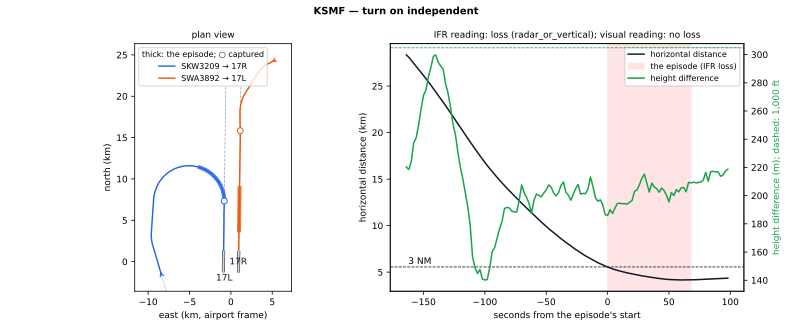
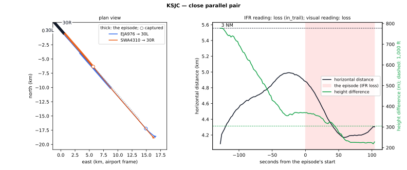
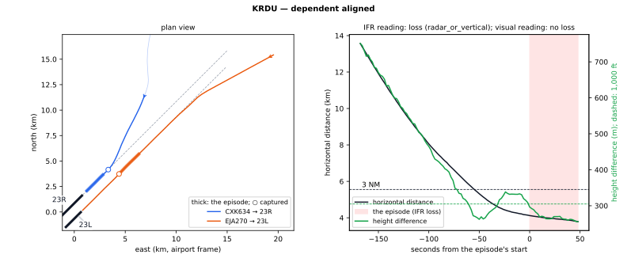
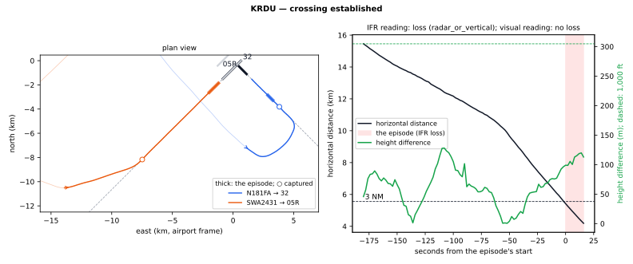
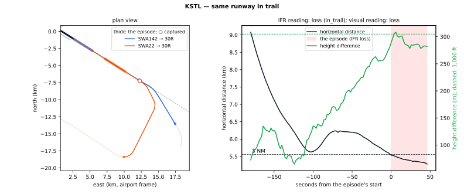

# Separation on parallel and crossing runways in the recorded arrivals

*Readout, 2026-09-27. Multi-aircraft design §3.2 and §3.4, M0 step 4 (design §6.4).*

- **Census:** `4dTrajectory/outputs/POOLED/traffic/census_20260927/census.json`, schema `ts-traffic-census-v3`,
  written at `8e788f9f` on a clean tree by `experiments/traffic_census.py`. It covers the training operating days and
  reads the instruction artefact `instruction_language/v5_20260926`.
- **Examples:** [`figures/parallel_runway_separation/`](figures/parallel_runway_separation/), drawn by
  `experiments/traffic_separation_examples.py`; `examples.json` holds every number quoted in §4 and §5.

**Decision (user, 2026-09-27).** The multi-aircraft closed loop's separation checks and its reward use the **visual
reading** (§2). It follows 7-4-4 c: it assumes visual approach clearances, never visual separation. The **IFR reading**
is reported beside every separation readout.

---

## 1 The question

The multi-aircraft closed loop ends an aircraft that loses separation, with reward 0 (design §3.4). That needs a rule for
"lost separation". We first encoded FAA JO 7110.65BB literally: 3 NM radar or 1,000 ft vertical, the wake minima, and the
parallel-runway rules. Under that rule, the **recorded** traffic loses separation 0.6–1.9 times per hour of traffic at four
of the five airports.

So is the problem in the data or in our rule? Both, in different ways:

- **The geometry is real.** The two aircraft really are within 3 NM horizontally and within 1,000 ft vertically.
- **Almost all of it happens on parallel and crossing runways.** In good weather these runways run visual approaches
  (7-4-4) and visual separation (7-2-1), which permit these distances. ADS-B does not record either.
- **Our "established" is stricter than a controller's.** It is the labeller's capture corridor, and the aircraft must
  stay inside it to the threshold. Some pairs that are established in practice are therefore judged as still turning
  in, and fall under the stricter turn-on rule.

## 2 The two readings

| Situation | IFR reading (the order as written) | Visual reading (checks and reward) |
|---|---|---|
| One runway, both established, in trail | Radar 3 NM and the directly-behind wake minimum (TBL 5-5-1); horizontal only (5-9-6 a5) | The same |
| One runway, one aircraft still joining | Radar 3 NM or 1,000 ft | The same |
| Two runways under 2,500 ft apart (KSJC 30L/30R; KSTL 12L/12R and 30L/30R) | Judged as one runway (5-5-4 h NOTE; that radar applies across the pair is our reading) | The same: a visual approach here needs visual separation (7-4-4 c1 b) |
| Dependent parallels, 2,500–4,300 ft (KRDU; KSTL 11/12R) | 1,000 ft or 3 NM during turn-on; diagonal 1.0 or 1.5 NM once both are established (5-9-6) | No minimum once both are turned in (7-4-4 c2 a, c): within 30° of their courses, each on its own side of the midline between the two finals; before that, as IFR |
| Independent parallels, ≥ 4,300 ft (KSMF) | 1,000 ft or 3 NM during turn-on (5-9-7 a1); none once both are established | No minimum once both are turned in (7-4-4 c3 a, c), as above; before that, as IFR |
| Runways of other directions (KRDU 32 × 5/23, KMSY) | Radar or vertical | Both established on their finals: not judged (7-4-4 c4; the crossing-runway gate, 3-10-4, is not modelled). While either is still vectored: radar or vertical |
| Leader over its threshold | TBL 5-5-2 to the established aircraft next behind, on the same runway or a pair judged as one | The same |

The visual reading never judges a pair the IFR reading would not (tested on random scenes). Runway spacings and regimes
are from the separation literature, `docs/literature/arrival_separation/README.md` §7. Code: `inference/separation.py`
(`IFR`, `VISUAL`, `_turned_in`); the 30° is `runway_schedule.FAA_VISUAL_INTERCEPT_MAX_DEG`, and each parallel pair's
signed spacing is `Separation.right_nm`.

**What the visual reading assumes, and what it does not.** In good weather controllers clear arrivals to several
runways for visual approaches, and the reading assumes those clearances. It never assumes **visual separation**
(7-2-1): that takes a pilot's traffic-in-sight report and an instruction to keep visual separation, and the model's
vocabulary has neither word. The conditions of 7-4-4 c (JO 7110.65BB Change 3, pp. 439–440; c1 and b1 as amended by
N JO 7110.805) then decide what is free:

- **c2 (a) and c3 (a)**, dependent and independent parallels. When "one aircraft is turning to final and another
  aircraft is established on the extended centerline for the adjacent runway", approved separation is provided until
  the aircraft are on a heading "which will intercept the extended centerline of the runway at an angle not greater
  than 30 degrees". After that, by **(c)**, "it is not necessary to apply any other type of separation with aircraft on
  the adjacent extended runway centerline". The reading reads the heading as the ground track (no wind data), and
  "will intercept" as **on its own side of the midline** between the two centrelines. An aircraft that has overshot
  its centreline into the other final's half has not intercepted, nor has one still crossing that half toward its own
  runway: (b) and (d) hold such an aircraft until it reaches its own centreline, and NOTE 1 names overshoots as the
  concern. The midline is our reading. Reading "will intercept" as "heading toward its own centreline" was tried and
  dropped: it made every aircraft drifting a degree off its centreline a loss (KRDU 584 → 789 pairs; the added
  episodes a median 10 m and 2° off the centreline).
- **c1**, parallels under 2,500 ft. The visual approach needs approved separation "until the preceding aircraft is
  established on its extended runway centerline" **and** "The succeeding aircraft reports having the preceding
  aircraft in sight and is instructed to maintain visual separation". Without visual separation there is no visual
  approach beside such a pair, so it stays one runway.
- **c4**, intersecting and converging runways. Approved separation until the visual approach clearance is
  acknowledged; "When aircraft flight paths intersect, approved separation must be maintained until visual separation
  is provided". The runway gate that provides it, 3-10-4, is not modelled, so established finals of other directions
  are not judged. This is the one place where the reading is looser than the text.
- **Not encoded:** b1, which says radar targets must not touch (it needs a display scale). The same-side cases of
  c2 and c3 (b) and (d) are approximated by the midline: they release at the centreline itself.

The first draft of this readout used a looser visual reading, with every parallel pair free whether or not these
conditions were met. That reading assumed visual separation, and gave 917 pairs, 0.33 per hour. The user chose the
reading above instead (design §9 item 16).

## 3 What the census finds

The census covers the training operating days and every arrival, with or without a sentence. The aircraft are judged at
every 2 s scene step. A pair's loss over consecutive steps is one episode. The table counts **pairs of aircraft** with at
least one loss, per hour with traffic in the scene.

| Airport | Flights | Hours with traffic | Pairs with a loss, IFR | per hour | Pairs with a loss, visual | per hour |
|---|---|---|---|---|---|---|
| KMSY | 4,882 | 360 | 11 | 0.03 | 10 | 0.03 |
| KRDU | 14,499 | 812 | 1,518 | 1.87 | 592 | 0.73 |
| KSJC | 10,057 | 587 | 526 | 0.90 | 526 | 0.90 |
| KSMF | 5,650 | 396 | 290 | 0.73 | 223 | 0.56 |
| KSTL | 9,615 | 615 | 361 | 0.59 | 317 | 0.52 |
| All | 44,703 | 2,771 | 2,706 | 0.98 | 1,668 | 0.60 |

At every landing, the census also judges the established aircraft next behind the leader as the leader crosses its
threshold. The two readings judge landings alike:

| Airport | Judged | Below the required distance | Of which a wake loss (TBL 5-5-2) |
|---|---|---|---|
| KMSY | 1,396 | 0 | 0 |
| KRDU | 4,131 | 25 | 4 |
| KSJC | 5,018 | 322 | 36 |
| KSMF | 921 | 24 | 7 |
| KSTL | 3,573 | 218 | 10 |

The episodes group by the two aircraft's runways as follows (IFR → visual; 2,993 → 1,809 in all). A pair's IFR
episode can split into several under the visual reading (3 pairs at KRDU), so compare readings by pairs:

| Airport | Same runway | Close pair (< 2,500 ft) | Dependent parallels | Independent parallels | Other directions |
|---|---|---|---|---|---|
| KMSY | 10 → 10 | — | — | — | 1 → 0 |
| KRDU | 143 → 143 | — | 758 → 244 | — | 809 → 265 |
| KSJC | 268 → 268 | 302 → 302 | — | — | — |
| KSMF | 48 → 48 | — | — | 253 → 180 | 1 → 1 |
| KSTL | 269 → 269 | 64 → 64 | 67 → 15 | — | — |

At KRDU, 228 of the 758 dependent-parallel episodes are below the diagonal minimum at some step under IFR.

## 4 Where the IFR losses are: the two aircraft at the start of each episode

The table below describes the IFR episodes of the relations that carry most of the losses, at each episode's first step
(`examples.json`, `episodes_at_their_start`). The degree and metre rows are medians.

| | KSMF independent | KSJC close pair | KRDU dependent | KRDU crossing | KSTL same runway |
|---|---|---|---|---|---|
| Episodes | 253 | 302 | 758 | 809 | 269 |
| Both established / one / neither | 0 / 164 / 89 | 85 / 197 / 20 | 142 / 447 / 169 | 544 / 238 / 27 | 211 / 42 / 16 |
| The one ahead not yet established | 150 | 159 | 352 | 107 | 20 |
| Both headings within 10° of their courses | 12 % | 41 % | 43 % | 88 % | 88 % |
| Larger heading more than 30° off its course | 70 % | 53 % | 30 % | 9 % | 8 % |
| Larger heading off its course | 44° | 41° | 16° | 0.7° | 0.4° |
| Larger distance off its centreline | 1,882 m | 858 m | 310 m | 8.5 m | 11 m |
| Height difference | 196 m | 282 m | 292 m | 99 m | 296 m |
| Closest approach / required distance | 0.71 | 0.63 | 0.66 | 0.75 | 0.94 |

Reading each column:

- **KSMF, independent parallels (5,982 ft).** Never both established. Typically one aircraft is on its final and the
  other turns in beside it, 44° off its course and 1.9 km off its centreline, with about 200 m of height between them.
  Under IFR that is a turn-on without 1,000 ft or 3 NM, which 5-9-7 a1 does not permit. In 70 % of the episodes the
  turn is steeper than 30° at the first step. That is legal for a visual approach only with visual separation, and the
  visual reading keeps 180 of the 253 episodes.
- **KSJC, 30L/30R (699 ft).** The order separates the pair as one runway for wake. Under IFR, one aircraft following
  another across the pair at 4–5 km is therefore "in trail under 3 NM". The recorded controllers fly the pair side by
  side, which 7-4-4 c1 allows only with the succeeding aircraft keeping visual separation. Both readings judge all 302
  episodes.
- **KRDU, dependent parallels (3,498 ft).** 43 % of the episodes start with both aircraft pointing down their finals,
  the farther one a median 310 m off its centreline.
  - The capture corridor (20 m + d·tan 0.45°, 2°) must hold for the rest of the approach before an aircraft counts as
    established. So under IFR these aligned aircraft are judged by the turn-on rule (3 NM or 1,000 ft), not the 1.0 NM
    diagonal.
  - The visual reading frees a pair once both are turned in, and keeps 244 of the 758.
- **KRDU, crossing runways.** Runway 32, mostly general aviation, against 5L/5R/23L/23R.
  - In 544 of the 809 episodes both aircraft are established on their own finals, converging near the field with about
    100 m of height between them. The visual reading does not judge these (3-10-4 not modelled).
  - The other 265, with an aircraft still being vectored, stay losses.
- **KSTL, same runway.** Two aircraft on one final, the one behind a median 0.94 × 3 NM ≈ 5.2 km back, just inside the
  radar minimum. These are losses under both readings (§6).

## 5 Recorded examples

Each figure draws one TYPICAL episode of its kind: the one whose closest approach is nearest its kind's median, the
earliest of equals (rule, not choice). The kinds are defined under IFR; the figure's title line gives both verdicts.

- **Left panel:** the plan view in the airport frame, north up.
  - Both flights' full tracks are faint. Three minutes either side of the episode are solid, and the episode itself is
    thick.
  - Runways are drawn with their extended centrelines, and ○ marks where each aircraft is captured (established).
- **Right panel:** the two aircraft's horizontal distance (black, against 3 NM) and their height difference (green,
  against 1,000 ft) over time, with the episode shaded.

### 5.1 KSMF, turning in beside an independent parallel final (a loss under both readings)



- **Aircraft.** SWA3892 is established on the 17L final: 0.2° off its course, 3 m off the centreline, 7.6 km out.
  SKW3209 turns onto 17R from the west: 75° off its course, 3.2 km off its centreline, 10.1 km out.
- **The episode.** 11 September 2026, 17:20:36Z, 70 s. The distance falls from 5.55 to 4.16 km (0.75 × 3 NM), and the
  height difference stays at 186–209 m.
- **Verdict.** IFR: a turn-on loss (5-9-7 a1). Visual reading: a loss too, because a 75° turn beside an adjacent final
  needs visual separation (7-4-4 c3 a). It is one of 164 episodes at KSMF with one aircraft established.

### 5.2 KSJC, in trail across 30L/30R (a loss under both readings)



- **Aircraft.** SWA4310 on 30R and EJA976 on 30L, both established, 7.6 and 12.5 km out: one follows the other across
  the pair.
- **The episode.** 14 May 2026, 22:11:16Z, 106 s. The distance falls from 4.88 to 4.17 km (0.75 × 3 NM), and the
  height difference from 369 to 228 m.
- **Verdict.** Both readings judge the pair as one runway: in trail under 3 NM. The recorded operation is very likely
  a visual approach with visual separation (7-4-4 c1), which the model cannot give. It is one of 194 such episodes at
  KSJC.

### 5.3 KRDU, dependent parallels, both aligned but one not yet captured (a loss under IFR only)



- **Aircraft.** CXK634 is established on 23R, 2.8 km out.
- **EJA270 on 23L.** It is 0.5° off its course and 10 m off its centreline, 8.0 km out, but not yet captured. It leaves
  the corridor again before the threshold, so its capture comes later (○).
- **The episode.** 2 May 2026, 00:11:58Z, 50 s. The distance falls from 4.12 to 3.79 km (0.68 × 3 NM), and the height
  difference from 296 to 256 m.
- **Verdict.**
  - IFR judges the pair by the turn-on rule (3 NM or 1,000 ft), because one aircraft counts as still joining. Under the
    1.0 NM diagonal the same geometry would be clear.
  - Visual reading: no loss. Both are within 30° of their courses and on their own sides (7-4-4 c2 a, c).
  - It is one of 186 episodes like it at KRDU.

### 5.4 KRDU, finals of crossing runways (a loss under IFR only)



- **Aircraft.** N181FA is established on the runway 32 final, 3.0 km out. SWA2431 is established on 05R, 1.6 km out.
- **The episode.** 1 May 2026, 15:56:02Z, 18 s. They converge near the field: the distance falls from 5.42 to 4.19 km
  (0.75 × 3 NM), with 99–113 m of height between them. The episode ends when SWA2431 lands.
- **Verdict.** IFR: radar or vertical broken. Visual reading: not judged (3-10-4 not modelled). It is one of 544 such
  episodes at KRDU.

### 5.5 KSTL, in trail on one runway (a loss under both readings)



- **Aircraft.** SWA142 is on the 30R final, 3.3 km out. SWA22 turned in behind it and follows, 8.9 km out.
- **The episode.** 8 July 2026, 04:26:06Z, 48 s. The distance falls from 5.53 to 5.28 km, against the 5.56 km minimum
  (0.95 × 3 NM), with about 285 m of height between them.
- **How it ends.** The episode ends when SWA142 lands, 5.28 km ahead of SWA22, so that landing is also below the
  required distance.
- **Verdict.** A loss under both readings. It is one of 211 at KSTL.

## 6 What the visual reading leaves

The visual reading leaves 1,668 pairs with a loss (1,809 episodes), 0.60 per hour with traffic. By kind:

- **One runway (all five airports, 738 episodes).** Aircraft in trail, and aircraft joining a final. Most of these are
  close calls: where 3 NM was required, the aircraft came no closer than 2.5 NM in 239 of 268 KSTL episodes, 123 of 264
  at KSJC, 68 of 143 at KRDU and 31 of 46 at KSMF.
- **Close pairs (KSJC 302, KSTL 64).** Flown side by side in the record. The rules allow that only with visual
  separation.
- **Turn-ons beside a parallel final steeper than 30°, or past the midline (KRDU 244, KSMF 180, KSTL 15).**
- **Other directions with an aircraft still vectored (KRDU 265, KSMF 1).**

In the recorded operation much of this is probably covered by provisions the readings do not encode:

- visual separation (7-2-1), both in trail on one runway and beside a close pair;
- the 2.5 NM reduced in-trail minimum of 5-5-4 j. It applies within 10 NM of the runway, and needs a documented average
  runway occupancy of 50 s or less and other conditions. None of our airports is known to hold it;
- aircraft joining a final from the traffic pattern. At KRDU the same-runway joiners start a median 73° off course and
  2.6 km off the centreline. A probe during the code review of an earlier census found most of KSJC's same-runway
  joiners were piston types; the runners do not measure this.

## 7 Consequences and decision

- **The model is held to a stricter standard than the record in these places.** It cannot give visual separation, so
  it must keep the separation the recorded controllers often replace with it.
  - The recorded traffic itself breaks the visual reading 0.60 times per hour, and KSJC's close pair 0.51 times per
    hour (302 episodes in 587 h).
  - The design's rule is to report that rate beside the model's, under the same check (design §1.3: being "safer than
    the data" leaves the data).
- **The pass line.** The "labelled words" setting (design §2.2) replays the recorded words through the executor. Its
  step-0 pass line is at most 3 % of flights ended by the check (design §3.4). The recorded rate above suggests KSJC may
  fail it on the close pair alone. §3.4 already says what then happens: the check becomes a reward or a readout only,
  and the numbers come back to the user.
- **The IFR reading** would also judge the turn-ons that intercept at 30° or less and the established crossing
  finals. It is reported, not used.
- **Decision (user, 2026-09-27).** Checks and reward use the visual reading of §2. Every separation readout also
  reports IFR, and the recorded traffic's own rate under the same check.

Open questions:

1. Neither reading encodes visual separation (7-2-1). The model has no word for it; adding the words would be a
   vocabulary change.
2. The no-overtaking condition of 7-4-4 c1 and the same-side cases of c2 and c3 are not encoded.
3. "Established" is the labeller's capture. It is shared with the labeller and the executor, and is left as it is.
4. Weather (METAR) could separate visual days from instrument days. That would be a new data source, not planned.
5. Which approaches each airport's charts authorise was not checked (literature §7).

## 8 Reproduce

```bash
python run_ts.py traffic_census --instructions 4dTrajectory/outputs/POOLED/instruction_language/v5_20260926 \
    --out 4dTrajectory/outputs/POOLED/traffic/census_20260927
python run_ts.py traffic_separation_examples --census 4dTrajectory/outputs/POOLED/traffic/census_20260927 \
    --instructions 4dTrajectory/outputs/POOLED/instruction_language/v5_20260926 \
    --out 4dTrajectory/ts_transformer/docs/two_tier/readouts/figures/parallel_runway_separation
```

The census takes about a minute and a half. The code is on branch `dev-multi-aircraft`:

- the judge: `inference/separation.py`;
- the rules and wake tables: `inference/runway_schedule.py`;
- the scene steps and samples: `prior/scene.py`;
- the two runners above.
