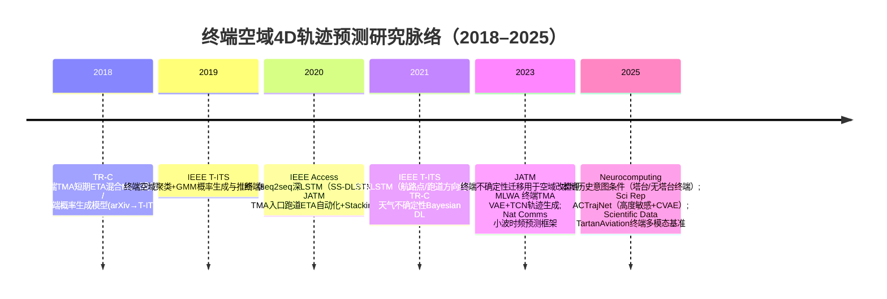

# 面向终端空域的四维飞机轨迹预测：近五年高质量期刊AI方法深度调研报告

## 执行摘要

终端空域（Terminal Airspace / Terminal Area / TMA）涵盖起飞、初始爬升、进近与着陆等高机动、高密度阶段，是安全风险与运行不确定性最集中的空域之一；在事故统计层面，这些阶段虽只占飞行时间的很小比例，却贡献了显著比例的重大事故风险（例如文献在终端阶段给出“56%”或“60%”量级的风险集中描述）。citeturn59view0turn31view0 基于此背景，近五年（2019–至今）面向终端空域的4D轨迹预测研究呈现明确趋势：从“确定性多步回归（RNN/LSTM/GRU、seq2seq）”走向“概率生成式预测（GMM、VAE/CVAE、扩散模型）+ 物理/程序约束（runway方向、爬升顶点、航路点等）+ 更强上下文条件（跑道构型、天气、交互）”。

在高质量期刊中，推荐优先精读的“终端空域强相关”代表作包括：  
（1）IEEE T-ITS 的终端空域概率生成模型（聚类 + GMM），强调**可解释、可生成、可实时推断**并公开代码与预训练模型（但原始雷达数据受限）。citeturn59view0turn14view0turn37view2  
（2）IEEE T-ITS 的“约束LSTM”4D预测框架，将飞行阶段的关键物理/程序约束显式加入学习过程，并与多类传统基线比较。citeturn50view1  
（3）Journal of Air Transport Management（JATM）两篇终端研究：一篇聚焦**TMA入口点跑道ETA**的自动化数据预处理+Stacking集成学习框架；另一篇聚焦**终端空域改造评估所需的“轨迹不确定性可迁移建模”**并给出燃油差异的实证验证。citeturn60view0turn43view0  
（4）Scientific Reports 的 ACTrajNet（高度敏感建模 + CVAE）针对**无塔台终端空域频繁高度波动**，在公开数据集 TrajAir 上给出定量改进与代码开源。citeturn48view2  
（5）Neurocomputing 的“本地历史意图”条件建模，面向**塔台/无塔台终端空域**提升跨场景泛化（通过意图特征而非绝对坐标）。citeturn14view3turn54search7turn13search0  

数据与复现实验方面，终端空域公开基准正在快速成形：TrajAir（无塔台终端、111天ADS‑B+METAR）与 TartanAviation（终端多模态：图像/语音/ADS‑B，含塔台与无塔台、多月、多机场），以及用于“机场地面与近场”建模的 Amelia‑42 / Amelia42‑Mini（42机场+TRACON设施，且示例子集按机场构建了近场过滤）。citeturn58view1turn57view2turn53search9  

受访问策略影响：IEEE Xplore 主站点在本次检索环境中不可直接打开（robots限制），AIAA Arc 对部分PDF访问返回403；ScienceDirect 在高频访问时触发429限流。因此，对少数论文的“全文细节（如逐表指标/超参数）”采用了作者/机构页面、开放PDF、Google Scholar条目快照与出版商摘要页交叉核验的方式呈现，并对无法可靠获取的字段明确标注“不完整/待补全”。citeturn50view1turn20search16turn22search2turn23view0  

## 研究范围与术语界定

本报告将“4D轨迹预测”视为：在三维空间位置（经纬度/局部坐标 + 高度）基础上，结合**时间**维度，对未来一段时间内的轨迹点序列（或其概率分布）进行预测；部分研究将“到达时间（ETA/ALT）预测”作为4D预测的关键派生任务或终端阶段的核心目标（例如“跑道ETA”“着陆时间ALT”）。citeturn60view0turn24search2turn59view0  

“终端空域/终端区”的定义在文献中并不完全统一：  
一类定义强调“机场周边受控空域”，如IEEE T-ITS 终端生成模型将其表述为“围绕机场的受控空域（controlled airspace surrounding a given airport）”。citeturn59view0  
另一类工作给出更工程化的范围阈值示例（地域/国家标准差异较大）。例如PLOS ONE的一篇终端区研究在引言中给出“距机场基准点约50 km、6600 m以下（不含）且高于最低高度层”的描述，并在实验中选取特定高度带（如900–4500 m）做终端区样本。citeturn47view0turn47view1  
在数据集层面，TartanAviation对轨迹数据给出“以机场为中心的距离与高度过滤”的工程选择（如名义选择6000 ft MSL与5 km半径，并转换到跑道端点为原点的局部坐标系）。citeturn57view2  

本报告按用户要求“默认采信论文明确提及 terminal / terminal area / terminal maneuvering area (TMA) / approach / departure / TRACON/进近着陆程序”等研究，并在每篇论文条目中注明其终端空域范围表述或可推断的近场过滤条件。

## 顶级论文清单与综合排名

下表给出约15篇“终端空域相关、且优先来自高质量期刊/出版社”的代表作。排序综合考虑：期刊/平台质量（IEEE Transactions、TR-C、JATM、Nature系等优先）、终端空域显式聚焦程度、方法创新性（概率/约束/多模态）、可复现性（代码/数据）、引用影响力（以Google Scholar/出版商/Scopus可得数据为准）。

> 说明：引用数为本次检索时点（2026‑04‑11）在可访问渠道的快照；同一论文在Google Scholar/Scopus/出版商“Cited by”之间可能存在差异，本表注明来源。citeturn12search1turn13search0turn52search5turn50view1turn60view0  

| 排名 | 论文（完整引文） | 年份 / 期刊 | DOI | 任务与终端空域范围 | AI方法要点（输入→输出） | 指标与核心结果（摘要级/可见表格） | 代码/数据 | 引用数（来源） |
|---|---|---|---|---|---|---|---|---|
| 1 | Barratt, S. T.; Kochenderfer, M. J.; Boyd, S. P. **Learning Probabilistic Trajectory Models of Aircraft in Terminal Airspace from Position Data**. | 2019, IEEE Trans. Intelligent Transportation Systems | 10.1109/TITS.2018.2877572 | 终端空域：机场周边受控空域；以KJFK落地/起飞为例citeturn59view0turn37view0 | 轨迹重建（正则化平滑/补齐）→K-means聚类→每簇协方差低秩近似→GMM生成/推断 | 以KL散度+RMS评估生成/推断；并做“飞行员图灵测试（PTT）”验证可辨识度citeturn38view2turn37view2 | GitHub开源；原始数据因保密不可公开，但提供预训练模型citeturn14view0 | 135（GS作者页快照）citeturn12search1 |
| 2 | Shi, Z.; Xu, M.; Pan, Q. **4‑D Flight Trajectory Prediction with Constrained LSTM Network**. | 2021, IEEE Trans. Intelligent Transportation Systems | 10.1109/TITS.2020.3004807 | 包含下降/进近与跑道方向约束，终端阶段要素明显citeturn50view1turn51search11 | “约束LSTM”：把Top‑of‑climb、Way‑points、Runway方向等阶段性约束融入序列预测；ADS‑B多站数据→4D轨迹 | 与LSTM、Markov/加权Markov、SVM、Kalman等对比，定量优于多种基线citeturn50view1 | 未见官方代码/数据公开（需进一步核验） | 127（Scopus计数，机构页）citeturn50view1 |
| 3 | Wang, Z.; Liang, M.; Delahaye, D. **Automated data‑driven prediction on aircraft Estimated Time of Arrival**. | 2020, Journal of Air Transport Management | 10.1016/j.jairtraman.2020.101840 | 终端：TMA入口点跑道ETA；案例北京首都机场TMA，按跑道构型(QFU)分区citeturn60view0 | 自动化清洗/修复4D轨迹→按QFU聚类分区→候选ML模型择优→Stacking集成；ADS‑B特征工程→ETA | 以嵌套交叉验证评估；结论：预处理显著提升数据质量；Stacking优于单模型citeturn60view0 | 数据源为开放ADS‑B（文中致谢提供者），但完整数据/代码未见公开 | 43（ScienceDirect cited by）citeturn60view0 |
| 4 | Zhu, X.; Hong, N.; He, F.; Lin, Y.; Li, L.; Fu, X. **Predicting aircraft trajectory uncertainties for terminal airspace design evaluation**. | 2023, Journal of Air Transport Management | 10.1016/j.jairtraman.2023.102473 | 终端：香港国际机场终端空域；目标是支持“新标准航路”设计评估（无历史飞行也可生成）citeturn43view0turn14view1 | 特征/输出重构（领域知识）→MLPNN预测“标准差”等不确定性参数→Gaussian+指数平滑模拟新航路随机轨迹 | 生成轨迹用于评估：实际到达轨迹平均燃油消耗比标准到达航路高23%–37%，并用真实数据验证citeturn43view0 | TU Delft仓储记录显示可下载PDF，但本次环境对文件抓取不稳定；代码/数据未明确开源citeturn43view0 | 7（GS作者页快照，Zhu）citeturn13search1 |
| 5 | Zeng, W.; Quan, Z.; Zhao, Z.; Xie, C.; Lu, X. **A Deep Learning Approach for Aircraft Trajectory Prediction in Terminal Airspace**. | 2020, IEEE Access | 10.1109/ACCESS.2020.3016289 | 终端：广州终端空域（到达/离场）citeturn31view0 | 轨迹正则化重建（等时间间隔、去噪）+ seq2seq 深LSTM（编码器‑解码器递归多步）citeturn31view0turn35view0 | 指标：EE/ATE/CTE/AE；示例表给出不同输入特征组合的误差统计（含起飞/进近分场景）citeturn35view1 | IEEE Access为OA；本次通过公开PDF获取，但未见官方代码仓库声明 | 引用数：未能在本次检索环境中稳定获得GS计数（建议补查） |
| 6 | Krauth, T.; Lafage, A.; Morio, J.; Olive, X.; Waltert, M. **Deep generative modelling of aircraft trajectories in terminal maneuvering areas**. | 2023, Machine Learning with Applications | 10.1016/j.mlwa.2022.100446 | 终端：苏黎世机场TMA，强调ATC偏离标称进近所致高变异citeturn17view0 | 4D轨迹生成：VAE + TCN + VampPrior；目标是用于蒙特卡洛风险评估的“可飞行”轨迹生成citeturn17view0 | 指标：分布拟合与可飞行性（flyability）指标上优于传统统计生成方法（摘要级）citeturn17view0 | 数据：按需提供（on request），非直接开源citeturn17view0 | 0（ScienceDirect cited by）citeturn17view0 |
| 7 | Yin, Y.; Zhang, S.; Zhang, Y.; Zhang, Y.; Xiang, S. **Aircraft trajectory prediction in terminal airspace with intentions derived from local history**. | 2025, Neurocomputing | 10.1016/j.neucom.2024.128843 | 终端：同时覆盖塔台与无塔台终端空域数据集citeturn14view3turn54search7 | 用“本地历史轨迹库”学习意图表征，作为可插拔条件增强任意预测器；文中示例集成到扩散式框架并用ADE/FDE验证citeturn54search7 | 结果：在ADE/FDE上显著优于既有方法（幅度需查全文表格）citeturn54search7 | ScienceDirect显示被引(6)；是否开源未明示citeturn14view3 | 10（GS作者页快照）citeturn13search0 |
| 8 | Zhu, H.; Tong, Q.; Hu, J.; et al. **Altitude aware trajectory prediction methods for non towered terminal airspace (ACTrajNet)**. | 2025, Scientific Reports | 10.1038/s41598-025-11888-w | 终端：无塔台终端空域；并讨论塔台控制数据泛化限制citeturn48view2turn48view3 | TCN独立提取高度特征 + 通道注意力融合（CAF）+ CVAE 编解码；历史轨迹+环境信息→未来轨迹分布citeturn48view2 | ADE/FDE显著下降：在TrajAir上分别降低约2.47%/2.42%；并给出AADE/AFDE等高度维专用指标citeturn48view2 | 数据与代码均给出：TrajAir数据开源、ACTrajNet代码仓库开放citeturn48view2 | 引用数：尚新（需后续跟踪）citeturn48view0 |
| 9 | Pang, Y.; Zhao, X.; Yan, H.; Liu, Y. **Data-driven trajectory prediction with weather uncertainties: A Bayesian deep learning approach**. | 2021, Transportation Research Part C | 10.1016/j.trc.2021.103326 | 更偏战略/空域中心；明确讨论TRACON等制度约束与天气不确定性citeturn23view0 | CNN+RNN+FC嵌套时空特征提取→变分推断形成Bayesian DL，输出均值与置信区间citeturn23view0 | 在Sherlock数据库严重对流天气条件下做度量验证，并与既有方法对比（摘要级）citeturn23view0 | 数据：Sherlock数据仓库（非公共直链）；代码未见 | 94（ScienceDirect cited by）citeturn23view0 |
| 10 | Zhang, Z.; Guo, D.; Zhou, S.; Zhang, J.; Lin, Y. **Flight trajectory prediction enabled by time-frequency wavelet transform**. | 2023, Nature Communications | 10.1038/s41467-023-40903-9 | 机动场景强调；可迁移到终端高机动段（需结合终端条件）citeturn52search0 | 小波时频分析 + 编解码框架（开放PDF可查架构）citeturn52search4 | 高被引、强调在机动预测中减少误差累积与提升鲁棒性（需按任务细读）citeturn52search0 | Open access PDF；代码需另查 | 184（GS作者页快照）citeturn52search5 |
| 11 | Patrikar, J.; Dantas, J.; Moon, B.; et al. **Image, speech, and ADS‑B trajectory datasets for terminal airspace operations (TartanAviation)**. | 2025, Scientific Data | 10.1038/s41597-025-04775-6 | 终端：塔台+无塔台；多月、多机场、并行多模态citeturn57view2 | 数据描述（非预测模型）：3.1M图像、3374小时ATC语音、661天ADS‑B；提供同步/过滤/插值后处理与采集预处理代码citeturn57view2 | 给出轨迹过滤与坐标系（如6000 ft MSL、5 km半径等名义选择）citeturn57view2 | 数据集与代码开源；适合作为终端多模态条件预测基座citeturn57view2turn53search8 | 5（出版商页面）citeturn57view2 |
| 12 | Patrikar, J.; Moon, B.; Oh, J.; Scherer, S. **Predicting Like A Pilot: Dataset and Method to Predict Socially‑Aware Aircraft Trajectories in Non‑Towered Terminal Airspace (TrajAir / TrajAirNet)**. | 2022(会议), ICRA；arXiv公开 | 10.1109/ICRA46639.2022.9811972（会议）；10.48550/arXiv.2109.15158（arXiv） | 无塔台终端：区域机场周边；111天ADS‑B+METARciteturn58view0turn58view1 | 提供数据集 + 社会感知基线TrajAirNet；多机交互+天气上下文→多机未来轨迹citeturn58view0 | 作为非塔台终端预测事实基准，被后续ACTrajNet等大量引用citeturn48view2 | 数据与代码开源（文中给出链接入口）citeturn58view0turn53search0 | 引用数：建议通过GS条目补查（本次未稳定抓取） |
| 13 | Ma, X.; Zheng, L.; Lu, X. **4D trajectory prediction and conflict detection in terminal areas based on an improved convolutional network**. | 2025, PLOS ONE | 10.1371/journal.pone.0317549 | 终端区定义与高度带示例（900–4500 m）；并给出水平/垂直间隔阈值用于冲突告警citeturn47view0turn47view1 | CNN‑BiGRU预测4D轨迹 + 几何冲突检测；ADS‑B预处理（样条插值等）citeturn47view0turn47view1 | 指标：RMSE、MAPE；与LSTM/GRU对比，CNN‑BiGRU误差更小citeturn47view1 | 声明“Supporting Info中包含相关数据”citeturn47view0 | 引用数：需后续跟踪（新文）citeturn47view0 |
| 14 | Zhang, H.; Liu, Z. **Four‑Dimensional Aircraft Trajectory Prediction Based on Generative Deep Learning**. | 2024, Journal of Aerospace Information Systems (AIAA) | 10.2514/1.I011333 | 区域：香港区域4D历史轨迹（更偏终端/近场需结合全文确认）citeturn20search16turn22search2 | CTGAN类条件表格GAN做4D生成式预测；与CGAN/LSTM等比较（摘要级）citeturn22search2turn22search0 | 公开文本不可直接抓取全文PDF（本次环境AIAA 403）；指标名称与相对提升可从二手摘要获取citeturn22search0turn20search16 | 代码/数据未在可见摘要中明确（建议补查） | 引用数：PolyU页面显示Scopus计数“5”（针对另一篇I011454条目）citeturn20search9 |
| 15 | Wang, Z.; Liang, M.; Delahaye, D. **A hybrid machine learning model for short‑term estimated time of arrival prediction in terminal manoeuvring area**. | 2018, Transportation Research Part C | 10.1016/j.trc.2018.07.019 | 终端：TMA短期ETA，属高被引奠基工作（超出5年窗口但仍常被引用）citeturn7search1 | 混合ML用于终端短期ETA（与后续JATM 2020形成方法谱系）citeturn60view0 | 高被引、方法常作为后续终端ETA基线；详细指标需查全文citeturn7search1 | 代码/数据通常受限 | 引用数：Annie Liang GS页显示该文被引137（快照）citeturn4search12 |

## 顶部八篇论文深度解读

以下对排名前8的“终端空域4D预测/生成”论文做结构化深挖；每篇均覆盖：问题定义、方法结构、输入输出、数据、终端范围、指标与对比、优势局限、复现与实证。

**Barratt et al., IEEE T-ITS 2019：终端空域概率生成模型（聚类 + GMM）**  
摘要要点：提出一种从历史雷达/融合监视位置数据学习终端空域（机场周边受控空域）飞机运动的概率生成模型，可生成逼真轨迹、用于预测并支持高效实时推断，同时模型紧凑、训练快。citeturn59view0turn37view0  
问题陈述：终端区域程序化结构强、数据噪声与采样不均匀、需要既能“预测”又能“生成用于仿真评估”的模型。作者指出既有终端学习方法往往缺少完整概率运动模型、或难以规模化。citeturn59view0  
方法：先做轨迹重建（对噪声与不等长序列进行时间对齐、插值/外推、正则化平滑），再用K-means在统一长度的轨迹向量空间聚类；对每个簇估计经验协方差并做低秩截断，最终形成“簇先验 + 簇内高斯”的GMM式生成模型（采样：先抽簇，再在低秩子空间采样并映射回轨迹）。citeturn37view1turn38view0  
数据与终端范围：使用FAA多传感器融合跟踪数据（融合雷达、SSR、WAM、ADS‑B等），示例机场KJFK，任务覆盖落地与起飞轨迹。citeturn59view0turn37view0  
指标与结果：生成质量用KL散度等分布相似度指标评估；推断（预测）用后验均值与真实轨迹的RMS误差评估；同时引入“飞行员图灵测试（PTT）”检验生成轨迹与真实轨迹的可分辨性（表格报告不同飞行员对落地/起飞样本的判别准确度接近随机水平）。citeturn38view2turn37view2  
基线：论文强调相对“传统统计方法/难扩展聚类方法”的优势，核心比较体现在分布拟合与预测误差随簇数变化的曲线，以及对终端程序结构的捕获。citeturn37view2turn38view2  
优势与局限：优势在于可解释（簇≈程序/跑道流）、可生成、预测可做贝叶斯推断且推理高效；局限已明示：无法融入ATC意图、难建模多机交互、依赖历史数据因此不适用于“新程序/新航路”评估。citeturn59view0  
复现与实证：代码与预训练模型公开，但原始数据受保密限制不可分享。citeturn14view0 引用数（GS快照）约135。citeturn12search1  

**Shi et al., IEEE T-ITS 2021：约束LSTM的4D轨迹预测**  
摘要要点：提出“约束LSTM”用于4D轨迹预测，针对飞行爬升/巡航/下降‑进近阶段提出三类约束（Top‑of‑climb、Way‑points、Runway方向），并在ADS‑B多站数据上验证优于多类基线。citeturn50view1turn51search11  
问题陈述：点位稀疏、共享航路与阶段切换使飞行轨迹预测较地面交通更难；终端/进近段尤其受到程序约束与姿态变化影响。citeturn50view1  
方法：以LSTM保持长时依赖为骨架，在不同飞行阶段注入可解释约束；并使用DBSCAN与线性最小二乘用于分段与预处理，借助滑动窗口保持轨迹连续性。citeturn50view1  
输入输出：输入为带时间戳的空间位置序列（4D时空轨迹集），输出未来轨迹点序列（文献页面摘要级）。citeturn50view1  
数据来源：多ADS‑B地面站数据（机构页摘要）。citeturn50view1  
指标与基线：与LSTM、Markov/加权Markov、SVM、Kalman Filter等对比并给出定量优势；以“约束保持长时依赖”作为关键卖点。citeturn50view1  
优势与局限：优势在于把终端/阶段性程序信息以“约束”形式显式嵌入，缓解纯数据驱动在终端高机动段的物理不可行问题；局限是公开复现资产（代码/数据）在可见摘要中未明确，需要进一步人工核验。citeturn50view1  
引用：机构页显示Scopus引用数127（快照）。citeturn50view1  

**Wang et al., JATM 2020：TMA入口点跑道ETA自动化预测框架（预处理 + Stacking）**  
摘要要点：提出终端机动区（TMA）入口点处的跑道ETA预测框架，核心由自动化数据预处理（分割‑清洗‑估计）与机器学习建模组成；按跑道使用构型(QFU)对航班聚类分区，并在北京TMA真实ADS‑B数据上用嵌套交叉验证评估，Stacking集成学习表现最佳。citeturn60view0  
问题陈述：TMA入口点是ETA预测“最关键且最困难”的环节之一，受复杂交通形态、天气、ATC指令与人为因素影响显著；大量研究缺乏自动化与跨TMA泛化能力。citeturn60view0  
方法与输入输出：以4D轨迹为核心输入，经预处理后构建特征；输出为到达跑道的ETA（回归任务）。模型层面比较多种候选ML并在不同QFU分区上分别择优，最终用Stacking融合。citeturn60view0  
数据与终端范围：北京首都机场TMA（文中“Airport and TMA”段落明确），使用开放历史ADS‑B并致谢数据提供者。citeturn60view0  
评估：强调“预处理前后对比”证明数据质量提升，并指出Stacking优于单模型；具体最佳MAE数值需查表（ScienceDirect可见表格位置但本次无法稳定抓取全文PDF）。citeturn60view0  
优势与局限：优势在于流程自动化、对缺失/离群/噪声鲁棒并宣称可扩展到其他TMA；局限在于复现资产（代码/全量数据）未直接公开。citeturn60view0  

**Zhu et al., JATM 2023：面向终端空域改造评估的“可迁移不确定性预测”**  
摘要要点：针对终端空域标准航路改造评估，提出基于MLPNN的轨迹不确定性预测模型，关键是通过领域知识进行输入/输出构造，使模型能从既有标准航路学习并迁移到“尚未飞过的新航路”生成带不确定性的轨迹；在香港国际机场终端空域做真实数据验证，并报告实际到达轨迹平均燃油消耗比标准到达航路高23%–37%。citeturn43view0turn14view1  
问题陈述：传统仿真生成终端轨迹需要为每个新场景做繁琐配置；多数数据驱动方法只能在“已有历史轨迹”的既有结构上工作，难以用于新结构/新航路设计。citeturn43view0  
方法：以特征工程与输出设计把原始轨迹映射到可迁移表示；MLPNN监督学习预测标准差等不确定性参数；随后用高斯分布与指数移动平均等机制在新航路上模拟轨迹分布，实现“无历史飞行的新程序评估”。citeturn43view0  
终端范围：香港国际机场终端空域（文中明确）。citeturn43view0  
指标与结果：论文的核心“结果指标”不是单点位置误差，而是“可用于安全/效率/环境评估的轨迹生成能力”，并用燃油差异与真实航迹验证来证明模拟轨迹的评估有效性。citeturn43view0  
优势与局限：优势在于“支持新航路/新结构设计评估”的可迁移性；局限是对外可用的代码/数据公开程度不明，且本次环境无法稳定拉取其仓储PDF文件进行更细指标复核。citeturn43view0  

**Zeng et al., IEEE Access 2020：终端空域seq2seq深LSTM（SS‑DLSTM）**  
摘要要点：针对终端空域结构复杂与姿态频繁变化，提出“轨迹重建正则化 + seq2seq深LSTM（编码器‑解码器）”的4D轨迹预测框架；在广州终端空域数据上验证精度与鲁棒性优于主流方法。citeturn31view0turn35view0  
问题定义：将多步4D轨迹预测形式化为序列到序列学习：历史状态序列→未来3D位置序列。citeturn31view0turn35view0  
模型结构：编码器学习历史轨迹表征，解码器以递归方式输出预测序列；输入特征既含基础位置，也可加入航向/速度/机型等派生特征以增强阶段行为学习。citeturn31view0turn35view1  
数据与范围：广州终端空域到达与离场轨迹（文中描述“terminal airspace in Guangzhou, China”）。citeturn31view0  
指标与结果：使用EE（欧氏误差）、ATE（沿航迹误差）、CTE（横向误差）、AE（高度误差）等指标；论文表格给出不同输入属性组合下的误差均值与标准差（区分落地/起飞）。citeturn35view1  
优势与局限：优势是端到端多步预测、训练部署相对直接；局限是偏确定性预测，若要用于终端运行的不确定性管理（TBO/冲突探测），通常还需叠加不确定性建模或多模态条件（天气/ATC意图/交互）。citeturn31view0turn23view0  

**Krauth et al., MLWA 2023：终端机动区4D轨迹生成（VAE + TCN + VampPrior）**  
摘要要点：面向空域设计与冲突风险蒙特卡洛评估，提出适配4D轨迹的变分自编码器结构（TCN + VampPrior）生成大量“多样且可飞行”的终端机动区轨迹；在苏黎世机场TMA训练，强调因ATC频繁偏离标称进近导致的高变异性。citeturn17view0  
问题陈述：终端程序风险评估需要大量多样轨迹；仅靠少量观测或简单统计模型难以生成既真实又可飞行的轨迹分布。citeturn17view0  
方法：以TCN对时间序列建模，VAE学习潜变量分布，VampPrior增强先验表达能力，以提高少样本/多模态分布拟合能力；同时强调生成轨迹的“flyability”约束评估。citeturn17view0  
数据与开放性：声明数据可按需提供（on request），仍可能存在获取门槛。citeturn17view0  
优势与局限：优势是生成式、可用于风险评估与“高风险轨迹”采样；局限是与实际ATC指令/多机交互耦合仍较弱（从摘要可见其主要建模对象是单机轨迹分布）。citeturn17view0turn59view0  

**Yin et al., Neurocomputing 2025：从本地历史学习“意图条件”，增强终端轨迹预测泛化**  
摘要要点：指出仅依赖绝对位置的轨迹预测虽能提升精度但会损害跨空域泛化；提出从历史轨迹库中学习“意图”作为替代条件，并在塔台/无塔台终端数据集上做ADE/FDE评估，显著优于已有方法。citeturn14view3turn54search7  
方法逻辑：建立意图表征使其相对当前目标位置归一化，从而更稳健、更可泛化；意图模块可作为附加条件接到任意预测模型上（model‑agnostic），示例集成到扩散式预测框架。citeturn54search7  
数据与终端范围：ScienceDirect摘要页明确“在塔台与无塔台终端空域的两个数据集上做实验”。citeturn14view3  
结果与局限：公开摘要强调“大幅领先”，但未给出可见数值；需通过全文表格补齐（如ADE/FDE的绝对值、不同预测时域的增益、消融实验）。citeturn54search7  

## 方法、数据集与评测指标的综合对比

### 方法谱系对照表

| 方法家族 | 代表论文（本报告） | 模型核心 | 终端空域适配点 | 输出形态 | 常用指标 | 典型短板 |
|---|---|---|---|---|---|---|
| 可解释概率生成（聚类+GMM） | Barratt (IEEE T-ITS)citeturn59view0 | 轨迹重建→聚类→簇内高斯/低秩协方差→GMM | 程序结构强（簇≈程序/跑道流），推断高效；可用于仿真 | 轨迹分布（可采样、可做后验推断） | KL、RMS、主观PTTciteturn38view2turn37view2 | 难融入ATC意图与多机交互；不适合“新程序无历史”citeturn59view0 |
| 约束序列网络（Constrained RNN/LSTM） | Shi (IEEE T-ITS)citeturn50view1 | LSTM + 阶段性约束（TOC/航路点/跑道方向） | 直接把进近/跑道几何等硬约束写入学习框架 | 多步点预测（确定性为主） | 位置误差类+对比基线citeturn50view1 | 约束设计需领域工程；跨机场迁移仍难 |
| seq2seq深RNN（终端短时多步） | Zeng (IEEE Access)citeturn31view0 | 编码器‑解码器深LSTM | 终端轨迹重复性强（程序复用），seq2seq易学习 | 多步3D位置序列 | EE/ATE/CTE/AEciteturn35view1 | 不确定性与多模态条件弱；长时域误差累积 |
| 终端ETA/ALT回归（分区+集成） | Wang (JATM)citeturn60view0 | 自动预处理 + 分跑道构型建模 + Stacking | 终端入口点“高密度混叠”通过QFU分区缓解 | ETA标量 | MAE等（表中）citeturn60view0 | 对轨迹形状预测能力有限；难用于冲突检测类“空间未来” |
| “设计评估”导向不确定性学习 | Zhu (JATM)citeturn43view0 | MLPNN预测不确定性参数 + 生成模拟 | 解决“新航路无历史”这一终端特有痛点 | 分布参数→随机轨迹 | 评估型指标（燃油/效率/安全）citeturn43view0 | 预测精度与安全可信度依赖特征设计；复现门槛（数据/代码） |
| 生成式深度模型（VAE/CVAE/扩散） | Krauth (MLWA)citeturn17view0；ACTrajNet (Sci Rep)citeturn48view2 | VAE/CVAE(+TCN/注意力)或扩散生成 | 可输出多模态轨迹分布；适合终端不确定性与多模式机动 | 分布/多样本轨迹 | ADE/FDE、分布距离、flyabilityciteturn48view2turn17view0 | 训练与评估复杂；物理可行性与约束满足仍是挑战 |
| 意图/历史条件增强 | Yin (Neurocomputing)citeturn54search7 | 从本地历史库提取意图条件（可插拔） | 将绝对坐标依赖转为意图依赖，提升跨终端泛化 | 提升多模型性能（ADE/FDE） | ADE/FDEciteturn54search7 | 需要高质量历史库与检索/表征；意图定义仍非标准化 |

### 数据集与终端空域覆盖对照

终端空域研究面临“可公开高质量监视数据稀缺”的结构性问题：部分高价值数据（雷达融合、管制指令、航路设计评估数据）常受商业/安全限制，仅能公开模型或部分样例。citeturn14view0turn43view0 近年开放数据的突破主要来自ADS‑B与多模态终端采集工程。

| 数据/来源 | 终端空域类型 | 时间跨度/规模（公开说明） | 可用模态 | 适合任务 |
|---|---|---:|---|---|
| TrajAir（AirLab）citeturn53search0turn58view1 | 无塔台终端空域（区域机场周边） | 111天（8个月），ADS‑B+METAR | 轨迹+天气 | 多机交互预测、终端GA轨迹预测基准、生成式/概率模型对比 |
| TartanAviation（Scientific Data 2025）citeturn57view2turn53search8 | 塔台+无塔台终端空域 | 661天ADS‑B；3374小时语音；3.1M图像 | 多模态（图像/语音/轨迹/天气） | 终端多模态条件轨迹预测、语音指令→意图→轨迹、视觉DAA辅助预测 |
| Amelia42‑Mini（HuggingFace示例）citeturn53search9 | 机场近场/地面与低空过滤 | 每机场15天样例；按地理围栏+高度过滤（如2000 ft AGL） | 清洗后的位置报告 | 机场近场交通预测、地面/近终端融合建模、跨机场泛化研究 |

## 研究空白与开放挑战

终端空域4D预测的“难点”与“未来机会”高度耦合：终端既是高价值应用场景，也是对模型可信性与泛化要求最高的场景。

首先是**不确定性与多模态性**：终端轨迹包含强多模式（跑道构型、进离场程序、ATC向量引导/盘旋等待）与强随机性（风切变、能量管理差异、机型/重量等隐变量）。这推动了从确定性RNN到Bayesian DL与生成式模型（VAE/CVAE、扩散）的迁移：TR‑C工作强调天气不确定性并通过变分推断给出置信区间；JATM 2023直接学习可迁移不确定性并用于设计评估；Scientific Reports则把高度维不稳定作为核心建模对象并引入高度专用误差指标。citeturn23view0turn43view0turn48view2 但目前主流指标（ADE/FDE/RMSE）往往仍偏“均值误差”，对多样性、尾部风险（rare maneuvers）与可飞行性约束的评价不足，这也是生成式终端模型不断引入“分布距离+flyability”指标的动因。citeturn17view0turn57view0  

其次是**物理/程序一致性与可信约束**：终端轨迹必须满足速度/爬升率/转弯率、跑道对正、航路点与高度限制、以及可能的噪声/缺失修复逻辑。完全端到端深度模型容易产生“统计上合理但物理不可飞”的样本；因此“约束学习”（如runway方向、TOC/航路点约束）与“后处理重建”（正则化平滑、等采样对齐）成为关键工程环节。citeturn50view1turn37view1turn31view0 但约束的标准化表达（尤其在跨国家程序差异、PBN/RNP、以及管制向量引导下）仍未形成统一接口，导致跨机场迁移困难。

再次是**多机交互与ATC意图缺失**：终端高密度环境下“他机‑他机‑程序‑管制指令”共同决定轨迹演化。经典终端概率生成模型明确承认“无法纳入ATC意图与复杂时空交互”是局限；而新一代研究（TrajAir/TartanAviation、基于扩散与意图建模的工作）开始把“社会交互”和“意图条件”作为核心组件。citeturn59view0turn58view1turn57view2turn54search7 未来的关键瓶颈是：如何在公开数据中获得“可监督/可弱监督”的ATC指令与航路约束标签，并把它们融入可解释的预测管线（例如“语音指令→意图→轨迹”的闭环）。

最后是**评估与落地验证**：终端预测模型的“真实世界有效性”不能仅靠离线误差，需要与运行决策任务耦合验证：如冲突探测/间隔管理、航路设计评估、燃油/排放影响评估。JATM 2023通过“生成轨迹→燃油差异→用真实航迹验证”给出更接近运营的证据链；PLOS ONE则将4D预测与几何冲突检测绑定，并给出终端区水平/垂直间隔阈值设定示例。citeturn43view0turn47view1 但跨机场、跨季节、跨规则变化（如跑道改造、程序更新）的“分布漂移”验证仍稀缺。

## 推荐下一步精读与可用数据集清单

### 推荐下一步精读清单

建议按“终端强相关→方法通用→多模态/前沿生成”的顺序阅读：

（1）**终端概率生成与可解释基线**：Barratt (IEEE T-ITS) 结合其开源仓库可快速复现“重建‑聚类‑GMM生成/推断”，适合作为终端生成式基线与可解释对照。citeturn14view0turn59view0  
（2）**终端程序/物理约束学习**：Shi (IEEE T-ITS) 作为“把跑道/航路点约束写进LSTM”的代表，适合用于构建“可行性约束”模块库。citeturn50view1  
（3）**TMA入口ETA与运行层应用**：Wang (JATM) + 其引用链中的TR‑C 2018奠基作，适合做“终端入口多模式分区 + 集成学习”路线的复现与扩展。citeturn60view0turn4search12turn7search1  
（4）**面向改造评估的不确定性迁移**：Zhu (JATM 2023) 代表“学不确定性参数→生成新航路轨迹→用于燃油/环境评估”的工程化路径。citeturn43view0  
（5）**终端生成式深度模型的评估框架**：Krauth (MLWA) 代表“flyability + 分布拟合”的终端生成评估思想，可为扩散/flow等方法提供指标模板。citeturn17view0  
（6）**无塔台终端的高度波动与多机交互**：ACTrajNet (Sci Rep) + TrajAir/TartanAviation 数据论文，适合做开放数据上的SOTA复现实验与多模态条件预测。citeturn48view2turn57view2turn58view1  
（7）**高影响力通用方法（可迁移到终端）**：Nature Communications 小波时频框架在机动预测方面高被引，适合作为终端“长时域抗误差累积”的通用模块候选。citeturn52search0turn52search5  

### 可用数据集与落地建议

优先建议从公开终端数据集出发构建“可复现基线”，再逐步引入单位内部高价值数据（雷达融合、跑道构型、管制指令、航路设计）：

1）**TrajAir（无塔台终端，轨迹+天气）**：适合做多机交互、概率预测（ADE/FDE/多样性指标）与高度波动建模；Scientific Reports 的 ACTrajNet 与若干扩散/意图方法均以其作为主基准。citeturn48view2turn58view1turn53search0  
2）**TartanAviation（终端多模态）**：如果你的终端预测希望“显式条件化到ATC语音/视觉态势”，该数据集提供了并行采集的语音、图像、轨迹，且包含塔台与无塔台机场，利于研究跨管制形态泛化；并给出了轨迹过滤与坐标系转换细节，便于复现。citeturn57view2turn53search8  
3）**Amelia42‑Mini（机场近场过滤样例）**：若你的产品形态涵盖“机场地面‑近终端”联动（滑行/排队/起飞队列对离场轨迹的影响），该数据集的地理围栏与高度过滤（如2000 ft AGL）对构建“统一近场场景编码器”很有价值。citeturn53search9turn54search16  

---



```mermaid
flowchart TD
    A[原始数据<br/>ADS-B / 雷达融合 / METAR天气 / 跑道构型 / 程序约束 / 语音指令] --> B[时空对齐与清洗<br/>去噪/插值/重建/等采样]
    B --> C{建模范式选择}
    C --> C1[确定性多步预测<br/>LSTM/GRU/TCN/Transformer<br/>Seq2Seq编码器-解码器]
    C --> C2[概率预测/生成<br/>GMM / VAE-CVAE / 扩散模型]
    C --> C3[约束增强<br/>航路点/跑道方向/能量约束<br/>物理可行性]
    C1 --> D[条件融合<br/>跑道QFU/天气特征/交互图/意图表征]
    C2 --> D
    C3 --> D
    D --> E[解码输出]
    E --> E1[未来轨迹点序列<br/>4D点(位置+时间)]
    E --> E2[轨迹分布/多样本<br/>不确定性区间/多模态轨迹]
    E1 --> F[评估与落地任务]
    E2 --> F
    F --> F1[误差指标<br/>ADE/FDE/RMSE/MAE<br/>EE/ATE/CTE/AE]
    F --> F2[分布与可行性<br/>KL/JS/MMD/MED<br/>Flyability/约束违背率]
    F --> F3[运行验证<br/>冲突探测/间隔管理<br/>燃油与排放评估]
```

```text
开放PDF/论文入口（可复制到浏览器）：
1) Barratt et al., T-ITS 2019（arXiv PDF）：https://arxiv.org/pdf/1810.09568
2) Zeng et al., IEEE Access 2020（公开PDF示例来源）：https://www.researchgate.net/publication/343641857_A_Deep_Learning_Approach_for_Aircraft_Trajectory_Prediction_in_Terminal_Airspace/fulltext/5f35e3d0a6fdcccc43c68da0/A-Deep-Learning-Approach-for-Aircraft-Trajectory-Prediction-in-Terminal-Airspace.pdf
3) Zhang et al., Nature Communications 2023（Open access PDF）：https://www.nature.com/articles/s41467-023-40903-9.pdf
4) Zhu et al., Scientific Reports 2025（ACTrajNet 页面，含数据/代码入口）：https://www.nature.com/articles/s41598-025-11888-w
5) Patrikar et al., Scientific Data 2025（TartanAviation 页面，含PDF下载按钮）：https://www.nature.com/articles/s41597-025-04775-6
6) Patrikar et al., TrajAir / TrajAirNet（arXiv页面，含PDF与相关DOI）：https://arxiv.org/abs/2109.15158
7) Krauth et al., MLWA 2023（出版商页面，可点View PDF）：https://www.sciencedirect.com/science/article/pii/S2666827022001219
8) Wang et al., JATM 2020（出版商摘要页，DOI入口）：https://doi.org/10.1016/j.jairtraman.2020.101840
9) Zhu et al., JATM 2023（DOI入口）：https://doi.org/10.1016/j.jairtraman.2023.102473
10) Shi et al., IEEE T-ITS 2021（DOI入口）：https://doi.org/10.1109/TITS.2020.3004807
```

