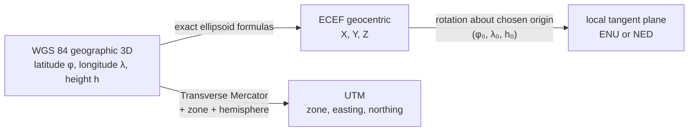

# WGS 84, ECEF, UTM, and Local Flat Cartesian Coordinates

## Executive summary

A “WGS 84 coordinate” usually means one of three different things, and confusing them causes many practical errors. First, it can mean **geodetic coordinates** on the WGS 84 ellipsoid: latitude, longitude, and ellipsoidal height. Second, it can mean **ECEF geocentric Cartesian coordinates**: \(X,Y,Z\) in meters from the Earth’s center. Third, it can mean a **projected flat coordinate system derived from WGS 84**, such as **UTM**, which adds a map projection and a zone. These are different coordinate systems tied to the same reference framework, not different datums. citeturn1view1turn33view0turn41search0

WGS 84 itself is an Earth-centered, Earth-fixed terrestrial reference system maintained by NGA and used by GPS. NGA defines it with four fundamental parameters: semi-major axis \(a\), flattening \(f\), Earth angular velocity \(\omega\), and geocentric gravitational constant \(GM\). For ordinary coordinate conversion, the important geometric parameters are mainly \(a\) and \(f\). NGA also states that the current WGS 84 reference frame is aligned to ITRF at the centimeter level for practical positioning. citeturn10search0

The forward conversion from geodetic \((\phi,\lambda,h)\) to ECEF \((X,Y,Z)\) is exact for the chosen ellipsoid. The inverse conversion is slightly harder because latitude appears inside a nonlinear equation; practical software therefore uses either a short iteration or a very accurate closed-form approximation such as the EPSG/IOGP formula based on an auxiliary angle \(q\). citeturn33view0

UTM is a standard family of **Transverse Mercator** projected coordinate systems. Standard UTM uses 60 longitudinal zones, each 6° wide, with scale factor \(k_0=0.9996\), false easting 500,000 m, and false northing 0 m in the north or 10,000,000 m in the south. UTM is excellent for regional mapping inside one zone, but it is not a single global flat plane. citeturn30view0turn41search0

A “general Cartesian flat coordinate system” is **unspecified** unless you also specify at least an origin, axis directions, units, and how the plane is tied to the Earth. In practice, people usually mean either a **local tangent plane** such as ENU/NED or a **map projection** such as UTM. This review treats both, and keeps any unspecified local origin symbolic as \((\phi_0,\lambda_0,h_0)\). citeturn1view1

## What WGS 84 is

WGS 84 is the U.S. Department of Defense’s global geodetic reference system, now maintained by NGA. NGA describes it as a 3-dimensional coordinate reference frame for latitude, longitude, and height, used by DoD, NATO, IHO, ICAO, and GPS. Its origin is the Earth’s center of mass; its axes form a right-handed Earth-Centered, Earth-Fixed system; and its ellipsoid is centered on the same origin. citeturn10search0

Historically, WGS 84 replaced earlier World Geodetic System realizations such as WGS 72; NGA still publishes operational guidance for WGS 72 to WGS 84 conversion in maritime navigation notices, which is a useful reminder that WGS 84 is a geodetic reference system, not merely a new map grid. In modern GIS practice, EPSG represents generic “WGS 84” as an **ensemble** containing multiple realizations, including the original/Transit realization and later frames such as G730, G873, G1150, G1674, G1762, G2139, and G2296. EPSG gives that ensemble an accuracy tag of 2 m, which is acceptable for many GIS workflows but is not precise enough to describe centimeter-level frame realization work by itself. citeturn17search1turn35search0

One practical consequence follows immediately: for normal mapping, saying “WGS 84” is often enough. For high-accuracy work, it is often **not** enough. IOGP notes that coordinates can also change with time because of plate motion even within a coordinate reference system, and the EPSG ensemble model shows that “WGS 84” is not one single immutable realization. A practical inference is that centimeter-level workflows should also specify a frame realization and an epoch; if those are not given, they are unspecified. citeturn1view1turn35search0

The table below lists the WGS 84 geometric quantities most commonly used in coordinate conversion. The first four are NGA defining parameters; the others are standard derived ellipsoid quantities computed from them. citeturn10search0turn33view0

| Quantity | Meaning | Value |
|---|---|---:|
| \(a\) | Semi-major axis | 6,378,137.0 m |
| \(1/f\) | Inverse flattening | 298.257223563 |
| \(f\) | Flattening | 0.00335281066474748 |
| \(\omega\) | Nominal mean angular velocity | \(7.292115\times10^{-5}\) rad/s |
| \(GM\) | Geocentric gravitational constant | \(3.986004418\times10^{14}\) m³/s² |
| \(b=a(1-f)\) | Semi-minor axis | 6,356,752.314245 m |
| \(e^2=f(2-f)\) | First eccentricity squared | 0.00669437999014 |
| \(e'^2=e^2/(1-e^2)\) | Second eccentricity squared | 0.00673949674228 |

In EPSG terms, the common WGS 84 coordinate reference systems are separate objects. **EPSG:4326** is the familiar 2D geographic CRS with geodetic latitude and longitude. **EPSG:4979** is the 3D geographic CRS that adds ellipsoidal height. **EPSG:4978** is the geocentric Cartesian CRS with \(X,Y,Z\). That distinction matters: if height matters, 4326 is not enough. citeturn35search0turn42search1

The flow below summarizes the main relationships:

This is why “convert WGS 84 to Cartesian” is incomplete unless “Cartesian” is clarified. It could mean ECEF, UTM, or a local tangent plane, and each one uses different extra information. citeturn1view1turn33view0turn34view0

## Geodetic and ECEF coordinates

The cleanest starting point is to separate **geodetic** coordinates from **geocentric Cartesian** coordinates.

Geodetic coordinates are \((\phi,\lambda,h)\): geodetic latitude, geodetic longitude, and ellipsoidal height. NOAA defines geodetic latitude as the angle between the equatorial plane and the line perpendicular to the reference ellipsoid at the point. EPSG’s WGS 84 geographic 3D CRS uses axes “geodetic latitude, geodetic longitude, ellipsoidal height.” citeturn37search14turn35search0

ECEF coordinates are \((X,Y,Z)\): a right-handed Cartesian system with origin at Earth’s center, \(Z\) along the rotation axis, \(X\) through the equator at the Greenwich meridian, and \(Y\) through the equator at 90°E. This is the natural frame for satellites, inertial/GNSS fusion, and vector algebra in 3D. citeturn33view0

A useful geometric warning is that **geodetic latitude is not geocentric latitude**. Geodetic latitude uses the ellipsoid normal; geocentric latitude uses the radius from Earth center. On an ellipsoid surface, the two are related by
\[
\tan\psi=(1-e^2)\tan\phi,
\]
where \(\psi\) is geocentric latitude. They are equal only on a sphere, or at the equator and poles. This difference is one reason “latitude” must be interpreted carefully in mathematics and software. The relation follows directly from the derivation below. citeturn37search14turn33view0

For conversion work, the essential ellipsoid equation is
\[
\frac{x^2+y^2}{a^2}+\frac{z^2}{b^2}=1.
\]
Because the ellipsoid is rotationally symmetric, it is convenient to work first in the meridian plane using
\[
p=\sqrt{X^2+Y^2}.
\]
Then the ellipse is
\[
\frac{p^2}{a^2}+\frac{z^2}{b^2}=1.
\]
Assume the point on the ellipsoid surface is \((p_0,z_0)\). Differentiating the ellipse gives the tangent slope
\[
\frac{dz}{dp}=-\frac{b^2p_0}{a^2z_0}.
\]
The normal slope is therefore the negative reciprocal,
\[
\text{slope of normal}=\frac{a^2z_0}{b^2p_0}.
\]
By definition of geodetic latitude, that normal makes angle \(\phi\) with the equatorial plane, so
\[
\tan\phi=\frac{a^2z_0}{b^2p_0}
       =\frac{z_0}{(1-e^2)p_0}.
\]
Combining this relation with the ellipse equation gives the standard surface-point form
\[
p_0=\nu\cos\phi,\qquad
z_0=\nu(1-e^2)\sin\phi,
\]
where
\[
\nu=\frac{a}{\sqrt{1-e^2\sin^2\phi}}
\]
is the prime vertical radius of curvature. This is the geometric reason \(\nu\) appears in all geodetic-to-ECEF formulas. The formulas themselves are standard EPSG/IOGP formulas; the intermediate algebra above is just a simple geometric derivation of why they take this form. citeturn33view0

Now add longitude by rotating around the \(Z\)-axis, and add ellipsoidal height \(h\) along the same surface normal. That gives the forward conversion:
\[
X=(\nu+h)\cos\phi\cos\lambda,
\]
\[
Y=(\nu+h)\cos\phi\sin\lambda,
\]
\[
Z=\big((1-e^2)\nu+h\big)\sin\phi.
\]
These equations are exact for the reference ellipsoid, provided that \(\phi,\lambda,h\) are geodetic latitude, longitude relative to Greenwich, and **ellipsoidal** height on the same datum/frame. citeturn33view0

A numerical example from EPSG/IOGP makes the formulas concrete. For the WGS 84 geographic point
\[
\phi=53^\circ48'33.820''\text{N},\quad
\lambda=2^\circ07'46.380''\text{E},\quad
h=73.0\text{ m},
\]
the forward formulas give approximately
\[
X=3{,}771{,}793.968\text{ m},\quad
Y=140{,}253.342\text{ m},\quad
Z=5{,}124{,}304.349\text{ m}.
\]
These are the same values used in the EPSG example. citeturn33view0turn38view0

The inverse conversion starts from known \(X,Y,Z\). Longitude is the easy part:
\[
\lambda=\operatorname{atan2}(Y,X).
\]
Define
\[
p=\sqrt{X^2+Y^2}.
\]
Then the forward equations imply
\[
p=(\nu+h)\cos\phi,\qquad
Z=((1-e^2)\nu+h)\sin\phi.
\]
Eliminate \(h\) using \(h=p/\cos\phi-\nu\). Substituting into \(Z\) gives
\[
Z=p\tan\phi-e^2\nu\sin\phi,
\]
with \(\nu=a/\sqrt{1-e^2\sin^2\phi}\). This is nonlinear in \(\phi\), which is why the inverse problem is harder. citeturn33view0

A simple iterative form comes directly from rearranging the same equation:
\[
\phi_{n+1}=\operatorname{atan2}\!\left(Z+e^2\nu_n\sin\phi_n,\;p\right),
\qquad
\nu_n=\frac{a}{\sqrt{1-e^2\sin^2\phi_n}}.
\]
Start from a reasonable guess such as
\[
\phi_0=\operatorname{atan2}(Z,\;p(1-e^2)),
\]
iterate until the change is tiny, then recover height from
\[
h=\frac{p}{\cos\phi}-\nu.
\]
This is conceptually simple and usually converges very fast for ordinary Earth-surface points. citeturn33view0

EPSG/IOGP also gives a very accurate non-iterative alternative, often associated with Bowring-style formulas. Define
\[
q=\operatorname{atan2}(Za,\;pb),\qquad
\varepsilon=\frac{e^2}{1-e^2}.
\]
Then latitude can be computed as
\[
\phi=\operatorname{atan2}\!\left(Z+\varepsilon b\sin^3 q,\;p-e^2a\cos^3 q\right),
\]
followed by
\[
\nu=\frac{a}{\sqrt{1-e^2\sin^2\phi}},\qquad
h=\frac{p}{\cos\phi}-\nu.
\]
This is the practical “no-iteration” inverse formula in EPSG Guidance Note 7-2. citeturn33view0

Using the same EPSG example point in reverse,
\[
X=3{,}771{,}793.968\text{ m},\quad
Y=140{,}253.342\text{ m},\quad
Z=5{,}124{,}304.349\text{ m},
\]
the inverse formulas recover
\[
\phi=53^\circ48'33.820''\text{N},\quad
\lambda=2^\circ07'46.380''\text{E},\quad
h=73.0\text{ m}.
\]
That round trip shows the forward and inverse formulas are consistent when the same ellipsoid and conventions are used. citeturn33view0

One last height warning matters in practice. The \(h\) in these equations is **height above the ellipsoid**, not height above mean sea level. NOAA notes that orthometric height is obtained from ellipsoidal height by removing geoid undulation, and NGA explains that the geoid can lie tens of meters above or below the ellipsoid depending on location. So if your input “height” is a map elevation or survey benchmark height, you usually need a geoid model before using geodetic–ECEF formulas correctly. citeturn33view0turn40view0turn27search1

## WGS 84 and UTM

UTM is not a different datum from WGS 84. It is a **projected coordinate reference system** obtained by applying the **Transverse Mercator** projection to a geographic CRS such as WGS 84. IOGP defines a projected CRS as the result of applying a map projection to a geographic CRS, and USGS describes Transverse Mercator as one of the conformal projections used for larger-scale mapping. In other words, geodetic WGS 84 and UTM can describe the same physical point, but in very different coordinate systems. citeturn1view1turn43search2

Standard UTM divides the world into 60 longitudinal zones, each 6° wide. In the northern hemisphere, it is defined from the equator to 84°N; in the southern hemisphere, from 80°S to the equator. IOGP gives the standard parameters: latitude of origin 0°, central meridians at 6° intervals east of 177°W, scale factor \(k_0=0.9996\), false easting 500,000 m, false northing 0 m in the north, and 10,000,000 m in the south. A concrete example is EPSG:32633, “WGS 84 / UTM zone 33N,” valid for 12°E to 18°E. citeturn30view0turn41search0

If longitude \(\lambda\) is in degrees, the standard zone number is
\[
Z=\left\lfloor\frac{\lambda+180^\circ}{6^\circ}\right\rfloor+1,
\]
and the central meridian is
\[
\lambda_0 = 6Z-183^\circ.
\]
If the user overrides the zone manually, that is a different choice; in this review, no zone override was specified, so I use the standard rule above. citeturn3view3

For derivation, the simplest ellipsoidal formulas are the classical Snyder/USGS series. IOGP keeps these formulas for backward compatibility and notes that, within ±4° of the central meridian, the newer JHS/Krüger formulas and the older USGS formulas agree to within about 3 mm forward and 0.0005 arcsecond reverse. Because a standard UTM zone only extends ±3° from its central meridian, the Snyder/USGS series are a reasonable and accessible derivation here. For production software over wider regions, IOGP recommends the JHS/Krüger formulas. citeturn30view0turn32view1

The forward geodetic-to-UTM steps on WGS 84 are:

\[
\nu=\frac{a}{\sqrt{1-e^2\sin^2\phi}},
\qquad
T=\tan^2\phi,
\qquad
C=e'^2\cos^2\phi,
\qquad
A=(\lambda-\lambda_0)\cos\phi,
\]
where \(e'^2=e^2/(1-e^2)\), and \(\phi,\lambda,\lambda_0\) are in radians. Then compute the meridional arc
\[
M=a\left[
\left(1-\frac{e^2}{4}-\frac{3e^4}{64}-\frac{5e^6}{256}\right)\phi
-\left(\frac{3e^2}{8}+\frac{3e^4}{32}+\frac{45e^6}{1024}\right)\sin 2\phi
+\left(\frac{15e^4}{256}+\frac{45e^6}{1024}\right)\sin 4\phi
-\left(\frac{35e^6}{3072}\right)\sin 6\phi
\right].
\]
With false easting \(FE=500{,}000\) m and false northing \(FN=0\) m or \(10{,}000{,}000\) m, the projected coordinates are
\[
E=FE+k_0\nu\left[
A+\frac{(1-T+C)A^3}{6}
+\frac{(5-18T+T^2+72C-58e'^2)A^5}{120}
\right],
\]
\[
N=FN+k_0\left[
M+\nu\tan\phi\left(
\frac{A^2}{2}
+\frac{(5-T+9C+4C^2)A^4}{24}
+\frac{(61-58T+T^2+600C-330e'^2)A^6}{720}
\right)
\right].
\]
These are the standard ellipsoidal TM series used for accessible UTM derivations. citeturn32view1

The inverse UTM-to-geodetic steps begin by removing false easting/northing and recovering the footpoint latitude. Compute
\[
M_1=\frac{N-FN}{k_0},
\qquad
e_1=\frac{1-\sqrt{1-e^2}}{1+\sqrt{1-e^2}},
\]
\[
\mu_1=\frac{M_1}{a\left(1-\frac{e^2}{4}-\frac{3e^4}{64}-\frac{5e^6}{256}\right)}.
\]
Then compute the footpoint latitude
\[
\phi_1=\mu_1
+\left(\frac{3e_1}{2}-\frac{27e_1^3}{32}\right)\sin 2\mu_1
+\left(\frac{21e_1^2}{16}-\frac{55e_1^4}{32}\right)\sin 4\mu_1
+\left(\frac{151e_1^3}{96}\right)\sin 6\mu_1
+\left(\frac{1097e_1^4}{512}\right)\sin 8\mu_1.
\]
Then
\[
\nu_1=\frac{a}{\sqrt{1-e^2\sin^2\phi_1}},
\qquad
\rho_1=\frac{a(1-e^2)}{(1-e^2\sin^2\phi_1)^{3/2}},
\]
\[
T_1=\tan^2\phi_1,
\qquad
C_1=e'^2\cos^2\phi_1,
\qquad
D=\frac{E-FE}{\nu_1k_0}.
\]
Finally,
\[
\phi=\phi_1-\frac{\nu_1\tan\phi_1}{\rho_1}
\left[
\frac{D^2}{2}
-\frac{(5+3T_1+10C_1-4C_1^2-9e'^2)D^4}{24}
+\frac{(61+90T_1+298C_1+45T_1^2-252e'^2-3C_1^2)D^6}{720}
\right],
\]
\[
\lambda=\lambda_0+
\frac{
D-\frac{(1+2T_1+C_1)D^3}{6}
+\frac{(5-2C_1+28T_1-3C_1^2+8e'^2+24T_1^2)D^5}{120}
}{
\cos\phi_1
}.
\]
These are again the standard Snyder/USGS inverse formulas reproduced by IOGP. citeturn32view1

A numerical example helps. Take the geodetic point for central Berlin:
\[
\phi=52.520000^\circ,\qquad \lambda=13.405000^\circ.
\]
The standard zone rule gives **zone 33N**, whose central meridian is 15°E. Using the WGS 84 ellipsoid and the UTM formulas above gives approximately:
\[
E=391{,}779.259\text{ m},\qquad
N=5{,}820{,}072.160\text{ m}.
\]
Applying the inverse formulas to these UTM coordinates returns the original latitude and longitude to round-off level in a normal double-precision calculation. These values are calculated directly from the cited formulas above, under the standard UTM choice of zone from longitude. citeturn3view3turn32view1turn41search0

The standard UTM design choices have simple meanings. The scale factor \(k_0=0.9996\) slightly shrinks the map along the central meridian so that the overall scale behavior across the zone is better balanced. The false easting of 500,000 m keeps eastings positive around the central meridian. The southern false northing of 10,000,000 m avoids negative northings south of the equator. citeturn30view0turn32view1

UTM is convenient, but it is not universal. Zone and hemisphere are essential metadata, and NOAA explicitly warns that if you need to work across zone boundaries, geodetic positions are preferable. That is a very practical rule: UTM is excellent inside one zone, less convenient for multi-zone analysis, and not defined as a single worldwide flat plane. citeturn13search10turn30view0

## ECEF and local flat Cartesian frames

The other common meaning of “flat Cartesian coordinates” is a **local tangent plane**. EPSG calls the related system “topocentric” and defines a right-handed local Cartesian frame with axes east, north, up. In many engineering and robotics applications this is called **ENU**. A closely related convention called **NED** uses north, east, down instead. If a local origin is not specified, the local flat frame is underspecified; in the formulas below the origin remains symbolic as \((\phi_0,\lambda_0,h_0)\) or equivalently \((X_0,Y_0,Z_0)\). citeturn34view0

The clean procedure is:

1. Convert the origin geodetic coordinates \((\phi_0,\lambda_0,h_0)\) to ECEF \((X_0,Y_0,Z_0)\).
2. Convert the target geodetic point to ECEF \((X,Y,Z)\), if needed.
3. Form the difference vector
   \[
   \Delta \mathbf r =
   \begin{bmatrix}
   X-X_0\\Y-Y_0\\Z-Z_0
   \end{bmatrix}.
   \]
4. Rotate that vector into the local basis at the origin.

The local basis vectors are easy to understand geometrically. At the origin, the unit east vector is tangent to the parallel:
\[
\hat e=
\begin{bmatrix}
-\sin\lambda_0\\
\cos\lambda_0\\
0
\end{bmatrix}.
\]
The unit north vector is tangent to the meridian:
\[
\hat n=
\begin{bmatrix}
-\sin\phi_0\cos\lambda_0\\
-\sin\phi_0\sin\lambda_0\\
\cos\phi_0
\end{bmatrix}.
\]
The unit up vector is normal to the ellipsoid:
\[
\hat u=
\begin{bmatrix}
\cos\phi_0\cos\lambda_0\\
\cos\phi_0\sin\lambda_0\\
\sin\phi_0
\end{bmatrix}.
\]
Stack them as rows and you get the standard EPSG rotation matrix:
\[
\begin{bmatrix}
E\\N\\U
\end{bmatrix}
=
\begin{bmatrix}
-\sin\lambda_0 & \cos\lambda_0 & 0\\
-\sin\phi_0\cos\lambda_0 & -\sin\phi_0\sin\lambda_0 & \cos\phi_0\\
\cos\phi_0\cos\lambda_0 & \cos\phi_0\sin\lambda_0 & \sin\phi_0
\end{bmatrix}
\begin{bmatrix}
X-X_0\\Y-Y_0\\Z-Z_0
\end{bmatrix}.
\]
This is exactly the EPSG geocentric-to-topocentric conversion, just written with ENU labels instead of \(U,V,W\). citeturn34view0turn42search1

If your application uses NED instead of ENU, nothing deep changes. It is just a different axis convention:
\[
\begin{bmatrix}
N\\E\\D
\end{bmatrix}
=
\begin{bmatrix}
N\\E\\-U
\end{bmatrix}_{\text{from ENU}}.
\]
So the mathematical issue is not “which one is correct,” but “which one did the software or sensor assume?” In EPSG’s standard topocentric method, the local axes are east, north, up. citeturn34view0turn42search1

The EPSG example is very instructive. For a topocentric origin with geocentric coordinates
\[
X_0=3{,}652{,}755.3058,\;
Y_0=319{,}574.6799,\;
Z_0=5{,}201{,}547.3536\text{ m},
\]
and a target point
\[
X=3{,}771{,}793.968,\;
Y=140{,}253.342,\;
Z=5{,}124{,}304.349\text{ m},
\]
the local coordinates are
\[
E=-189{,}013.869\text{ m},\quad
N=-128{,}642.040\text{ m},\quad
U=-4{,}220.171\text{ m}.
\]
The negative “up” is not a mistake. It reflects the fact that the target point lies below the tangent plane at the origin once the points are separated by a few hundred kilometers. citeturn34view0turn42search1

That leads directly to the key practical question: **when is a flat approximation acceptable?**

The ENU transform itself is exact as a rotation of the ECEF difference vector. The approximation enters only when you treat the curved Earth as if it were the tangent plane itself over a finite area. A simple small-angle estimate for the vertical separation between a spherical Earth and its tangent plane is the sagitta:
\[
\text{vertical curvature error} \approx \frac{L^2}{2R},
\]
where \(L\) is the horizontal distance and \(R\) is an Earth radius. Using a mean radius of about \(6.37\times10^6\) m derived from the WGS 84 ellipsoid gives the following rule-of-thumb table. The horizontal arc-versus-chord difference is much smaller:
\[
\text{arc minus chord} \approx \frac{L^3}{24R^2}.
\]
These approximations come from elementary circle geometry, applied using WGS 84 Earth size. citeturn10search0

| Horizontal extent \(L\) | Tangent-plane vertical error \(L^2/(2R)\) | Arc minus chord |
|---:|---:|---:|
| 1 km | 0.078 m | 0.000001 m |
| 5 km | 1.96 m | 0.00013 m |
| 10 km | 7.85 m | 0.0010 m |
| 20 km | 31.4 m | 0.0082 m |
| 50 km | 196 m | 0.128 m |

This means a local tangent plane is usually excellent for very local work, but it becomes a poor model of the Earth’s surface surprisingly quickly if you care about vertical consistency. As a rule of thumb, to keep pure curvature sag below about 1 m, stay within roughly 3.6 km of the origin; for 10 m, roughly 11 km. For strictly local robotics, vision, short-baseline engineering, or small campus/site mapping, ENU/NED is often ideal. For city-scale or regional mapping, UTM is usually the better flat representation. citeturn10search0turn34view0

## Common pitfalls and practical choices

The most common failure is mixing up **conversion** and **transformation**. Converting geodetic WGS 84 to ECEF, UTM, or ENU with no datum change is a **coordinate conversion**. Changing from one datum/reference frame to another is a **transformation**, which may require Helmert parameters, grids, and sometimes an epoch. IOGP is explicit about that distinction. citeturn1view1turn38view0

A close second is mixing up **ellipsoidal height** and **orthometric height**. GNSS typically gives ellipsoidal height \(h\); mapping and leveling usually want gravity-related height \(H\). NOAA notes that converting from ellipsoidal to orthometric height is done algebraically by removing geoid undulation, and NGA notes that the geoid can differ from the WGS 84 ellipsoid by many tens of meters. If your “height” source is not specified, then the height type is unspecified, and any ECEF or ENU result may be vertically wrong even if horizontal coordinates are fine. citeturn40view0turn27search1

Another common problem is assuming **EPSG:4326 includes height**. It does not. EPSG’s 3D WGS 84 geographic definition is 4979, while 4326 is only latitude and longitude. IOGP also notes that converting from geographic 2D back to geographic 3D is indeterminate unless you append an artificial height, often zero; that may preserve horizontal results in some workflows, but the vertical coordinate is then meaningless. citeturn35search0turn38view0

Axis order causes endless software bugs. EPSG’s formal axis order for geographic WGS 84 is latitude, longitude, but many web APIs and programming libraries use longitude, latitude. IOGP even includes dedicated axis-order-reversal conversions because software commonly swaps the order of geographic or projected coordinates. If a data source says only “WGS 84 coordinates” without axis order, the axis order is effectively unspecified until the interface documentation confirms it. citeturn35search0turn38view0

UTM is easy to misuse if zone or hemisphere is omitted. Easting and northing by themselves are not globally unique, because the same structure repeats by zone and hemisphere. If you need to cross a zone boundary, NOAA advises using geodetic positions rather than forcing everything into one UTM zone unless you have explicitly decided to do so. Likewise, standard UTM formulas assume the point is in the chosen zone; if you override zones carelessly, distortion or even strange coordinate behavior can result. citeturn13search10turn30view0

Numerical stability matters near singular cases. At the exact poles, longitude is mathematically undefined because \(X=Y=0\). Near the poles, formulas using \(h=p/\cos\phi-\nu\) can lose precision because \(\cos\phi\) is tiny; a \(Z\)-based alternative is safer there. Very close to Earth center, both latitude and longitude become meaningless. For UTM, standard coverage stops at the UTM latitude limits; outside those limits, a different polar coordinate system is required, but no specific alternative was requested here, so that choice remains unspecified. citeturn33view0turn30view0

For practical work, the coordinate systems compare as follows. This summary table is synthesized from NGA, EPSG, and IOGP definitions. citeturn10search0turn35search0turn33view0turn34view0turn41search0

| System | Coordinates | Needs extra metadata | Best use | Main caveat |
|---|---|---|---|---|
| WGS 84 geographic 2D | \(\phi,\lambda\) | datum/frame realization; axis order | interchange, storage, web GIS | no height |
| WGS 84 geographic 3D | \(\phi,\lambda,h\) | datum/frame realization; height type must be ellipsoidal | GNSS positions, full 3D geodetic work | height is not mean sea level |
| WGS 84 ECEF | \(X,Y,Z\) | datum/frame realization | satellites, 3D vectors, sensor fusion | not intuitive for humans/maps |
| WGS 84 / UTM zone \(n\) | zone, hemisphere, \(E,N\) | zone and hemisphere | regional mapping, local engineering over larger areas | awkward across zone boundaries |
| Local ENU / NED | local Cartesian offsets | origin \((\phi_0,\lambda_0,h_0)\) or \((X_0,Y_0,Z_0)\) | robotics, local navigation, site work | tangent-plane interpretation breaks down with distance |

If I had to reduce the whole topic to one practical rule, it would be this: use **geodetic WGS 84** for global interchange, **ECEF** for 3D geometry, **UTM** for regional mapping in one zone, and **ENU/NED** for genuinely local work. If someone says only “Cartesian,” ask what they mean—or, if no answer is available, treat the Cartesian frame as unspecified and do not guess. citeturn1view1turn33view0turn34view0turn41search0

**Open questions and limitations.** This review intentionally focused on WGS 84 relationships that kept the datum fixed. It did not derive full datum-to-datum transformations such as NAD 83 ↔ WGS 84, nor did it expand the separate polar alternatives outside the standard UTM latitude range, because those choices were not specified in the request. For centimeter-level operational work, you should additionally specify frame realization and epoch; otherwise, those choices remain unspecified. citeturn1view1turn35search0turn10search0